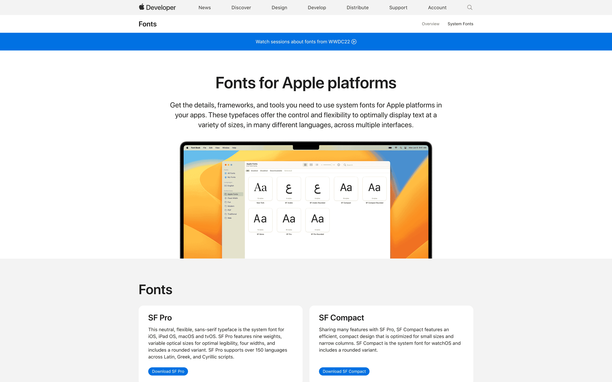
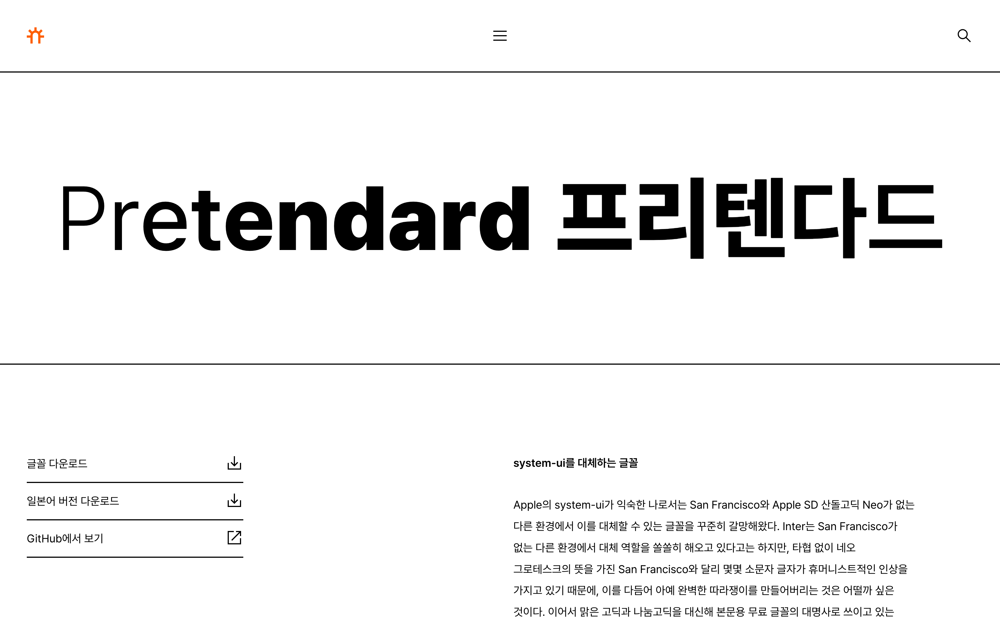

- [Font](./../.././docs/pages/Font.md) by [Apple](./../.././docs/pages/Apple.md)
- Has a strict usage model. No [Webfont](./../.././docs/pages/Web%20Typography.md) use
- Although [Brunch violates SF terms of use](./../.././docs/pages/Brunch%20violates%20SF%20terms%20of%20use.md)

<figure>

</figure>

## Similar fonts

### [Inter](./../.././docs/pages/Inter.md)

<figure>

</figure>

### [Pretendard](./../.././docs/pages/Pretendard.md)

<figure>

</figure>

### [Toss Product Sans](./../.././docs/pages/Toss%20Product%20Sans.md)

<figure>

</figure>

### [Akzidenz](./../.././docs/pages/Akzidenz.md)

<figure>

</figure>

### [Satoshi](./../.././docs/pages/Satoshi.md)

<figure>

</figure>

<head>
  <html lang="en-US"/>
</head>
