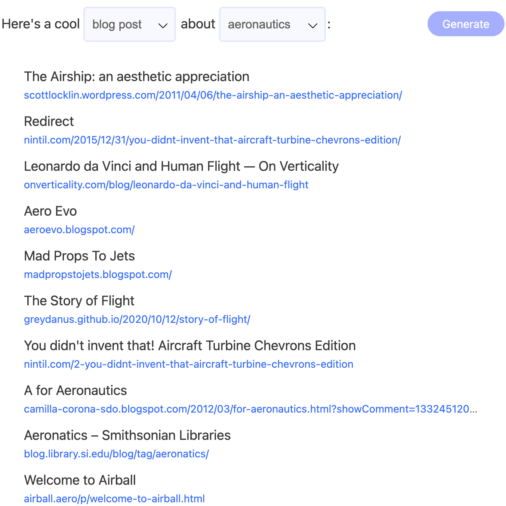
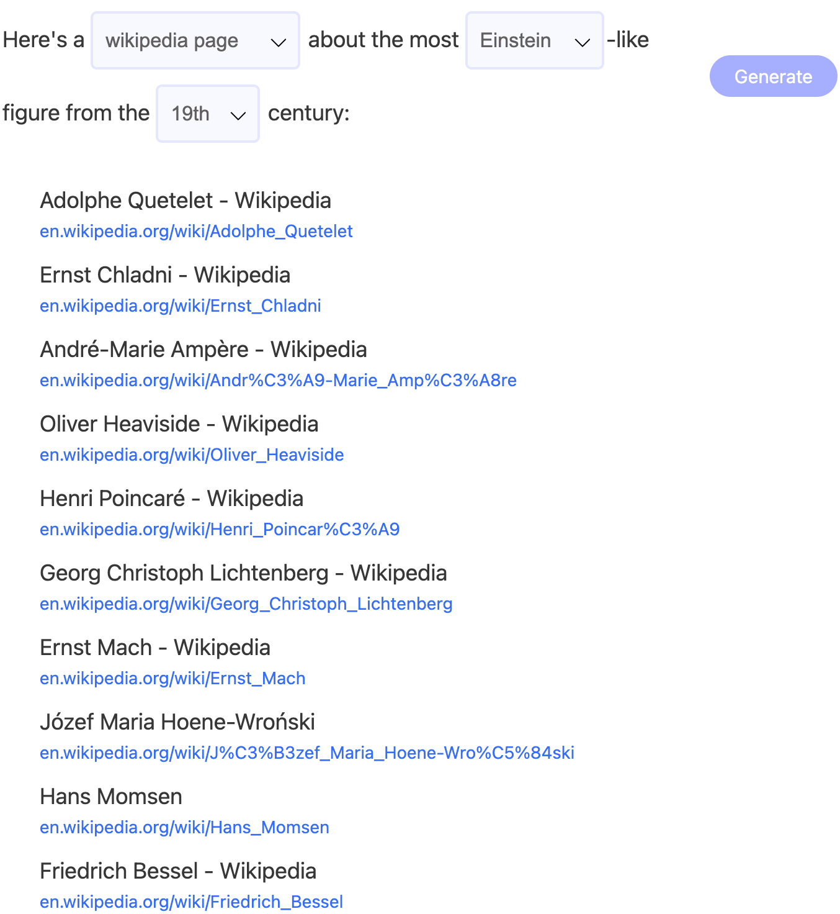

- [Bing Chat for All Browsers](./../.././docs/pages/Bing%20Chat%20for%20All%20Browsers.md)
- [Information among Data](./../.././docs/pages/Information%20among%20Data.md)
- [Search in a Latent Space](./../.././docs/pages/Search%20in%20a%20Latent%20Space.md)
- [Generative AI](./../.././docs/pages/Generative%20AI.md)
- [wong2/chat-gpt-google-extension: A Chrome extension to show ChatGPT response in Google search results](https://github.com/wong2/chat-gpt-google-extension)

### [Wolfram Alpha as the Way to Bring Computational Knowledge Superpowers to ChatGPT](https://writings.stephenwolfram.com/2023/01/wolframalpha-as-the-way-to-bring-computational-knowledge-superpowers-to-chatgpt/)

- It's always amazing when things suddenly "just work". It happened to us with [Wolfram|Alpha](https://www.wolframalpha.com/) back in 2009. It happened with our [Physics Project](https://www.wolframphysics.org/) in 2020. And it's happening now with [OpenAI](https://openai.com/)'s [ChatGPT](https://chat.openai.com/chat)
- a fascinating, essay-style response. But the actual result is wrong
- In many ways, one might say that [ChatGPT](./../.././docs/pages/ChatGPT.md) never "truly understands" things; it just "knows how to produce stuff that's useful". But it's a different story with Wolfram|Alpha. Because once [Wolfram Alpha](./../.././docs/pages/Wolfram%20Alpha.md) has converted something to Wolfram Language, what it's got is a complete, precise, formal representation from which one can reliably compute things
- But just like us humans, there are times when [ChatGPT](./../.././docs/pages/ChatGPT.md) needs a more formal and precise "power assist."

### [who are you - You. com](https://you.com/search?q=who+are+you&tbm=youchat)

- Hello! My name is YouChat; I'm an [AI](./../.././docs/pages/AI.md) that can answer general questions, explain things, suggest ideas, translate, summarize text, compose [emails](./../.././docs/pages/Mail.md), and write code for you. I'm powered by [artificial intelligence](./../.././docs/pages/AI.md) and [natural language processing](./../.././docs/pages/Natural%20Language%20Processing.md), allowing you to have human-like conversations with me. I am constantly learning from vast amounts of online information, so I sometimes need to correct some answers. My [AI](./../.././docs/pages/AI.md) is constantly improving, and I often share sources for my answers.

### [Introducing NeevaAI - Neeva](https://neeva.com/blog/introducing-neevaai)

- Today, we are thrilled to launch NeevaAI - an authentic, real-time [AI](./../.././docs/pages/AI.md) search officially
- The introduction of accessible [AI](./../.././docs/pages/AI.md), such as the recent explosion of [ChatGPT](./../.././docs/pages/ChatGPT.md), represents one of the most exciting technological advances since the iPhone
- First, [ChatGPT](./../.././docs/pages/ChatGPT.md)'s output does not include sources or references. It is impossible to determine the credibility of an answer by identifying and looking up the primary source
- Second, [ChatGPT](./../.././docs/pages/ChatGPT.md) does not retrieve real-time data or information. The model stops at 2021, making it less useful for the needs of current searches
- Nevada solves both of these problems

## On [ChatGPT](./../.././docs/pages/ChatGPT.md)

After playing with it for two days, It's marvelous.
We will never see [Demise of Chatbots in 2017](./../.././docs/pages/Demise%20of%20Chatbots%20in%202017.md) again.
This can kill [Google](./../.././docs/pages/Google.md).
People want information, not data.
People, in the past, searched (and used [Google](./../.././docs/pages/Google.md)) because it was the best bet to find information.

But if an [AI](./../.././docs/pages/AI.md) can search **for you** and only return the trim down the **answer**, why would anyone take the effort to find [Information among Data](./../.././docs/pages/Information%20among%20Data.md)?

> 20여년 이어져온 [구글](./../.././docs/pages/Google.md)의 시대가 끝나가는 것이 느껴져요. 아, [구글](./../.././docs/pages/Google.md)이라는 회사 말고, [구글](./../.././docs/pages/Google.md)이라는 검색이요. 원래 사람들이 원하는 것은 검색이 아니고 정답이거든요. 다만 그 동안은 정답을 얻을 수가 없었기에 검색을 했을 뿐이지요. 그런데 이제 [인공지능](./../.././docs/pages/AI.md) 덕분에 진짜 답을 얻을 수 있게 되어가고 있어요. 그럼 검색은 더 이상 필요 없어지는 것이지요. 엊그제 나온 [OpenAI](./../.././docs/pages/OpenAI.md)의 [ChatGPT](./../.././docs/pages/ChatGPT.md)에 많은 사람들이 놀라고 있어요. 모든 것의 정답을 주지는 못 하는데요. 그래도 모든 것의 정답을 주는 기계의 느낌이 살짝 나긴 해요. [구글](./../.././docs/pages/Google.md)(검색)의 시대는 끝나가고 있어요. 아참, 새 시대도 [구글](./../.././docs/pages/Google.md)(회사)가 열 가능성이 꽤 크긴 해요. [구글](./../.././docs/pages/Google.md)이 ([마이크로소프트](./../.././docs/pages/Microsoft.md) 등이 그랬던 것처럼) 자기 스스로를 죽일 수 있다면 [구글](./../.././docs/pages/Google.md)에게도 기회가 있을 텐데요. [구글](./../.././docs/pages/Google.md)이 딥러닝에 투자 하는 것을 보면... [구글](./../.././docs/pages/Google.md)은 다시 태어날 준비는 충분히 되어 있는 듯 해요. [Sedong Nam](https://www.facebook.com/dgtgrade/posts/5846987125360105)

## [Metaphor](https://metaphor.systems/)

<figure>

</figure>

<figure>

</figure>

<figure>

</figure>
