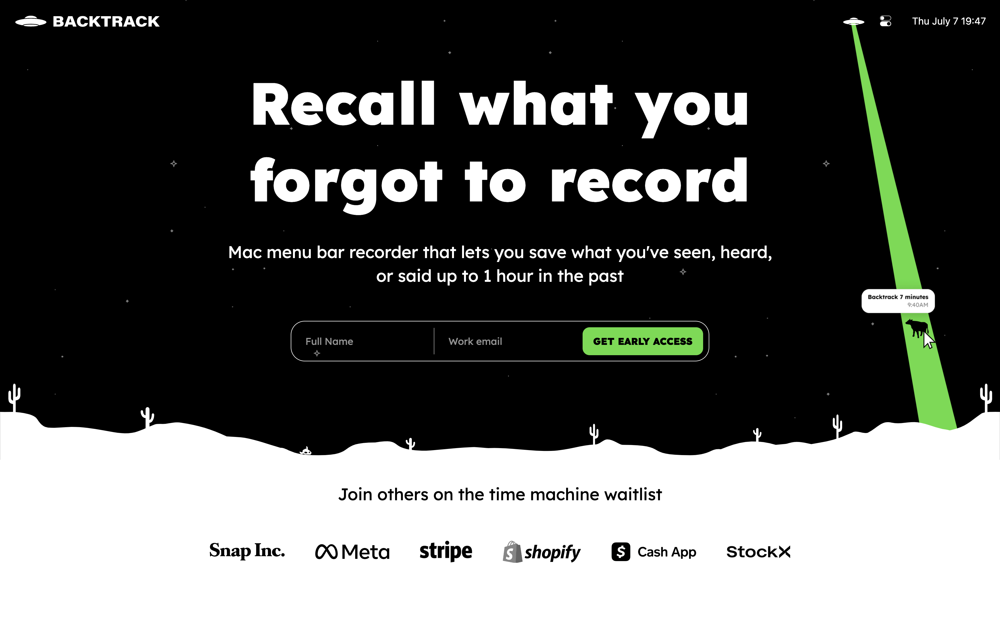
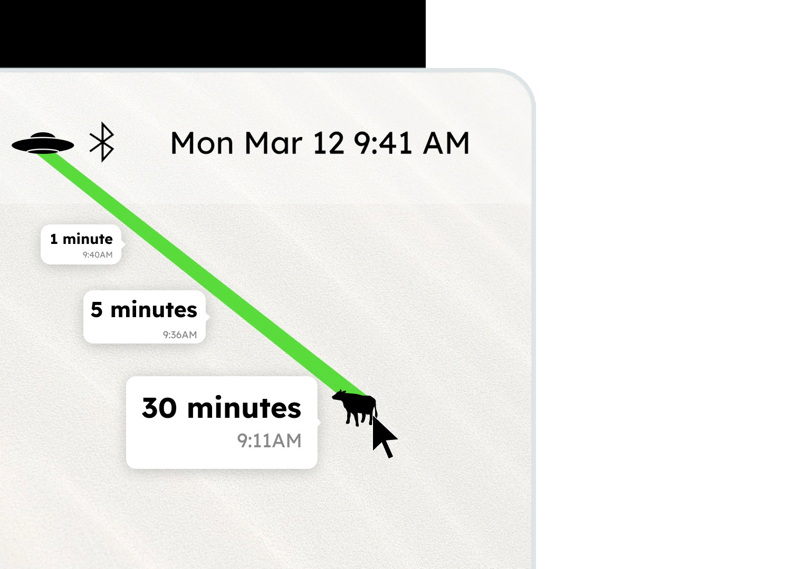

## Reference

- [thesephist/monocle: Universal personal search engine, powered by a full-text search algorithm written in pure Ink, indexing Linus's blogs and private note archives, contacts, tweets, and over a decade of journals.](https://github.com/thesephist/monocle)
- [Building Monocle, a universal personal search engine for life](https://thesephist.com/posts/monocle/)
- [Monocle](https://monocle.surge.sh/)

## [Rewind](./../.././docs/pages/Rewind.md)

<figure>

</figure>

## [Backtrack: Recall what you forgot to record](https://usebacktrack.com/)

<figure>

</figure>

<figure>

</figure>

<figure>

</figure>

<head>
  <html lang="en-US"/>
</head>
