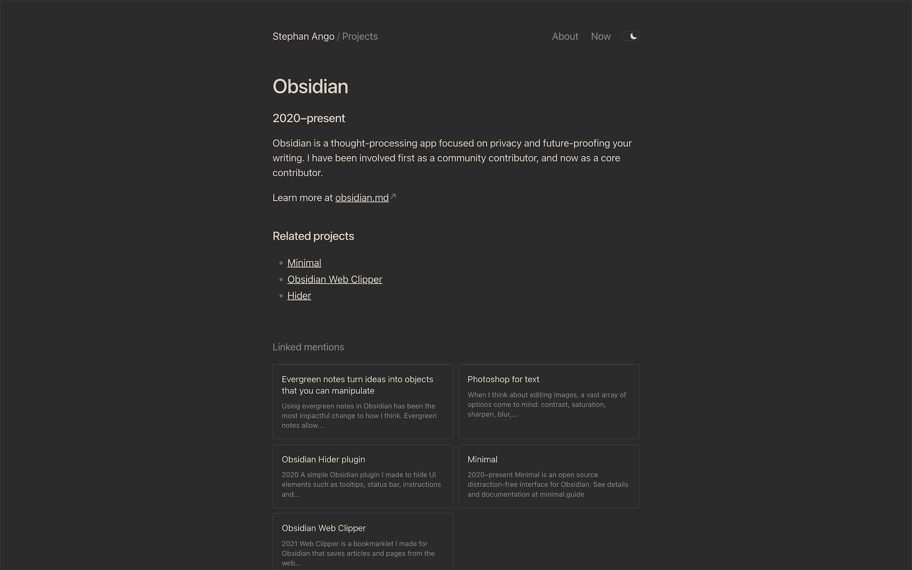
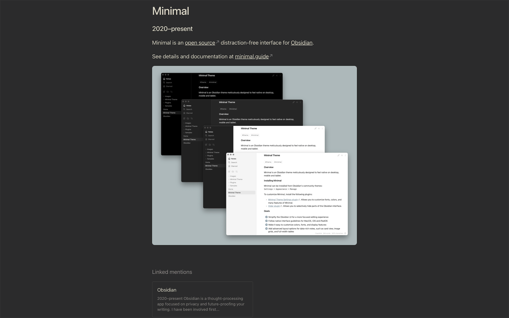
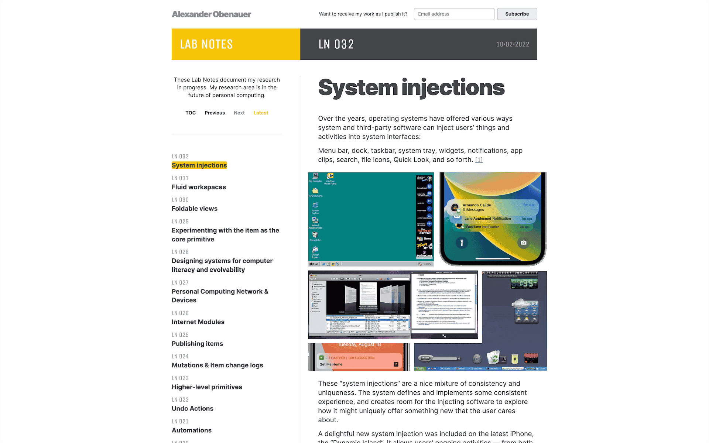
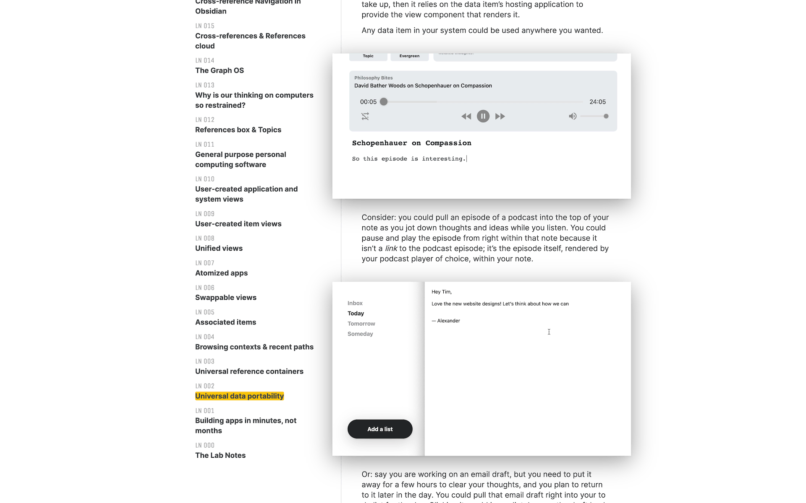
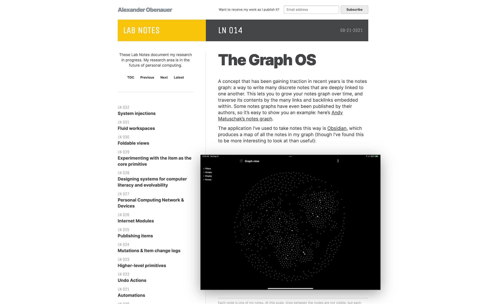
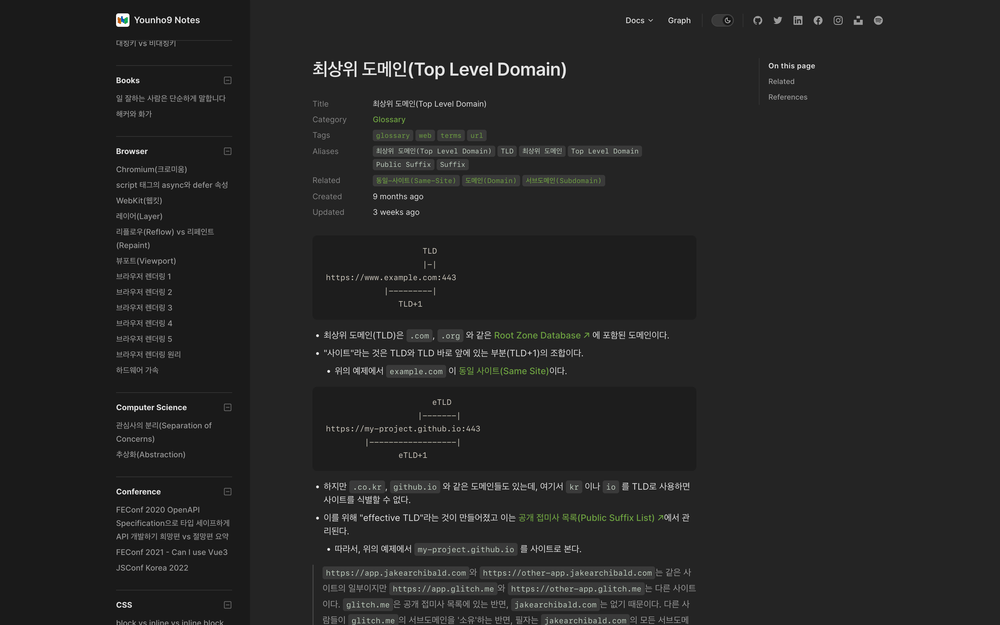
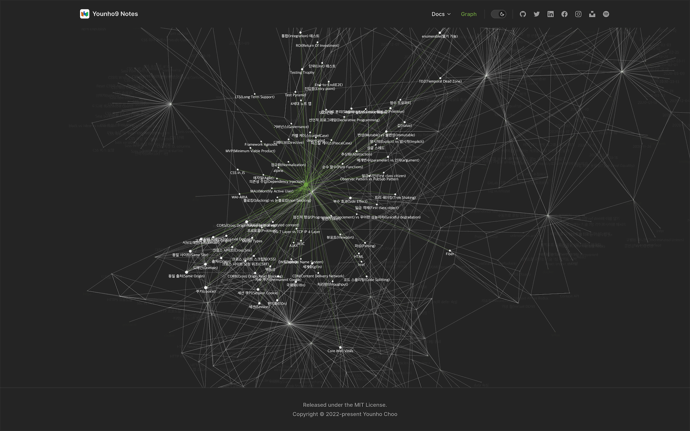
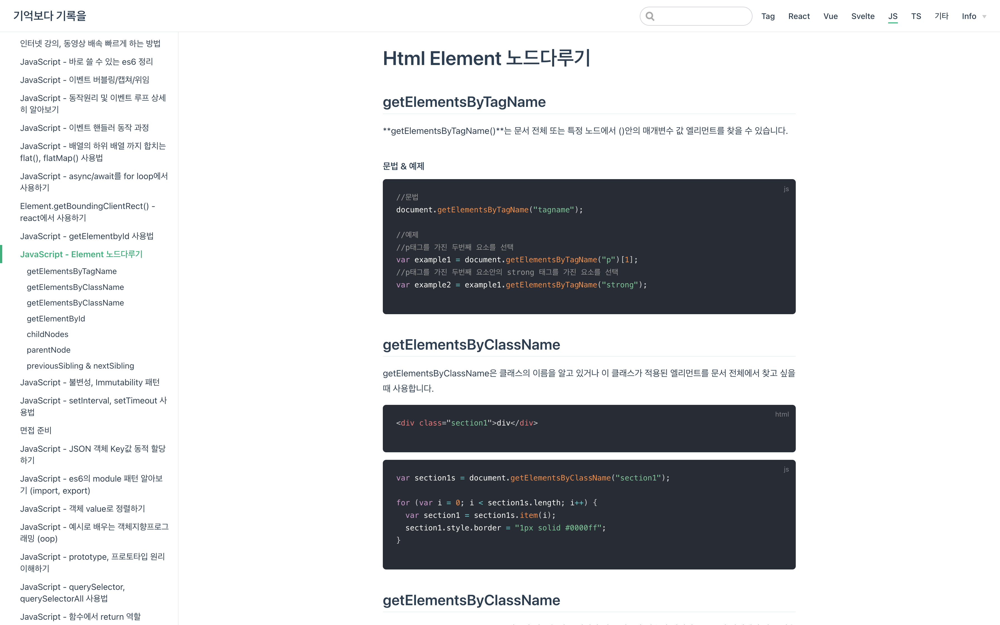
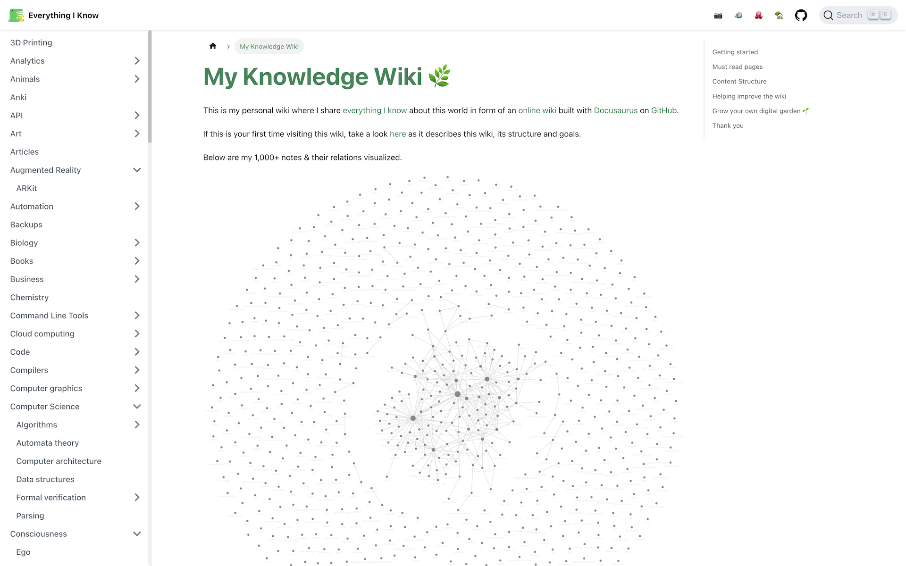

## State-of-the-art References

### [Stephan Ango](./../.././docs/pages/Stephan%20Ango.md) [Link](https://stephanango.com)

<Accordions>
<Accordion title="Images">

<figure>

</figure>

<figure>

</figure>

</Accordion>
</Accordions>

### [The Lab Notes](https://alexanderobenauer.com/labnotes/000/) by [Alexander Obenauer](https://twitter.com/alexobenauer)

Seems like using [Svelte](./../.././docs/pages/Svelte.md)

<Accordions>
<Accordion title="Images">

<figure>

</figure>

<figure>

</figure>

<figure>

</figure>

<figure>

</figure>

<figure>

</figure>

</Accordion>
</Accordions>

### [Younho9 Notes](https://notes.younho9.com/) by [younho9 (Younho Choo)](https://github.com/younho9)

<Accordions>
<Accordion title="Images">

<figure>

</figure>

<figure>

</figure>

</Accordion>
</Accordions>

### [기억보다 기록을](https://kyounghwan01.github.io) by [Kyounghwan01 (kyounghwan Noh)](https://github.com/Kyounghwan01)

<Accordions>
<Accordion title="Images">

<figure>

</figure>

</Accordion>
</Accordions>

### [Everything I know](https://wiki.nikiv.dev/) by [nikitavoloboev (Nikita)](https://github.com/nikitavoloboev)

<Accordions>
<Accordion title="Images">

<figure>

</figure>

</Accordion>
</Accordions>

### [Andy Matuschak](./../.././docs/pages/Andy%20Matuschak.md)

- [sliding panes](./../.././docs/pages/Sliding%20Panes.md)

## Potential Tools

- [Using React with D3.js](https://wattenberger.com/blog/react-and-d3)
- [Speeding up force simulations with spirals](https://wattenberger.com/blog/spirals)
- [Scaling SVG Elements](https://wattenberger.com/guide/scaling-svg)
- [Use the d3 force](https://wattenberger.com/blog/d3-force)
- [ConvertKit: The creator marketing platform](https://convertkit.com/)

## Interesting Blogs

- [flurries of latent creativity](https://blog.singleton.io/)
- [What to blog about](https://simonwillison.net/2022/Nov/6/what-to-blog-about/)
- [Simon Willison: TIL](https://til.simonwillison.net/)

## [Interactive Articles](./../.././docs/pages/Interactive%20Articles.md)

- [Tania Rascia](https://www.taniarascia.com/)
- [Edy Kim](https://edykim.com/)
- [Chris Welch](https://chriswelch.co/)

## Fast Websites

- [Telmo Goncalves](https://telmo.is/)
- [Lee Robinson - Developer, writer, creator.](https://leerob.io/)
- [Timo Lins - Code · Design · Film](https://timo.sh/)

## Built with Market Softwares

- [Joshua's Garden](https://joschuasgarden.com/50+Slipbox/Welcome!)
- [Mister Chad](https://mister-chad.com/welcome)
- [JT's Digital Garden](https://notes.gnotract.com/00+%F0%9F%A4%AF+Meta/%F0%9F%93%8C+Landing+Page)
- [docs.logseq.com](https://docs.logseq.com/)
- [note.xuanwo.io](https://note.xuanwo.io/)
- [pengx17.github.io](https://pengx17.github.io/knowledge-garden)
- [whatiknown.strrl.dev](https://whatiknown.strrl.dev/)
- [io-oi.me/wiki](https://io-oi.me/wiki)
- [To The Garden](https://tothegarden.vercel.app/page/%E8%8A%B1%E5%9B%AD%E6%BC%AB%E6%AD%A5%20to%20the%20Garden)
- [zhangxueshan246.github.io](https://zhangxueshan246.github.io/#/)
- [xutuan.vercel.app](https://xutuan.vercel.app/#/page/logseq%E4%BD%BF%E7%94%A8%E7%BB%8F%E9%AA%8C%E5%88%86%E4%BA%AB)
- [bmpi.dev](https://www.bmpi.dev/)
- [logseq.abosen.top](https://logseq.abosen.top/#/page/README)

## References

- [Support Roam-like Linking for Docs Folder · Issue #7618 · facebook/docusaurus](https://github.com/facebook/docusaurus/issues/7618)
- _Create beautifully tended Digital Gardens from your RoamResearch graph. Publish your notes as a static site in a few simple steps_ - [Roam Garden](https://roam.garden/)
  - _These notes are the first attempt at a [Digital Garden](./../.././docs/pages/Digital%20Garden.md) and, as such, are a little wild and untamed. There's no central index or table of contents; you explore by going deeper and deeper down the rabbit hole._ - [About these notes](https://matt.roam.garden/)
  - _👋 I'm Vlad Sitalo - the creator of Roam Garden. I like to build things, and at times, I wonder about:_ - [Garden Terrace](https://vlad.roam.garden/)
- [GitHub - maximevaillancourt/digital-garden-jekyll-template: Start your own digital garden using this Jekyll template 🌱](https://github.com/maximevaillancourt/digital-garden-jekyll-template)
- _GitHub Action Logseq Publish_ - [Logseq Publish · Actions · GitHub Marketplace](https://github.com/marketplace/actions/logseq-publish)
