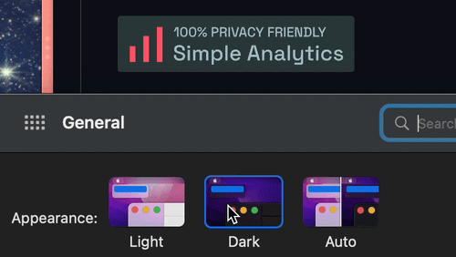

## One way of doing it (wrong)

- Using `#gh-dark-mode-only` for [GitHub](./../.././docs/pages/GitHub.md)

```

<figure>


</figure>

<figure>


</figure>
```

- This does not scale and does not work outside of [GitHub](./../.././docs/pages/GitHub.md)

## The proper way

Using `preferred color scheme` CSS property and [HTML](./../.././docs/pages/HTML.md) Picture `srcset` property.

```html
<a title="Simple Analytics" href="" referrerpolicy="origin" target="_blank">
  <picture>
    <source media="(prefers-color-scheme: dark)" srcset="https://simpleanalyticsbadges.com/cho.sh?mode=dark" />
    
  </picture>
</a>
```


<figure>




</figure>

<head>
  <html lang="en-US"/>
</head>
