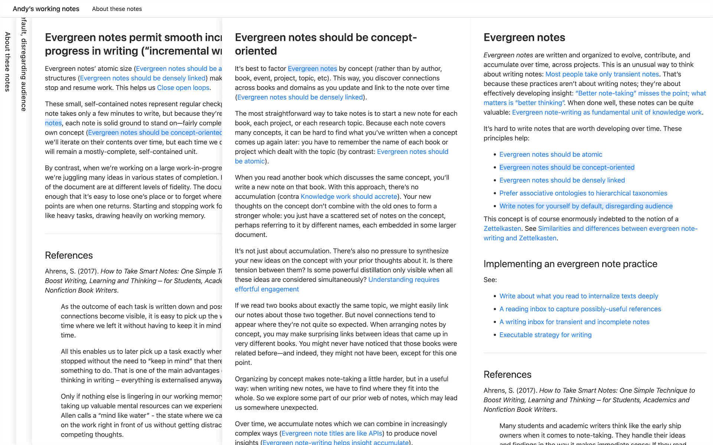

- It seems like it was first introduced by [Andy Matuschak](./../.././docs/pages/Andy%20Matuschak.md), at least his version made it the trend.

<figure>

</figure>

<head>
  <html lang="en-US"/>
</head>
