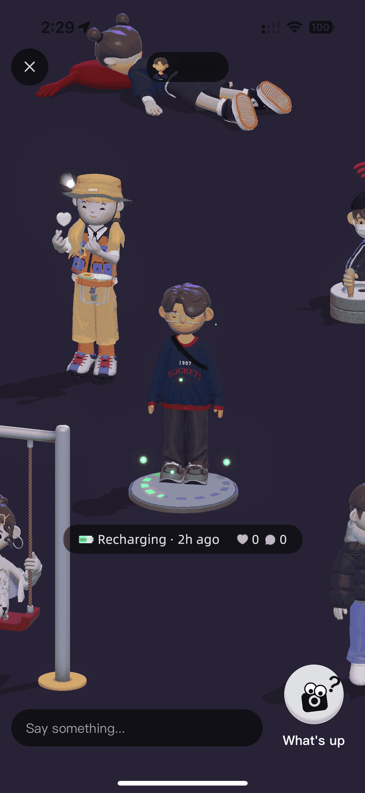
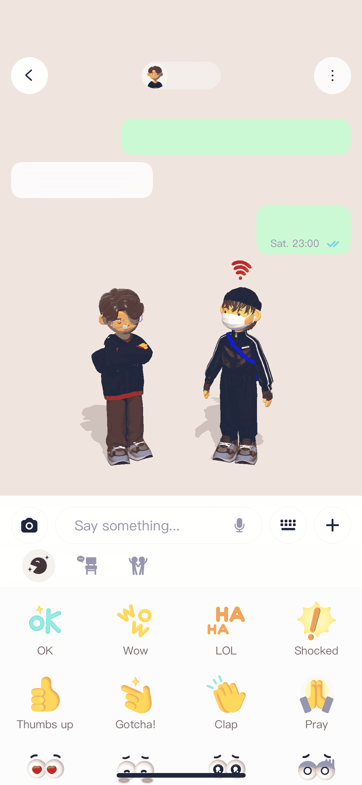

[Bondee](./../.././docs/pages/Bondee.md) is a [metaverse](./../.././docs/pages/Metaverse.md) social app, going crazy in [Korea](./../.././docs/pages/%EB%8C%80%ED%95%9C%EB%AF%BC%EA%B5%AD.md), [Japan](./../.././docs/pages/%EC%9D%BC%EB%B3%B8.md), [Singapore](./../.././docs/pages/Singapore.md), [Taiwan](./../.././docs/pages/%EB%8C%80%EB%A7%8C.md), etc., ranking #1 in the [App Store](./../.././docs/pages/App%20Store.md). Users can create a [3d](./../.././docs/pages/3D.md) character and design rooms of their own. Imagine [Club Penguin](./../.././docs/pages/Club%20Penguin.md) or [Habbo Hotel](./../.././docs/pages/Habbo%20Hotel.md) but in a modern messenger form. It is one of the superior [metaverse](./../.././docs/pages/Metaverse.md) apps, with great modeling, natural interactions, and millions of [3D](./../.././docs/pages/3D.md) styles and assets. It feels better than [Facebook](./../.././docs/pages/Facebook.md) and [Instagram](./../.././docs/pages/Instagram.md)'s [3D](./../.././docs/pages/3D.md) avatar.

<figure>

</figure>

Then what makes it so good? My observations:

**[3D](./../.././docs/pages/3D.md) character creation**. [Bondee](./../.././docs/pages/Bondee.md) has so many trendy presets that it took me 5 seconds to create my avatar. Customizability is always great, but I was always scared of [Instagram](./../.././docs/pages/Instagram.md) giving me a bare-face avatar that I had to go through 49 different layers of facial features.

<figure>

</figure>

**Townhall**. This is where you can see all your online friends and join them in their rooms. The town hall has a significant social effect, as you can see your friends' avatars moving around and interacting with each other. You also see more friends compared to the plain table view found in most messengers; you feel like you're hanging out! Friends' social updates show as small speech balloons instead of boring feeds. The avatars also behave differently depending on the content of the status update, for example, biking, having coffee, or binge-watching.

<figure>

</figure>

**What's up Button**. Next to the avatars chilling at the Townhall, there is a What's up button. It sends your friend a notification to snap a photo of yourself or your surroundings and send it to you. It's basically like Snapchat, but the difference is that you don't have that initial mental barrier of starting a conversation --- I found myself tapping that button way more often when checking out status updates on the Townhall. Sometimes, a single [UI and UX](./../.././docs/pages/UI%20and%20UX.md) makes a huge difference.

<figure>

</figure>

**Chat**. The chat interface is different from other apps; the top half is the chat bubbles, and the lower half you have your friend's avatar and your avatar talking to each other. They can hug, high-five, dance, or do other interactions based on the content of the chat. They do some simple text tokenization, analyzing the chat content and acting accordingly. For example, if you type "I had dinner", your avatars will pretend to have dinner together.

<figure>

</figure>

**Neighborhood**. There are also your room and customizability features. The neighborhood gives you an isometric apartment-like view, which makes you feel like you are living in a virtual community. Also, you can check the visitors to your room to spot who's spying on you. You can also leave a note when visiting other's rooms.

<figure>

</figure>
