## Full-text

### [Notion](./../.././docs/pages/Notion.md)

<figure>

</figure>

### [Obsidian](https://obsidian.md/)

<figure>

</figure>

### [Dendron](https://www.dendron.so/)

<figure>

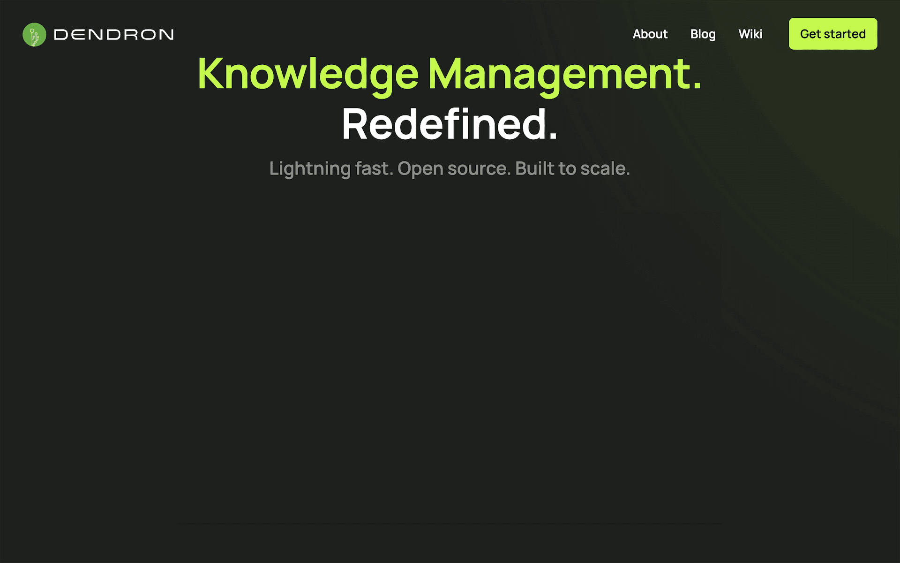

</figure>

### [Craft](https://www.craft.do/)

<figure>

</figure>

### [Scrivener](https://www.literatureandlatte.com/scrivener/overview)

<figure>

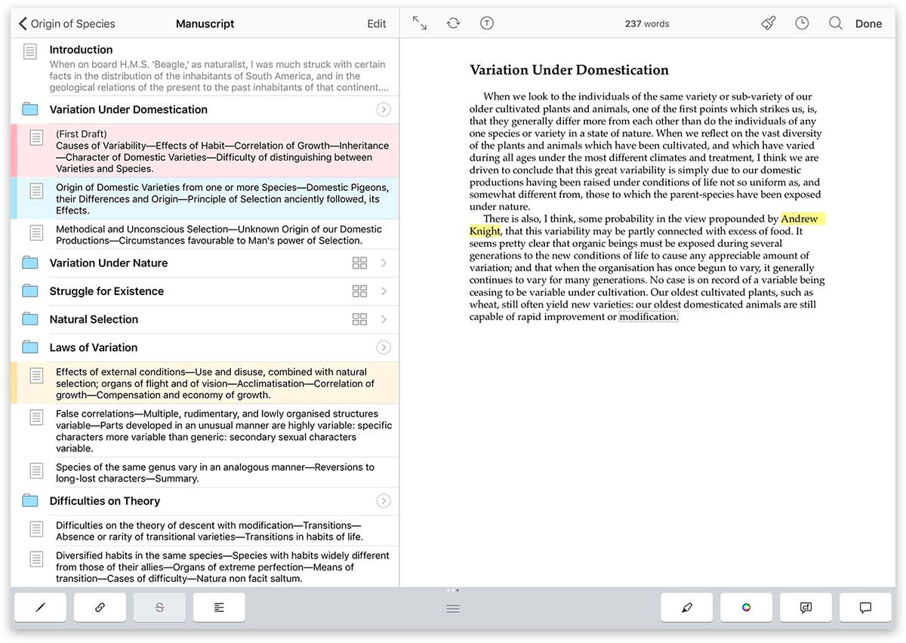

</figure>

### [zadam/trilium](https://github.com/zadam/trilium)

<figure>

</figure>

### [Standard Notes](https://standardnotes.com/)

<figure>

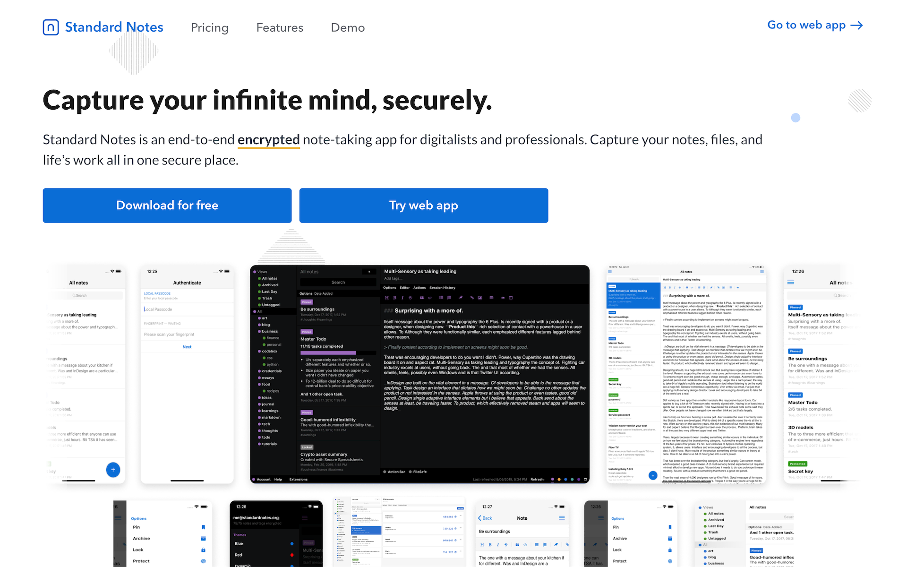

</figure>

### [usememos/memos](https://github.com/usememos/memos)

<figure>

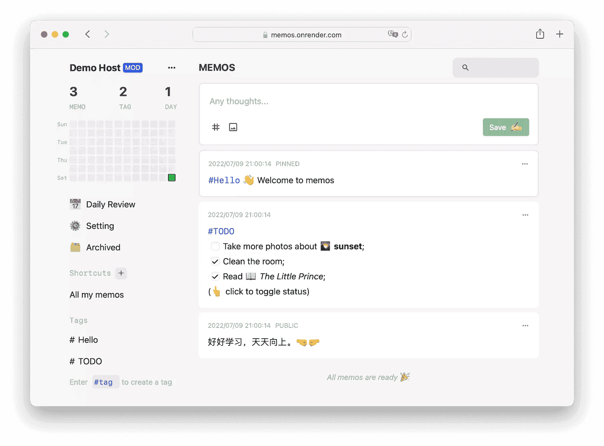

</figure>

### [Mem](https://get.mem.ai/)

<figure>

</figure>

### [Saga](https://saga.so/)

<figure>

</figure>

### [myReach](https://myreach.io/features/)

<figure>

</figure>

## Outliner

### [Roam Research](./../.././docs/pages/Roam%20Research.md)

<figure>

</figure>

### [Logseq](https://logseq.com/)

<figure>

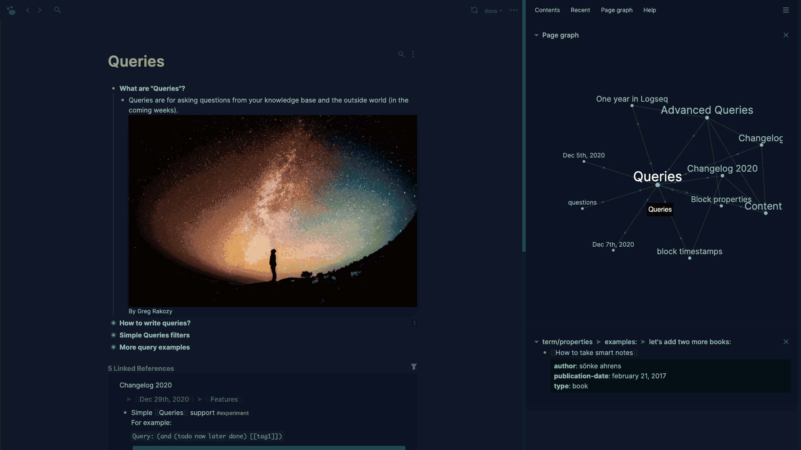

</figure>

### [WorkFlowy](https://workflowy.com/)

<figure>

</figure>

### [Dynalist](https://dynalist.io/)

<figure>

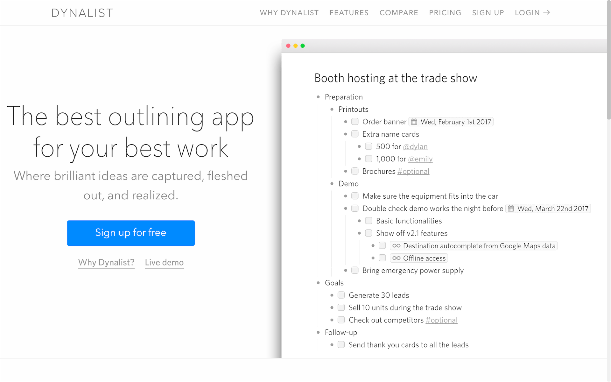

</figure>

### [Supernotes](https://supernotes.app/)

<figure>

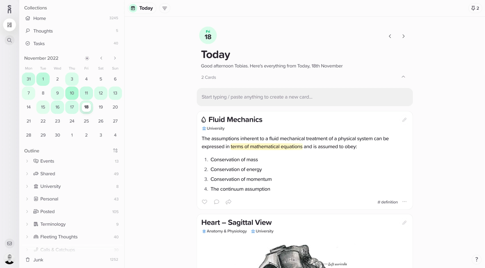

</figure>

<figure>

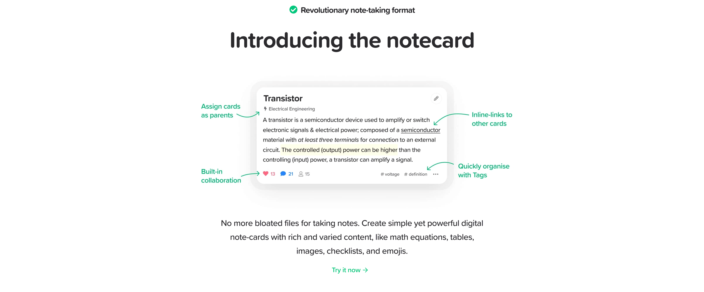

</figure>

<figure>

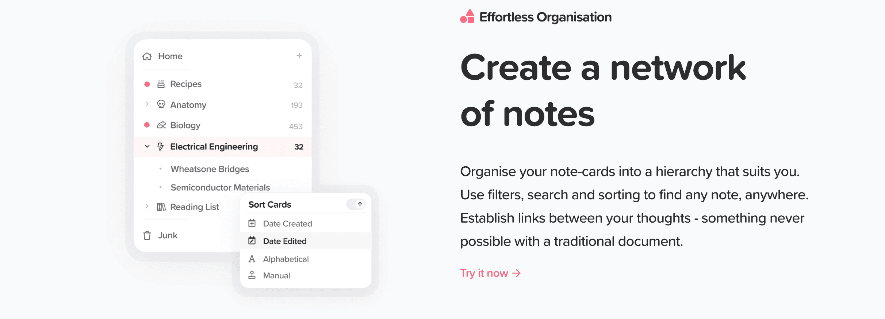

</figure>

<figure>

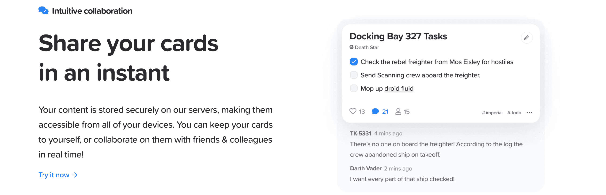

</figure>

<figure>

</figure>

## Dev

### [Paracosm](./../.././docs/pages/Paracosm.md)

<figure>

</figure>

### [Docusaurus](https://docusaurus.io/)

<figure>

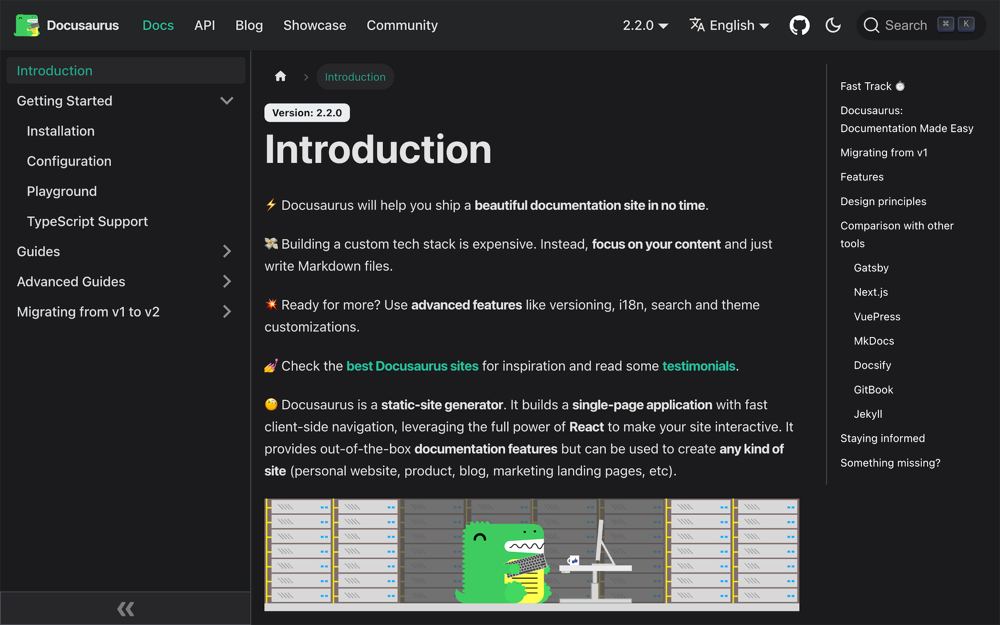

</figure>

## Discontinued

### [Weavit](https://www.weavit.ai/)

<head>
  <html lang="en-US"/>
</head>
