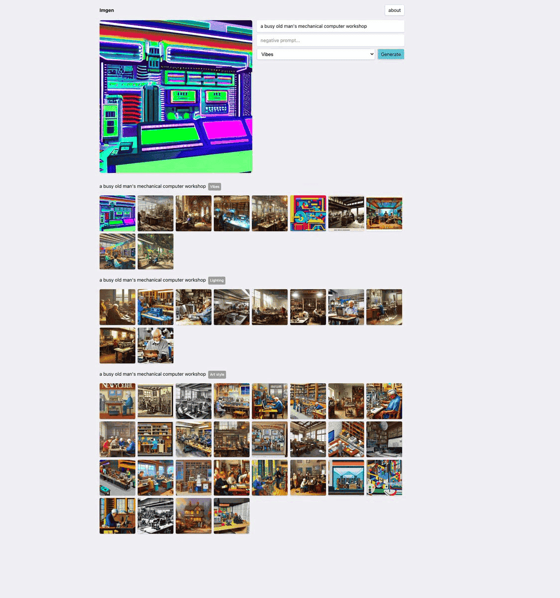
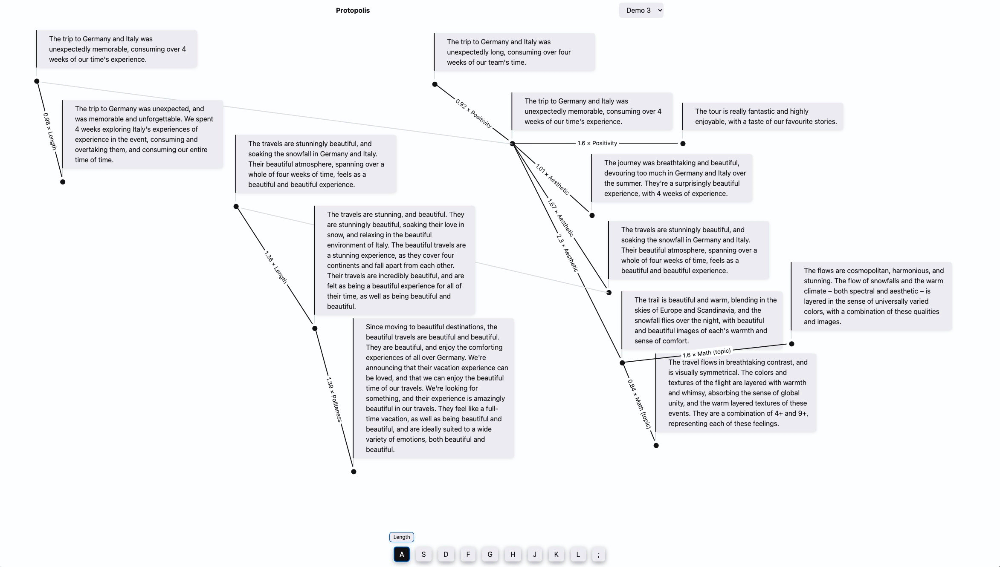
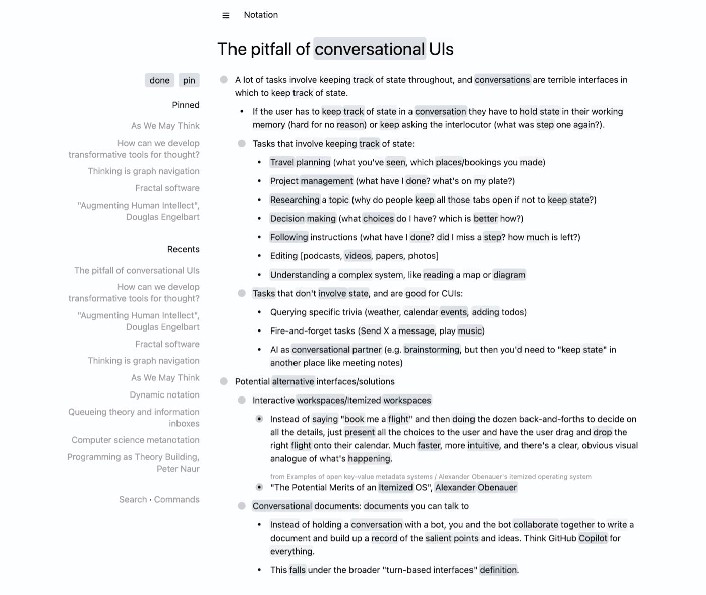
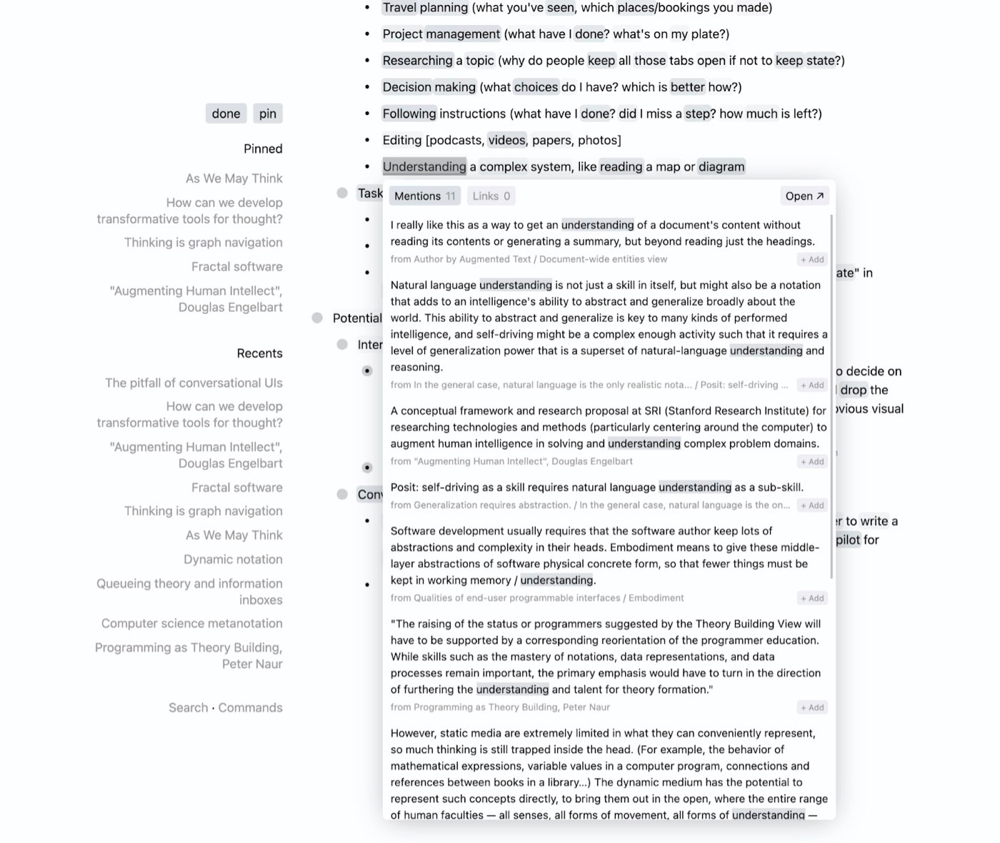
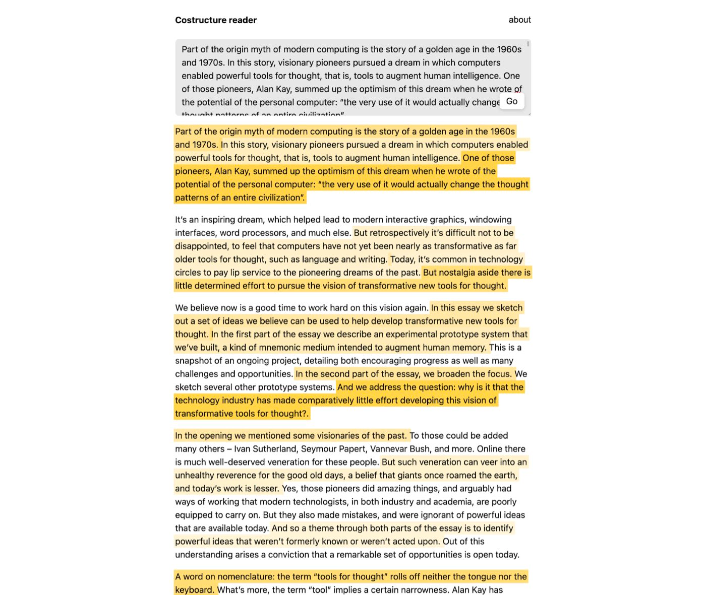
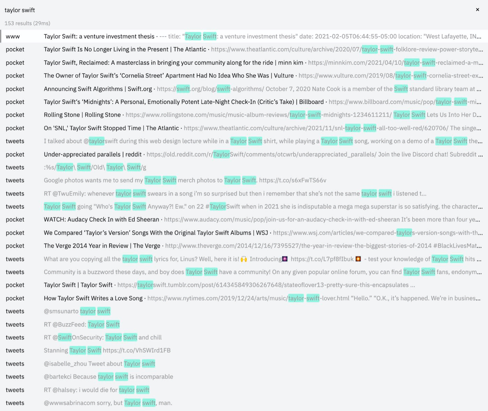
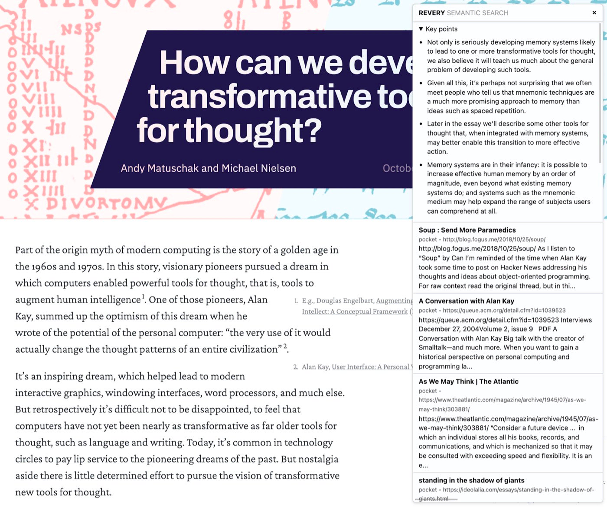

### [Search in a Latent Space](./../.././docs/pages/Search%20in%20a%20Latent%20Space.md)

- [Tweet](https://twitter.com/thesephist/status/1592241959489380354?s=20&t=8ZzexwJZiQeJ2a2m3F3RtQ)

<figure>

</figure>

<figure>

</figure>

### The "Length" dimension of [Synthote](./../.././docs/pages/Synthote.md)s

<figure>

</figure>

### Notation: [Text-based Tools for Thought](./../.././docs/pages/Text-based%20Tools%20for%20Thought.md) that automatically links

<figure>

</figure>

<figure>

</figure>

### CoStructure: [Data Capturers](./../.././docs/pages/Data%20Capturers.md) tool that automatically highlights

<figure>

</figure>

### Monocle: [Search Engine Indexing Your Life](./../.././docs/pages/Search%20Engine%20Indexing%20Your%20Life.md)

<figure>

</figure>

<figure>

</figure>

<head>
  <html lang="en-US"/>
</head>
