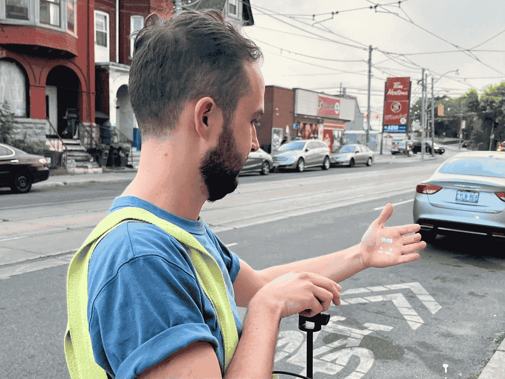
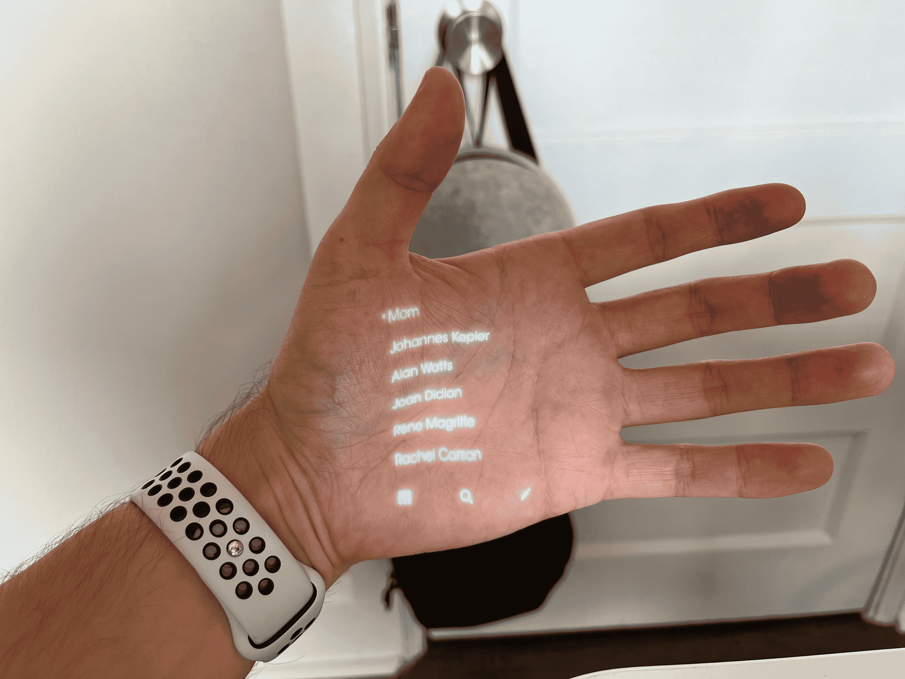
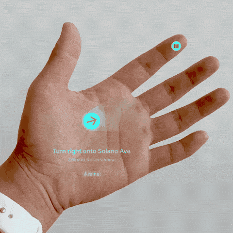
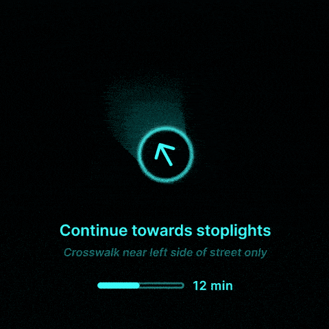

[Case Study](./../.././docs/pages/Case%20Study.md) of [Humane Ai Pin](./../.././docs/pages/Humane%20Ai%20Pin.md)

## [Process - Wayfinding with Ai Pin](https://michaelandzanes.website/process)

### Pocket-sized projector

<figure>

</figure>

- Used a Pico projector.
- Took the projector outside to film our concepts and showcase how they could work.

### Architecture

<figure>

</figure>

- Hypothesized that [Ai Pin](./../.././docs/pages/Humane%20Ai%20Pin.md) could utilize a MEMS blue laser scanner
  - small size, energy efficiency, and always-in-focus capabilities.
- Projected images on our hands and developed guidelines for positioning and scaling [UI](./../.././docs/pages/UI%20and%20UX.md) elements.

### Font and line weights

<figure>

</figure>

- Created tests to find which fonts, line weights, and shapes were ideal for legibility under bright and dark environments to understand laser projectors better.

### [Iterative](./../.././docs/pages/Iterative%20and%20Incremental%20Development.md) prototyping

<figure>

</figure>

- The demo shows a compass arrow that adjusts its perspective based on your hand position.
- Used tools like Figma, Origami, and Keynote

### Inspiration

<figure>

</figure>

- Light Phone II is designed as a communication tool that reduces distractions.
- Inspired by its interface and tried projecting it as an early experiment.

### One-handed operation

<figure>

</figure>

- [Ai Pin](./../.././docs/pages/Humane%20Ai%20Pin.md) should still work with one hand.
- This example shows how you could return to a dashboard or "home" state by closing your palm.
- This correlates with you "closing" an activity.

### Primary gestures

<figure>

</figure>

- We would like to know if you could display interface elements on your fingertips that could be easily tapped.
- This solution feels ergonomically friendly.
- Not sure if the hardware will be able to project onto a target this small

### Common interactions

<figure>

</figure>

- We tested our interaction mechanisms on common visual elements such as lists.
- This demo explores scrolling lists using a two-handed gesture.
- The interfaces we pursued for this concept reduced the need to scroll by displaying minimal information.

### [Animations](./../.././docs/pages/Animation.md) and haptics

<figure>

</figure>

- Multi-modal feedback --visual cues, sound, and haptics-- would be critical for Wayfinding.
- Built [animations](./../.././docs/pages/Animation.md) to work alongside the potential hardware to demonstrate these scenarios.

### Ambient awareness

<figure>

</figure>

- A future iteration of the hardware may be able to listen to announcements.
- [Ai Pin](./../.././docs/pages/Humane%20Ai%20Pin.md) could transcribe and alert you about relevant trip updates.

### Dynamic, contextually aware interface

<figure>

</figure>

- Seamlessly transition and adapt based on understanding your surroundings.
- Less manual control, more intelligent interface, without interaction
