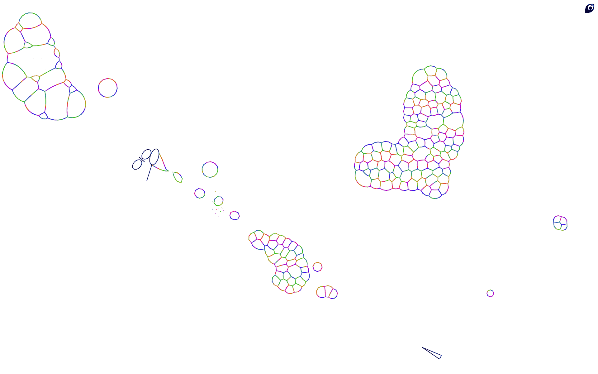
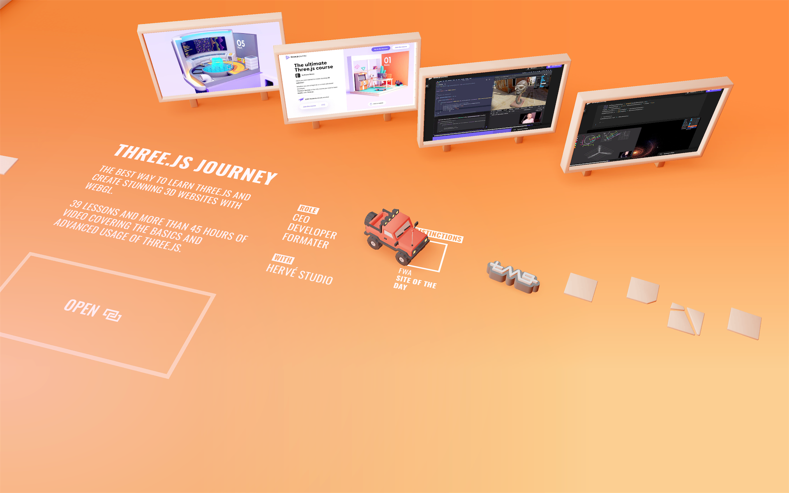

- [Graphics](./../.././docs/pages/Graphics.md) on Web
- Usually uses [WebGPU](./../.././docs/pages/WebGPU.md) and [WASM](./../.././docs/pages/WebAssembly.md)
- [3d Globe on the Web](./../.././docs/pages/3d%20Globe%20on%20the%20Web.md)

## [Bubbles](https://oimo.io/works/bubbles/)

<figure>

</figure>

## [Jesse's Ramen](https://jesse-zhou.com/)

<figure>

</figure>

## [Bruno Simon](https://bruno-simon.com/)

<figure>

</figure>

## [Inside the Great Pyramid | Giza Project](https://giza.mused.org/en/guided/266/inside-the-great-pyramid)

<figure>

</figure>

<head>
  <html lang="en-US"/>
</head>
