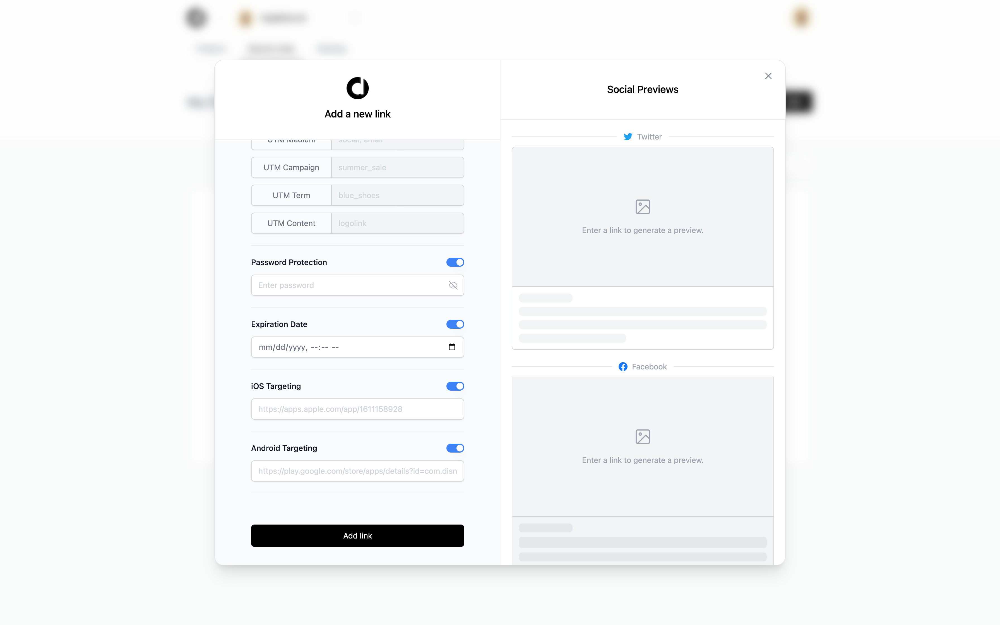
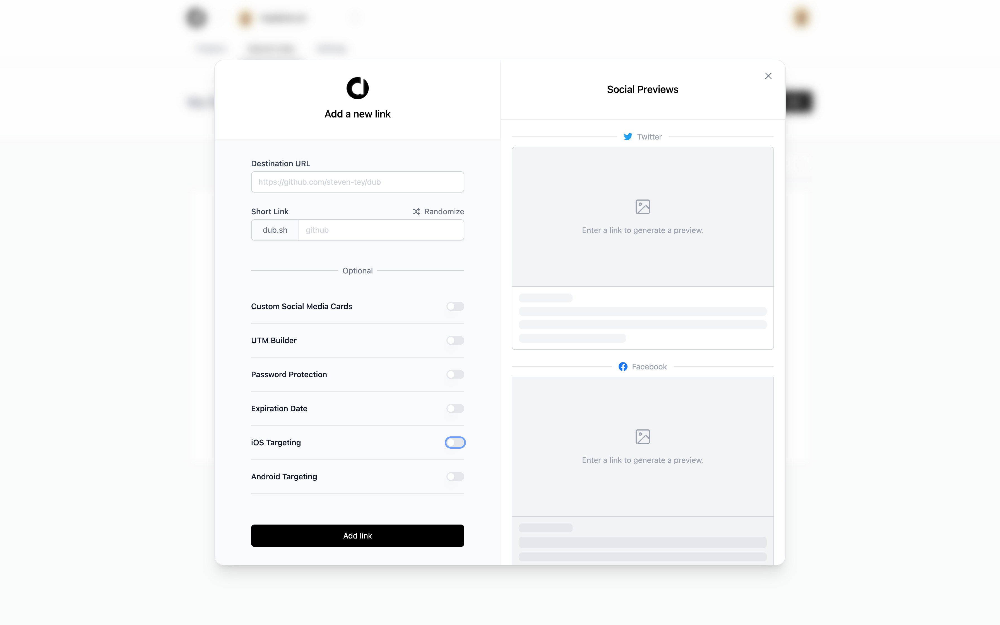

<figure>

</figure>

<figure>

</figure>

## Announcement

- [Steven Tey: "Introducing my new side project: https://t.co/BGR54GVVRK It's an open-source link-shortener Software as a Service with built-in analytics + free custom domains 🚀 Built with ▲ @Vercel Edge Functions + @Upstash Redis"](https://twitter.com/steventey/status/1572958186667233282)
- Built with Vercel [Edge](./../.././docs/pages/Edge.md) Functions + Upstash Redis
- I built a dashboard to visualize the time-series data for each link's clicks (incl. location, device/[os](./../.././docs/pages/OS.md)) with [airbnb/visx: 🐯 visx | visualization components](https://github.com/airbnb/visx)
- You can use your domain for links (e.g., http://stey.me/devrel) even on free plans. This is made possible by the Platforms Starter Kit that I launched at Vercel earlier this year: [vercel/platforms: A template for site builders and low-code tools.](https://github.com/vercel/platforms)
  - [Next.js](./../.././docs/pages/Next.js.md) framework
  - [Vercel](./../.././docs/pages/Vercel.md) hosting
  - [Tailwind](./../.././docs/pages/Tailwind.md) CSS
  - upstash database
  - nextauthjs
  - [Framer Animation](./../.././docs/pages/Framer%20Motion.md)
  - stripe payments
  - [AGPL](./../.././docs/pages/AGPL.md)

<head>
  <html lang="en-US"/>
</head>
