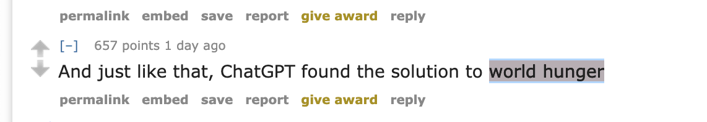
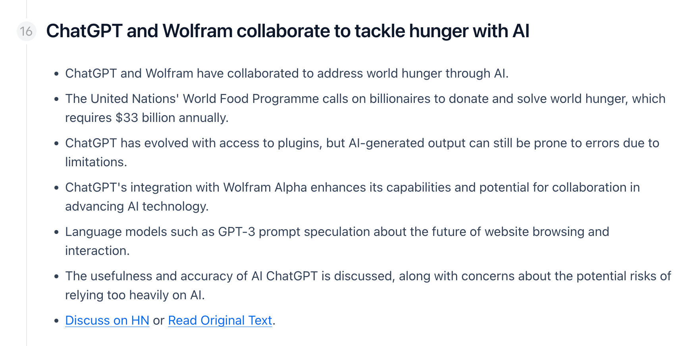
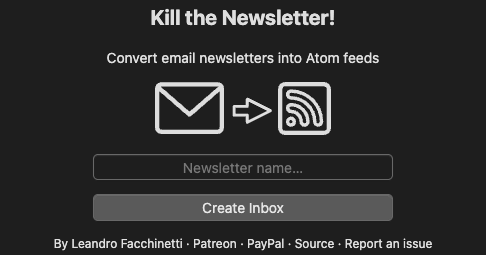
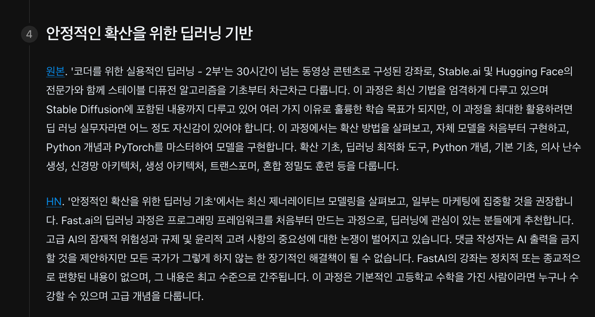
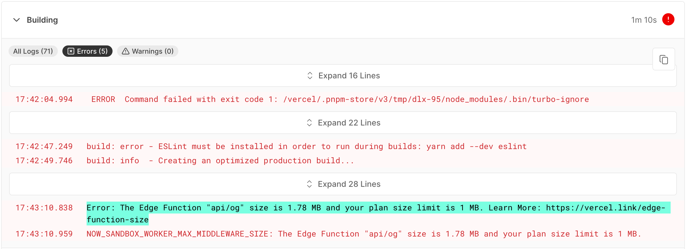
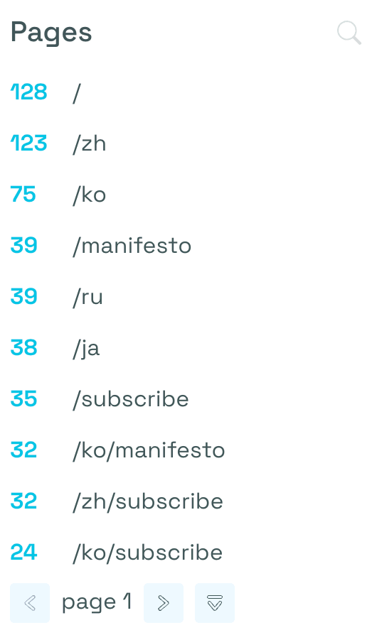
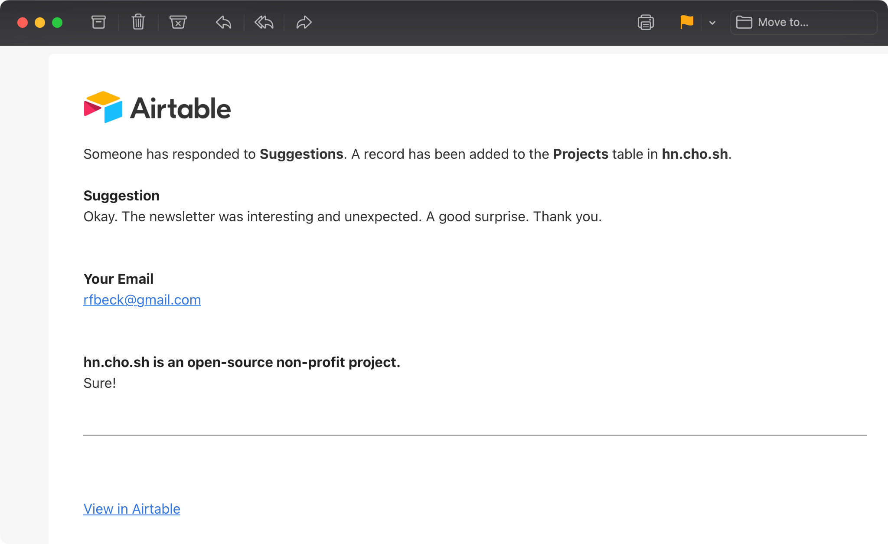

## [Prehistoric](./../.././docs/pages/Prehistoric.md)

- [Artifact](./../.././docs/pages/Artifact.md)
- [우린 텍스트 틱톡을 평생 만들 수 있을까](./../.././docs/pages/%EC%9A%B0%EB%A6%B0%20%ED%85%8D%EC%8A%A4%ED%8A%B8%20%ED%8B%B1%ED%86%A1%EC%9D%84%20%ED%8F%89%EC%83%9D%20%EB%A7%8C%EB%93%A4%20%EC%88%98%20%EC%9E%88%EC%9D%84%EA%B9%8C.md)
- [Algorithmic Recommendation Engine for Texts](./../.././docs/pages/Algorithmic%20Recommendation%20Engine%20for%20Texts.md)
- [Can we ever build TikTok for Text](./../.././docs/pages/Can%20we%20ever%20build%20TikTok%20for%20Text.md)
- [NewsGPT](./../.././docs/pages/NewsGPT.md)

## [2023-03-06](./../.././docs/journals/2023-03-06.md)

News app, but all critical information is in chat bubbles--short, informative, and friendly chats. You can ask follow-up questions, and it will look up articles on the web, like how [Bing Chat](./../.././docs/pages/Bing%20Chat.md) does, and provide answers.

- Send message (share)
- Chatbot will answer and give contexts
- 그냥 인터페이스 다 없애고 [nudge](./../.././docs/pages/Nudge.md)처럼 100% [문자](./../.././docs/pages/Text%20Message.md) 기반?
- 하루에 한두개 비슷한 뉴스 채팅으로 던져주기

## [2023-03-20](./../.././docs/journals/2023-03-20.md)

해커뉴스를 읽고 있다가 이걸 [AI](./../.././docs/pages/AI.md)에게 요약해보고 있었다.
그냥 이걸 파이프라인으로 만들면 어때?

## [2023-03-21](./../.././docs/journals/2023-03-21.md) -- [2023-03-23](./../.././docs/journals/2023-03-23.md)

Ghost로 간단하게 뉴스레터 웹사이트를 만들어보았다.
Stripe도 붙이려다가 [한국](./../.././docs/pages/%EB%8C%80%ED%95%9C%EB%AF%BC%EA%B5%AD.md)이 지원되지 않아 포기했다.

## [2023-03-24](./../.././docs/journals/2023-03-24.md)

Ghost를 버리고 Nextra로 만들기로 했다.
GitHub Actions로 빌드하는 방식으로.
간단하게 사이트를 만들고 시범적인 CI/CD를 돌려보았다.

## [2023-03-25](./../.././docs/journals/2023-03-25.md)

<figure>

</figure>

<figure>

</figure>

ㅋㅋㅋㅋㅋㅋ 진지해서 웃긴데 해결책은 찾아야겠다.

## [2023-03-31](./../.././docs/journals/2023-03-31.md)

며칠 전의 문제는 프롬프트를 조금 더 정교하게 설계하는 방향으로 어느 정도 해결했다. 안되면 모델을 Fine-tuning하려고 알아보고 있다. 참고해볼만한 자료:

- [Fine-tune LLaMA to speak like Homer Simpson](https://replicate.com/blog/fine-tune-llama-to-speak-like-homer-simpson)
- [Fine-tuning - OpenAI API](https://platform.openai.com/docs/guides/fine-tuning)

[OpenAI](./../.././docs/pages/OpenAI.md)를 가지고 많이 놀았다.
그와중에 DeepL은 [API](./../.././docs/pages/API.md)를 열어주지 않고 있었다.
결제 과정에서 오류가 나는 것을 일주일 째 방치하는 [SaaS](./../.././docs/pages/Software%20as%20a%20Service.md) 기업이라니.

## [2023-04-02](./../.././docs/journals/2023-04-02.md)

[Bing Chat for All Browsers](./../.././docs/pages/Bing%20Chat%20for%20All%20Browsers.md)가 10만 주간 사용자를 돌파하기 직전이다. 아마도 사이드바 채팅 [AI](./../.././docs/pages/AI.md)를 추가하고 [hn.cho.sh](./../.././docs/pages/hn.cho.sh.md)에 대한 셀프 프로모션을 추가해야겠다.

## [2023-04-03](./../.././docs/journals/2023-04-03.md)

[hn.cho.sh](./../.././docs/pages/hn.cho.sh.md)에 조금 더 예쁜 이름이 필요하다.
그리고 [Bing Chat for All Browsers in Japan](./../.././docs/pages/Bing%20Chat%20for%20All%20Browsers%20in%20Japan.md)에서 알듯이 뭔가 [일본](./../.././docs/pages/%EC%9D%BC%EB%B3%B8.md)에서 이런 프로덕트 반응이 잘 오는 것 같았다.
[일본](./../.././docs/pages/%EC%9D%BC%EB%B3%B8.md)으로 진출하기 위해 오랜만에 [일본인](./../.././docs/pages/%EC%9D%BC%EB%B3%B8%EC%9D%B8.md) 친구들에게 [이메일](./../.././docs/pages/Mail.md)을 조금 돌렸다. 얘기를 들어보니 Zenn을 많이 쓴다는 것 같길래 여기에 가입해서 홍보를 해봤다. [Show Zenn: シリコンバレーを理解する最も簡単な方法](https://zenn.dev/anaclumos/scraps/5c6ffc58a1b1e9)

[Twitter Link Preview](./../.././docs/pages/Twitter%20Link%20Preview.md)를 추가했다.

그리고 GitHub Actions에는 현재 돌고 있는 액션의 로그가 보이지 않는 버그가 있다. [Log lines for an active step are inaccessible · Issue #2131 · actions/runner](https://github.com/actions/runner/issues/2131)

[i18n](./../.././docs/pages/Internationalization.md)을 Sitemap과 HTML Head [hreflang](./../.././docs/pages/hreflang.md)으로 자동 생성되도록 만들었다. Nextra의 [i18n](./../.././docs/pages/Internationalization.md) 구조에 호환되게 만들려고 하니 링크 변형 함수를 많이 만들어야 했다.

<figure>

</figure>

<figure>

</figure>

그리고 [Bing Chat for All Browsers](./../.././docs/pages/Bing%20Chat%20for%20All%20Browsers.md)도 WAU 10만을 넘었다.

<figure>

</figure>

## [2023-04-04](./../.././docs/journals/2023-04-04.md)

구독자들의 [이메일](./../.././docs/pages/Mail.md)을 보며 되게 다양한 회사가 있음을 느꼈다.
유럽에 기반한 [Proton](https://proton.me/)이라는 회사 및 덕덕고 [이메일](./../.././docs/pages/Mail.md)이 존재한다는 것도 이번에 알게 되었고,
[이메일](./../.././docs/pages/Mail.md)에 `+tag` 오퍼레이터를 사용해서 [이메일](./../.././docs/pages/Mail.md)을 정리하는 사람들, 본인의 도메인을 사용하는 인디 해커들, 일회용 [이메일](./../.././docs/pages/Mail.md)이나 RSS 피드 변환 앱 ([Kill the Newsletter!](https://kill-the-newsletter.com/))을 적극 활용하시는 분도 있으셨다. [인공지능](./../.././docs/pages/AI.md) 회사, 자율주행 회사, 블록체인 회사, [VC](./../.././docs/pages/Venture%20Capital.md), 웹툰 회사, 고전적 자산운용사, 그 뿐만 아니라 연예기획사와 은행, 출판사 분들도 있었다.

<figure>

</figure>

그나저나 아직 조금 더 지켜봐야겠지만, 해외 시장에서는 전혀 반응이 없다. PMF에서 P랑 F는 찾았는데 아직 M을 뚫는 방법을 모르겠다.

미디어의 소유주에겐 항상 이렇게 많은 연결고리들이 열렸겠지?

## [2023-04-05](./../.././docs/journals/2023-04-05.md)

꿈결에 진짜 기가 막힌 프로젝트 이름이 생각 났는데 사라지고 말았다.

링크드인과 레딧 광고를 시작했다. 트위터도 돌리기 위해서 노력하고 있는데 트위터 광고 기능도 엄청 망가졌다: [The Twitter API is now effectively unmaintained](https://news.ycombinator.com/item?id=35370152)

상단에 "공유" - "구독" - "오늘의 뉴스"?로 하려고 했는데 이거 `getStaticProps`로 하면 될 것 같았는데 이상하게 잘 안 돼서 일단 포기.

프롬프트를 조금 개선했더니 요약 품질이 많이 좋아졌다. 오늘거 좀 마음에 든다.

<figure>

</figure>

<figure>

</figure>

<figure>

</figure>

Jargon Manager를 만들어야겠다. Stable Diffusion을 '안정적인 확산'이라고 번역하다니! DeepL 기능에 Glossary를 지원하는 기능이 있는데, 문제는 [API](./../.././docs/pages/API.md)를 사용한다면 무조건 [API](./../.././docs/pages/API.md)를 사용해서 등록해야 한다고 🫤 이게 말이 되나 [DeepL API](https://www.deepl.com/docs-api/glossaries/list-glossaries/)

<figure>

</figure>

## [2023-04-06](./../.././docs/journals/2023-04-06.md)

덴마크에서 누군가 다녀가길래 드디어 완전 모르는 유럽 분이 구독하시나 했는데 아마 구독은 안 하신 듯 했다.

<figure>

</figure>

og.cho.sh로 OG 생성을 옮기면서 [Pretendard](./../.././docs/pages/Pretendard.md)를 적용하려고 했는데.

<figure>

</figure>

폰트 파일 때문에 용량이 초과되었다. [Tips for optimizing font size? · vercel/satori · Discussion #434](https://github.com/vercel/satori/discussions/434)

## [2023-04-10](./../.././docs/journals/2023-04-10.md)

트위터와 링크드인에 자동 업그레이드 기능을 만들었다.

받은 피드백:

> I subscribed for a bit and appreciated the detail, but I felt the descriptions were lengthy. I like this [AI](./../.././docs/pages/AI.md) [newsletter](https://www.bensbites.co/): pretty easy-to-follow section, and it feels super readable. Understanding whether you are trying to source lesser-known information, summarize long-form, or do both might be helpful.

- [Ben's Bites](https://www.bensbites.co/)

모델 파인 튜닝과 더 정교한 번역이 갈수록 필요해진다. 아무래도 [GPT-4](./../.././docs/pages/GPT-4.md)가 나오면 번역 작업을 DeepL에서 [GPT-4](./../.././docs/pages/GPT-4.md)로 갈아타고, 그리고 몇 가지 좋은 예시를 이용해서 파인튜닝 작업을 해야겠다.

## [2023-04-11](./../.././docs/journals/2023-04-11.md)

- [DeepL vs. GPT 3.5 vs. GPT 4 벤치마크](./../.././docs/pages/DeepL%20vs.%20GPT%203.5%20vs.%20GPT%204%20%EB%B2%A4%EC%B9%98%EB%A7%88%ED%81%AC.md)
- 꿈에서 첨성대, 심마니라는 이름이 들려왔다. 근데 심마니는 [검색 엔진](./../.././docs/pages/Search%20Engine.md)이었잖아?
- 결국 [DB](./../.././docs/pages/Database.md) 기반으로 옮겨가야하는 것은 맞다. SPA 기반으로.

## [2023-04-12](./../.././docs/journals/2023-04-12.md)

[LLaMa](./../.././docs/pages/LLaMA.md)의 번역 성능을 확인해보았는데 아직 GPT 2 혹은 3 정도 수준에 머물러 있다.

<figure>

</figure>

[Headless](./../.././docs/pages/Headless.md) [Chrome](./../.././docs/pages/Chrome.md)을 사용하도록 GitHub Actions를 개편했다.

## [2023-04-14](./../.././docs/journals/2023-04-14.md)

<figure>

</figure>

이런 피드백을 받아서

<figure>

</figure>

이렇게 개선했다.

그리고 [중국](./../.././docs/pages/%EC%A4%91%EA%B5%AD.md) 친구가

<figure>

</figure>

라고 하는데 [CSS](./../.././docs/pages/CSS.md) 같은거로 간단하게 처리할 수 있는지 알아봐야겠다.

## [2023-04-16](./../.././docs/journals/2023-04-16.md)

[Beehiiv](./../.././docs/pages/Beehiiv.md)의 Referral 도구가 좋다고 하는데, 가장 큰 단점은 [Beehiiv](./../.././docs/pages/Beehiiv.md)는 Multiregion을 지원하지 않는다는 점이다. 국제화는 정말 어렵다. 국제화된채로 성공하기만 한다면 엄청난 포텐셜을 지녔지만, 결국 운영 초기에 국제화에 너무 많은 지력을 쏟는다면 경작 자체를 망치게 된다.

<figure>

</figure>

게다가 이제 구독자 증가 폭이 점점 줄어들고 있다. 해야할 일을 알아보자.

- 구독 위젯 만들어서 전환률 살펴보기 (중간에 삽입)
- 광고 재개하기 (자동 광고?)
- [SparkLoop: The #1 Newsletter Growth Platform](https://sparkloop.app/) 알아보기
- 스토리별로 쪼개보기?
- [supastarter](./../.././docs/pages/Supastarter.md) - The [SaaS](./../.././docs/pages/Software%20as%20a%20Service.md) starter template for [Next.js](./../.././docs/pages/Next.js.md) and [Supabase](./../.././docs/pages/Supabase.md) 살펴보기
- 광고를 돌리는게 큰 의미가 있는지 모르겠다. 클릭 당 지출이 1-2달러 수준인데.

## [2023-04-17](./../.././docs/journals/2023-04-17.md)

### [당근](./../.././docs/pages/Karrot.md) PM 론과의 대화

- PMF보다 [Go To Market](./../.././docs/pages/Go%20To%20Market.md) [전략](./../.././docs/pages/Strategy.md)이 훨씬 더 중요하다 (진짜 그런 듯...)
- 광고 CPA가 (5-6달러) 안 좋다. 일단 오가닉에 집중하자
- 기존 구독자 만족도와 활동성을 확인하자
- 기사 내 링크를 링크 쇼트너를 써서 클릭 수를 확인하자 (현재 사용 중인 뉴스레터 서버는 이를 지원하지 않음)
- 현재 지표로 나타나는 뉴스레터 확인률 88%는 엄청나게 높다. 광고차단기 등으로 손실되는 경우를 포함한다면 구독한 사람은 거의 다 읽는다는 셈.
  - 광고의 경우 15%면 높게 나오고,
  - 뉴스레터의 경우 50%면 높게 나오는 것이 일반적.
- 왜 높을까?
  - 해커뉴스가 매력적인 컨텐츠?
  - 처음이라 신기해서?
  - 요약이 잘 되어서?
- 해커뉴스 댓글 요약을 왜 좋아할까?
  - 유저들은 해커뉴스 댓글 요약을 왜 좋아할까요?
  - 요약기능을 말하는게 아니라 댓글 자체를 왜 좋아하는지?
  - 다른 사람들 반응이 궁금해서?
  - 댓글에서 새로운 관점을 알 수 있어서?
  - 해커뉴스에 있은 사람들의 관점 자체에 동조해서?
- "뉴스" 자체로 가치를 주고싶은거라면. 뉴스를 정말 차원이 다른 수준으로 올려놓아야 할 것. 기존에 아예 안되건것, 인간 편집부는 못할 것.
  - 인간 편집부는 좋은 주관을 가지고 유려하게 글을 쓰지만 방대한 양을 한 번에 처리를 못하고
  - 주관을 배제하기 어렵고...
- 이용자 늘리기는 당연히 계속 고민해야겠지만 그 답은 잡아둔 유저를 이해하는것에 있다. 심지어 리텐션도 높잖아. 일단 뭘 좋아하고 얼마나 다양한지 알아보고...
- 마케팅 더 하려면 차라리 그 비용으로 [메일](./../.././docs/pages/Mail.md) 내에서 바이럴 이벤트를 하자
  - 온라인 광고가 항상 이벤트보다 저렴하다는 생각이 바뀌었다.
  - CPC 2달러 CPA 5달러 나오는 것에 비하면
  - 차라리 그 돈으로 구독자에게 기프티콘 쏘는게 더 저렴하다.
- Ops와 Customer Acquisition이 정말 어렵다는 것을 알게 됐다. 오히려 엔지니어링보다 어려운 면모도 있는 듯. 컴퓨터는 오류가 나면 디버깅이 된다. 대중은 디버깅이 잘 안 된다. Observability 챙기자.
- 오픈소스는 항상 마켓 제품보다 열등하다. 무료로 사용할 수 있다는 장점이 있지만, 가져다가 확장해서 쓰기는 어렵고, 제공하는 Ops용 지표는 눈에 띄게 없다. 뉴스레터로 따지자면 지표는 물론이요 A/B 테스트나 Referral Program, Segment Testing, Polls, Forms 등등 지원하기 너무 어렵다.

## [2023-04-18](./../.././docs/journals/2023-04-18.md)

<figure>

</figure>

더불어 [중국](./../.././docs/pages/%EC%A4%91%EA%B5%AD.md)에서 접속자가 증가하고 있다.
아직 [중국](./../.././docs/pages/%EC%A4%91%EA%B5%AD.md)에서 특별하게 홍보 활동은 안 했다.

<figure>

</figure>

이것이 주변인들과의 관계를 포함한 개인적인 삶을 파괴하고 있다.
우선 [자동화](./../.././docs/pages/Automation.md)는 완료했으니 며칠간 손을 떼려고 한다.

## [2023-04-20](./../.././docs/journals/2023-04-20.md)

졸업 과제로 [OpenAI](./../.././docs/pages/OpenAI.md) 모델 파인 튜닝을 하고 있는데.

<figure>

</figure>

무진장 저렴하다.

> Ho trovato il servizio grazie al messaggio pubblicitario nella tua estensione di Bing Chat for All Browsers. Ritengo questo servizio molto innovativo e adoro soprattutto il fatto che sia nella mia lingua. Certamente condividerò questa notizia con i miei amici che sono appassionati di tecnologia. La prima volta che ho visitato il sito, ho avuto la sorprendente sensazione di essere catapultato in quel tipo di futuro che ho sempre sognato ma che non ho mai visto realizzato. Ti ringrazio per offrire quest'esperienza così straordinaria! Rendi il web davvero innovativo!
>
> Non saprei cosa potresti migliorare, lo trovo davvero un servizio perfetto. Forse sarebbe più ordinato scegliere un orario fisso nel quale fare arrivare le [email](./../.././docs/pages/Mail.md), ma non è assolutamente qualcosa di necessario.
>
> Translation:
>
> I found the service thanks to the advertisement in your extension of Bing Chat for All Browsers. I find this service very innovative and I especially love the fact that it is in my language. I will certainly share this news with my friends who are tech enthusiasts. The first time I visited the site, I had the amazing feeling of being catapulted into the kind of future I've always dreamed of but never seen realized. Thank you for providing such an amazing experience! Make the web truly innovative!
>
> I don't know what you could improve, I really find it a perfect service. Perhaps it would be more orderly to choose a fixed time for the [emails](./../.././docs/pages/Mail.md) to arrive, but it is absolutely not something necessary.

## [2023-04-21](./../.././docs/journals/2023-04-21.md)

[Person 9078DC](./../.././docs/pages/Person%209078DC.md)에서, [METI Engine](./../.././docs/pages/METI%20Engine.md) 네트워크의 필요성을 더더욱 절실히 느꼈다. [Sprachraum](./../.././docs/pages/Sprachraum.md)에 구애받지 않는 [Across the Sprachraums](./../.././docs/pages/Across%20the%20Sprachraums.md).

## [2023-05-04](./../.././docs/journals/2023-05-04.md)

<figure>

</figure>

<figure>

</figure>

## [2023-05-10](./../.././docs/journals/2023-05-10.md)

[Project Heimdall](./../.././docs/pages/Project%20Heimdall.md)

## [2023-05-25](./../.././docs/journals/2023-05-25.md)

<figure>

</figure>
