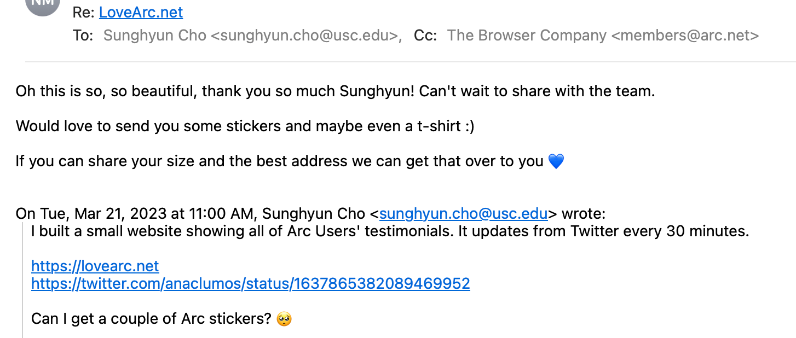
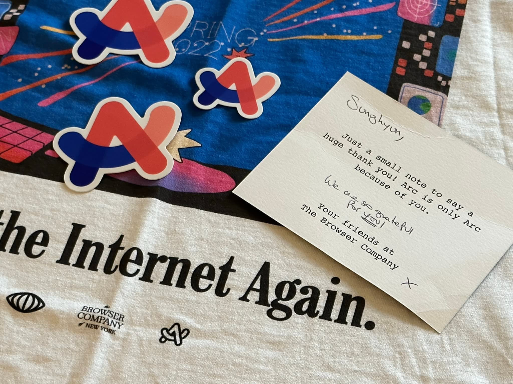

A small [done](./../.././docs/pages/Done.md) project I've done over the weekend

## Objectives

1. practice with [Twitter](./../.././docs/pages/Twitter.md) [scraping](./../.././docs/pages/Crawler.md) technologies
2. get some [Arc (Browser)](./../.././docs/pages/Arc%20%28Browser%29.md) stickers

## Key Results

- [LoveArc.net](https://lovearc.net)
- It drained too much Image Proxy Bandwidth from [Vercel](./../.././docs/pages/Vercel.md) that I turned off image proxies when migrating to [Cloudflare Pages](./../.././docs/pages/Cloudflare%20Pages.md). All the profiles will now show square boxes.

<blockquote class="twitter-tweet">

[@joshm](https://twitter.com/joshm?ref_src=twsrc%5Etfw) [@arcinternet](https://twitter.com/arcinternet?ref_src=twsrc%5Etfw) [@browsercompany](https://twitter.com/browsercompany?ref_src=twsrc%5Etfw) Just built an Arc fan page... A 💌

[Original Post Link](https://t.co/hNZQgYH1ab)

[Original Post Link](https://t.co/HyZJBsv9NB)

&mdash; Sunghyun Cho (@anaclumos) [March 20, 2023](https://twitter.com/anaclumos/status/1637865382089469952?ref_src=twsrc%5Etfw)

</blockquote>

<figure>

</figure>

<figure>

</figure>

<figure>

</figure>
