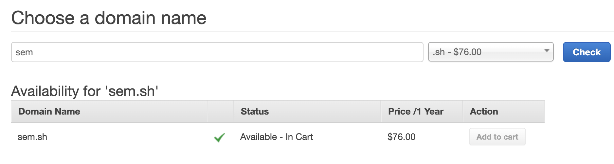
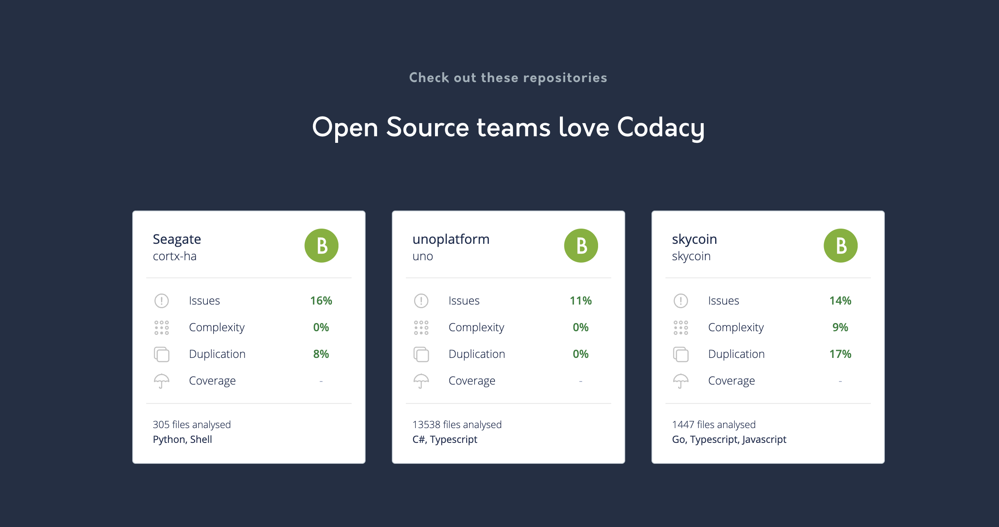
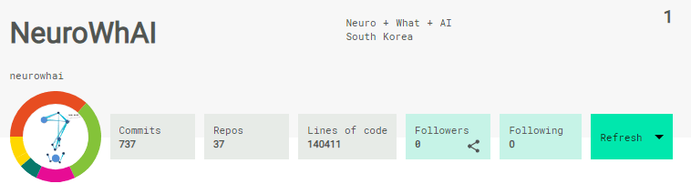
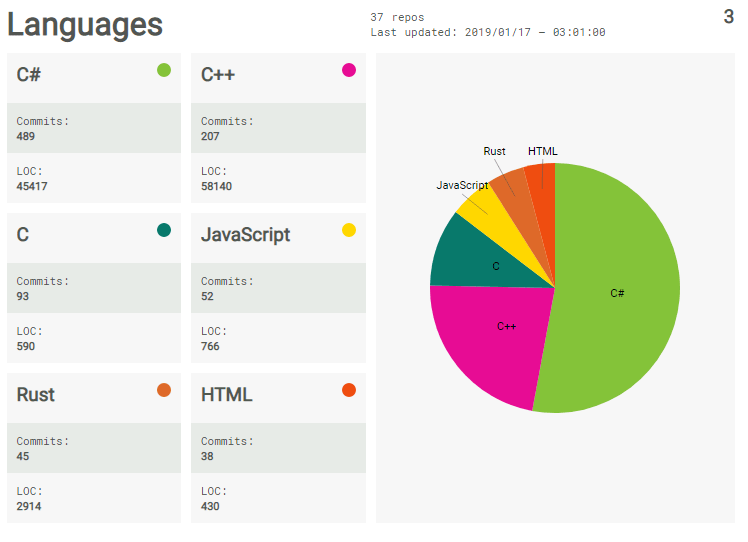
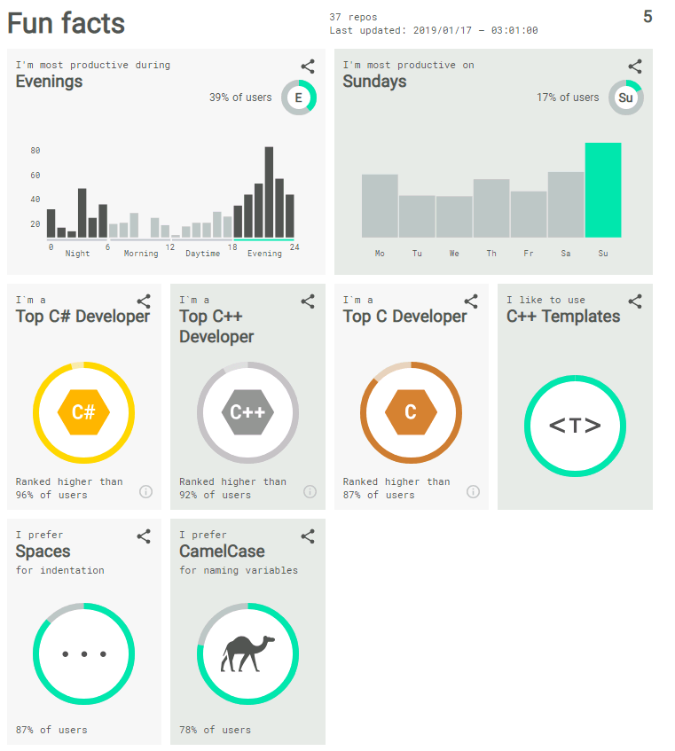

<figure>

</figure>

[Someday](./../.././docs/pages/Someday.md) [Project](./../.././docs/pages/Project.md). Open-sourced [Code Time](https://www.software.com/product/code-time) or [WakaTime](https://wakatime.com/). Time Tracking per language, per repository, per editor, etc

- Self-hostable dashboard server
- Your data, your own (no paywall if self-hosted)
- terminal program gets all the data (the .sh name)
- [JSON](./../.././docs/pages/JSON.md) API
- [GitHub](./../.././docs/pages/GitHub.md) Profile Widget
- Code Style Analytics (`PascalCase`, `snake_case`, ... )
- Idle time, Typing time, Googling Time measurer, etc

## References

- [swdotcom/visualstudio-codetime: Code Time for MS Visual Studio](https://github.com/swdotcom/visualstudio-codetime)
  - Although the plugins are open-sourced, it seems like the server or dashboard themselves are closed-sourced.
- Both Code Time and Wakatime has serious paywall problem
  - Free versions can only access up to 2 weeks of data
- [The DevOps Intelligence Platform - Codacy | Codacy](https://www.codacy.com/)
  - 
- [sourcerer.io](https://sourcerer.io) shut down couple years ago
  - [sourcerer.io로 GitHub, GitLab 프로필 만들기](https://neurowhai.tistory.com/316)
  - Archived Images from [NeuroWhAI (NeuroWhAI)](https://github.com/neurowhai). Thank you.
  - 
  - 
  - 

<head>
  <html lang="en-US"/>
</head>
