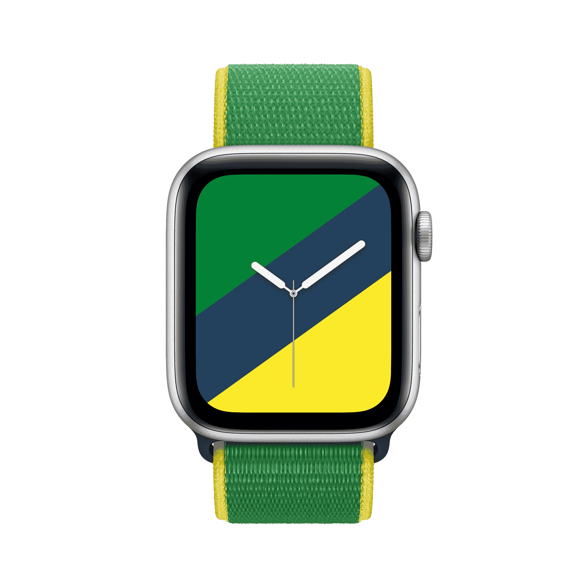
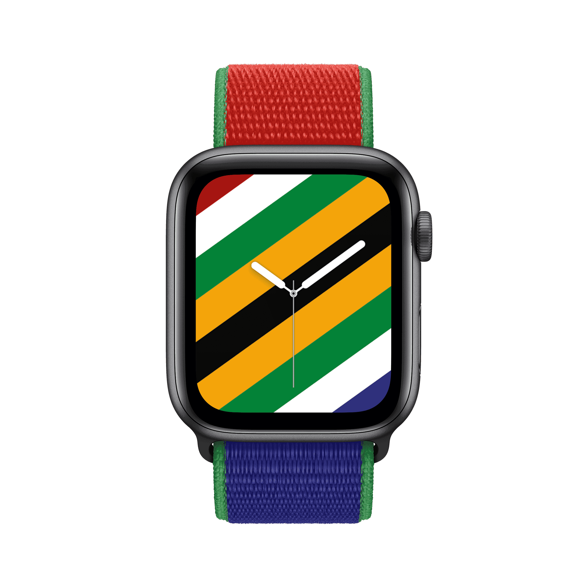
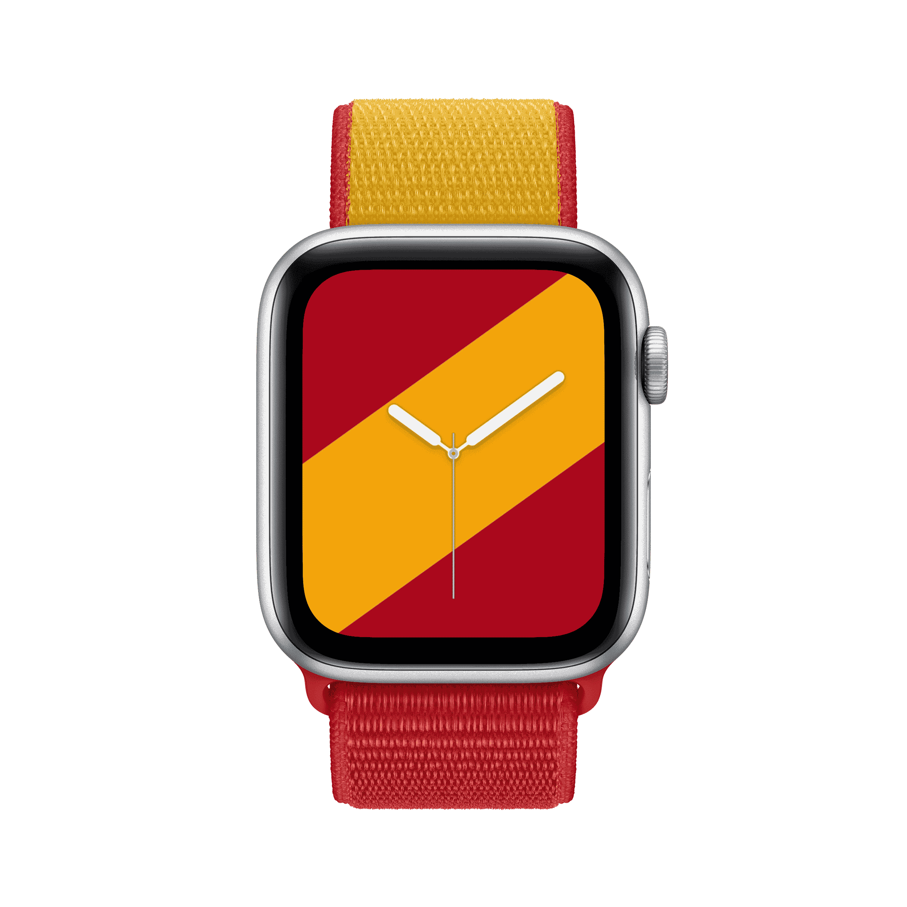
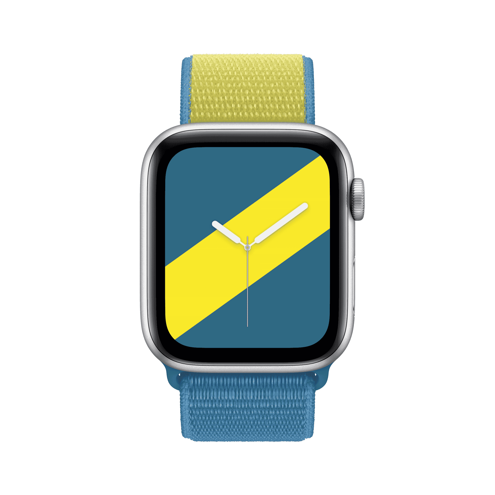

나는 [한복 정장](./../.././docs/pages/%ED%95%9C%EB%B3%B5%20%EC%A0%95%EC%9E%A5.md)을 서양식 정장처럼 보급화하고 싶은데,
그 과도기에 해외 친구들에게 그 나라 국기의 키컬러를 색동저고리 한복 정장 형태로 만들어서 선물하고 싶다.

예전에 도쿄 올림픽 당시에 애플워치 밴드가 국기 디자인이었던 적이 있는데, 색동저고리는 색깔이 들어갈 공간이 많으니 더 잘 맞출 수 있을 것이다.

[한민족의 문화](./../.././docs/pages/%ED%95%9C%EB%AF%BC%EC%A1%B1%EC%9D%98%20%EB%AC%B8%ED%99%94.md) [네오 코리안 르네상스](./../.././docs/pages/%EB%84%A4%EC%98%A4%20%EC%BD%94%EB%A6%AC%EC%95%88%20%EB%A5%B4%EB%84%A4%EC%83%81%EC%8A%A4.md) [성현적 발상](./../.././docs/pages/%EC%84%B1%ED%98%84%EC%A0%81%20%EB%B0%9C%EC%83%81.md)

;

<Horizontal>

<figure>

<figcaption>South Korea</figcaption>
</figure>

<figure>

<figcaption>Australia</figcaption>
</figure>

<figure>

<figcaption>Belgium</figcaption>
</figure>

</Horizontal>

<Horizontal>

<figure>

<figcaption>Brazil</figcaption>
</figure>

<figure>

<figcaption>Canada</figcaption>
</figure>

<figure>

<figcaption>China</figcaption>
</figure>

</Horizontal>

<Horizontal>

<figure>

<figcaption>Denmark</figcaption>
</figure>

<figure>

<figcaption>France</figcaption>
</figure>

<figure>

<figcaption>Germany</figcaption>
</figure>

</Horizontal>

<Horizontal>

<figure>

<figcaption>Great Britain</figcaption>
</figure>

<figure>

<figcaption>Greece</figcaption>
</figure>

<figure>

<figcaption>Italy</figcaption>
</figure>

</Horizontal>

<Horizontal>

<figure>

<figcaption>Jamaica</figcaption>
</figure>

<figure>

<figcaption>Japan</figcaption>
</figure>

<figure>

<figcaption>Mexico</figcaption>
</figure>

</Horizontal>

<Horizontal>

<figure>

<figcaption>Netherlands</figcaption>
</figure>

<figure>

<figcaption>New Zealand</figcaption>
</figure>

<figure>

<figcaption>Russia</figcaption>
</figure>

</Horizontal>

<Horizontal>

<figure>

<figcaption>South Africa</figcaption>
</figure>

<figure>

<figcaption>Spain</figcaption>
</figure>

<figure>

<figcaption>Sweden</figcaption>
</figure>

</Horizontal>
