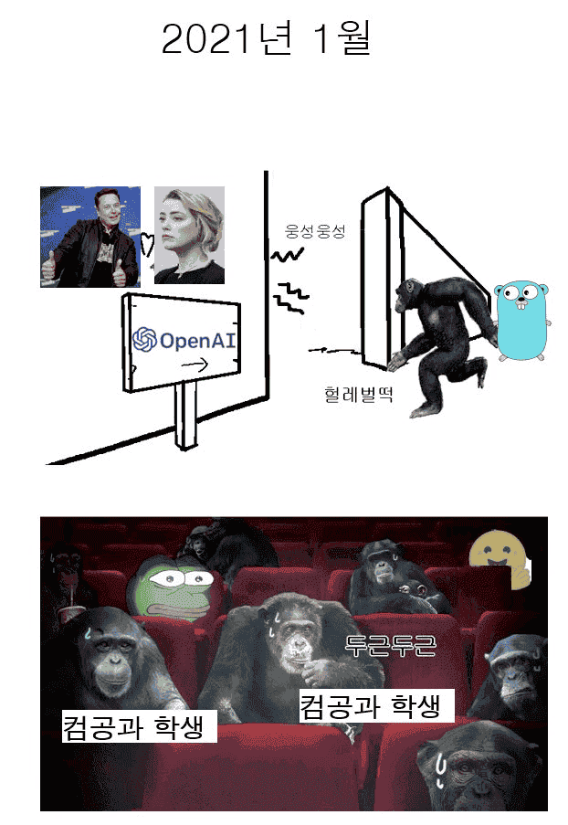
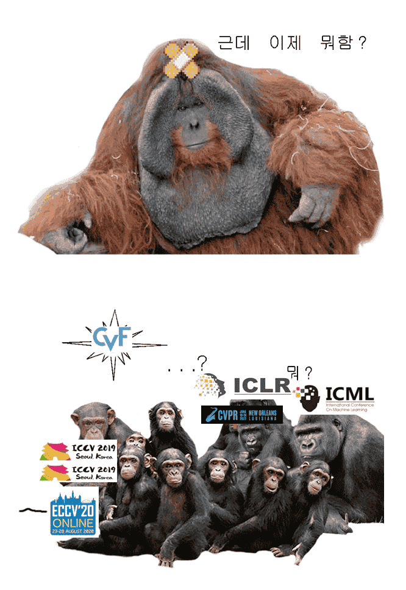
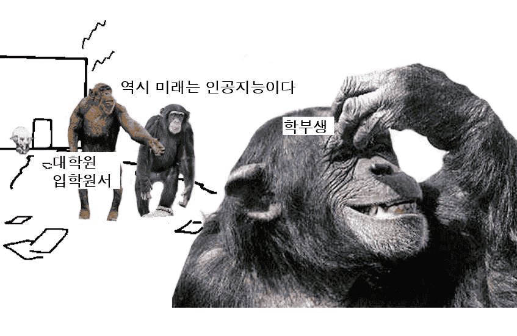

[2023-02-20](./../.././docs/journals/2023-02-20.md)에 작성한 에세이

<Accordions>
<Accordion title="2022년 여름의 [인공지능](./../.././docs/pages/AI.md) 업계를 대표적으로 나타내는 글이다">

https://www.facebook.com/groups/TensorFlowKR/posts/1835138123493904/

;

<Horizontal>

<figure>

</figure>

<figure>

</figure>

</Horizontal>
<Horizontal>

<figure>

</figure>

<figure>

</figure>

</Horizontal>
<Horizontal>

<figure>

</figure>

<figure>

</figure>

</Horizontal>
<Horizontal>

<figure>

</figure>

<figure>

</figure>

</Horizontal>
<Horizontal>

<figure>

</figure>

<figure>

</figure>

</Horizontal>
<Horizontal>

<figure>

</figure>

<figure>

</figure>

</Horizontal>
<Horizontal>

<figure>

</figure>

<figure>

</figure>

</Horizontal>
<Horizontal>

<figure>

</figure>

<figure>

</figure>

</Horizontal>
<Horizontal>

<figure>

</figure>

<figure>

</figure>

</Horizontal>
<Horizontal>

<figure>

</figure>

<figure>

</figure>

</Horizontal>
</Accordion>
</Accordions>

이게 반년도 되지 않았다. 2022년 가을만 해도 [인공지능](./../.././docs/pages/AI.md)이라고 해봐야 그림을 어느 정도 잘 그리는 [AI](./../.././docs/pages/AI.md)만 있었을 뿐이다. Stable Diffusion이나, DALL-E 같은... 그마저도 엄청난 대격변이었기 때문에 [Prompt Engineering](./../.././docs/pages/Prompt%20Engineering.md)이라는 새로운 분야가 각광 받으며 [인공지능](./../.././docs/pages/AI.md)에게 원하는 것을 정확하게 설명할 수 있는 것이 중요해질 것이라고 생각했다. 관련 글: [4.2 Gigabytes, or: How to Draw Anything](https://andys.page/posts/how-to-draw/)

2022년 가을만 해도 텍스트 [인공지능](./../.././docs/pages/AI.md)은 좀 남은 기술로 생각했다.
당시에도 나는 [Photoshop for Text](./../.././docs/pages/Photoshop%20for%20Text.md)를 상상하며 [훗날](./../.././docs/pages/Oneday.md) 미래에 도래할 텍스트 [인공지능](./../.././docs/pages/AI.md)의 미래를 상상하며 점차 [인공지능](./../.././docs/pages/AI.md)을 꿈꾸고 있었다.
그래서 [Grammarly](./../.././docs/pages/Grammarly.md) 등의 텍스트 [인공지능](./../.././docs/pages/AI.md) 회사에 열심히 지원했고.
당시 텍스트 [인공지능](./../.././docs/pages/AI.md)의 어려움으로 문법과 어투를 생각했다.
그림이야 대충 이리 저리 뭉쳐놓고 보아도 "그림"이라고 생각할 수 있는 반면 텍스트는 그렇지 못하므로.
그림은 대충 그려놓아도 이해할 수 있는 반면 텍스트는 문법과 어조, 그 사소한 느낌 때문에 고려해야할 게 정말 많았다.

> 어떤 면에서 보면, 텍스트 [인공지능](./../.././docs/pages/AI.md)이 기술적으로 매우 어렵다는 것이 놀랍지 않은가? 텍스트는 이미지보다 조작하기 쉬워보인다. **하지만 언어는 이미지보다 훨씬 더 많은 규칙을 가지고 있다**. 독자들은 글쓰기가 적절한 철자와 문법, 일관된 어조, 그리고 문장의 논리적인 순서를 따르기를 기대한다. [Photoshop for text -- Stephan Ango](https://stephanango.com/photoshop-for-text)

그런데 고작 3개월도 되지 않아 [ChatGPT](./../.././docs/pages/ChatGPT.md)가 등장하며... 모든 것을 뒤바꾸어 놓았다. 역사는 갈수록 빠르게 흐르는가? 기술적 특이점은 언제 오는가? 기술적 특이점은 항상 올듯 말듯 하며 오지 않는 것인가? 점점 빨라지는 시대에 우리가 과학을 통제하기 위해선 무엇을 해야하는가?
