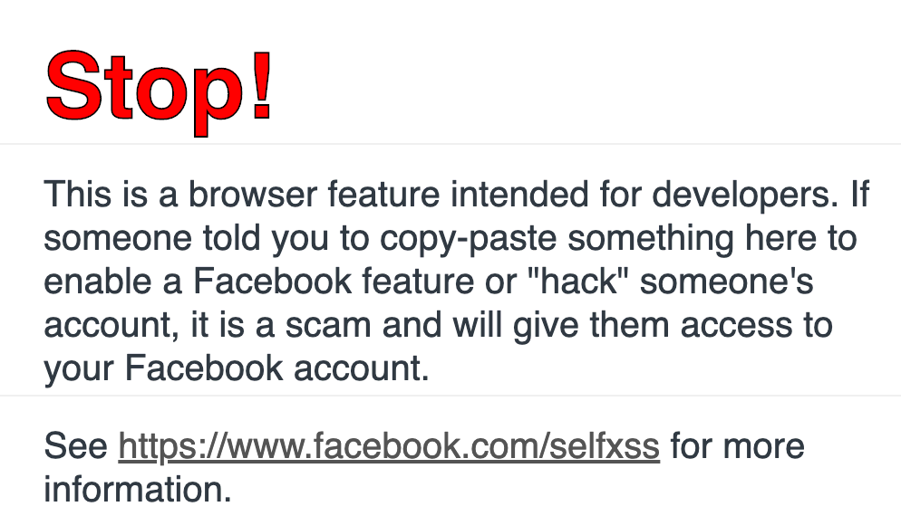

페이스북에서 개발자 콘솔을 열면 무시무시한 메시지가 나타난다.


<figure>




<figcaption>대충 이런 느낌적인 느낌느낌</figcaption>
</figure>

[HTML](./../.././docs/pages/HTML.md) 어딘가에서 `console.log`를 해주면 되는 간단한 작업이다. 특정 텍스트를 강조하고 싶다면 다음과 같이 CSS를 정의해주는 것도 가능하다.

```html
<script type="text/javascript">
  console.log('%cHi there!', 'color:darkorange; font-size:20px; font-weight: bold;')
  console.log(
    'Seems like you are trying to analyze my website — which is great! Meanwhile, if you have any questions regarding my website, please feel free to ask me at mail@chosunghyun.com !'
  )
</script>
```

당연히 특정 CSS 코드를 JS 변수나 상수에 저장해서 활용하는 방법도 있다.

## 추가 자료

- [Facebook 경고 문구와 99% 동일한 경고 문구 코드](https://gist.github.com/tosbourn/f556ee09c4a551e91d1dfde2f7b254f4)
- Tistory는 다음 코드를 사용한다.

```js
if (window.console != undefined) {
  setTimeout(console.log.bind(console, '%cTISTORY', 'font:8em Arial;color:#EC6521;font-weight:bold'), 0)
  setTimeout(console.log.bind(console, '%c  나를 표현하는 블로그', 'font:2em sans-serif;color:#333;'), 0)
}
```

<head>
  <html lang="en-US"/>
</head>
