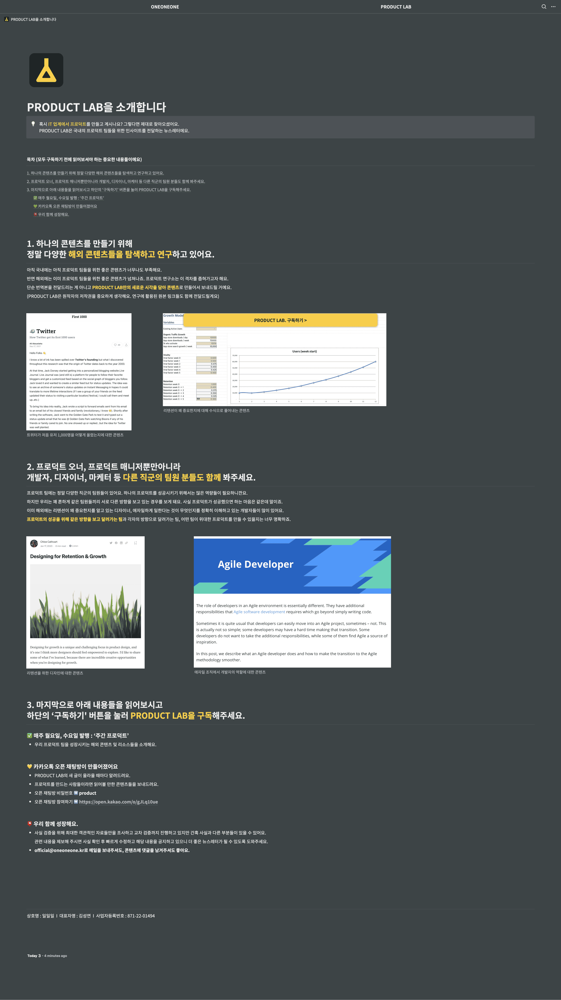

[NewsGPT](./../.././docs/pages/NewsGPT.md) Model. A competitor to [Project Heimdall](./../.././docs/pages/Project%20Heimdall.md).

## What I don't like

- Too strong ties to [Korean](./../.././docs/pages/%EB%8C%80%ED%95%9C%EB%AF%BC%EA%B5%AD.md) Market
  - Ex) domain, [kakaotalk](./../.././docs/pages/KakaoTalk.md), website...
  - You can only get so big as the market
- Too much curation: too 'optimized'
  - [Project Heimdall](./../.././docs/pages/Project%20Heimdall.md) aims to build the International mesh of [METI Engine](./../.././docs/pages/METI%20Engine.md). If humans get involved in the pipeline

- [PRODUCT LAB. 프로덕트랩](https://maily.so/productlab)

<figure>

</figure>

<figure>

</figure>

<figure>

</figure>

<figure>

</figure>

<figure>

</figure>

<figure>

</figure>
