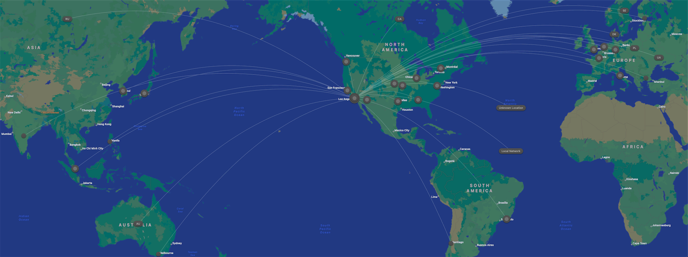

## 환영합니다!

> 여기는 제 개인 [위키백과](https://ko.wikipedia.org/wiki/%EC%9C%84%ED%82%A4%EB%B0%B1%EA%B3%BC)입니다.
> 제가 아는 모든 지식을 담았어요!

<figure>

<figcaption>제 HTTP 요청 지도입니다 🌏 🌎 🌍</figcaption>
</figure>

제 연구 기록에 오신 것을 환영합니다.
어릴 적 [상대적이며 절대적인 지식의 백과사전](https://ko.wikipedia.org/wiki/%EC%83%81%EB%8C%80%EC%A0%81%EC%9D%B4%EB%A9%B0_%EC%A0%88%EB%8C%80%EC%A0%81%EC%9D%B8_%EC%A7%80%EC%8B%9D%EC%9D%98_%EB%B0%B1%EA%B3%BC%EC%82%AC%EC%A0%84)에 큰 감명을 받은 저는, 마치 그 사전과 같이 제 프로젝트와 연구를 강결합하는
하나의 **진실의 절대적 원천**을 수년간 염원해 왔습니다.
그 염원의 현신을 여러분께 보여드릴 수 있어 기쁩니다.
여기에서 제 최근 관심사들을 찾아보실 수 있습니다.
기록은 한국어와 영어로 작성할 것이며 노트를 직접 번역할 계획은 없습니다.
다만 저는 컴퓨터언어학에 큰 관심이 있기에 언젠가 번역 자동화도 시도해보고 싶군요.
하지만 아직은 아닙니다.
국제화된 콘텐츠를 찾으신다면 [열람실](/w/archive)을 확인하시기 바랍니다.

## 비선형성

import Link from '@docusaurus/Link'

<Link href="/3d">

<figure>

<figcaption>모든 기록은 다른 노트들과 상호 연결됩니다.</figcaption>
</figure>

</Link>

만약 관련 개념에 익숙하시다면, 이곳은 [Memex](/r/D8A76E) 혹은 디지털 정원이기도 합니다.
일반적인 블로그나 노트와는 달리, 이곳은 비선형적입니다.
그 말은 즉슨, 어떤 카테고리와 태그도 존재하지 않으며, 순서도 존재하지 않고, 매우 간략한 계층 구조만 존재합니다.
그렇기에 아무 노트나 골라서 다른 노트로 이동할 수 있습니다.
모든 기록은 [상록수](/r/B0B79F)일 것이며, 다른 노트들과 상호 연결되고,
생각 간의 연결 구조를 형성하며, 큰 그림을 이해할 수 있도록 도와줄 것입니다.

## 기본 정보

- 겹겹이 둘러싸인 폴더 구조 만들지 않기
- 데이터 무덤 만들지 않기
  - 고쳐쓰고 압축하기
  - [BASB](/r/6AE59D)에서는 50배 축소를 권장
- [Inliner](/r/EE1ECD) 사용

## 사용 기술

저는 [Obsidian](/r/4AAFB1)을 이용해 생각을 기록합니다.
그 기록들을 제맘대로 만든 리액트 컴포넌트들로 상당 부분 개조한
[TypeScript](/r/134F92) [Docusaurus](/r/816CC8)로 연동합니다.
이후 [Vercel](/r/E42038)을 이용해 배포합니다.

[GitHub](https://github.com/anaclumos/extracranial)에
공개되어 있기도 합니다. 확인해보세요 😃
