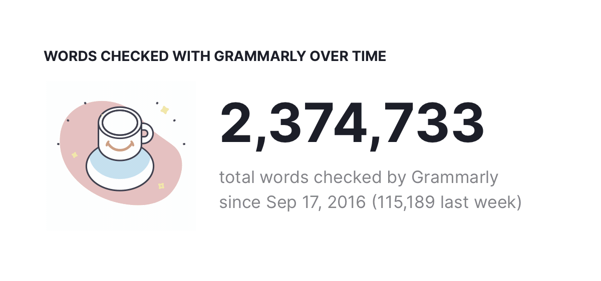

> As the 120-ton space shuttle sits surrounded by almost 4 million pounds of rocket fuel, exhaling noxious fumes, visibly impatient to defy gravity, its onboard computers take command. [They Write the Right Stuff](https://www.fastcompany.com/28121/they-write-right-stuff)

## Personal Research

- [[Dynamic Island on the Web]]
- [[Handwriting Tools for Thoughts]]
- [[Slow Down Your Clock Cycle Speed]]
- [[Letter to Mr. Alexander Obenauer on 2022-10-12]]
- [[Personal Training Corpus]]
- [[Cosmic noises of life]]
- [[Better Hacker News]]

![[418938.jpeg]]

## Noteworthy

- [[Jetbrains Fleet]] is [[GA]]. [Introducing the Fleet Public Preview](https://blog.jetbrains.com/fleet/2022/10/introducing-the-fleet-public-preview)

## [[TODO]]

- [x] Reply to [[Grammarly]] Recruiter
- [x] Revert Toggle Design
  - [x] Archived [[iOS Style Toggle in CSS]]
- [x] Review Midterm Results
- [x] Finish PayPal's OA
  - [x] [[Real Exams]]
- [x] Merge Academics and Research
