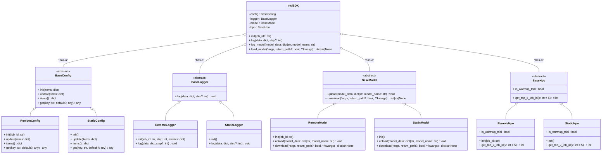

```mermaid

classDiagram
    %% ======================
    %% Base Abstract Classes
    %% ======================
    class BaseConfig {
      <<abstract>>
      + init(items: dict)
      + update(items: dict)
      + items() dict
      + get(key: str, default?: any) any
    }

    class BaseLogger {
      <<abstract>>
      + log(data: dict, step?: int) void
    }

    class BaseModel {
      <<abstract>>
      + upload(model_data: dict|str, model_name: str) void
      + download(*args, return_path?: bool, **kwargs) dict|str|None
    }

    class BaseHpo {
      <<abstract>>
      + get_top_k_job_id(k: int = 5) : list
      + is_warmup_trial : bool
    }

    %% =====================
    %% Concrete - REMOTE
    %% =====================
    class RemoteConfig {
      + init(job_id: str)
      + update(items: dict)
      + items() dict
      + get(key: str, default?: any) any
    }

    class RemoteLogger {
      + init(job_id: str, step: int, metrics: dict)
      + log(data: dict, step?: int) void
    }

    class RemoteModel {
      + init(job_id: str)
      + upload(model_data: dict|str, model_name: str) void
      + download(*args, return_path?: bool, **kwargs) dict|str|None
    }

    class RemoteHpo {
      + init(job_id: str)
      + get_top_k_job_id(k: int = 5) : list
      + is_warmup_trial : bool
    }

    %% =====================
    %% Concrete - STATIC
    %% =====================
    class StaticConfig {
      + init()
      + update(items: dict)
      + items() dict
      + get(key: str, default?: any) any
    }

    class StaticLogger {
      + init()
      + log(data: dict, step?: int) void
    }

    class StaticModel {
      + init()
      + upload(model_data: dict|str, model_name: str) void
      + download(*args, return_path?: bool, **kwargs) dict|str|None
    }

    class StaticHpo {
      + init()
      + get_top_k_job_id(k: int = 5) : list
      + is_warmup_trial : bool
    }

    %% =====================
    %% The "SDK" / Factory
    %% =====================
    class InclSDK {
      - config : BaseConfig
      - logger : BaseLogger
      - model  : BaseModel
      - hpo    : BaseHpo

      + init(job_id?: str)
      + log(data: dict, step?: int)
      + log_model(model_data: dict|str, model_name: str)
      + load_model(*args, return_path?: bool, **kwargs) dict|str|None
    }

    %% =====================
    %% Inheritance
    %% =====================
    BaseConfig <|-- RemoteConfig
    BaseConfig <|-- StaticConfig

    BaseLogger <|-- RemoteLogger
    BaseLogger <|-- StaticLogger

    BaseModel <|-- RemoteModel
    BaseModel <|-- StaticModel

    BaseHpo <|-- RemoteHpo
    BaseHpo <|-- StaticHpo

    %% =====================
    %% Composition: InclSDK
    %% =====================
    InclSDK o-- BaseConfig : "has-a"
    InclSDK o-- BaseLogger : "has-a"
    InclSDK o-- BaseModel  : "has-a"
    InclSDK o-- BaseHpo    : "has-a"
```
