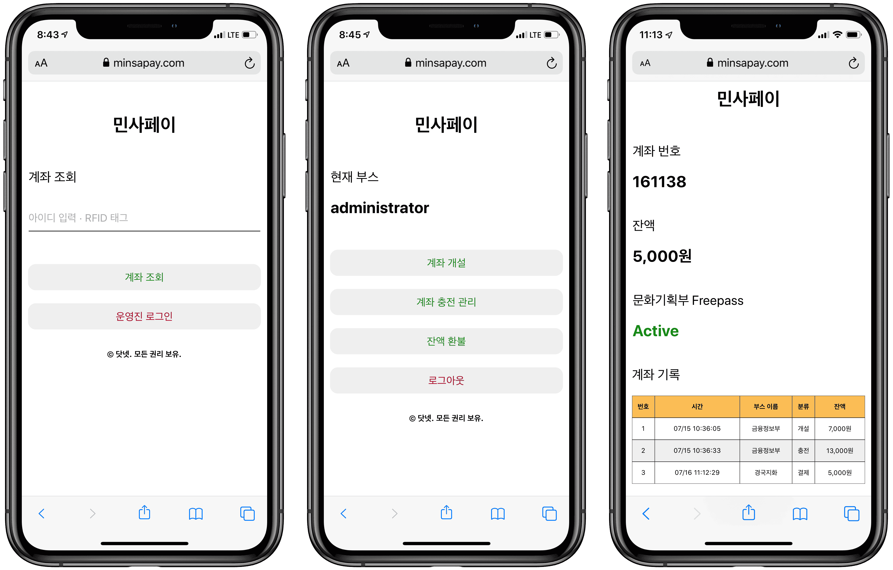

MinsaPay is a payment system that was built for the Minjok Summer Festival. It works like a prepaid tap-to-pay card. Every source and piece of anonymized transaction data is available on GitHub.

## Stats

- Number of Users: **~400**
- Number of Transactions: **~2900**
- Total Payment Amount: **~$4,000 USD** (₩4,604,210 KRW)
- Total Transaction Amount: **~$14,400 USD** (₩17,319,300 KRW)

- [GitHub - minsapay/server: Payment server & web app for KMLA Minjok Festival (Summer Festival)](https://github.com/minsapay/server)
- [GitHub - minsapay/transaction-data-2019: Transaction Data of MinsaPay 2019](https://github.com/minsapay/transaction-data-2019)

## But why does a school festival need a payment system?

My high school, Korean Minjok Leadership Academy (KMLA), had a summer festival like any other school. Students opened booths to sell food and items they created. We also screened movies produced by our students and hosted dance clubs. The water party in the afternoon is one of the festival's oldest traditions.

Because there were a lot of products being sold, it was hard to use regular paper money (a subsequent analysis by the MinsaPay team confirmed that the total volume of payments reached more than $4,000). So our student council created proprietary money called the **Minjok Festival Notes**. The student council had a dedicated student department act as a bank to publish the notes and monitor the currency's flow. Also, the Minjok Festival Notes acted as festival memorabilia since each year's design was unique.

**But there were problems**. First, it was not eco-friendly. Thousands of notes were printed and disposed of annually for just a single day. It was a waste of resources. The water party mentioned above was problematic as well. The student council made Minjok Festival Notes out of nothing special, just ordinary paper. That made the notes extremely vulnerable to water, and students lost a lot of money after the water party. Eventually, the KMLA students sought a way to resolve all of these issues.

## Idea

The student council first offered me the chance to develop a payment system. Because I had thought about the case beforehand, I thought it made a lot of sense. I instantly detailed the feasibility and possibilities of the payment system. But even after designing the system in such great detail that I could immediately jump into the development, I turned down the offer.

I believe in the social responsibilities of the developer. Developers should not be copy-pasters who meet the technical requirements and deliver the product. On the contrary, they are the people with enormous potential to open an entirely new horizon of the world by conversing with computers and other technological media. Therefore, developers have started to possess the decisive power to impact the daily lives of the rest of us, and it is their bound responsibility to use that power to enhance the world. That means developers should understand how impactful a single line of code can be.

Of course, I was tempted. But I had never done a project where security was the primary interest. It was a considerable risk to start with a project like this without any experience or knowledge in security. Many what-ifs flooded my brain. What if a single line of code makes the balance disappear? What if the payment record gets mixed up? What if the server is hacked? **More realistically, what if the server goes down?**

People praise audacity, but I prefer prudence. Bravery and arrogance are just one step apart. A financial system should be flawless (or as flawless as possible). It should both be functional and be performing resiliently under any condition. It didn't seem impossible. But it was too naïve to believe nothing would happen, as **I was (and am still) a total newbie in security**. So I turned it down.

## Wait, payment system using Google Forms?

The student council still wanted to continue the project. I thought they would outsource the task to some outside organization. It sounded better since they would at least have some degree of security. But the council thought differently. They were making it themselves with Google Forms.

When I was designing the system, the primary issue was **payment authorization**. The passcode shouldn't be shared with the merchant, while the system could correctly authorize and process the order. The users can only use the deposited money in their accounts. This authorization should happen in real-time. But I couldn't think of a way to nail the real-time authorization with Google Forms. So I asked for more technical details from one student council member. The idea was as follows:

Abstract of a Google-Form-Powered Payment System

- Create one Google Form per user. (We have about 400 users in total.)
- Create QR codes with links to the Google Form. (So it's 400 QR codes in total.)
- Create a wristband with the QR code, and distribute them to the users.
- Show that wristband when purchasing something.
- The merchant scans the QR code and opens the link in incognito mode.
- Input the price and the name of the booth.
- Confirm with the user (customer) and submit the response.
- Close the incognito tab.

So the idea was to use the Google Form's unique address as a password. Since the merchants are supposed to use incognito mode, there should be a safety layer to protect the user's Google Form address (in theory). They will need to make a deferred payment after the festival. But as a developer, this approach had multiple problems:

Potential Problems I found

- How are we going to manage all 400 Google Forms?
- Intended or not, people will lose their wristbands. In that case, we will need to note the owner of the wristband in every Google form to calculate the spending. Can we deliver those QR codes to the correct owner if we do?
- If the merchant doesn't use incognito mode, it will be hard for an ordinary person to tell the difference. If that happens, it is possible to attack the exposed Google form by submitting fake orders. We could also add a "password," but in that case, we cannot stop the customer from providing an incorrect password and claiming that they were hacked by someone else.
- If the merchant has to select the booth and input the price manually, there will be occasions where they make a typo. Operators could fix a typo in the price value relatively quickly, but a typo or misselection in the booth value would be a pain since we would have to find out who made a mistake and the original order. Imagine there were 20 wrong booth values. How are we going to trace the real booth value? We could guess, but would that sort of record have its value as reliable data?
- How are we going to make the deferred payment? How will we extract and merge all 400 of the Google Forms response sheets? Even worse, the day after the festival is a vacation. People care about losing money but not so much about paying their debts. There could be students who just won't come back. It would be excruciating to notify all those who didn't deliver. But if the money is prepaid, the solution is comparably easy. The council members could deposit the remaining balance to their phone number or bank account. We don't need to message dozens of students; we could do the work ourselves.
- The student council will make the Google Form with the student council's Google account. That Google account will have restricted access, but a few students will be working together to create all 400 Google forms. Can we track who makes the rogue action if someone manipulates the Google form for their benefit?
- Can this all be free from human error?

It could work in an ideal situation. But it will accompany a great deal of confusion and entail a noticeable discomfort on the festival day. That made me think that even though my idea had its risks, mine would still be better. So, I changed my mind.

## Development

Fortunately, I met a friend with the same intent—our vision and idea about the project aligned. I explained my previous concept, and we talked to each other and co-developed the actual product. We also met at a cafe several times. I set up and managed the DNS and created the front-end side. Below are the things we thought about while making the product.

Details that my team considered

- We won't be able to use any payment gateway or third-party payment service since we are not officially registered, and we will use it for a single day. Some students don't own smartphones, so we won't be able to use Toss or KakaoPay (Both are well-known P2P payment services in Korea, just like Venmo). Therefore, there cannot be any devices on the client-side. We would need to install computers on the merchant's side.
- It is impossible to build a completely automated system. Especially in dealing with cash, we would need some help from the student council and the Department of Finances and Information. Trusted members from the committee will manually count and deposit the money.
- There must be no errors in at least the merchant and customer fields since they would be the most difficult errors to fix later. But, of course, we cannot expect that people will make no mistakes. So, instead, we need to engineer an environment where no one can make a mistake even if they want to.
- The booths may be congested. If each customer needs to input their username and password every time, that will pose a severe inconvenience. For user experience, some sort of one-touch payment would be ideal.
- For this, we could use the Campus ID card. Each card has a student number (of course) and a unique value for identifying students at the school front door. We could use the number as the username and the unique value as the password. Since this password is guaranteed to be different for each student, we would only need the password for identification purposes.
- The final payment system would be a prepaid tap-to-pay card.
- Developers would connect each account with its owner's student ID.
- Students could withdraw the remaining money after the festival.

We disagreed on two problems.

1.  One was the platform. While my partner insisted on using Windows executable programs, I wanted the system to be multi-platform and asked to use web apps. (As you might expect, I use a Mac.)
2.  The other was the method of reading data from the Campus ID card. The card has an RFID chip and a bar code storing the same value. If we chose RFID values, we would have to purchase ten RFID readers, spending an additional $100. Initially, I insisted on using the embedded laptop webcam to scan the barcode because MinsaPay was a pilot experiment at that time. I thought that such an expense would make the entire system questionable in terms of cost-effectiveness. (I said _"Wait, we need to spend an additional $100 even though we have no idea if the system will work?"_)

We chose web and RFID, conceding one for each. I agreed to use RFID after learning that using a camera to read bar codes wasn't that fast or efficient.

## And it happened

Remember that one of the concerns was about the server going down?  
On the festival day, senior students had to self-study at school. Then at one moment, I found my phone had several missed calls. **The server went down**. I rushed to the festival and sat in a corner, gasping and trying to find the reason. Finally, I realized the server was intact, but the database was not responding.  
It was an absurd problem. (Well, no problem is absurd, per se, but we couldn't hide our disappointment after figuring out the reason.) We thought the free plan would be more than enough when we constructed our database. However, the payment requests surged and exceeded the database free tier. So we purchased a $9.99 plan, and the database went back to work. It was one of the most nerve-wracking events I ever had.

While the server was down, each booth made a spreadsheet and wrote down who needed to pay how much. Afterward, we settled the problem by opening a new booth for making deferred payments.

The payment log showed that the server went down right after 10:17:55 AM and returned at 10:31:10 AM. It was evident yet intriguing that the payments made per minute were around 10 to 30 before the crash but went down to almost zero right after restoring the server. If you are interested, please look [here](https://github.com/minsapay/transaction-data-2019/blob/master/transactions.csv#L1548).

## Results

- MinsaPay Web App: [minsapay.com](https://www.minsapay.com) (Currently Unavailable)
- MinsaPay Codebase: [minsapay/server](https://github.com/minsapay/server)
- MinsaPay Payment Log: [minsapay/transaction-data-2019](https://github.com/minsapay/transaction-data-2019)
- [MinsaPay in action](https://youtu.be/H5H5Eqmu0zo). I used MinsaPay to purchase an $8 t-shirt. It is even compatible with Internet Explorer—wow!

### 1\. MinsaPay

The entire codebase for MinsaPay is available on [GitHub](https://github.com/minsapay/server). First, though, I must mention that I still question the integrity of this system. One developer reported a security flaw that we managed to fix before launch. However, the system has unaddressed flaws; for example, though unlikely, merchants can still copy RFID values and forge ID cards.

### 2\. Payment Data

I wanted to give students studying data analysis more relatable and exciting data. Also, I wanted to provide financial insights for students planning to run a booth the following year. Therefore, we made all payment data accessible.

However, a data privacy problem arose. So I wrote a [short script](https://github.com/minsapay/transaction-data-2019#anonymizeipynb) to anonymize personal data. If a CSV file is provided, it will anonymize a selected column. Identical values will have the same anonymized value. You can review the anonymized data [here](https://github.com/minsapay/transaction-data-2019/blob/master/transactions.csv).

## Note for Developers

I strongly recommend thoroughly auditing the entire code or rewriting it if you use this system. MinsaPay is under the [MIT license](https://github.com/minsapay/server/blob/master/LICENSE.md).

## What I Learned

There is ample room for improvement.

First, there are codes with numerous compromises. For example, we made a lot of trade-offs not to miss the product deadline (the festival day). We also wanted to include safety features, such as canceling payments, but we didn't have time. More time and development experience would have improved the product.

Since I wasn't comfortable with the system's security, I initially kept the repository quiet and undisclosed. Afterward, however, I realized this was a contradiction, as I knew that security without transparency is not the best practice.

Also, we were not free from human errors. For example, RFID values were long strings of digits, and there were a few mistakes that someone would input in the charge amount, making the charge amount something like `Integer.MAX_VALUE`. We could've added a simple confirmation prompt, but we didn't know the mistakes would happen at that time.

In hindsight, it was such a great experience for me, who had never done large-scale real-life projects. I found myself compromising even after acknowledging the anti-patterns. I also understood that knowing and doing are two completely different things since knowing has no barriers, but doing accompanies extreme stress both in time and environment.

Still, it was such an exciting project.

Lastly, I want to thank everyone who made MinsaPay possible.

- [Jueon An](https://github.com/JueonAn), a talented developer who created MinsaPay with me
- The KMLA student council and Department of Finances and Information, who oversaw the entire MinsaPay Initiatives
- The open-source developers who reported the security flaws
- Users who experienced server failures during the festival day
- And the 400 users of MinsaPay

Thank you!

