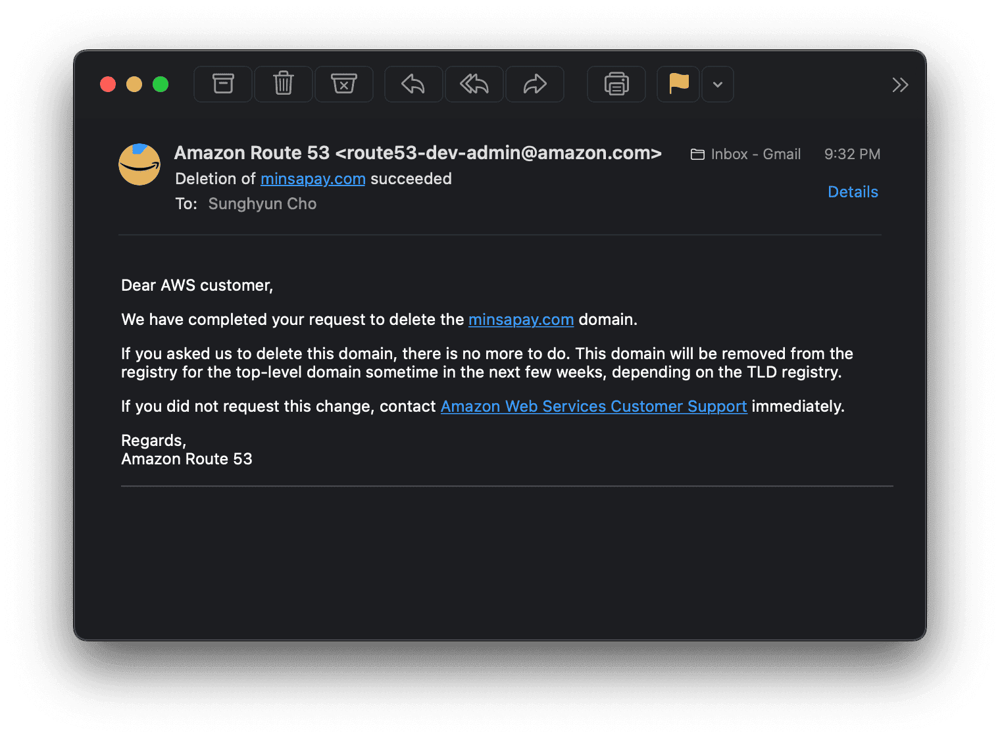

| 통계 지표   | 데이터          |
| ----------- | --------------- |
| 사용자      | 400명           |
| 거래 횟수   | 2,900건         |
| 누적 지불액 | 460만 4,210원   |
| 누적 거래액 | 1,731만 9,300원 |

민사페이는 민사고 여름 축제를 위해 제작된 간편 결제 시스템이다. 학생증의 RFID 칩을 사용하여 미리 학생증과 연동된 계정에 현금을 충전해서 사용한다. 축제가 끝난 뒤 미사용 금액은 환불이 가능하다. 축제 당일 실제 서버에서 사용된 모든 코드와 익명 결제 기록은 GitHub에서 확인할 수 있다.

- [minsapay/server: Payment server & web app for KMLA Minjok Festival (Summer Festival)](https://github.com/minsapay/server)
- [minsapay/transaction-data-2019: Transaction Data of MinsaPay 2019](https://github.com/minsapay/transaction-data-2019)

## 고등학교 축제에 간편 결제가 왜 필요한가?

많은 학교에는 각자의 여름 축제가 있다. 민족사관고등학교(민사고)는 여름 축제를 민족제라고 한다. 학생들이 부스를 열어서 먹거리와 기념품을 판매하고, 영화관이나 댄스클럽 등을 운영한다. 방송부원들이 제작한 1시간가량의 영상들을 다 같이 감상하기도 한다. 이 외에도 많은 행사들이 있지만 그중 단연 으뜸은 물놀이이다. 민족제는 여름방학 하루 전에 있기 때문에 오후 내내 물놀이가 있다. 참고로 민족제에 대해 2년 전에 제작한 [영상](https://www.youtube.com/watch?v=-BkBZ9ppSf0)이 있다.

민족제에는 판매되는 물품이 꽤 많다. 때문에 현금 거래는 어려움이 많았다. 이 문제를 해결하기 위해 민족제 화폐라는 제도가 생겼다. 학생회(금융 정보부)가 은행의 역할을 하여 현금을 관리하고 민족제 화폐를 교환해주는 것이다. 매년 새롭고 참신한 화폐가 제작되었기 때문에 상징성과 소장성이 높기도 했다.


하지만 여러 문제가 있었다. 우선 환경 친화적이지 못했다. 매년 몇백, 몇천 장의 지폐가 새로 인쇄되고 이후 그대로 폐기 처분되었다. 장기간 사용되는 화폐라면 모를까, 단 하루 사용하기 위해 종이 수백 장을 낭비한다는 것은 불필요하게 자원을 낭비하는 것이었다.

또한 언급한 물놀이도 문제를 만들었다. 민사고 학생들은 (당연하게도) 특수 화폐를 제작할 능력이 없다. 기껏해야 조금 두꺼운 종이에 인쇄해서 사용하는 정도였다. 그래서 오후 내내 물놀이를 하고 나면 종이 화폐가 모두 물에 젖어 찢어졌다. 수만 원 상당의 수해를 입은 수재민들이 발생할 정도였다! 이 때문에 민사고의 학생들은 종이 화폐를 사용하지 않으면서 결제를 할 수 있는 방안을 모색하게 되었다.

## 아이디어

학생회에서 나에게 처음으로 간편 결제 시스템 (이하 민사페이) 개발을 제안했다. 나도 비슷한 고민을 한 적이 있었기 때문에 민사페이의 개발 가능성, 결제 시스템의 필요조건 등 이모저모를 깊게 따져보았다. 그리고 바로 제작에 도입할 수 있을 정도로 전체적이고 구체적으로 구상했다. 하지만 결국 고민 끝에 제작하기 어렵다는 판단을 내렸다.

나는 개발자의 책임을 깊게 이해하고 있다. 개발자들은 요구된 기술 사양만 맞추어 단순 납품하는 사람들이 아니다. 기술을 매개로 컴퓨터와 소통하여 사람들의 삶을 가장 파격적으로 변화시킬 수 있는 잠재성을 가진 사람들이다. 개발자들은 사람들의 삶을 실질적으로 변화시킬 강력한 힘을 가지게 되며, 그 힘을 사회를 향상시키는 데 사용하는 것이 책임이다. 그렇기에 개발자들은 자신의 코드 한 줄이 얼마나 큰 파장을 불러올 수 있는지 이해해야 한다.

욕심이 나기는 했다. 하지만 나는 일반적인 개발은 해본 적이 있으나 보안이 강조되는 프로젝트는 맡아본 적이 없다. 물론 모든 일에 처음은 있겠으나, 민사페이와 같은 큰 프로젝트로 시작하라는 것은 위험이 너무 컸다. 수많은 질문이 머리를 오갔다. 만일 코드 한 줄이 잘못돼서 통장 잔고가 모두 사라진다면? 결제 기록이 꼬인다면? 해킹을 당해서 금액이 조작당한다면? 이런 극단적인 상황까지 가지 않는다고 해도 서버가 마비되어 결제를 전혀 할 수 없게 된다면?

세상은 대담한 사람을 칭송하지만 나는 그보다 신중함을 선호한다. 소신과 만용은 한 끗 차이이다. 특히 돈을 다루는 시스템은 버그가 전혀 없어야 한다. 동작하기만 하면 되는 것이 아니라 전천후 오류 없이 돌아가는 견고한 코드여야 한다. 시도하면 불가능할 것 같지는 않았지만, 철저히 무경험자인 내가 단번에 "아무 일 없을거야"고 생각하는 것은 내 능력에 대한 과신이었다. 그래서 제작이 어려울 것 같다고 이야기했다.

## 구글 설문지를 이용한 결제?

그럼에도 불구하고 학생회는 민사페이를 여전히 진행하겠다고 했다. 처음에 그 소식을 듣고 학생회가 전문 업체에 외주를 준다고 생각했다. 차라리 그게 나을 것 같았다. 최소한 시스템 보안의 기본은 다할 것이기 말이다. 하지만 학생회의 생각은 달랐다. 학생회 부원들이 직접 개발을 한다고 했다. 무려 구글 설문지 기반으로.

앞서 민사페이를 구상하면서 집중적으로 풀려 했던 문제는 인증에 관한 것이었다. 구매자가 무언가를 구매할 때 판매자와 개발자에게 비밀번호가 공유되지 않는 동시에 그 구매자를 식별해서 정확한 연산을 할 수 있어야 하고, 구매자가 원하지 않을 때는 결제가 되지 않도록 안전 장치를 마련해야 한다. 그래야 구매자가 잔고보다 더 많은 돈을 결제할 수 없을 것이고, 악의적으로 다른 계좌로 결제하지 못할 것이다. 이 인증이 실시간으로 이루어져야 한다. 하지만 구글 설문지으로는 그 방법이 전혀 생각나지 않았다. 어찌어찌 다른 것들을 해결한다고 어떻게 실시간 인증을 할 것인지에 대한 궁금증은 풀리지 않았다. 그래서 학생회에게 더 자세히 물어보았다. 학생회의 구상은 다음과 같았다.

<details>
<summary>⚡️ Google Form을 이용한 결제 시스템 동작 원리</summary>

- 학생 한 명 당 구글 설문지를 하나 만든다. (총 400명가량)
- 그 구글 설문지 링크를 각자 QR 코드로 제작한다.
- 학생들에게 방수 놀이공원 팔찌의 형태로 QR 코드를 나눠준다.
- 결제를 할 때 그 팔찌를 보여준다.
- 판매자는 QR 코드를 스캔해서 개인 정보 보호 창으로 구글 설문지를 연다.
- 구글 설문지에는 가격, 부스를 입력한다.
- 설문지를 제출한 뒤 창을 닫는다.

</details>

즉 각자 생성되는 구글 설문지의 주소를 암호처럼 사용하는 것이다. 개인 정보 보호 창으로 열기 때문에 나중에 누가 악의적으로 다른 계좌를 공격하려 해도 보호를 할 수 있을 것이다. 만약 이런 제도를 도입한다면 후불제를 도입해야 했을 것이다. 하지만 개발자의 관점에서 이 방식은 너무나도 끔찍했다. 짧게 생각해도 이런 문제가 있었다.

<details>
<summary>💣 찾은 문제점들</summary>

- 400명가량의 설문지는 어떻게 관리하는가?
- (악의적이든 아니든) 팔찌를 잃어버리는 사람이 나올 것이다. 그런 사람들의 돈을 정산하기 위해서는 구글 설문지마다 소유자를 기록해두어야 할 텐데 이를 어떻게 관리할 것인가? 구글 설문지에 이름을 저장해둔다면 팔찌가 뒤섞이지 않고 정확하게 학생들에게 전달할 수 있는가?
- 판매자가 개인 정보 보호 창으로 열지 않아도 학생들은 알아차릴 수 없을 것이다. 그 경우 설문지가 방문 기록에 남아있으므로 악의적인 공격이 가능해지는데 이를 어떻게 방지하는가? 설문지에 암호를 추가하여 암호가 일치하는 결제 기록만 후불제로 계산하는 방식도 동작은 하겠다. 하지만...
- 판매자가 부스를 직접 선택해서 금액을 입력한다면, 부스 이름이나 금액을 잘못 입력하는 사람이 생길 것이다. 금액을 잘못 입력하는 문제는 당사자들에게 물어봐 해결할 수 있을지 몰라도, 부스를 잘못 입력하는 경우 누가 잘못 입력한 것인지 찾는 것이 매우 고통스러울 것이다. 가령 전체 기록 중 20건의 판매자 부스가 뒤바뀌었다고 해보자. 데이터로써 가치는 있을 것이며, 누가 잘못 기록한 것인지 어떻게 추적할 것인가?
- 나중에 잔고 계산 및 통계는 어떻게 처리할까? 400명의 엑셀 파일을 언제 추출해서 통합하는가? 게다가 민족제 다음날은 방학식이다. 학생들이 선불로 결제한 경우 돈이 아까워서라도 돈을 찾으러 오지만 후불제인 경우 귀찮아서 안 올 가능성도 염두에 두어야 한다. 돈을 지불하라고 수십명에게 재촉 문자를 보내는 것은 여간 번거로운 일이 아니다. 반면 선불제라면 불가피할 경우 직접 계좌나 전화번호로 일단 송금해주면 된다. 굳이 힘들게 수십명에게 문자를 돌릴 필요가 없다.
- 설문지를 제작하는 것은 학생회의 구글 계정이다. 학생회의 구글 계정은 여러 명이 사용할 것인데 (물론 제한된 접근권이 있겠지만, 400명의 설문지를 제작할 때 한 사람만 일하지는 않을 것이라 추측) 학생회 중 누군가 악의를 가지고 설문지를 조작한다고 할 때 편집 기록만으로 알아낼 수 있는가?
- 이 모든 과정에서 사람의 실수가 일어나지 않을 수 있는가?

</details>

물론 이상적인 환경에서는 동작할 것이다. 하지만 그 과정에서 수많은 혼선이 있을 것이고 학생들의 불편함이 생길 것이다. 차라리 그럴 바에는 내가 제작을 맡은 뒤 내 방식대로 제작하는 것이 낫다고 생각했다. 학생회와 여러 차례 의견을 주고받은 결과 민사페이를 시도해보는 것으로 결정하게 되었다.

## Development

다행히도 나와 뜻을 함께하는 친구를 만났다. 생각하는 제작 방향도 상당히 동일했다. 나는 이전에 구상했던 민사페이에 대해서 설명을 해주었고, 서로 조율을 하며 실제 프로덕트를 제작하였다. 카페에서 몇 번 만나기도 했다. 나는 DNS 설정 및 관리, Front end 제작을 맡았다. 다음은 민사페이가 완성될 때까지 우리가 했던 고민들이다.

<details>
<summary>🤔 고민한 내용들</summary>

- 현금을 거래에 사용하기는 어려울 것이다. 사업자 등록도 되지 않았고 단 하루 사용하는 것이기 때문에 PG 등의 결제사를 이용하기는 어려울 것이다. 그렇다고 토스나 카카오페이 같은 간편 송금 서비스를 사용하기에는 스마트폰이 없는 학생들도 많았다. 그렇기 때문에 유저(구매자) 쪽에는 전자 장비가 없어야 한다. 대신 각 판매자의 부스마다 컴퓨터를 설치해두어야 한다.
- 사람 손이 전혀 가지 않는 완전 자동 시스템은 제작이 불가능하다. 특히 현금을 다루는 부분에서는 어쩔 수 없이 학생회(금융 정보부)의 도움을 빌려야 한다. 신뢰할 수 있는 금융 정보부원들이 직접 돈을 확인하고 데이터를 입력해주는 과정을 거쳐야 한다.
- 최소한 판매자와 구매자를 잘못 입력할 일이 없도록 해야 한다. 앞서 언급했듯이 다른 오류는 바로잡을 수 있어도 이 부분은 절대 잘못되면 안 된다. 즉 구매자와 판매자들이 자신들의 이름을 잘못 기록하는 실수를 하지 않을 것이라 신뢰하면 안 된다. 대신 결제 중 절대 착오가 날 수 없는 환경을 설계해야 한다.
- 부스는 쉽게 번잡해진다. 그런 과정에서 아이디와 비밀번호를 일일이 입력하고 있게 된다면 불편함을 야기할 것이다. UX 적인 면에서 원터치 결제를 할 수 있으면 좋겠다.
- 이를 위해서는 학생증을 이용하면 좋을 것이다. 학생증 내부에는 이미 개인 식별이 가능한 값이 들어가 있다. 즉 학생증의 고유 번호를 비밀번호로 사용하는 것이다. 이렇게 되면 학번을 아이디로, 학생증의 고윳값을 비밀번호로 사용이 가능하다. 비밀번호가 서로 다르다는 것이 보장이 되기 때문에 비밀번호(학생증 값) 만으로 결제가 가능할 것이다. 판매자는 판매자 계정으로 로그인을 해야 하고, 구매자는 학생증을 소지해야 결제할 수 있도록 하자.
- 결과적으로 선불 교통 카드와 비슷한 모습을 하게 된다. 미리 학생증과 연동된 계정에 현금을 충전해서 현금 대신 사용한다. 당연히 미사용 금액은 환불이 가능하다.

</details>

의견이 갈리는 부분은 2가지였다.

첫째는 웹 기반으로 제작할 것인지 프로그램 기반으로 제작할 것인지에 대한 문제였다. 그 친구는 Windows `exe` 기반의 프로그램을 제작하자 했다. 나는 멀티 플랫폼을 지향했고 `exe` 프로그램들에 큰 불신이 있었기에 웹을 주장했다. 예상했겠지만 난 Mac을 쓰는 개발자이다.

둘째는 원터치 결제를 할 때 RFID를 사용할 것인지 바코드를 사용할 것인지에 관한 문제였다. 학생증에는 RFID 칩과 바코드가 둘 다 있다. RFID를 사용하게 된다면 약 10대가량의 RFID 리더를 구매해야 하는데, 이 비용이 10만 원 정도 되었다. 때문에 나는 노트북 내장 카메라를 이용하여 바코드를 스캔하는 방법을 주장했다. 올해 시범 운영하는 제도라 자치회비를 사용하게 된다면 제도의 실효성에 대한 의문이 생길 것 같았기 때문이다.

결국 웹을 고르는 동시에 RFID를 사용하기로 했다. 하나씩 양보한 셈이다. 나는 카메라를 이용한 바코드 인식이 브라우저 상에서 성능에 그리 좋지 않을뿐더러 인식이 그리 빠르지 않다는 것을 알게 되자 RFID를 사용하자는 주장을 받아들였다.


## 그런데 그것이 실제로 일어났습니다

앞서 했던 고민 중 `서버가 터지면 어쩌지`라고 고민했던 것을 기억하는가?

축제 당일 3학년 학생들은 오전 내내 자습을 하기 때문에 학교 자습실에 있었다. 그러다가 갑자기 전화가 연달아 울리는 것이다. 전화를 받아보니 우려했던 일이 터진 것이었다. 결제 서버가 마비되었다. 부리나케 내려가서 상황을 파악해보았다. 구석에 앉아 같은 개발자 친구와 함께 이유를 파악하려 해보았다.


데이터베이스가 응답을 하지 않고 있었다. 생각보다 어이없는 문제였다. 처음 데이터베이스를 구축할 당시 무료 플랜만으로 충분할 것이라 판단해서 무료 플랜을 사용했는데, 오전 10시 전후로 거래가 일시에 몰리자 Free Tier를 넘어간 것이다. 9달러 플랜을 결제했고 그 이후로는 서버가 다시 터지지 않았다.

민사페이 공백기에는 각자 컴퓨터에 엑셀로 학생 이름과 금액을 기록해두었었다. 나중에 그를 모두 취합해서 `외상 부스`를 만들어 돈을 후불하는 것으로 사태를 수습했다.

나중에 기록을 보며 10시 17분 55초에 결제가 멈춰서 10시 31분 10초에 결제가 다시 되기 시작했다는 것을 알게 되었다. 이전에는 분당 결제가 평균 10회, 많게는 30회도 일어난 반면 복구 직후에는 한동안 결제 빈도가 낮았다는 점이 당연하면서도 흥미롭게 다가왔다. 이 기록이 궁금하다면 [여기](https://github.com/minsapay/transaction-data-2019/blob/master/transactions.csv#L1548)를 보기 바란다.


## Results

- MinsaPay 웹 앱: [minsapay.com](https://www.minsapay.com) (Currently Unavailable)
- MinsaPay 코드베이스: [minsapay/server](https://github.com/minsapay/server)
- MinsaPay 결제 기록: [minsapay/transaction-data-2019](https://github.com/minsapay/transaction-data-2019)
- [티셔츠를 구매하기 위해 민사페이로 ₩8,000을 결제했던 영상](https://youtu.be/H5H5Eqmu0zo)이다. 인터넷 익스플로러와도 완벽하게 호환(...)된다.

### #1. 민사페이

리얼 서버에서 사용된 민사페이의 전체 코드가 GitHub에 업로드되어있다. 민사페이 또한 데이터베이스를 초기화하여 복구해두었다.

난 여전히 이 코드의 보안이 극도로 취약할 것이라는 의심이 든다. 코드를 오픈소스로 공개했기 때문에 코드 상의 취약점 하나를 다른 분께서 발견해주셔서 사전에 고칠 수 있었다. 하지만 여전히 수많은 보안 문제가 있을 것이다. 또한 결제를 하기 위해 RFID를 인식하는 순간 값이 복사되어 저장할 수 있다는 취약점은 해결되지 않았다.

### #2. 결제 데이터

빅데이터를 공부하는 민사고 학생들에게 조금 더 밀접하게 연관이 있는 동시에 흥미로운 소재를 주고 싶었다. 또한 민족제 부스 운영자들에게도 성공적인 부스 운영을 위한 참고 자료를 주고 싶었다. 그래서 모든 결제 기록을 공개하기로 했다. 다만 한 가지 문제점이 있었다. 개인 정보 보호 문제이다. 비록 사소한 정보일지라도 개인의 금융 기록인데, 그 기록이 공개된다는 것은 큰 개인 정보 보호 문제가 있었다.

때문에 Jupyter Notebook으로 짧은 스크립트를 작성했다. `csv` 확장자로 원본 데이터를 입력하면 선택한 열을 익명화하는 스크립트이다. 당연히 동일한 실명은 같은 익명값로 출력된다.

```python
import pandas as pd
Dataframe = pd.read_csv('raw.csv')

def anonymize(df, targetColumn):
    anon = {}
    id = 0
    for x in range(len(df)):
        user = df.loc[x, targetColumn]
        if user in anon:
            df.loc[x, targetColumn] = anon[user]
        else:
            if id < 10:
                unknown = "#00" + str(id)
            elif id < 100:
                unknown = "#0" + str(id)
            else:
                unknown = "#" + str(id)
            anon[user] = targetColumn + str(unknown)
            id += 1
            df.loc[x, targetColumn] = anon[user]

anonymize(Dataframe, 'user')
anonymize(Dataframe, 'booth')

Dataframe.to_csv("anonymized.csv", mode='w')
```

데이터는 [여기](https://github.com/minsapay/transaction-data-2019/)에서 확인할 수 있다.

## Developer Note

이 글을 읽고 자신의 학교에서 비슷한 시스템을 도입하고 싶은 사람들이 분명히 있을 것 같다. 만일 이 코드를 사용하게 된다면 검증을 확실하게 하길 바란다. 아니, 아예 재설계하길 바란다. 참고로 민사페이 시스템은 [MIT 라이선스](https://github.com/minsapay/server/blob/master/LICENSE.md)이다.

---

## 마지막으로

개선점이 분명히 많다.

우선 다시 봐도 아쉬운 코드가 많다. 그 당시에도 시간을 맞추기 위해 타협을 많이 했던 기억이 난다. 결제 취소 등의 기능이나 여러 인터페이스 단계의 안전장치들들도 구상했으나 축제 전에 완성하기 위해 개발 시작도 못했었다. 시간이 조금만 주어진다면 더 나았을 것 같다는 생각이 들면서도, 그게 내 능력 부족이라는 생각이 들었다.

또한 보안에 자신이 없었기 때문에 처음에는 저장소를 조용하게 유지했다. 감춰서 유지되는 보안은 절대 좋은 보안이 아니라는 점을 알고 있으면서도 그런 악습을 되풀이하는 내 모습이 참 모순적이었다.

마지막으로 사람의 실수에서 자유롭지 못했다. 휴먼 에러가 몇 건 생겼다. `RFID` 값은 긴 숫자열인데, 충전 금액 칸에서 `RFID`를 태그하는 바람에 충전 금액이 `Integer.MAX_VALUE` 같은 값이 된 것이다. 간단하게 50,000원 이상 추가하는 경우 재확인을 하는 인터페이스 등을 적용했으면 해결될 문제였는데 이런 실수가 발생할 것이라 예상하지 못했다.

전반적으로 되돌아볼 때, 실무에 적용하는 첫 프로젝트였다는 점에서 나에게 큰 경험이었다. 나쁜 개발 패턴을 알고 있으면서도 현실과 타협하는 내 모습을 발견하게 되었고, 아는 것과 실제로 할 수 있는 것은 분명 다르다는 것을 뼈저리게 느꼈다. 아는 것에는 문턱이 없지만 실제 행동으로 옮길 때는 극심한 시간적, 환경적 스트레스가 동반되기 때문이다. 지식의 실무 대입은 보이는 것보다 멀리 있었다.

그래도 정말 즐거운 프로젝트였다.

마지막으로 민사페이가 있도록 도와준 모든 학생들에게 큰 감사를 전하고 싶다.

- 같이 민사페이를 개발해준 안주언 동료 개발자 ([GitHub](https://github.com/JueonAn), [Blog](https://blog.naver.com/jueon21))
- 민사페이 정책을 추진해준 행정위원회, 금융정보부
- 민사페이 서버의 보안 이슈를 제보해주신 개발자분들
- 민사페이의 서버 다운으로 불편함을 겪고도 이해해줬던 사람들
- 그 외에 민사페이를 사용해준 400명의 사람들

모두 정말 감사합니다!


