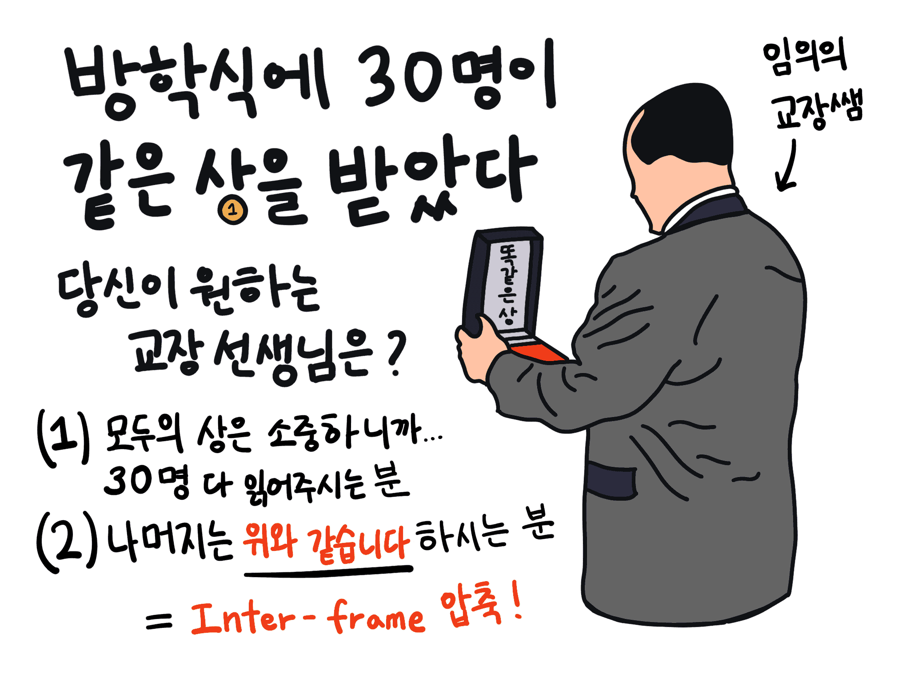

In this article, we will learn about the principle of video compression and discuss why the above phenomenon occurs.

## Videos are too big

A video is a collection of photos. However, the capacity becomes surprisingly large if we produce a video as a series of actual images. For example, if the 1920 x 1080 60FPS video we often watch on YouTube is not compressed, its size approaches 7GB per minute. However, if you watch a video with the exact specifications on YouTube, up to 40MB per minute is used. This compression is a reduction of capacity by almost 200 times. Still, we don't notice much of a difference. What happened?

## So we encode

Due to the large video size, most videos use some compression level. We call this video encoding, and the world of encoding algorithms is amazingly sophisticated and beautiful.

Video encoding finds the key to saving capacity in **redundancy**. For example, imagine a singer standing still and singing. Only the singer's mouth moves, and the background and the singer's body do not move at all. If so, is it necessary to provide information about the black pixels in the background and the body movements of the singer every time? No. Because those parts overlap.

Video data overlap in space and time. A method of removing spatial duplication is called intra-frame coding (intra-frame compression), and a way of eliminating temporal duplication is called inter-frame coding (inter-frame compression). As detailed implementation methods, there is a Discrete Cosine Transform used to reduce adjacent pixel data, prediction using motion vectors, and in-loop filtering techniques.

## Intra-frame coding

> Reduce the size of the photo itself!

A video is a collection of photos. A picture is a set of pixels. We can reduce spatial redundancy if we reduce the information on overlapping pixels in the same image. One of the most straightforward implementations is to use averages. Suppose the data of one pixel is left empty, and the information of the surrounding pixels is left. In that case, the computer takes the knowledge of _adjacent pixels_ when playing a video and expresses the average of the data.

What's interesting here is that _adjacent pixels_ are not up, down, left, or right. Pixel data in a video is stored in order from left to right and top to bottom. Suppose the information of the top, bottom, left, and right pixels is retrieved, and the average is obtained. In that case, it is necessary to wait until the right and bottom pixel data are read and then come back to represent the pixel data. Since it is not efficient when expressing a video quickly, Intra-frame coding temporarily stores the upper left, upper right, upper right, and left data. When encountering blank data, the average value is calculated using the temporarily stored values.

## Inter-frame coding

> Don't resend information you've sent in the past; let's recycle it!

Remember giving out prizes at school holidays? Let's imagine that the same award is given to 30 people. How long would the vacation ceremony be if the principal read out all the prizes individually? How boring and painful will it be? But the principal doesn't. Just **the contents are the same as above,** and move on. We can have a lovely vacation afternoon just by expressing that we are the same as the previous person. The principal did inter-frame compression.

The same goes for videos. Since many videos have similar frames, they can also express information about the relationship between the structures before and after or omit it altogether. This can reduce temporal redundancy.

### #1. `I-Frame` being the standard

An I-Frame (Intra-coded picture) is a photograph. All information in the I-Frame is new information. I-Frame becomes the standard for expressing the front and back frames.

### #2. `P-Frame` expressing only the amount of change

A P-Frame (Predicted Pictures) is inserted between each I-Frame. The amount of change from the previous screen is expressed in the P-Frame. If the current frame has something in common with the last structure, information about the prior frame is retrieved and used. It is easier to understand by looking at the picture.

What is represented by an arrow is a motion vector representing the amount of change. In addition to this, P-Frame includes conversion values for prediction correction. In some cases, new image information is also included in the P-Frame. P-Frame uses only about half the size of the I-Frame. Of course, in actual video encoding, instead of comparing all pixel information, it is divided into several blocks and compared. This is called a macroblock, and in HEVC, the latest video codec, it is called a coding tree unit.

### #3. `B-Frame` saving data

Insert B-Frame (Bidirectionally Predicted Pictures) between I-Frame and P-Frame. B-Frame calculates the screen using the front and backs I-Frames or P-Frames. There is no difference from P-Frame, but B-Frame is used because of its capacity. Since B-Frame utilizes all the data of the preceding and preceding frames, we can omit information as much. So the B-Frame uses only 25% of the size of the P-Frame.

Like P-Frame, B-Frame also uses Motion Vector and conversion values for prediction correction. B-Frame refers to I-Frame and P-Frame, but in the latest video codecs such as HEVC and VVC, B-Frame can also refer to other B-Frames.

## Reason for ghostings

The problem occurs when the communication packet containing the I-Frame is lost. As a result, the reference values for calculating the surrounding P-Frame and B-Frame disappeared. Of course, a good video streaming program uses various algorithms to detect communication packet loss in advance and request packets again. Still, we cannot check for I-Frame loss if the server is unstable or the streaming program is poor.

If the I-Frame is lost and only the next P-Frame and B-Frame arrive, the change value is applied to the wrong I-Frame.

## A picture is worth a thousand words

If you still don't understand, check it out with your own eyes. Using a commercial video library such as 'FFmpeg', the frame information of a video file can be intentionally corrupted. This type of art is called Datamoshing.

Using `Python` and `FFmpeg` libraries, the I-Frame in the music video was damaged to cause the ghosting artificially.

import YouTube from '@site/src/components/YouTube'

<YouTube id="ND60AIQg4bQ"/>

- All I-Frames in the video were overwritten with the values of the previous frame (probably P-Frame and B-Frame). Therefore, there is no new information due to I-Frame. So the screen does not change, but the characters' movements appear. This is because I applied the amount of change (P-Frame and B-Frame) to the wrong reference point (I-Frame).
- There are times when a part of the middle screen looks clean for a moment. This is because the P-Frame may also have new image information. However, since I-Frames, all new information, has been deleted, even if the screen looks clean temporarily, the entire screen will not be clean.
- You will notice that when the video is broken, it is not scattered like small sand but broken into large, easily visible square units. This is because image data compression is not calculated for each pixel but in units of macroblocks (coding tree units) that bundle several pixels. When this phenomenon occurs during a broadcast, it is commonly referred to as "Pixelated Videos".

Considering that there is no I-Frame, you will understand the relationship between I-Frame, P-Frame, and B-Frame more clearly after watching the video. When the opportunity arises, we will discuss how to damage a video using `FFmpeg` later.

---

- If there is an error in the article, please report it to [mail@chosunghyun.com](mailto:mail@chosunghyun.com).
- "However, to prevent the error from getting bigger, B-Frames do not refer to other B-Frames. They only refer to I-Frames or P-Frames" is incorrect. In video codecs such as HEVC and VVC, B-Frames can reference other B-Frames. Thank you so much for reporting. Credit: (anonymous)
