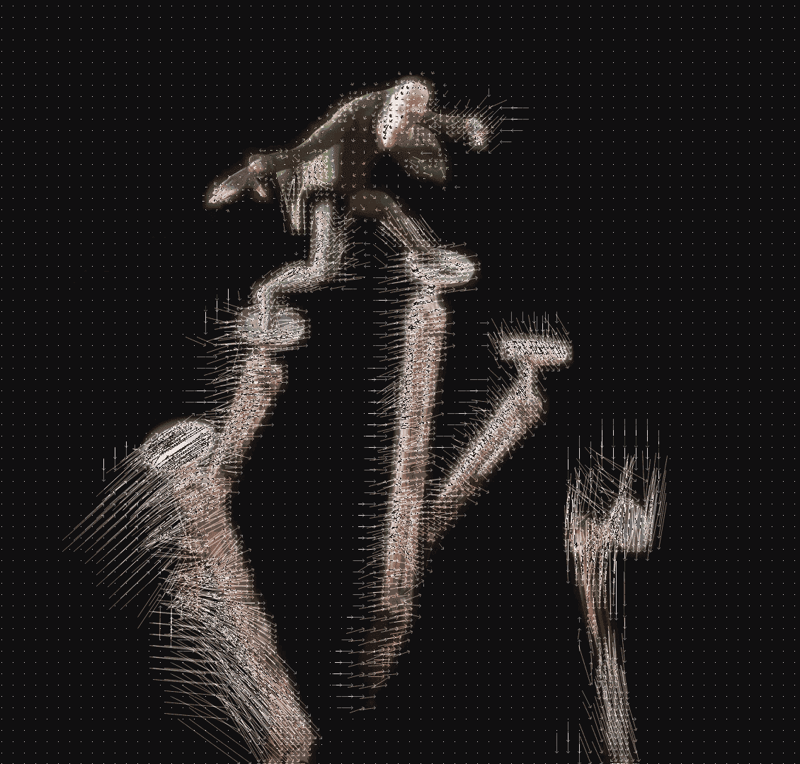

이 글에서는 동영상 압축의 원리에 대해서 알아보고 위와 같은 현상이 왜 일어나는지에 대해 다뤄보려 한다.

## 동영상은 너무 크다

동영상은 사진들의 집합이다. 그러나 동영상을 실제 사진의 연속으로 제작할 경우 용량이 놀랍도록 비대해진다. 우리가 YouTube에서 자주 시청하는 1920 x 1080 60FPS 동영상을 전혀 압축하지 않으면 그 크기가 분당 7GB에 육박한다. 하지만 실제 YouTube에서 똑같은 사양의 동영상을 시청할 경우 분당 최대 40MB 가량 사용된다. 거의 200배 가까이 용량이 줄어든 것이다. 그럼에도 우리는 큰 차이를 느끼지 못한다. 대체 무슨 일이 일어난 것일까?

## 그래서 인코딩을 한다

동영상의 비대한 크기 때문에 대부분의 동영상은 일정 수준 압축을 한다. 이를 동영상 인코딩이라고 하는데, 인코딩 알고리즘의 세계는 놀랍도록 정교하고 아름답다.

동영상 인코딩은 용량 절감의 핵심을 **중복성**에서 찾는다. 예를 들어 한 가수가 가만히 서서 노래를 부르고 있다고 생각해보자. 가수의 입만 움직이며 배경과 가수의 몸은 전혀 움직이지 않는다. 그렇다면 배경의 검정 픽셀과 가수의 몸동작에 대한 정보를 매번 제공할 필요가 있을까? 아니다. 그 부분들은 중복되기 때문이다.

동영상의 데이터는 시공간 상으로 중복된다. 공간상의 중복을 제거하는 방법을 인트라프레임 코딩(Intra-frame coding, 프레임 내 압축)이라고 하며 시간상의 중복을 제거하는 방법을 인터프레임 코딩(Inter-frame coding, 프레임 간 압축)이라고 한다. 세부적인 구현법으로 인접한 픽셀 데이터의 절감을 위해 활용되는 Discrete Cosine Transform, Motion Vector를 활용한 예측, 그리고 In-loop Filtering 기법 등이 존재한다.

## Intra-frame coding

> 사진 자체의 크기를 줄이자!

동영상은 사진의 집합이다. 사진은 픽셀의 집합이다. 같은 사진 내에 중복된 픽셀에 대한 정보를 줄일 수 있다면 공간상의 중복성(Spatial redundancy)을 줄일 수 있다. 가장 간단한 구현 중 하나는 평균치를 활용하는 것이다. 한 픽셀의 데이터를 비워두고 주변 픽셀 정보를 남겨두면 컴퓨터는 동영상을 재생할 때 *인접한 픽셀*들의 정보를 가져와 그 데이터의 평균을 표현한다.

여기서 재밌는 점은 *인접한 픽셀*이 상하좌우가 아니라는 점이다. 동영상 내 픽셀 데이터는 왼쪽에서 오른쪽으로, 그리고 위에서 아래의 순서로 저장되어 있다. 만약 상하좌우의 픽셀의 정보를 가져와서 평균을 구하게 된다면 우측과 하단의 픽셀 데이터가 읽힐 때까지 기다린 후에 다시 되돌아와 픽셀 데이터를 표현해야 한다. 빠르게 동영상을 표현할 때 효율적이지 못하므로 Intra-frame coding에서는 왼쪽 위, 위, 오른쪽 위, 그리고 왼쪽의 데이터를 임시로 저장해두었다가 공백 데이터를 만나면 임시 저장된 값들을 사용하여 평균값을 계산한다.

## Inter-frame coding

> 과거에 이미 보낸 정보는 다시 보내지 말고 재활용하자!

학교 방학식에서 상을 주는 것을 기억하는가? 만약 동일한 상을 30명에게 준다고 생각해보자. 교장 선생님께서 일일이 모든 상을 낭독하신다면 방학식이 얼마나 길어질까? 얼마나 지루하고 괴로울까? 하지만 교장 선생님께서는 그러시지 않는다. 그저 **위와 내용은 같습니다,** 하고 넘어가신다. 그렇게 앞 사람과 동일하다는 표현만으로 우리는 소중한 방학식 오후를 가질 수 있게 된다. 교장 선생님께서 Inter-frame 압축을 하신 것이다.

동영상도 마찬가지이다. 많은 동영상은 앞뒤 프레임이 비슷하기 때문에 동영상도 프레임 전후의 관계로 정보를 표현하거나 아예 생략할 수 있다. 이를 통해 시간상의 중복성(Temporal Redundancy)을 줄일 수 있다.

### #1. 기준이 되는 `I-Frame`

I-Frame(Intra-coded picture)은 사진이라고 봐도 무방하다. I-Frame 내의 모든 정보는 새로운 정보이다. I-Frame은 앞뒤 프레임을 표현하는 기준이 된다.

### #2. 변화량만 표현하는 `P-Frame`

각각의 I-Frame 사이에서는 P-Frame(Predicted Pictures)을 삽입한다. P-Frame에는 이전 화면과의 변화량이 표현되어 있다. 현재 프레임이 앞 프레임과 공통점이 있을 경우 앞 프레임의 정보를 가져와 사용하는 것이다. 그림을 보면 이해가 좀 편하다.

화살표로 표현된 것이 변화량을 나타내는 Motion Vector이다. 이 외에도 P-Frame에는 예측 보정을 위한 변환값들이 포함되어 있다. P-Frame에도 새로운 이미지 정보가 포함되는 경우가 있다. P-Frame은 I-Frame의 절반 정도의 크기만 사용한다. 물론 실제 동영상 인코딩에서는 모든 픽셀 정보를 비교하는 대신 여러 블록 단위로 쪼개서 비교한다. 이를 매크로블록(Macroblock)이라고 하며, 최신 영상 코덱인 HEVC에서는 코딩 트리 유닛(Coding Tree Unit)이라고 부른다.

### #3. 데이터를 아끼는 `B-Frame`

I-Frame과 P-Frame 사이에는 B-Frame(Bidirectionally Predicted Pictures)을 삽입한다. B-Frame은 앞뒤의 I-Frame 또는 P-Frame을 이용해 화면을 계산한다. P-Frame이랑 다를 것이 없어 보이는데 굳이 B-Frame을 사용하는 이유는 용량 때문이다. B-Frame은 앞뒤 프레임의 데이터를 모두 활용하기 때문에 그만큼 정보를 생략할 수 있다. 그래서 B-Frame은 P-Frame의 25% 정도의 크기만 사용한다.

B-Frame도 P-Frame처럼 Motion Vector와 예측 보정을 위한 변환값들을 사용한다. B-Frame은 I-Frame과 P-Frame을 참조하지만 HEVC 및 VVC 등의 최신 영상 코덱에서는 B-Frame도 다른 B-Frame을 참조할 수 있다.

## 유체이탈의 원인

문제는 I-Frame을 담은 통신 패킷이 손실될 때 발생한다. 주위의 P-Frame, B-Frame을 계산할 기준값이 사라진 것이다. 물론 좋은 동영상 스트리밍 프로그램일 경우 미리 여러 알고리즘을 활용해 통신 패킷 손실을 미리 감지하고 패킷을 다시 요청하겠지만 서버가 불안정하거나 스트리밍 프로그램이 부실한 경우 I-Frame이 손실된 것을 감지하지 못한다.

이때 I-Frame이 유실되고 그다음의 P-Frame, B-Frame만 도착하면 잘못된 I-Frame에 변화값을 적용하게 되는 것이다. 그렇게 한석원 선생님은 스스로를 인수분해 해버리신 것이다.

## 백문이 불여일견

아직도 잘 이해가 되지 않는다면 직접 눈으로 확인해보자. `FFmpeg` 등의 상용 비디오 라이브러리를 이용해 의도적으로 동영상 파일의 프레임 정보를 변질시킬 수 있다. 이런 형식의 예술 분야를 Datamoshing이라고 한다.

`Python`과 `FFmpeg` 라이브러리를 활용해 뮤직비디오 내 I-Frame을 손상시켜 인위적으로 유체이탈 현상을 발생시켰다.

import YouTube from '@site/src/components/YouTube'

<YouTube id="ND60AIQg4bQ"/>

- 영상 내의 모든 I-Frame들을 바로 이전의 프레임 (아마도 P-Frame과 B-Frame) 값으로 덮어씌웠다. 때문에 I-Frame으로 인한 신규 정보는 존재하지 않는다. 그래서 화면은 변하지 않지만 인물들의 동작이 나타난다. 잘못된 기준점(I-Frame)에 변화량(P-Frame과 B-Frame)이 적용되었기 때문이다.
- 중간 중간 화면의 일부가 순간적으로 깔끔하게 보일 때가 있다. 이는 P-Frame도 신규 이미지 정보를 가지고 있을 수 있기 때문이다. 모든 부분이 신규 정보인 I-Frame들은 삭제되었기 때문에, 일시적으로 화면이 깔끔하게 보이더라도 화면 전체가 깔끔하지는 않을 것이다.
- 영상이 깨질 때 작은 모래처럼 흩어지는 것이 아니라 눈에 잘 보이는 커다란 정사각형 단위로 깨지는 것을 알 수 있을 것이다. 이는 영상 데이터 압축이 각 픽셀마다 계산되는 것이 아니라 여러 픽셀을 묶은 매크로블록 (코딩 트리 유닛) 단위로 계산되기 때문이다. 이런 현상이 방송 도중 일어나면 흔히 "깍두기 현상"이라고 부른다.

I-Frame이 없다는 것을 감안하고 영상을 보고 나면 I-Frame, P-Frame, B-Frame 간의 관계가 조금 더 명확하게 이해가 될 것이다. `FFmpeg`를 이용해서 동영상을 손상시키는 방법은 나중에 기회가 되면 다뤄보도록 하겠다.

---

- 글에 오류가 있다면 [mail@chosunghyun.com](mailto:mail@chosunghyun.com)으로 제보 부탁드립니다.
- "다만 오차가 점점 커지지 않도록 B-Frame은 다른 B-Frame을 참조하지 않는다. I-Frame 또는 P-Frame만 참조한다"는 문장이 잘못되었습니다. HEVC 및 VVC 등의 영상 코덱에서 B-Frame은 다른 B-Frame을 참조할 수 있습니다. 제보 정말 감사드립니다. Credit: (익명 요청)
