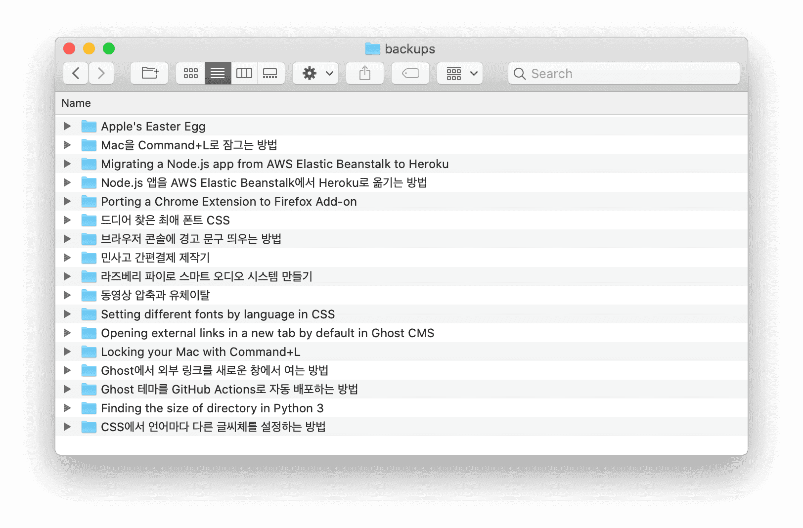
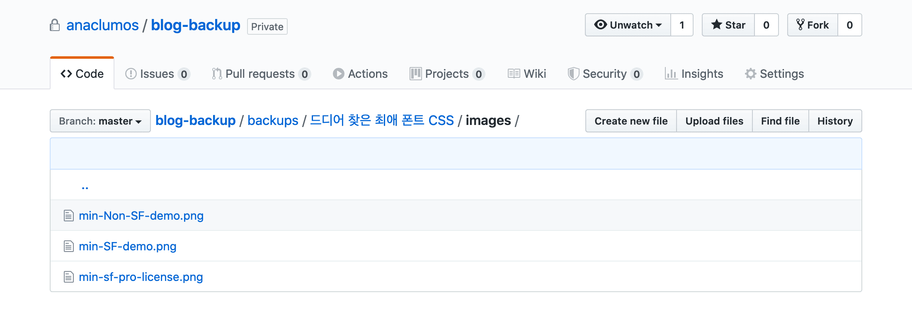

My Ghost blog is not serverless. The server is maintained despite the need for continuous management because there are numerous advantages of blogging through the server. However, managing a blog through a server has one huge drawback. If the server crashes, it will be challenging to restore the text inside. There will be many more texts and photos in the future, but it would be too cumbersome to copy and back up each time. So I wanted to come up with a plan to improve this.

## Problems with Ghost's built-in backup

Ghost provides a function to download a blog backup file in `.json` format. Everything that can be set in Ghost is backed up as it is, including the author's name, used tags, the content and structure of the article, the time the article was uploaded, and the summary in the HTML meta tag.

But there are two problems.

- Ghost built-in backup files are complex for humans to read. It is not only Minified JSON but also contains a lot of information, so the file structure is complicated, and the text is compressed.
- Also, Ghost's built-in backup does not back up photos. Therefore, when you restore the blog, all photo files are "not found" (aka **Xbox**). It is fortunate if the blog server is alive or there are copied photos, but there may be cases where I cannot restore the images.

## target

### main goal

- You must back up all text and photos.

### Bonus Goal

- Must be in a human-readable format. (Human-Readable Medium)
- In preparation for restoring the blog, you must see which photos are included in which position in which post.
- Backups should be convenient.
- It should be possible to create clones outside the blog.

## Envision

That's RSS. RSS is a technology that emerged during the blogging boom of the early 2000s and acts like a "subscription". Sites and blogs that support RSS provide an RSS feed address. In the RSS feed address, the contents updated on the site are organized in a machine-readable form. When users enter an RSS feed address into an RSS reader, the reader scrapes new content from the RSS feed address every time.

In modern times, SNS is active, and RSS technology has been abandoned, but it is sufficient to achieve my goal. The RSS feed serves as an API to receive articles. Ghost supports RSS, so I decided to use it.

### rough idea

1. Enter the blog RSS address and copy the entire RSS feed.
2. Parse the RSS and extract the HTML of the article.
3. Create a folder for each article to save the HTML of the article.
4. Connect to the `src` address of the `img` tag included in the HTML of the article and download the picture.
5. For posts with pictures, create an `images` folder for each post folder to save pictures and change the `src` of the `img` tag in HTML to the relative path of the saved image.

## Development

### Reference

All examples below are based on v1 of `[anaculos/backup-with-rss](https://github.com/anaculos/backup-with-rss)`. By the time you read this, I may have added some new features or bug fixes.

Also, the code attached to this article is intended to show a rough deployment, not the entire code. If you try to copy and run this article, it probably won't run! The complete code is publicly available on the [GitHub repository](https://github.com/anaclomos/backup-with-rss).

### 1\. Copy RSS feeds using Feedparser

Copy RSS feeds via a module called Feedparser in Python.

```python
# -*- coding: utf-8 -*-
import feedparser


class RSSReader:
    origin = ""
    feed = ""

    def __init__(self, URL):
        self.origin = URL
        self.feed = feedparser.parse(URL)

    def parse(self):
        return self.feed.entries
```

RSSReader is used to load RSS feeds and pass `entries` items.

What this code does is:

1. When an RSSReader Object is created, the RSS address is saved in `self.origin`, and the RSS address is parsed and stored in `self.feed`.
2. When the parse function is executed, it returns `entries` among the values stored in `self.feed`.

Among them, `entries` contains articles from the RSS feed in the form of `list`. The following example is the RSS of [this article](https://blog.chosunghyun.com/apples-easter-egg/).

Structure of `self.feed.entries` in `parse()`

```JSON
{
  "bozo": 0,
  "encoding": "utf-8",
  "entries": [],
  "feed": {
    "generator": "Ghost 3.13",
    "generator_detail": {
      "name": "Ghost 3.13"
    },
    "image": {
      "href": "https://blog.chosunghyun.com/favicon.png",
      "link": "https://blog.chosunghyun.com/",
      "links": [
        {
          "href": "https://blog.chosunghyun.com/",
          "rel": "alternate",
          "type": "text/html"
        }
      ],
      "title": "Sunghyun Cho",
      "title_detail": {
        "base": "https://blog.chosunghyun.com/rss/",
        "language": "None",
        "type": "text/plain",
        "value": "Sunghyun Cho"
      }
    },
    "link": "https://blog.chosunghyun.com/",
    "links": [
      {
        "href": "https://blog.chosunghyun.com/",
        "rel": "alternate",
        "type": "text/html"
      },
      {
        "href": "https://blog.chosunghyun.com/rss/",
        "rel": "self",
        "type": "application/rss+xml"
      }
    ],
    "subtitle": "Sunghyun Cho's Blog",
    "subtitle_detail": {
      "base": "https://blog.chosunghyun.com/rss/",
      "language": "None",
      "type": "text/html",
      "value": "Sunghyun Cho;s Blog"
    },
    "title": "Sunghyun Cho",
    "title_detail": {
      "base": "https://blog.chosunghyun.com/rss/",
      "language": "None",
      "type": "text/plain",
      "value": "Sunghyun Cho"
    },
    "ttl": "60",
    "href": "https://blog.chosunghyun.com/rss/",
    "namespaces": {
      "": "http://www.w3.org/2005/Atom",
      "content": "http://purl.org/rss/1.0/modules/content/",
      "dc": "http://purl.org/dc/elements/1.1/",
      "media": "http://search.yahoo.com/mrss/",
      "status": 200,
      "version": "rss20"
    }
  }
}
```

### 2\. Create a Markdown file with RSS data

I could extract only necessary values from `self.feed.entries` returned by `RSSReader` and created the `MDCreator` class to process the information provided by `RSSReader`.

```python
class MDCreator:
    def __init__(self, rawData, blogDomain):
        self.rawData = rawData
        self.blogDomain = blogDomain

    def createFile(self, directory):
        try:
            os.makedirs(directory + "/" + self.rawData.title)
            print('Folder "' + self.rawData.title + '" Created ')
        except FileExistsError:
            print(
                'Folder "' + self.rawData.title + '" already exists'
            )
        self.directory = directory + "/" + self.rawData.title

        MDFile = codecs.open(
            self.directory + "/README.md", "w", "utf-8"
        )
        MDFile.write(self.render())
        MDFile.close()
```

The `blogDomain` parameter is used later.

What this code does is:

1. When the MDCreator object is created, save the blog address in `self.blogDomain` and the original RSS feed data in `self.rawData`. The actual data of this RSS feed is `self.feed.entries` returned from `parse()` of RSSReader.
2. When the `createFile()` function is executed, a folder is created for each article in the backup folder. In this case, the folder title is the title of the article. Next, create `README.md` for each folder and put the article's contents in it.

The reason for creating the file through the `codecs` library is to use Unicode instead of the CP949 codec on Windows. Then the emoji included in the RSS will usually appear 🚀🥊

### 3\. Adding post information to the created Markdown file

I wanted to use Jekyll-type Front Matter when displaying text information. It was the easiest way to check the article's title, tags, links, authors, etc.

```python
def render(self):
    try:
        postTitle = str(self.rawData.title)
    except AttributeError:
        postTitle = "Post Title Unknown"
        print("Post Title does not exist")
    try:
        postTags = str(
            self.getValueListOfDictList(self.rawData.tags, "term")
        )
    except AttributeError:
        postTags = "Post Tags Unknown"
        print("Post Tags does not exist")
    try:
        postLink = "Post Link Unknown"
        postLink = str(self.rawData.link)
    except AttributeError:
        print("Post Link does not exist")
    try:
        postID = str(self.rawData.id)
    except AttributeError:
        postID = "Post ID unknown"
        print("Post ID does not exist")
    try:
        postAuthors = str(self.rawData.authors)
    except AttributeError:
        postAuthors = "Authors Unknown"
        print("Authors does not exist")
    try:
        postPublished = str(self.rawData.published)
    except AttributeError:
        postPublished = "Published Date unknown"
        print("Published Date does not exist")
    self.renderedData = (
        "---\nlayout: post\ntitle: "
        + postTitle
        + "\ntags: "
        + postTags
        + "\nurl: "
        + postLink
        + "\nauthors: "
        + postAuthors
        + "\npublished: "
        + postPublished
        + "\nid: "
        + postID
        + "\n---\n"
    )
```

What this code does is:

1. In the RSS code, check if there is a title, tag, link, ID, author name, and publication date of the article; if there is a value, enter the value in Front Matter.
2. If there is no value, enter `~ Unknown`.

Tags are entered through code such as `self.getValueListOfDictList(self.rawData.tags, "term")` because Ghost specifies tags in the following format. The same goes for Gatsby and WordPress.

```json
'tags': [{'label': None, 'scheme': None, 'term': 'English'},
     {'label': None, 'scheme': None, 'term': 'Code'},
     {'label': None, 'scheme': None, 'term': 'Apple'}],
```

```python
def getValueListOfDictList(self, dicList, targetkey):
    arr = []
    for dic in dicList:
        for key, value in dic.items():
            if key == targetkey:
                arr.append(value)
    return arr
```

This way, only the `term` item is removed from `tags` and added to Front Matter. Then, when executed, the following Jekyll Style Front Matter is completed.

```yaml
---
layout: post
title: Apple's Easter Egg
tags: ['English', 'Code', 'Apple']
url: https://blog.chosunghyun.com/apples-easter-egg/
authors: [{ 'name': 'S Cho' }]
published: Sun, 19 Jan 2020 17:00:00 GMT
id: /_ Some Post ID _/
---
```


Front Matter looks like this renders on GitHub.

### 4\. Adding summary and body text to the created Markdown file

Add Summary and Content items of RSS data to `renderedData`.

```python
self.renderedData += "\n\n# " + postTitle + "\n\n## Summary\n\n"

try:
    self.renderedData += self.rawData.summary
except AttributeError:
    self.renderedData += "RSS summary does not exist."

self.renderedData += "\n\n## Content\n\n"

try:
    for el in self.getValueListOfDictList(self.rawData.content, "value"):
        self.renderedData += "\n" + str(el)
except AttributeError:
    self.renderedData += "RSS content does not exist."
```

One curious thing is that while Ghost and WordPress-based blogs support both RSS summary and content, Jekyll-based GitHub Pages or Tistory put all the article's contents in the RSS summary. (...) Ghost provides a function to set the Excerpt of the text, and this Excerpt value is used as RSS Summary.

### 5\. Adding Images to Generated Markdown Files

For backup, I must preserve even the image intact. Except for images embedded in HTML as base64, all of them now have only `src` specified in the `img` tag. If the server dies, we cannot load photos from `img src`, so I must download all images at the time of backup.

[How to Download All Images from a Web Page in Python](https://www.thepythoncode.com/article/download-web-page-images- python).

```python
soup = bs(self.renderedData, features="html.parser")
for img in soup.findAll("img"):

    for imgsrc in ["src", "data-src"]:
        try:
            remoteFile = img[imgsrc]
            break
        except KeyError:
            continue

    if self.isDomain(remoteFile) != True:
        print("remoteFile", remoteFile, "is not a domain.")
        remoteFile = self.blogDomain + "/" + remoteFile
        print("Fixing it to", remoteFile)
    print(
        'Trying to download "'
        + remoteFile
        + '" and save it at "'
        + self.directory
        + '/images"'
    )
    self.download(remoteFile, self.directory + "/images")
    img["src"] = "images/" + remoteFile.split("/")[-1]
    img["srcset"] = ""
    print(img["src"])
self.renderedData = str(soup)
return self.renderedData
```

What this code does is:

1. Read the string `renderedData` into HTML and find all `img` tags.
2. Check if there is an `src` or `data-src` attribute. `data-src` is an attribute corresponding to WordPress.
3. Create an images folder in each post folder and save images in it. At this time, the name of the image is the lowest directory of img src. For example, if `img src` is `https://blog.someone.com/images/example.png`, it will be saved as `images/example.png`.
4. Change the existing `img src` to the relative path of the `images` folder.
5. Remove the `srcset` attribute if it has one (Gatsby correspondence)

```python
def download(self, url, pathname):
    if not os.path.isdir(pathname):
        os.makedirs(pathname)
    response = requests.get(url, stream=True)
    file_size = int(response.headers.get("Content-Length", 0))
    filename = os.path.join(pathname, url.split("/")[-1])
    if filename.find("?") > 0:
        filename = filename.split("?")[0]
    progress = tqdm(
        response.iter_content(256),
        f"Downloading {filename}",
        total=file_size,
        unit="B",
        unit_scale=True,
        unit_divisor=1024,
    )
    with open(filename, "wb") as f:
        for data in progress:
            f.write(data)
            progress.update(len(data))
```

One problem is that the addresses of images are not consistent. Some sites write the entire domain as `` while others `` Write from the subdirectory as well. In some places, it was ``. To respond to as many cases as possible, a function `isDomain()` that detects domains has been created. Other libraries recognized file extensions such as `.png` as Top Level Domains such as `.com`, so we added some exception handling.

```python
def isDomain(self, string):
    if string.startswith("https://") or string.startswith("http://"):
        return True
    elif string.startswith("/"):
        return False
    else:
        return validators.domain(string.split("/")[0])
```

The domain name is specified in front if the domain is not directly accessible, such as ``. At this time, the previously specified `self.blogDomain` is used.

## Result

I backed up this blog. This blog is a Self-hosted [Ghost](https://ghost.org) blog. If you run only `main.py`, the backup will continue.



![This is the appearance of the article backed up on GitHub. Photos are also saved and displayed directly in a folder instead of on a blog server.] (E98816.png)



The following services tested are supported: The style or arrangement of the writing may be slightly different, but the purpose of **backup** is sufficiently achieved.

- Ghost
- WordPress
- Jekyll-based GitHub Pages
- Gatsby-based GitHub Pages
- Medium
- Tistory

## Evaluation of achievement of goals

### Main Goal

- You must back up all text and photos. ★★★

The goal has been fully achieved. The video is not backed up, but since the video is embedded via YouTube anyway, the probability of information loss is much less. Because of this, it was excluded from the goal from the beginning.

### Bonus Goal

- Must be in a human-readable format. (Human-Readable Medium) ★★☆

Compared to Ghost's built-in backup, you can see important information at a glance in Front Matter, and the text is rendered almost the same form as a blog. Articles and photos are organized by folder, making it easy to find the data you want. However, even if you use Markdown, it is inconvenient to edit the text because the body of the text is HTML. It is a backup that achieves the purpose of just _Lots of copies keeps stuff safe_.

- It should be clear which picture goes in which position in which text. (In preparation for restoring the blog) ★★★

You can see which picture goes where in which text.

- Backups should be convenient. ★★☆

You have to run `main.py` manually. I'm thinking of automating it with `crontab` someday.

Also, due to the nature of using RSS, only posts included in RSS feeds are backed up. RSS feeds often contain only the most recent posts to reduce bandwidth usage, but each blog has the option to adjust this. For example, the Ghost blog, by default, includes the 15 most recent posts in its RSS feed. I cannot manipulate the number of RSS feed posts on the Ghost blog within Ghost CMS, and [Ghost Core's code](https://github.com/TryGhost/Ghost/blob/master/core/server/models/plugins/pagination.js# L20) cannot be touched.

- It should be possible to create clones outside the blog. ★★☆

WordPress may temporarily block access if you repeatedly download many photos from a WordPress blog.

## Future Plans

After completing it and thinking about it, it would be a good tool for those planning to relocate to the blog but are worried about the amount of data they have accumulated. We plan to improve it further to be a helpful tool before blogging.

## Reference

- [How to Download All Images from a Web Page in Python](https://www.thepythoncode.com/article/download-web-page-images-python) by [PythonCode](https://www.thepythoncode. com/)
- [Ghost Custom RSS Feed](https://ghost.org/tutorials/custom-rss-feed/)
- The script does not typically run if the RSS feed contains unsupported Unicode characters. Errors in editors or blogs most often cause this. It will work if you find and correct the text using a service such as [Feed Validator](http://www.feedvalidator.org/).
