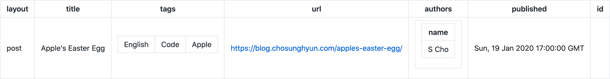
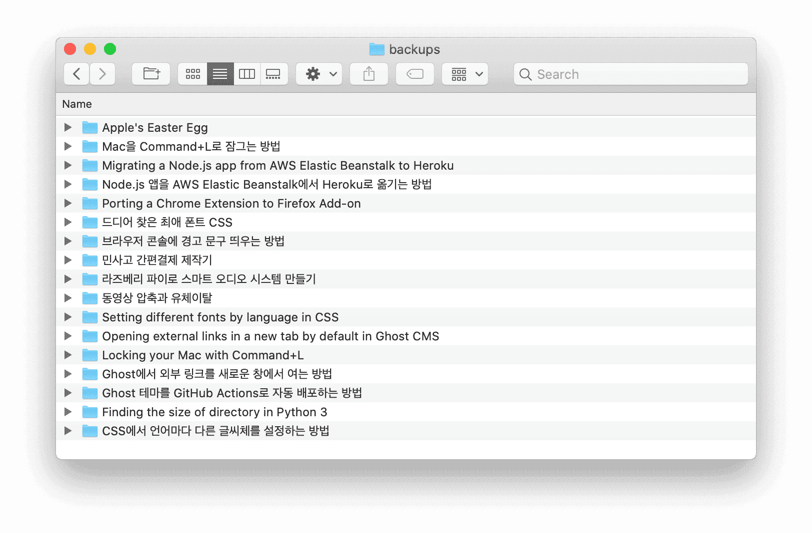
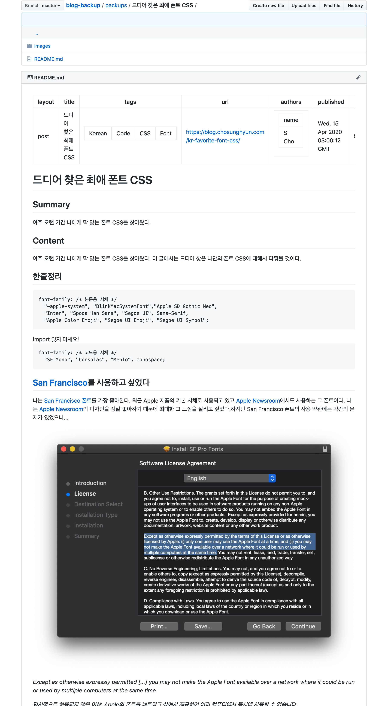
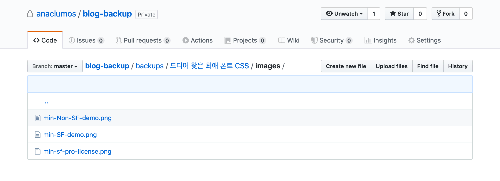

내 Ghost 블로그는 서버리스하지 않다. 지속적인 관리가 필요함에도 서버를 유지하는 이유는 서버를 통한 블로그 운영에 수많은 장점들이 있기 때문이다. 하지만 서버를 통해 블로그를 관리하게 되면 아주 큰 단점이 한 가지 생긴다. 서버가 터질 경우 안에 담긴 글들을 복원하기 매우 어려워진다는 것이다. 앞으로 글과 사진이 훨씬 많아질텐데 매번 일일이 복사하여 백업하기는 너무 귀찮을 것 같다는 생각이 들었다. 이를 개선해볼 대책을 세워보고 싶었다.

## Ghost 내장 백업의 문제점

Ghost는 `.json` 형태의 블로그 백업 파일을 내려 받을 수 있는 기능을 제공한다. 정말 블로그의 **영혼 그대로 복사**된다. 작가 이름, 사용한 태그들, 글의 내용 및 양식, 글을 업로드한 시간과 HTML 메타태그 내 summary까지, Ghost 내에서 설정할 수 있는 모든 것들은 그대로 백업된다.

하지만 두 가지 문제점이 있다.

- Ghost 내장 백업 파일은 사람이 읽기 어렵다. Minified JSON일 뿐만 아니라, 수많은 정보들을 담고 있기 때문에 파일 구조도 복잡하며 글도 압축되어 있다.
- 또 Ghost 내장 백업은 사진을 백업하지 않는다. 때문에 블로그를 복원하면 사진 파일들은 모두 "찾을 수 없음"(일명 **엑박**)이 뜨게 된다. 블로그 서버가 살아있거나 복사해둔 사진들이 있으면 다행이지만 사진을 복원하지 못하는 경우도 생길 수 있다는 뜻이다.

## 목표

### 주 목표

- 글과 사진을 모두 백업해야 한다.

### 보너스 목표

- 사람이 읽을 수 있는 형태여야 한다. (Human-Readable Medium)
- 블로그를 복원할 때를 대비하여 어느 글의 어느 위치에 어느 사진이 들어가는지 명확하게 알 수 있어야 한다.
- 백업이 편리해야 한다.
- 블로그 외부에서 복제본을 만들 수 있어야 한다.

## 구상

바로 RSS이다. RSS는 2000년대 초반 블로그 붐이 일었을 때 등장한 기술로 마치 "구독"의 역할을 한다. RSS를 지원하는 사이트나 블로그들은 RSS 피드 주소를 제공한다. RSS 피드 주소에는 그 사이트에서 업데이트 되는 내용들이 기계가 읽을 수 있는 형태로 정리되어 올라간다. 사용자들이 RSS 리더에 RSS 피드 주소를 입력하면 리더가 RSS 피드 주소에서 새로운 컨텐츠를 매번 긁어오는 것이다.

현대에는 SNS가 활성화되며 RSS 기술이 사장되었지만 나의 목표를 달성하기에는 충분한 기술이다. RSS 피드는 글을 받아오는 API 역할을 하는 것이다. Ghost는 기본적으로 RSS를 지원하니 이를 이용하기로 했다.

### 개략적인 아이디어

1.  블로그 RSS 주소를 입력하여 RSS 피드 전체를 복사해온다.
2.  RSS를 파싱하여 글의 HTML을 추출한다.
3.  각 글마다 폴더를 하나씩 생성하여 글의 HTML을 저장한다.
4.  글의 HTML에 포함된 `img` 태그의 `src` 주소에 접속하여 사진을 내려 받는다.
5.  사진이 존재하는 글은 글 폴더마다 `images` 폴더를 만들어 사진을 저장하고, HTML 내 `img` 태그의 `src` 를 저장된 이미지의 상대 경로로 변경한다.

## Development

### 참고

아래의 모든 예시는 `[anaclumos/backup-with-rss](https://github.com/anaclumos/backup-with-rss)` 의 v1을 기준으로 작성되었다. 이 글을 읽을 시점에는 무언가 새로운 기능이나 버그 수정이 추가되었을지 모른다.

또한 이 글에 첨부된 코드는 개략적인 전개를 보여주기 위한 것이지 전체 코드가 아니다. 이 글대로 복사해서 실행하려 하면 아마 실행되지 않을 것이다! 전체 코드는 [GitHub 저장소](https://github.com/anaclumos/backup-with-rss)에 공개되어 있다.

### 1\. Feedparser를 이용해 RSS 피드 복사

Python의 Feedparser라는 모듈을 통해 RSS 피드를 복사한다.

```python
# -*- coding: utf-8 -*-
# -*- coding: utf-8 -*-
import feedparser


class RSSReader:
    origin = ""
    feed = ""

    def __init__(self, URL):
        self.origin = URL
        self.feed = feedparser.parse(URL)

    def parse(self):
        return self.feed.entries
```

RSSReader는 RSS 피드를 불러와 `entries` 항목을 넘기는데 사용된다.

이 코드가 하는 역할은,

1.  RSSReader Object가 생성될 때 `self.origin`에 RSS 주소를 저장하고 RSS 주소를 파싱하여 `self.feed`에 저장한다.
2.  parse 함수가 실행될 시 `self.feed`에 저장된 값 중 `entries`를 반환한다.

이 중 `entries` 에는 RSS 피드의 글들이 `list`의 형식으로 들어있다. 다음 예시는 [이 글](https://blog.chosunghyun.com/apples-easter-egg/)의 RSS이다.

`parse()`의 `self.feed.entries`의 구조

```json
// 일부 생략
{
  "bozo": 0,
  "encoding": "utf-8",
  "entries": [],
  "feed": {
    "generator": "Ghost 3.13",
    "generator_detail": {
      "name": "Ghost 3.13"
    },
    "image": {
      "href": "https://blog.chosunghyun.com/favicon.png",
      "link": "https://blog.chosunghyun.com/",
      "links": [
        {
          "href": "https://blog.chosunghyun.com/",
          "rel": "alternate",
          "type": "text/html"
        }
      ],
      "title": "Sunghyun Cho",
      "title_detail": {
        "base": "https://blog.chosunghyun.com/rss/",
        "language": "None",
        "type": "text/plain",
        "value": "Sunghyun Cho"
      }
    },
    "link": "https://blog.chosunghyun.com/",
    "links": [
      {
        "href": "https://blog.chosunghyun.com/",
        "rel": "alternate",
        "type": "text/html"
      },
      {
        "href": "https://blog.chosunghyun.com/rss/",
        "rel": "self",
        "type": "application/rss+xml"
      }
    ],
    "subtitle": "Sunghyun Cho's Blog",
    "subtitle_detail": {
      "base": "https://blog.chosunghyun.com/rss/",
      "language": "None",
      "type": "text/html",
      "value": "Sunghyun Cho;s Blog"
    },
    "title": "Sunghyun Cho",
    "title_detail": {
      "base": "https://blog.chosunghyun.com/rss/",
      "language": "None",
      "type": "text/plain",
      "value": "Sunghyun Cho"
    },
    "ttl": "60",
    "href": "https://blog.chosunghyun.com/rss/",
    "namespaces": {
      "": "http://www.w3.org/2005/Atom",
      "content": "http://purl.org/rss/1.0/modules/content/",
      "dc": "http://purl.org/dc/elements/1.1/",
      "media": "http://search.yahoo.com/mrss/",
      "status": 200,
      "version": "rss20"
    }
  }
}
```

### 2\. RSS 데이터로 Markdown 파일 만들기

`RSSReader`가 반환하는 `self.feed.entries` 중에서 필요한 값들만 뽑아내면 될 것 같았다. `RSSReader`가 제공한 정보를 가공할 `MDCreator` 클래스를 만들었다.

```python
class MDCreator:
    def __init__(self, rawData, blogDomain):
        self.rawData = rawData
        self.blogDomain = blogDomain

    def createFile(self, directory):
        try:
            os.makedirs(directory + "/" + self.rawData.title)
            print('Folder "' + self.rawData.title + '" Created ')
        except FileExistsError:
            print(
                'Folder "' + self.rawData.title + '" already exists'
            )
        self.directory = directory + "/" + self.rawData.title

        MDFile = codecs.open(
            self.directory + "/README.md", "w", "utf-8"
        )
        MDFile.write(self.render())
        MDFile.close()
```

`blogDomain` parameter는 나중에 사용된다.

이 코드가 하는 역할은,

1.  MDCreator Object가 생성될 때 블로그 주소를 `self.blogDomain`에, RSS 피드 원본 데이터를 `self.rawData` 에 저장한다. 이 RSS 피드 원본 데이터는 RSSReader의 `parse()`에서 반환되는 `self.feed.entries`이다.
2.  `createFile()` 함수가 실행되면 백업 폴더에 각 글마다 하나의 폴더를 만든다. 이 때 폴더 제목은 글의 제목이다. 각 폴더마다 `README.md`를 생성하고, 그 안에 글의 내용을 넣는다.

`codecs` 라이브러리를 통해서 파일을 생성하는 이유는 Windows에서 CP949 코덱 대신 Unicode를 사용하게끔 하기 위함이다. 그래야 RSS 안에 포함된 이모지가 정상적으로 나타난다 🚀🥊

### 3\. 생성한 Markdown 파일에 글 정보 추가하기

글의 정보를 표시할 때 Jekyll 형식의 Front Matter를 사용하고 싶었다. 글의 제목, 태그, 링크, 작가 등을 가장 쉽게 확인할 수 있는 방법이라는 생각이 들었기 때문이다.

```python
def render(self):
    try:
        postTitle = str(self.rawData.title)
    except AttributeError:
        postTitle = "Post Title Unknown"
        print("Post Title does not exist")
    try:
        postTags = str(
            self.getValueListOfDictList(self.rawData.tags, "term")
        )
    except AttributeError:
        postTags = "Post Tags Unknown"
        print("Post Tags does not exist")
    try:
        postLink = "Post Link Unknown"
        postLink = str(self.rawData.link)
    except AttributeError:
        print("Post Link does not exist")
    try:
        postID = str(self.rawData.id)
    except AttributeError:
        postID = "Post ID unknown"
        print("Post ID does not exist")
    try:
        postAuthors = str(self.rawData.authors)
    except AttributeError:
        postAuthors = "Authors Unknown"
        print("Authors does not exist")
    try:
        postPublished = str(self.rawData.published)
    except AttributeError:
        postPublished = "Published Date unknown"
        print("Published Date does not exist")
    self.renderedData = (
        "---\nlayout: post\ntitle: "
        + postTitle
        + "\ntags: "
        + postTags
        + "\nurl: "
        + postLink
        + "\nauthors: "
        + postAuthors
        + "\npublished: "
        + postPublished
        + "\nid: "
        + postID
        + "\n---\n"
    )
```

이 코드가 하는 역할은,

1.  RSS 코드에서 글의 제목, 태그, 링크, ID, 작가 이름들, 그리고 출판 날짜가 있는지 확인하고, 값이 있을 경우 Front Matter에 그 값을 입력한다.
2.  값이 없을 경우 `~ Unknown`을 입력한다.

Tags를 `self.getValueListOfDictList(self.rawData.tags, "term")` 같은 코드를 통해서 넣는 이유는 Ghost에서 다음과 같은 형식으로 태그가 지정되어 있기 때문이다. 이는 Gatsby나 Wordpress 등도 마찬가지이다.

```json
'tags': [{'label': None, 'scheme': None, 'term': 'English'},
     {'label': None, 'scheme': None, 'term': 'Code'},
     {'label': None, 'scheme': None, 'term': 'Apple'}],
```

```python
def getValueListOfDictList(self, dicList, targetkey):
    arr = []
    for dic in dicList:
        for key, value in dic.items():
            if key == targetkey:
                arr.append(value)
    return arr
```

이와 같은 방식으로 `tags`에서 `term` 항목만 꺼내 Front Matter에 추가한다. 그렇게 되면 실행했을 때 다음과 같은 Jekyll Style Front Matter가 완성된다.

```yaml
---
layout: post
title: Apple's Easter Egg
tags: ['English', 'Code', 'Apple']
url: https://blog.chosunghyun.com/apples-easter-egg/
authors: [{ 'name': 'S Cho' }]
published: Sun, 19 Jan 2020 17:00:00 GMT
id: /_ Some Post ID _/
---
```



Front Matter는 GitHub에서 이렇게 렌더링되어 보인다.

### 4\. 생성한 Markdown 파일에 글 요약 및 본문 추가하기

RSS 데이터의 Summary 항목과 Content 항목을 `renderedData`에 추가한다.

```python
self.renderedData += "\n\n# " + postTitle + "\n\n## Summary\n\n"

try:
    self.renderedData += self.rawData.summary
except AttributeError:
    self.renderedData += "RSS summary does not exist."

self.renderedData += "\n\n## Content\n\n"

try:
    for el in self.getValueListOfDictList(self.rawData.content, "value"):
        self.renderedData += "\n" + str(el)
except AttributeError:
    self.renderedData += "RSS content does not exist."
```

한 가지 신기했던 점은 Ghost와 Wordpress 기반 블로그들은 RSS의 Summary와 Content를 모두 지원하는 반면 Jekyll-based GitHub Pages나 Tistory는 RSS Summary에 모든 글의 내용을 집어넣는다는 점이다. (...) Ghost는 기본적으로 글의 Excerpt를 설정할 수 있는 기능을 제공하는데, 이 Excerpt 값이 RSS Summary로 사용된다.

### 5\. 생성한 Markdown 파일에 이미지 추가하기

백업을 위해서는 이미지까지 온전하게 보존되어야 한다. HTML에 base64로 임베디드되어있는 이미지가 아니라면 지금으로는 모두 `img` 태그에 `src`만 지정되어 있는 형태이다. 서버가 죽으면 `img src`에서 이미지를 불러오지 못할테니 백업을 할 시점에 이미지를 모두 다운로드해야한다.

[PythonCode](https://www.thepythoncode.com/)의 [How to Download All Images from a Web Page in Python](https://www.thepythoncode.com/article/download-web-page-images-python)을 참고하였다.

```python
soup = bs(self.renderedData, features="html.parser")
for img in soup.findAll("img"):

    for imgsrc in ["src", "data-src"]:
        try:
            remoteFile = img[imgsrc]
            break
        except KeyError:
            continue

    if self.isDomain(remoteFile) != True:
        print("remoteFile", remoteFile, "is not a domain.")
        remoteFile = self.blogDomain + "/" + remoteFile
        print("Fixing it to", remoteFile)
    print(
        'Trying to download "'
        + remoteFile
        + '" and save it at "'
        + self.directory
        + '/images"'
    )
    self.download(remoteFile, self.directory + "/images")
    img["src"] = "images/" + remoteFile.split("/")[-1]
    img["srcset"] = ""
    print(img["src"])
self.renderedData = str(soup)
return self.renderedData
```

이 코드가 하는 역할은,

1.  문자열 `renderedData`를 HTML로 읽어와 `img` 태그를 모두 찾는다.
2.  `src`나 `data-src` attribute가 있는지 확인한다. `data-src`는 Wordpress에 대응하는 attribute이다.
3.  각 글 폴더 내에 images 폴더를 만들고 그 안에 이미지들을 저장한다. 이 때 이미지의 이름은 img src의 가장 하위 디렉토리이다. 예를 들어 `img src`가 `https://blog.someone.com/images/example.png`라면 `images/example.png`로 저장된다.
4.  기존의 `img src`를 `images` 폴더의 상대 경로로 변경한다.
5.  `srcset` attribute를 가지고 있다면 이를 제거한다 (Gatsby 대응)

```python
def download(self, url, pathname):
    if not os.path.isdir(pathname):
        os.makedirs(pathname)
    response = requests.get(url, stream=True)
    file_size = int(response.headers.get("Content-Length", 0))
    filename = os.path.join(pathname, url.split("/")[-1])
    if filename.find("?") > 0:
        filename = filename.split("?")[0]
    progress = tqdm(
        response.iter_content(256),
        f"Downloading {filename}",
        total=file_size,
        unit="B",
        unit_scale=True,
        unit_divisor=1024,
    )
    with open(filename, "wb") as f:
        for data in progress:
            f.write(data)
            progress.update(len(data))
```

한 가지 문제점은 이미지의 주소들이 일관적이지 않다는 것이다. 어느 사이트는 ``와 같이 전체 도메인을 적는 반면 어느 사이트는 `` 같이 서브디렉토리부터 적는다. 어느 곳은 ``인 곳도 있었다. 최대한 많은 경우에 대응하기 위해 도메인을 감지하는 함수 `isDomain()`을 만들었다. 다른 라이브러리는 `.png`와 같은 파일 확장자를 `.com`과 같은 Top Level Domain으로 인식했기에 몇 가지 예외 처리를 추가했다.

```python
def isDomain(self, string):
    if string.startswith("https://") or string.startswith("http://"):
        return True
    elif string.startswith("/"):
        return False
    else:
        return validators.domain(string.split("/")[0])
```

만약 ``와 같이 직접 접근 가능한 도메인이 아닌 경우 앞에 도메인 이름을 붙이도록 지정했다. 이 때 아까 지정해둔 `self.blogDomain`이 사용된다.

## 결과

이 블로그를 백업해보았다. 이 블로그는 Self-hosted [Ghost](https://ghost.org) 블로그이다. `main.py`만 실행하면 쭉 백업이 진행된다.







테스트해본 바로 다음 서비스들이 지원된다. 글의 양식이나 배열이 조금 다를 수 있지만 **백업**의 목적은 충분히 달성한다.

- Ghost
- Wordpress
- Jekyll-based GitHub Pages
- Gatsby-based GitHub Pages
- Medium
- Tistory

## 목표 달성 평가

### 주 목표

- 글과 사진을 모두 백업해야 한다. ★★★

목표를 완전히 달성했다. 동영상은 백업되지 않는데, 어차피 동영상은 YouTube를 통해서 embedded되므로 정보가 유실될 확률이 훨씬 적다. 때문에 처음부터 목표에서 제외했다.

### 보너스 목표

- 사람이 읽을 수 있는 형태여야 한다. (Human-Readable Medium) ★★☆

Ghost 내장 백업과 비교하여 Front Matter에서 중요한 정보들을 한 눈에 볼 수 있고, 블로그와 거의 동일한 형태로 글이 렌더링된다. 폴더별로 글과 사진이 정리되어 원하는 자료를 찾기도 편리하다. 하지만 Markdown을 활용해도 글 본문은 HTML이기에 글을 수정하기는 불편하다. 딱 _Lots of copies keep stuff safe_ 정도의 목적을 달성하는 백업이다.

- 어느 글의 어느 위치에 어느 사진이 들어가는지 명확하게 알 수 있어야 한다. (블로그 복원할 때를 대비) ★★★

어느 글의 어느 위치에 어느 사진이 들어가는지 명확하게 알 수 있다.

- 백업이 편리해야 한다. ★★☆

수동으로 `main.py`를 실행해줘야 한다. 언젠가 `crontab`으로 자동화하려 생각 중이다.

또한 RSS을 사용하는 특성 상 RSS 피드에 포함된 게시글만 백업이 된다. RSS 피드는 bandwidth 사용량을 줄이기 위해 최신 게시물만 포함하는 경우가 많은데, 각 블로그마다 이를 조정할 수 있는 옵션이 있다. Ghost 블로그는 기본적으로 15개의 최신 게시물을 RSS 피드에 포함한다. Ghost 블로그의 RSS 피드 게시글 숫자는 Ghost CMS 안에서는 조작이 불가능하며 [Ghost Core의 코드](https://github.com/TryGhost/Ghost/blob/master/core/server/models/plugins/pagination.js#L20)를 건드려야 가능하다.

- 블로그 외부에서 복제본을 만들 수 있어야 한다. ★★☆

Wordpress 블로그에서 반복적으로 수많은 사진들을 다운로드하면 일시적으로 접근이 차단되는 경우가 있다.

## 향후 계획

완성하고 곰곰이 생각을 해보니 블로그 이전을 계획 중인데 쌓아둔 자료가 너무 많아서 고민인 사람들에게 좋은 도구가 될 것 같다는 생각이 들었다. 블로그 이전에 도움이 될 수 있는 도구가 되도록 더욱이 개선을 해볼 계획이다.

## 참고

- [How to Download All Images from a Web Page in Python](https://www.thepythoncode.com/article/download-web-page-images-python) by [PythonCode](https://www.thepythoncode.com/)
- [Ghost Custom RSS Feed](https://ghost.org/tutorials/custom-rss-feed/)
- 만약 RSS 피드에 미지원 유니코드 문자가 포함되면 스크립트가 정상적으로 실행되지 않는다. 이는 대부분 에디터 또는 블로그의 오류로 발생하는 경우가 많으며 [Feed Validator](http://www.feedvalidator.org/) 등의 서비스를 이용하여 그 글자를 찾아 고치면 정상 동작한다.
