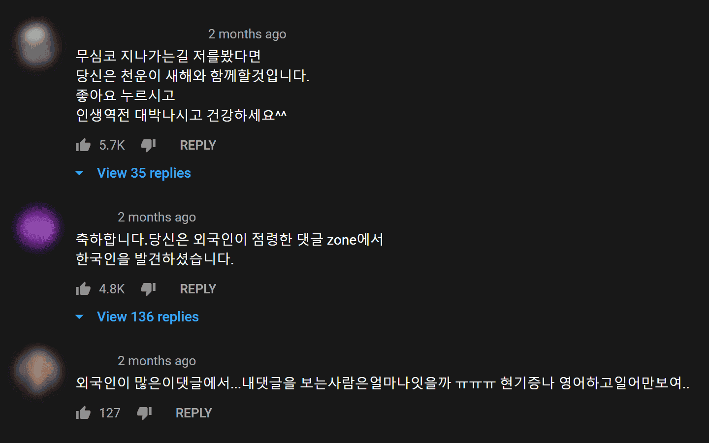

- This is a personal analysis and there is no way to verify this article until YouTube releases the source code. Please keep that in mind when reading this article.



YouTube does not have the ability to view comments based on language. This article tells the story of the development of "YouTube Comment Language Filter" from its alpha, beta, and general release versions.

- [anaclumos/youtube-comment-language-filter](https://github.com/anaclumos/youtube-comment-language-filter)
- [Chrome family installation links](https://chrome.google.com/webstore/detail/youtube-comment-language/pliobnchkbenbollnjaaojhbjkjgfkni) (Chrome, Brave, Naver Whale, Microsoft Edge)
- [Firefox family installation link](https://addons.mozilla.org/firefox/addon/yclf/)

## 0\. The idea

One day, out of frustration and curiosity, I decided to take a look at how YouTube's comment HTML is wrapped up. After entering various values in the `console`, I created a javascript file that removes all comments that contain Korean characters. My past experience with [a project called HangulBreak.py about Hangul and Unicode conventions](https://github.com/anaclumos/hangulbreak) was helpful.

🧼 Initial filter script. The idea is to remove YouTube comments if they don't contain Hangul. It's also stored in the [first commit of the GitHub repository](https://github.com/anaclumos/youtube-comment-language-filter/commit/e976d6489e9f71aec470daddf0f37d938ebaebb1).

```js
var commentList = document.getElementsByTagName('ytd-comment-thread-renderer')
var comment

function containsUnicode(str, startUnicode, endUnicode) {
  for (var i = 0; i < str.length; i++) {
    if (startUnicode.charCodeAt(0) <= str.charCodeAt(i) && str.charCodeAt(i) <= endUnicode.charCodeAt(0)) {
      return true
    }
  }
  return false
}

for (var x = 0; x < commentList.length; x++) {
  comment = commentList[x].childNodes[1].childNodes[1].childNodes[3].childNodes[3].innerText
  if (containsUnicode(comment, '가', '힣')) {
    // comment = "한글임 \n" + comment;
  } else {
    // console.log(typeof commentList[x]);
    commentList[x].parentNode.removeChild(commentList[x])
  }
}

for (var x = 0; x < commentList.length; x++) {
  console.log(commentList[x].childNodes[1].childNodes[1].childNodes[3].childNodes[1].innerText)
  // The author's name and date of creation are concatenated together. "Name\nDate Created"

  console.log(commentList[x].childNodes[1].childNodes[1].childNodes[3].childNodes[3].innerText)
  // Comment!
}
// End of code

/* Notes: This is initial code, and while it works in some cases.
 * there are a number of errors and performance issues.
 * The code, which has been debugged and improved, is uploaded to GitHub.
 */
```

At this point, I thought I could grow this code into a project. However, there were a few problems with this script.

- First, I had to paste the code from the console, which made it difficult and inconvenient for others to use.
- It didn't run automatically, so I had to re-run it in the console when the comments reloaded.
- Since it could only filter out Korean characters, it was very limited in use, and it was slow to run.

Solving these problems became a natural development goal. I thought it would be most convenient to create a Chrome extension first.

- Edge and Whale are also Chromium-based, and Firefox add-ons can be created as Chrome extensions.
- Safari doesn't play YouTube 4K videos, so many Safari users also use Chromium to view YouTube.
- Internet Explorer has lost support for YouTube.

I also felt that to make it easier for non-computer savvy people to use, it should be located between the video and the comment, "just like YouTube does," so that users can move their mouse cursor from the video to the comment and use it naturally. So I didn't want a Chrome extension, I wanted to embed the menu directly into the YouTube screen itself.


Now, the goal became concrete.

- This Chrome extension would insert a language control interface between the video and the comments.
- The interface will allow all comments to be filtered automatically. It will continue to work even when more comments are loaded.
- It should be scalable so that adding new languages is not a major challenge.
- It should be reasonably fast.

### See also: versioning

Different people and organizations have different ways of assigning version numbers. For the purposes of this article, we'll use the following categorization

- The first digit indicates a major update.
- The first decimal point indicates the addition of a feature, the second decimal point indicates a bug fix.
- The third decimal point is used for re-uploads to the store without any code modifications.

| Name     | Version | Description                                                                                    |
| -------- | ------- | ---------------------------------------------------------------------------------------------- |
| Alpha    | 0.1+    | Minimal functionality, released to a small number of people for feedback                       |
| Beta     | 0.9+    | Most of the original concept implemented, distributed to a large number of people for feedback |
| Official | 1+      | Continuous improvement, distributed to anyone with feedback                                    |

## 1\. Alpha versions should be released as soon as possible

To create an alpha (or more precisely, a [Minimum Viable Product](https://en.wikipedia.org/wiki/Minimum_viable_product)), a minimum of basic functionality must be working. More specifically, the following goals had to be achieved

1. automatically redo comments on every new load.
2. be able to see the full comment again at any time.
3. allow for a one-click installation.

The first question was, "How do we make it happen automatically?".

### Method 1. Time-based autoplay

I thought it would be a waste of performance for people who just watch YouTube videos as soon as they turn them on. At the same time, I didn't want to make it so long between replays that it would be annoying to read the comments. This was the first option I thought of, but the first one I discarded.

### Method 2. Detect YouTube's loading icon

YouTube's loading icon

When I checked, the `<can-show-more>` tag appeared and disappeared under the comment whenever the loading icon appeared, so I thought I could catch the moment when YouTube's [**obfuscated**](<https://en.wikipedia.org/wiki/Obfuscation_(software)>) javascript code inserted the `<can-show-more>` tag and re-run the filter accordingly.


### Method 3. MutationObserver

Then I discovered MutationObserver in JavaScript. The idea is to set a `target` to observe and a `config` to observe, and then run a `callback` function when a change occurs that meets the `config`. I used the YouTube comment HTML as the `target` and made it react to changes in the `childNodes` and `attributes` in the HTML. Just as we wanted, it was re-run every time the comment loaded. Problem solved.

However, performance dropped significantly. First, I realized that `console.log` was running tens of thousands of times, so I cleared it, and it became usably fast. To speed things up a bit, instead of testing the language of the comment each time, I wrapped the comment with `display:none;` and recorded the result in an HTML tag. When I clicked the button to view the full comment, it would remove the `display:none;`, and when I ran it again, it would only use the tags I had recorded. Solution 2. (I didn't realize this until later, but it wasn't a complete solution. This way of utilizing annotations didn't improve speed much and created more problems. See YouTube's SPA-ness during beta #2.)

I spent the next three days learning about the structure of Chrome Extensions and porting my existing code within the framework of Chrome Extensions. I used the official documentation, stack overflow, and a Udemy course on Chrome extensions as my main sources. Solution 3.

### Finish the alpha version


We started development on March 6, 2020, and finished the first alpha version on March 11. We shared the alpha with a small group of testers and spent about a week collecting user reviews and researching improvements and bugs.


## 2\. Beta version

We found and improved several problems in the alpha version.

### ① YouTube's Lazy Loading Issue

YouTube lazily loads content. [Lazy loading](https://en.wikipedia.org/wiki/Lazy_loading) refers to the practice of waiting and fetching information when it's needed, rather than loading everything at once. Lazy loading is usually applied to large images, but YouTube has taken it a step further and lazily loads the HTML itself! (I don't know if that's accurate, but that's what I saw at the time of development).

When you first land on a video page, the HTML for the comment interface doesn't exist. When the user starts scrolling to view the comments, a gray loading icon appears and loads the comment HTML. (Why? Because it saves querying the comment DB. Seems like a clever solution.) Since the comment HTML doesn't exist at the `document_end` of the extension, the extension throws an error and exits shortly after.


### Solution.

Although YouTube's Lazy Loading prevented me from seeing the content of the comments, I was able to insert a filter menu into the comment window itself and it worked fine. Fortunately, the comment box was loading shortly after the document loaded (at `document_end`), so I set it to rescan the comment box for an `Xpath` every 0.5 seconds if the comment HTML didn't exist.

This may seem a bit puzzling, as I had previously ruled out retrying at regular intervals as a waste of computation. In the previous case, the timer would loop indefinitely because it was re-checking the comments after a certain amount of time, whereas in this case, it only retries until the comments window loads. In practice, this workaround terminates normally after one or two retries. If it takes longer than that, your internet is too slow to view YouTube itself.


Secondary bugs have since emerged. Because I wasn't very good with JavaScript, I didn't know how to efficiently retry certain functions after a certain amount of time. YouTube would sometimes load infinitely when accessed by video URL or directly from search results. It turned out that we needed to make the JS retry after a certain amount of time, but by making it wait for a certain amount of time, we were preventing other JS from running. This bug can also be found in [GitHub Issue #4](https://github.com/anaclumos/youtube-comment-language-filter/issues/4) and was finally fixed in v1.1.4. (The bug showed up about once in 20 times, and it was harder to reproduce the error situation than to find the bug in the error situation.)

### ② YouTube's HTML component recycling issue

In order for the Chrome extension to access your website and make changes, you need to write all the addresses that the extension will access in the `manifest.json`. Initially, I used `https://*.youtube.com/watch*` because I thought it would only need to run on the video page. However, I ran into a problem when I tried to access the video from the YouTube home screen.

YouTube reuses a lot of components from HTML. If you've ever watched a YouTube video and pressed the `i` button to launch the miniplayer, you'll recognize this. YouTube doesn't actually take you to the video page, it just (1) covers the existing screen, (2) puts a new page on top, and (3) replaces the address in the web address bar. So naturally, when you press the `i` button to open the miniplayer, you'll see the same window you saw before playing the video.

However, using `https://*.youtube.com/*` in the `manifest.json` caused the filter menu to be inserted in the wrong place, even on pages without a comment box.


Also, on video pages, even if the filter menu was inserted correctly, if you navigated to another video with the filter enabled, it would sometimes filter the "current video's comments" based on the "previous video's comment language". This also seemed to be caused by YouTube's recycling of the comment component. I mentioned earlier that I was jotting down the results in the comment HTML to speed things up, but this also scrambled the results and made the error bigger.

### Solution

The extension monitors website access. Be prepared to insert a filter if the domain being accessed is YouTube, or manually inspect the domain on a case-by-case basis and insert a filter if it's youtube.com/watch.


In this case, we need the "Can read user's history" permission when installing the extension. For this reason, I've included a note about the permissions used in the corresponding [commit](https://github.com/anaclumos/youtube-comment-language-filter/commit/ce34e2540ffa4aa70ddd463aed6d35ca7e2ae1cd) and [installation completion page](https://chosunghyun.com/youtube-comment-language-filter/). As you can see from the [GitHub open source](https://github.com/anaclumos/youtube-comment-language-filter), the browsing history is not sent externally.

I also set it up so that when you navigate to a new page with filters on, it will (1) reset all filters and filter results, (2) reload the comments on the new page, and (3) wait.

Sometimes the problem would reappear. However, this seems to be more of a YouTube bug. Even without this extension, YouTube's web commenting system is notoriously buggy, with incorrect comments appearing and comments on videos getting mixed up. In this case, a refresh should fix it.

### ③ Speed issues

In the alpha version, the performance of the filter was very bad, but by removing all `console.log`, there was a significant speed improvement. As long as the filter is faster than the time it takes for users to read comments, it's not unusable, so I prioritized fixing the above issues over speed improvement, but later I realized that this is the problem.

```js
for (var comment of commentList) {
  if (comment.id === '') {
    var commentString =
      comment.childNodes[1].childNodes[1].childNodes[1].childNodes[3].childNodes[3].childNodes[1].innerText
    if (containsSelectedLang(commentString)) {
      comment.id = 'contains-SelectedLang'
    } else {
      comment.id = 'no-SelectedLang'
    }
  }
  if (comment.id === 'no-SelectedLang') {
    comment.style = 'display: none'
  }
}
```

The `comment` address in `commentString` doesn't currently work because it has changed several times with YouTube's updates.

### Solution...?

We haven't completely fixed it yet. For now, we've modified v1.2 to use the names of the characters rather than the names of the languages to make the characterization more explicit. There are plans to eventually include a natural language processing module. However, due to a policy issue with Chrome Extensions, this would require us to break a significant portion of our code, so we're working on it.

## 3\. Full version

While there are no performance or functionality improvements to the filter itself, we have made usability improvements to the extension. We've built a settings window to hide unused languages and created a [landing page](https://chosunghyun.com/youtube-comment-language-filter) that opens immediately after installation. We've also created a short guide for reporting bugs. I also redid the promo image.


I did a small experiment a while back, and the difference between the number of people who came in with and without the promo image was about 4x.

Finally, I ported the Chrome extension to Firefox as a Firefox add-on. I covered this in my previous article _Porting a Chrome Extension to Firefox Add-on_ (https://blog.chosunghyun.com/porting-a-chrome-extension-to-firefox-add-on/).

## Overall thoughts on v1

My goal in releasing v1 was to create a deliverable that I could use without thinking about it. If an extension breaks along the way and you start to care about it, it ruins the fun of watching YouTube.

But the current v1 doesn't break the fun. I can just use it without thinking about it and it works fine. ([_It just all... works!_](https://youtu.be/KTrO2wUxh0Q?t=229))


In addition, the original purpose of finding Korean comments works almost flawlessly. After all, Korean comments will have at least one Hangul character in them.

## In the future

I'm working on v2. The most popular feedback on v1 was "more styles" and "better language detection". A fundamental problem with Chrome extensions is that it is very complicated to add external files or modules from within the Chrome extension itself. Using the `npm` library is also cumbersome. The solution is to use something called [Webpack](https://webpack.js.org/), which requires a significant rewrite of the code. Nevertheless, I can think of a lot of fun ways to use it, so I'm working on v2.

There's also talk that YouTube is experimenting with the percentage of foreigners viewing Korean videos by deliberately pushing Korean comments down in the comment rankings, so I don't think this project will ever end.

Hence the title Part 1. Someday, if v2 is completed, or if something happens that deserves to be remembered, you'll see part 2 of this post.
