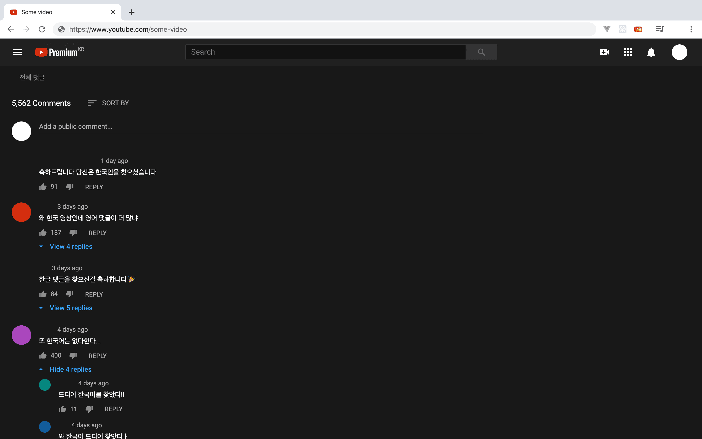
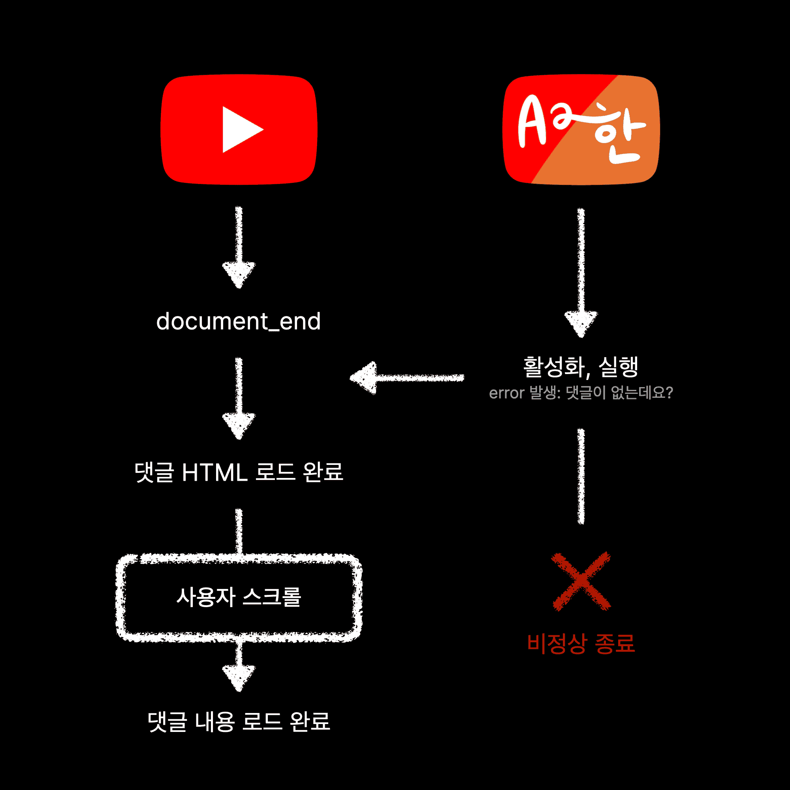
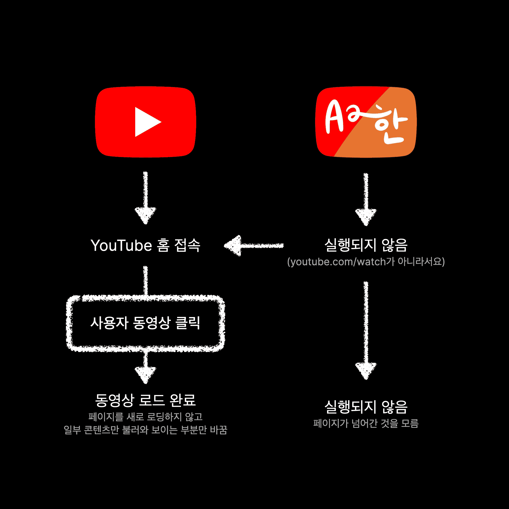
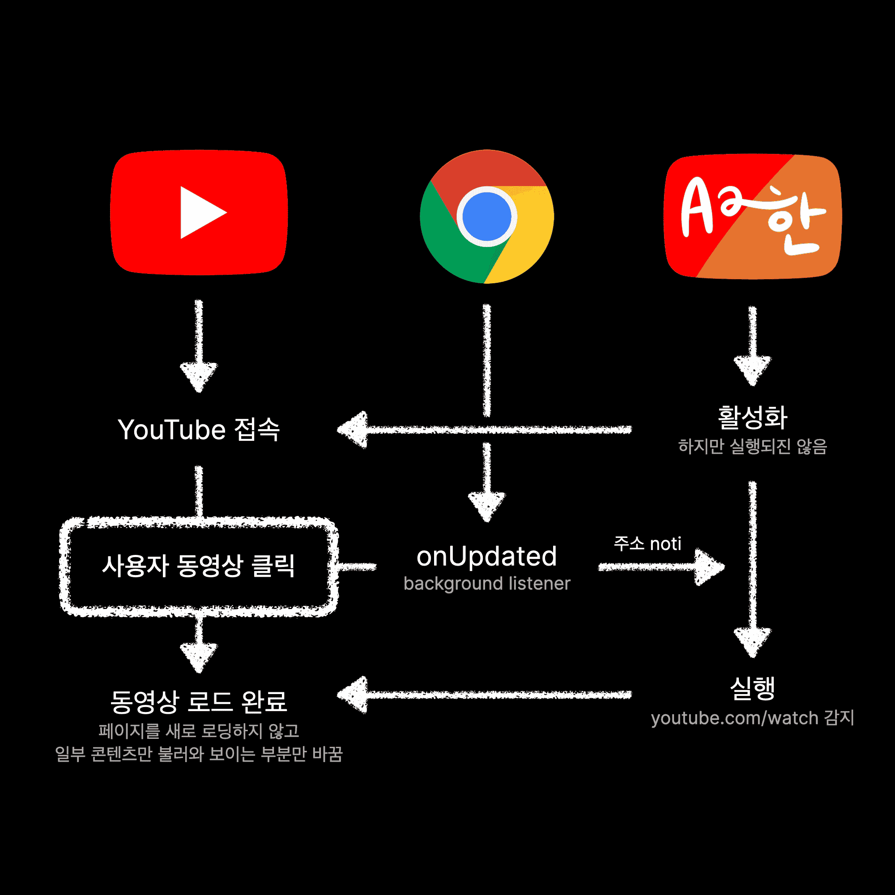
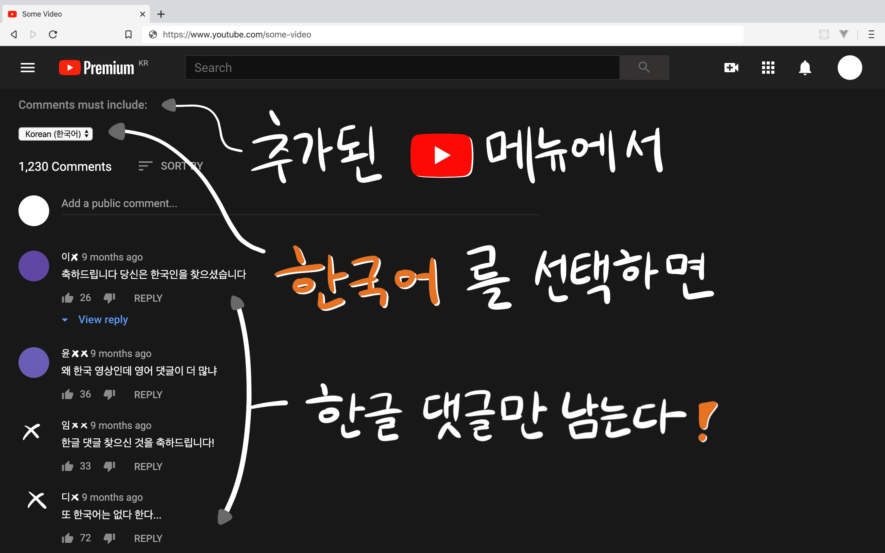

- 이 글은 개인적인 분석이며 YouTube가 소스 코드를 공개하기 전까지는 이 글을 검증할 방법이 없습니다. 이 점 유념하시고 글을 읽어주시기 바랍니다.


YouTube는 언어를 기준으로 댓글을 보는 기능이 없다. 이 글은 그 불편함을 조금이나마 해소하기 위해 개발한 "YouTube 댓글 언어 필터"의 알파, 베타, 그리고 정식 출시 버전까지의 개발 이야기를 담았다.

[anaclumos/youtube-comment-language-filter](https://github.com/anaclumos/youtube-comment-language-filter)

- [Chrome 계열 설치 링크](https://chrome.google.com/webstore/detail/youtube-comment-language/pliobnchkbenbollnjaaojhbjkjgfkni) (Chrome, Brave, Naver Whale, Microsoft Edge)
- [Firefox 계열 설치 링크](https://addons.mozilla.org/firefox/addon/yclf/)

---

## 0\. 구상

하루는 불편함을 느끼던 와중 호기심이 들어 YouTube의 댓글 HTML이 어떻게 묶여있는지 뜯어보았다. `console`에서 이런저런 값들을 입력해보다가 한글이 포함된 댓글만 남기고 싹 지워주는 자바스크립트 파일을 만들었다. 과거 [한글과 유니코드 규칙에 관련된 한글깨기.py라는 프로젝트](https://github.com/anaclumos/hangulbreak)를 진행했던 경험이 도움이 됐다.

🧼 초기 필터 스크립트. YouTube 댓글에서 한글이 포함되어 있지 않으면 그 댓글을 지워버리는 원리이다. [GitHub 저장소의 첫 커밋](https://github.com/anaclumos/youtube-comment-language-filter/commit/e976d6489e9f71aec470daddf0f37d938ebaebb1)에도 저장되어 있다.

```js
var commentList = document.getElementsByTagName('ytd-comment-thread-renderer')
var comment

function containsUnicode(str, startUnicode, endUnicode) {
  for (var i = 0; i < str.length; i++) {
    if (startUnicode.charCodeAt(0) <= str.charCodeAt(i) && str.charCodeAt(i) <= endUnicode.charCodeAt(0)) {
      return true
    }
  }
  return false
}

for (var x = 0; x < commentList.length; x++) {
  comment = commentList[x].childNodes[1].childNodes[1].childNodes[3].childNodes[3].innerText
  if (containsUnicode(comment, '가', '힣')) {
    // comment = "한글임 \n" + comment;
  } else {
    // console.log(typeof commentList[x]);
    commentList[x].parentNode.removeChild(commentList[x])
    x--
  }
}

for (var x = 0; x < commentList.length; x++) {
  console.log(commentList[x].childNodes[1].childNodes[1].childNodes[3].childNodes[1].innerText)
  // 작성자 이름과 작성날짜가 같이 묶여있다. "이름\n작성날짜"

  console.log(commentList[x].childNodes[1].childNodes[1].childNodes[3].childNodes[3].innerText)
  // 댓글!
}
// End of code

/* 참고: 이 코드는 초기 코드이며, 일부 경우에서는 정상 동작하지만
 * 여러 에러가 발생하며 성능 저하 문제가 있었다.
 * 디버깅과 성능 개선 작업이 진행된 코드는 GitHub에 업로드되어 있다.
 */
```

이때 이 코드를 프로젝트로 키울 수 있겠다고 생각했다. 하지만 이 스크립트는 몇 가지 문제점이 있었다.

- 우선 콘솔에서 코드를 붙여 넣어야 하니 다른 사람들이 쓰기 어렵고 불편했다.
- 자동적으로 실행되지 않았기에 댓글이 새로 로딩되면 콘솔에서 다시 실행해야 했다.
- 한글만 걸러낼 수 있다는 점에서 용도가 무척 제한적이었고, 실행 속도가 느렸다.

이 문제점들을 해결하는 것이 자연스러운 개발 목표가 되었다. 우선 크롬 익스텐션을 만드는 것이 가장 편리할 것이라 생각했다.

- 엣지나 웨일도 크로미움 기반이며 파이어폭스 애드온도 크롬 익스텐션으로 만들 수 있다.
- 사파리는 YouTube 4K 동영상 재생이 안 되기 때문에 사파리 사용자들도 YouTube를 볼 때 크로미움을 쓰는 경우가 많다.
- 인터넷 익스플로러는 YouTube 지원이 끊겼다.

또한 컴퓨터를 잘 모르는 사람들도 사용하기 편하려면 "YouTube의 기능인 것처럼" 동영상과 댓글 사이 위치해 있어야 한다고 생각했다. 그래야만 사용자가 마우스 커서를 동영상에서 댓글로 옮겨가면서 자연스럽게 사용할 수 있다. 그래서 크롬 익스텐션에는 별다른 기능이 없고 YouTube 화면 자체에 직접 메뉴를 삽입하도록 만들고 싶었다.


이제 목표가 구체화되었다.

- 이 크롬 익스텐션은 동영상과 댓글 사이에 언어를 컨트롤하는 인터페이스를 삽입할 것이다.
- 그 인터페이스를 통해 모든 댓글이 자동적으로 필터링할 수 있을 것이다. 댓글을 더 불러와도 계속 그대로 작동할 것이다.
- 새로운 언어를 추가할 때 큰 어려움이 없도록 확장성을 갖춰야 한다.
- 납득할 수 있을 정도로 빨라야 한다.

### 참고: versioning

버전 숫자를 부여하는 방식은 사람마다, 단체마다 다르다. 이 글에서는 다음과 같은 분류를 따른다.

- 일의 자리는 메이저 업데이트를 뜻한다.
- 첫 번째 소수점은 기능의 추가, 두 번째 소수점은 버그 수정을 뜻한다.
- 세 번째 소수점은 코드 상의 수정 없이 스토어에 재업로드를 할 때 사용한다.

| 이름 | 버전 | 설명                                        |
| ---- | ---- | ------------------------------------------- |
| 알파 | 0.1+ | 최소한의 기능, 소수에게 배포/피드백         |
| 베타 | 0.9+ | 최초 구상 대부분 구현, 다수에게 배포/피드백 |
| 정식 | 1+   | 지속적 개선, 누구에게나 배포/피드백         |

## 1\. 알파 버전은 최대한 빨리

알파 버전(더 정확하게는 [Minimum Viable Product](https://en.wikipedia.org/wiki/Minimum_viable_product))을 만들기 위해서는 최소한의 기본적인 기능이 동작해야 한다. 더 구체적으로는 다음 목표가 달성되어야 했다.

1.  댓글이 새로 로딩될 때마다 자동적으로 재실행되어야 한다.
2.  언제든지 다시 전체 댓글을 볼 수 있어야 한다.
3.  원클릭 설치를 할 수 있어야 한다.

가장 먼저 "어떻게 자동적으로 재실행되게 만들 것인가"를 고민했다.

### 방법 1. 시간 기반 자동 재실행

하지만 YouTube 동영상을 켜자마자 동영상만 감상하는 사람들에게는 성능의 낭비일 것 같았다. 그렇다고 재실행 간격이 너무 길면 댓글을 읽을 때 불편함이 생길 것이다. 가장 먼저 떠올렸지만 가장 먼저 접은 방법이다.

### 방법 2. YouTube의 로딩 아이콘 감지

YouTube의 로딩 아이콘

확인해보니 로딩 아이콘이 생길 때마다 댓글 아래에 `<can-show-more>` 태그가 나타났다 사라졌다. 즉 [**난독화**](<https://en.wikipedia.org/wiki/Obfuscation_(software)>)된 YouTube의 자바스크립트 코드가 `<can-show-more>` 태그를 삽입하는 순간을 포착하여 같이 필터가 재실행되도록 하면 될 것 같다는 생각이 들었다.


### 방법 3. MutationObserver

이후 자바스크립트의 `MutationObserver`를 알게 되었다. 관찰 대상인 `target`과 관찰 조건인 `config`를 설정한 후 `config`에 맞는 변경 사항이 일어나면 `callback` 함수를 실행하는 것이었다. YouTube 댓글 HTML을 `target`으로 삼았고, HTML 내의 `childNodes`와 `attributes`의 변경에 반응하도록 했다. 원했던 대로 댓글이 로딩될 때마다 재실행되었다. 1번 해결.

하지만 성능이 크게 떨어졌다. 우선 `console.log`가 수만 번 실행된다는 것을 확인하고 이를 지우니 쓸만할 정도로 빨라졌다. 속도를 조금이나마 개선하기 위해 매번 댓글의 언어 테스트를 진행하는 대신 댓글을 `display:none;`으로 가리고 HTML 태그로 판정 결과를 기록해놓는 방법을 사용했다. 전체 댓글을 보는 버튼을 클릭하면 `display:none;`을 없애도록 했다. 그러다가 다시 재실행하면 앞서 기록해둔 태그만으로 판단했다. 2번 해결. (나중에야 알았지만 온전한 해결이 안 되었다. 이렇게 annotation을 활용하는 방법은 속도를 별로 개선하지 않았고 문제만 더 만들었다. 베타 버전 중 2번 YouTube의 SPA스러움 참고.)

이후 3일 동안 크롬 익스텐션의 구조에 대해서 배우면서 크롬 익스텐션의 틀 안에 기존 코드를 이식하는 작업을 했다. 크롬 익스텐션의 공식 문서, 스택 오버플로, 그리고 크롬 익스텐션에 대한 Udemy 강의를 주로 참고했다. 3번 해결.

### 알파 버전 완성


이렇게 2020년 3월 6일부터 개발을 시작해서 3월 11일에 첫 알파 버전 개발이 끝났다. 소규모의 테스터들에게 알파 버전을 공유했으며 약 일주일 동안 사용자 리뷰를 수집하면서 개선점과 버그를 연구했다.



## 2\. 베타 버전

알파 버전에서 여러 문제점을 찾아 개선했다.

### ① YouTube의 Lazy Loading 문제

YouTube는 콘텐츠를 Lazy Load 한다. [Lazy Loading](https://en.wikipedia.org/wiki/Lazy_loading)은 모든 정보를 한 번에 불러오지 않고 기다리다, 정보가 필요할 때 정보를 불러오는 방법을 뜻한다. Lazy Loading은 용량이 큰 이미지에 주로 적용하지만, YouTube는 한 발 더 나아가 HTML 자체를 Lazy Load 했다! (정확한지는 모르겠지만 개발 당시 그렇게 확인했다.)

동영상 페이지에 처음 들어올 때 댓글 인터페이스에 해당하는 HTML은 존재하지 않는다. 사용자가 댓글을 보려 스크롤을 시작하면 그제서야 회색 로딩 아이콘이 보이면서 댓글 HTML을 불러온다. (왜? 그래야 댓글 DB 쿼리를 줄일 수 있기 때문에. 영리한 해결책 같았다.) 즉 익스텐션이 실행되는 `document_end` 시점에는 댓글 HTML이 존재하지 않기 때문에 익스텐션이 오류를 낸 뒤 곧바로 종료되었다.



### 해결책

YouTube의 Lazy Loading으로 댓글의 내용은 보이지 않더라도 댓글 창 자체에 필터 메뉴를 삽입해 놓으면 정상적으로 사용이 가능했다. 다행히도 댓글 창은 도큐먼트가 로딩이 된 후 (`document_end` 시점) 잠시 뒤 곧바로 로딩이 되었다. 때문에 댓글 HTML이 존재하지 않을 경우 0.5초마다 댓글 창을 `Xpath`로 재검색하도록 설정했다.

앞서 일정한 시간마다 재시도하는 것은 연산 낭비라서 배제했기에 조금 의아할 것 같다. 앞의 경우는 일정 시간마다 댓글을 재검사하는 것이기에 타이머가 무한히 반복되는 반면 이 경우는 댓글 창이 로딩될 때까지만 재시도한다. 실제로 이 해결책은 1~2차례 재시도에 정상적으로 종료된다. 그보다 더 오래 걸리면 YouTube 자체를 못 볼 정도로 인터넷이 느린 것이다.


이후 부차적인 버그들이 발생했다. 자바스크립트를 능숙하게 다루지 못했기에 특정 함수를 일정 시간 뒤에 효율적으로 재시도하는 방법을 몰랐기 때문이다. 동영상 URL로 접근하거나 검색 결과에서 YouTube 동영상으로 곧바로 접근하면 YouTube가 무한 로딩되는 버그가 간혹 발생했다. 이유를 알고 보니 JS를 일정 시간 뒤에 재시도하도록 만들어야 하는데 일정 시간을 기다리도록 만들면서 다른 JS의 실행을 막았기 때문이었다. 이 버그는 [GitHub Issue #4](https://github.com/anaclumos/youtube-comment-language-filter/issues/4)에서도 확인할 수 있으며 v1.1.4에서 최종적으로 수정되었다. (버그가 20번에 한번 꼴로 나타났다. 오류 상황에서 버그를 찾는 것보다 오류 상황 자체를 재현하는 것이 더 어려웠다.)

### ② YouTube의 HTML 컴포넌트 재활용 문제

크롬 익스텐션이 웹사이트에 접근하여 내용을 변경하기 위해선 `manifest.json`에 익스텐션이 접근할 주소를 모두 작성해야 한다. 처음에는 동영상 페이지에서만 실행되면 될 것이라 생각했기에 `https://*.youtube.com/watch*`를 사용했다. 하지만 YouTube 홈 화면으로 들어와 동영상으로 접근할 경우에 문제가 생겼다.

YouTube는 HTML의 컴포넌트를 다수 **재활용한다**. YouTube 동영상을 보다가 `i` 버튼을 눌러 미니플레이어를 실행해본 적이 있다면 눈치챌 수 있을 것이다. YouTube는 동영상 페이지로 **이동**하는 것이 아니라, 단지 ① 기존 화면을 가리고 ② 새 페이지를 위에 띄운 뒤 ③ 웹 주소창의 주소만 바꾸어 놓는 것이다. 그러니 당연히 `i` 버튼을 눌러 미니플레이어를 띄우면 동영상을 재생하기 전에 본 창이 그대로 다시 나타나는 것이다.

그렇다고 `manifest.json`에 `https://*.youtube.com/*`를 사용하면 댓글 창이 없는 페이지에서도 엉뚱한 곳에 필터 메뉴가 삽입되었다.



또한 동영상 페이지에서 정상적으로 필터 메뉴가 삽입되었더라도 필터를 켠 채 다른 동영상으로 이동하게 되면 "이전 동영상의 댓글의 언어"에 맞추어 "현재 동영상의 댓글"을 필터링하는 경우도 간혹 발생했다. 이 또한 YouTube의 댓글 컴포넌트 재활용 때문에 발생한 문제 같았다. 아까 속도 개선을 위해 댓글 HTML에 결과를 메모해두었다고 했는데 이 결과 또한 뒤죽박죽 섞여 오류를 더 크게 만들었다.

### 해결책

익스텐션이 웹사이트 접속을 모니터링한다. 접속하는 도메인이 YouTube라면 필터를 삽입할 준비를 하고, 도메인을 그때그때 수동으로 검사하여 youtube.com/watch라면 그때 필터를 삽입한다.



이 경우 익스텐션을 설치할 때 "사용자의 방문 기록을 읽을 수 있음" 권한이 필요하다. 이 때문에 해당 [커밋](https://github.com/anaclumos/youtube-comment-language-filter/commit/ce34e2540ffa4aa70ddd463aed6d35ca7e2ae1cd)과 [설치 완료 페이지](https://chosunghyun.com/youtube-comment-language-filter/)에 사용하는 권한에 대해서 설명을 적어두었다. [GitHub 오픈 소스](https://github.com/anaclumos/youtube-comment-language-filter)를 보면 알겠지만 방문 기록은 외부로 전송되지 않는다.

또한 필터를 켠 채 페이지가 넘어갈 때도 정상적으로 필터링 될 수 있도록 ① 페이지가 넘어가면 ② 모든 필터와 필터 결과를 초기화하고 ③ 이동한 페이지의 댓글을 새로 불러와 ④ 대기할 수 있도록 설정해 주었다.

가끔 문제가 재발하긴 한다. 하지만 이는 오히려 YouTube 자체의 버그인 것 같았다. 이 익스텐션을 사용하지 않아도 YouTube 웹의 댓글 시스템은 잘못된 댓글이 나타나거나 영상의 댓글이 서로 섞이는 등 다양한 버그로 악명이 높다. 이 경우 새로 고침을 하면 해결된다.

### ③ 속도에 관한 문제

알파 버전에서 필터 성능이 무척 안 좋았다가 `console.log`를 모두 제거하는 것만으로 유의미한 속도 개선이 있었다고 했다. 사용자가 댓글을 읽는 시간보다만 필터 속도가 빠르면 사용에 무리가 없었기에 속도 개선보다 위의 문제들을 고치는 것이 우선이었는데, 나중에 확인하니 이런 문제였다.

```js
for (var comment of commentList) {
  if (comment.id === '') {
    var commentString = comment.childNodes[1].childNodes[1].childNodes[3].childNodes[3].childNodes[1].innerText
    if (containsSelectedLang(commentString)) {
      comment.id = 'contains-SelectedLang'
    } else {
      comment.id = 'no-SelectedLang'
    }
  }
  if (comment.id === 'no-SelectedLang') {
    comment.style = 'display: none'
  }
}
```

`commentString`의 `comment` 주소는 YouTube의 업데이트로 몇 차례 바뀌었기에 현재 작동하지 않는다.

### 해결책

문제점은 첫 줄의 `var comment of commentList`이다. 예를 들어 80개의 댓글에 대한 검사를 마쳤고 20개의 댓글을 새로 로딩했다고 할 때 위 코드를 사용하면 기존 80개 댓글도 다시 불러와 재검사한다. 어디까지 검사했는지 확인하는 변수를 추가해서 성능을 개선할 수 있었다.

```js
var commentNum = 0
var shownCommentNum = 0
// ...
for (var i = commentNum; i < commentList.length; i++) {
  commentNum++
  CLFFooter.textContent = commentNum + ' comments analyzed, ' + shownCommentNum + ' comments shown.'
  var commentString = commentList[i].childNodes[2].childNodes[2].childNodes[3].childNodes[3].innerText
  if (!containsSelectedLang(commentString, StartCharset, EndCharset)) {
    commentList[i].style = 'display: none'
  } else {
    shownCommentNum++
  }
}
```

방금 코드와 약간의 디테일이 다르다. 여기서는 다른 부분보다 네 번째 줄의 `for` 구조 변경이 제일 중요하다.

기존에 사용하던 annotation을 이용한 속도 개선 코드는 YouTube에서 동영상을 넘나들 때 오류를 일으키는 바람에 전부 삭제했다. 위와 같은 방법으로 속도를 개선하고 나니 불편함 없이 사용 가능했다.

### HTML 버튼의 속도 문제

또한 알파 버전에서는 버튼을 활용했는데, 이를 `HTML Select`로 변경했다. 이는 다국어 지원의 기반을 마련하기 위함뿐만 아니라 버튼의 느린 반응 속도에 대한 해결책이었다. 기존의 버튼을 클릭하면 실제 실행이 될 때까지 약 0.2초가량의 연산 시간이 있었다. 이 짧은 시간 동안 버튼을 연타하게 되면 반복적으로 필터가 꺼졌다 켜지는 바람에 YouTube가 멈추는 문제가 있었다. `HTML Select`를 활용하게 되면 **연타**가 불가능해지며 0.2초 안에 `Select` Value를 여러 차례 바꾸는 것은 어려우므로 **UI 적인 해결책**을 제시했다고 생각한다.

### ④ 글자 판별의 신뢰성에 관한 문제

엄밀하게 이야기할 때 이 익스텐션은 언어 판별이 아닌 글자 판별을 사용한다. 한글 밖에 판별하지 못한다는 단점을 개선하기 위해 베타 버전에서 유니코드 영역으로 글자 구별이 쉬운 [CJK](https://en.wikipedia.org/wiki/CJK_characters) (한자, 가나, 한글) 문자를 추가했다. 이 부분은 정말 중국인과 일본인이 사용할 수 있도록 만들었다기보다는 판별 언어를 추가할 수 있는지 그 확장성을 확인하기 위함이었다.

또한 "글자 집합 중 한 글자라도 포함하면 통과"라는 규칙을 적용하고 있기 때문에 글자 판별에 오류가 잦게 발생한다. 예를 들어...

> **I like the performance! This video is 최고!**

...와 같은 문장은 "영어"로 판별되어야 하나, "한국어"와 "영어"로 동시에 판별된다. 때문에 이름 등의 고유명사가 지속적으로 사용되는 경우 적당하게 필터가 되지 않는 문제가 발생한다. 한글 문장에 영단어 한 글자라도 포함되면 영어로 판별되고, 일본어 문장에 한자가 한 글자라도 있으면 중국어로 판별되는 문제가 있다.

### 해결책..?

아직 완벽하게 고치지 못했다. 일단 글자 판별이라는 특징을 보다 명확히 나타내기 위해 v1.2에서는 언어의 이름이 아닌 글자의 이름을 사용하도록 수정하였다. 궁극적으로 **자연어 처리 모듈**을 탑재할 계획이 있다. 하지만 크롬 익스텐션의 정책 문제로 이런 모듈을 사용하려면 지금 코드의 상당 부분을 뜯어고쳐야 하는 문제가 생겨 이를 연구하는 중이다.

## 3\. 정식 버전

필터 그 자체의 성능이나 기능의 개선은 없지만 익스텐션 부분에서 사용성을 개선했다. 설정 창을 제작하여 사용하지 않는 언어들을 감출 수 있도록 하였으며 설치 직후 열릴 [랜딩 페이지](https://chosunghyun.com/youtube-comment-language-filter)를 만들었다. 버그 제보를 위한 간단한 안내문도 제작해두었다. 프로모션 이미지도 다시 제작했다.



예전에 작은 실험을 해보았는데, 프로모션 이미지가 있을 때와 없을 때 유입 관객 수는 약 4배 정도 차이가 났다.

마지막으로 크롬 익스텐션을 파이어폭스 애드온으로 이식했다. 이 부분에 대해서는 [이전에 작성한 _Porting a Chrome Extension to Firefox Add-on_ 글](https://blog.chosunghyun.com/porting-a-chrome-extension-to-firefox-add-on/)에서 한 차례 다룬 적이 있다.

## v1에 대한 총평

v1까지 출시를 하며 염두에 둔 것은 **아무 생각 없이 쓸 수 있는 결과물**을 만드는 것이었다. 익스텐션이 도중에 버그를 일으켜서 오히려 익스텐션에 신경을 쓰기 시작하면 YouTube 보는 흥이 다 깨져버린다.

하지만 지금의 v1은 흥을 깨뜨리지 않는다. 그냥 아무 생각 없이 막 써도 잘 작동한다. ([_It just all... works!_](https://youtu.be/KTrO2wUxh0Q?t=229))


더불어서 최초 목적이었던 **한국어 댓글 찾기**는 흠잡을 곳 없이 거의 완벽하게 작동한다. 결국 한국어 댓글에는 한글이 한 글자라도 들어갈 테니까.

## 앞으로

v2를 개발하고 있다. v1에서 가장 많이 들어온 피드백은 "스타일의 추가"와 "언어 판별 개선"이다. 크롬 익스텐션의 근본적인 문제 때문에 크롬 익스텐션 자체에서 외부 파일이나 모듈을 추가하는 것이 매우 복잡하다. `npm` 라이브러리를 사용하는 것도 번거롭다. 이를 해결하기 위해서는 [Webpack](https://webpack.js.org/)이라는 것을 사용해야 하는데, 그를 위해서는 상당한 부분의 코드를 재작성해야 한다. 그럼에도 여러 가지 재미있는 활용 방향이 떠오르기 때문에 v2를 짬짬이 제작하고 있다.

YouTube에서 고의적으로 한글 댓글을 댓글 순위에서 낮추어 한국 영상의 외국인의 유입 비율을 실험하는 중이라는 이야기도 나오고 있기 때문에 절대 이 프로젝트가 여기서 끝날 것 같지 않다.

그래서 제목이 파트 1이다. 언젠가 v2가 완성되거나 마땅히 기억될 무슨 일이 생긴다면 이 글의 파트 2를 만날 수 있을 것이다.
