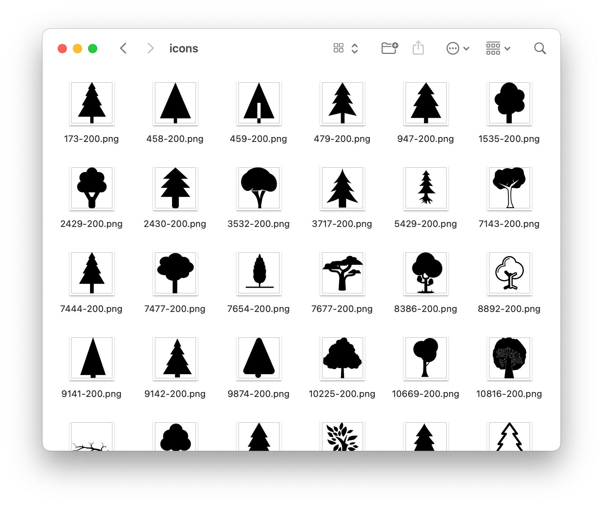

## Beware

이 도구를 사용하여 타인의 지적 재산권을 침해하지 마십시오. 이 코드와 The Noun Project API가 자신의 사용 용도에 적합한지 확인한 후에 사용하십시오. 또한 라이선스와 API 문서를 꼼꼼하게 검토하십시오. The Noun Project에서 허가하지 않는 사용 용도들은 [여기](https://api.thenounproject.com/getting_started.html#unacceptable-uses)에서 확인하실 수 있습니다. 또한 이 글과 이 글의 모든 코드는 MIT 라이선스임을 알려드립니다.

## 라이브러리 불러오기

```python
import requests
import os
from tqdm import tqdm
from requests_oauthlib import OAuth1
```

이 라이브러리들이 없다면 `pip3 download` 하여 사용하면 된다.

## `download` 함수

```python
def download(url, pathname):
    if not os.path.isdir(pathname):
        os.makedirs(pathname)
    response = requests.get(url, stream=True)
    file_size = int(response.headers.get("Content-Length", 0))
    filename = os.path.join(pathname, url.split("/")[-1])
    if filename.find("?") > 0:
        filename = filename.split("?")[0]
    progress = tqdm(
        response.iter_content(256),
        f"Downloading {filename}",
        total=file_size,
        unit="B",
        unit_scale=True,
        unit_divisor=1024,
    )
    with open(filename, "wb") as f:
        for data in progress:
            f.write(data)
            progress.update(len(data))
```

이 코드는 URL의 데이터를 불러와 `pathname`에 저장하는 역할을 한다.

## The Noun Project API

```python
# ---

DOWNLOAD_ITERATION = 3
# 1번에 아이콘을 50개씩 불러온다.
# 3번 실행하면 아이콘 150개를 불러온다.

SEARCH_KEY = "tree"  # 검색어
SAVE_LOCATION = "./icons" # 저장할 위치
auth = OAuth1("API_KEY", "API_SECRET")

# ---

for iteration in range(DOWNLOAD_ITERATION):
    endpoint = (
        "http://api.thenounproject.com/icons/"
        + SEARCH_KEY
        + "?offset="
        + str(iteration * 50)
    )
    response = requests.get(endpoint, auth=auth).json()
    for icon in response["icons"]:
        download(icon["preview_url"], SAVE_LOCATION)
```

보다 세부적인 기능은 이 [문서](https://api.thenounproject.com/documentation.html)를 참고하면 된다. API Key와 API Secret은 [여기](https://thenounproject.com/developers/apps/)에서 App을 등록하면 발급할 수 있다.

## 결과



다만 The Noun Project API는 API 호출 횟수에 제한이 있으니 이를 염두에 두고 활용하면 좋을 것 같다.
