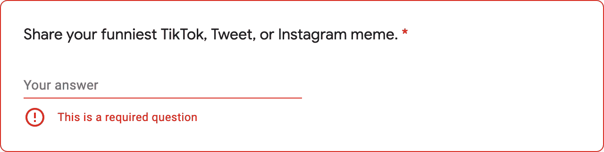

:::note
This document is machine-translated.
It is readable, but may contain awkward phrasing.
Please let me know if you find any errors!
:::

Recently, I applied for an on-campus technology start-up club, which has a very competitive rate (with a pass rate of around 5%), and I had the following question.



It was a club I had always wanted to join, so I had a lot of trouble. This is because everyone has different interests; what is funny to one group can be offensive to another.

Then, I thought, "What if I could create a service that recommends memes based on choices?" Because it is not a responsive recommendation system (a system that dynamically changes recommendations based on newly accumulated data), the technical complexity seemed not to be that high. But I just had a weekend, so I decided to make it quick.

## 🎬 Designing the System

First of all, I have listed the videos that I enjoyed watching. (I thought it would be okay to use YouTube instead of TikTok, Twitter, and Instagram.)


I've since broken it down by category on the Notion page. For example, it could be divided into Music, Movies, Games, Coding, and General memes.

As I envisioned the selection-based recommendation test, there seemed to be two approaches. One is a system that gives weight to each answer to a question, calculates a final score, and recommends results. The other is to set up the entire scenario tree and recommend results according to the combination of options. The popular MBTI results analysis uses the first score-based recommendation system. However, I used the second scenario tree-based recommendation system. Here's why:

The **score flag system** was too complex to configure.

- MBTI has a simple score flag. Since there are only four flags: `E/I`, `N/S`, `T/F`, and `J/P`, it is relatively convenient to manage the score status.
- I immediately had five categories: Music, Movies, Games, Coding, and General, and each type had various subcategories, so it wasn't easy to pinpoint the flags.
- For example, I cannot recommend LoL meme videos simply because the game flag score is high. Because you may not know the rules of the LoL, or you may not empathize with the laughter. In other words, to fix this, you need to either add a roll score flag or set a separate "favorite game" flag.
- In this case, state management becomes very complicated, and I didn't want to increase the technical difficulty.
- However, the design difficulty rises higher than the technical difficulty. Above all, I felt it was tough to elaborately plan which score range should be recommended for each flag. In other words, it is difficult to make a perfectly-fit meme recommendation based on the score.

I wanted to make **checking all endings** possible.

- In a choice-based game, you may want to see a different ending by changing only one final decision (especially these meme recommendations that are not just MBTI).
- But score-based systems usually require the test to be restarted from scratch and more engineering to add optional 'undo' actions.
- If you use the scenario tree base, this part becomes more convenient. This is because I need to navigate to the Parent Node.
- As will be described later, in my case, because I used Next Link, just going back in the browser becomes the undo action.

I wanted to include a **curated choice vocabulary** rather than a typical optional vocabulary.

- In a score-based system, you only ask questions and answers in a general form. That is, you cannot ask follow-up questions.
- I tried to use the Scenario Tree to make the question and the answer exactly fit each other, giving you an everyday experience.
- Also, as a result, this system is intended to be "attached to the club application".
- Even if you recommend a funny video, if you can't remember my name and only remember the Video, it serves no purpose!


## 🥞 Choosing the Stack

I didn't worry too much about the front end. Since I recently fell in love with TypeScript Next, it was a natural choice for me, and knowing Vercel's compatibility with Next, I decided to host it on Vercel. For the style, I used the styled component.

Where to store the data was a problem. Since the data about Meme is not dynamic and there is no need to store user information, I decided to hard-code all data modularly instead of using DB or DBaaS separately. [You can see the hardcoded data here](https://github.com/anaclumos/smile/tree/main/src/data).

The backend likewise didn't need to be configured. So I decided to make it serverless.

## 💻 Dev

It can be summarized as follows:

1. Each Question has a unique link for each question, and each Video has a special link, and when you select an option, you access that link.
2. Each option is in an Object with a 'next question' or 'result video' field, and an interface is constructed based on this.
3. Use `getStaticProps` and `getStaticPaths` to make responsiveness super fast.

### 🔗 1. Unique link structure

Each Question and Video has the following URI structure:

```bash
https://smile.cho.sh/question/[id]
https://smile.cho.sh/video/[id]
```

- Example
  - [https://smile.cho.sh/question/1](https://smile.cho.sh/question/1)
  - [https://smile.cho.sh/video/1](https://smile.cho.sh/video/1)

### 💬 2. Type Definitions

To take advantage of TypeScript, I have predefined the type structure.

```ts
export type question = {
  id: number
  contents: string[]
  answers: Answer[]
}

export type answer = {
  id: number
  content: string
  result: number | null
  nextQuestion: number | null
}

export type Video = {
  id: number
  title: string
  uploader: string
  desc: string
  youtubeId: string
}
```

In `type Answer`, `result`, and `nextQuestion` can have only one value. Links are created based on this. With these two separate fields, I was able to avoid the mistake of confusing `question` and `video`. I also wanted to avoid unintentional 'null' errors by defaulting to '0' when writing data. So you can check the traces at [/question/0](https://smile.cho.sh/question/0).

### 🚀 3. Making it Blazing Fast

For example, pages corresponding to `/question/[id]` are statically created at build time through the following code:

```ts
export const getStaticPaths: GetStaticPaths = async () => {
  const paths = questionData.map((question) => ({
    params: { id: question.id.toString() },
  }))
  return { paths, fallback: false }
}

export const getStaticProps: GetStaticProps = async ({ params }) => {
  try {
    const id = params?.id
    const item = questionData.find((data) => data.id === Number(id))
    return { props: { item } }
  } catch (err) {
    return { props: { errors: err.message } }
  }
}
```

Here, `getStaticPaths` sets a list of `path` of pages to be created statically, and `getStaticProps` retrieves the question data matching `path` and sends it to the React App in the form of `props`. This allows you to statically pre-generate all your questions and video pages. Furthermore, if you use a combination of `<Link>` of `next/link`, you can `prefetch` pages, making interactions very fast. (Literally, I don't see any loading or unloading in the browser favicon!)

### 💅 4. Styling and Tidying up

In other words, creating the intro and ending pages and adding the missing details. Next, I worked on handling different types of Views for exceptional cases. For instance, if the user answers that they do not know all the questions, the following results are displayed. While other views 'embed' the Video right away, only in this case was it shown in the form of a button.

<figure>


<figcaption>

[Check it yourself](https://smile.cho.sh/video/999) what kind of Video it is!

</figcaption>
</figure>

## ✨ Results

- [smile.cho.sh](https://smile.cho.sh)
- Try it yourself, and let us know what you think!
- I finally got into the club!

## 🔥 Postmortem

- There seems to be a good balance between the design and technical difficulties.
- I am happy that I learned the `map` function of `ES6+` properly!
- I built a good understanding of how to use Static TypeScript Next.
- It's a bit disappointing that I ignored Favicon, Metadata, SEO, etc., but I don't think I'll add them separately because it doesn't require search or SNS inflow.
- Grinding over the weekend delivers the product... 😉
