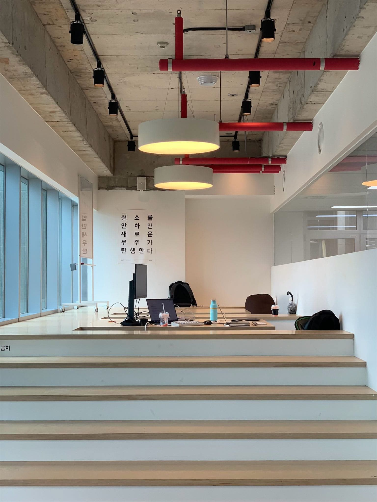
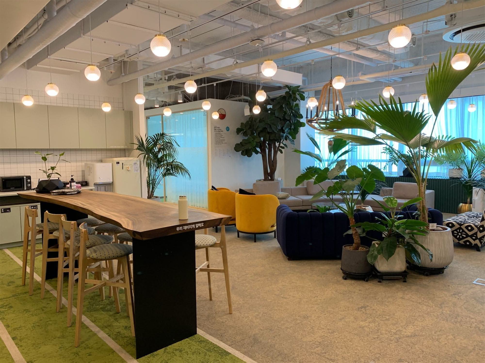
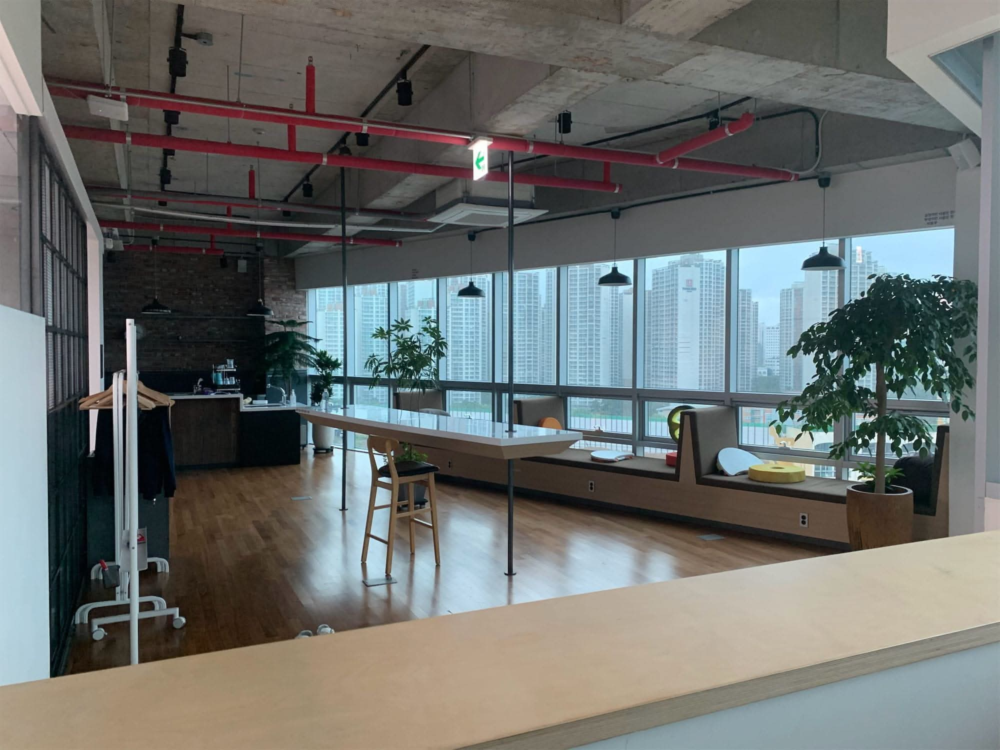
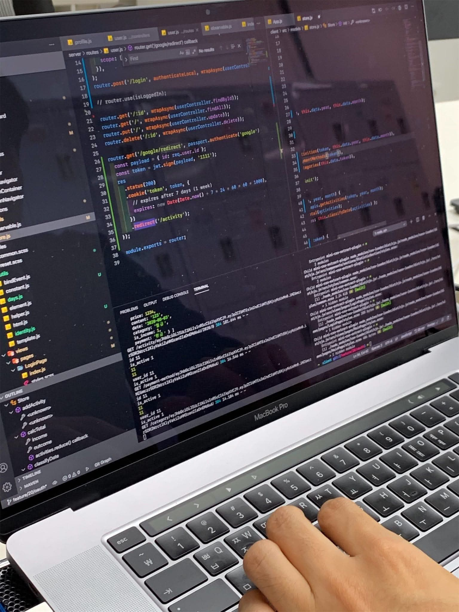
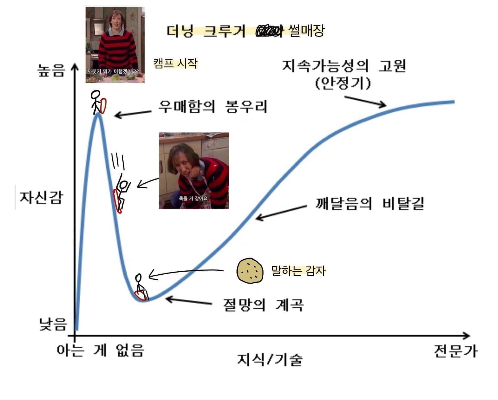

import DisplayFlex from '@site/src/components/DisplayFlex'


I feel like it's too late to write a review in 2021 when I finished the program in August 2020, but since the [4th selection](https://www.woowahan.com/#/recruit/TechCamp) is underway, I feel like if I don't post it now, I will never publish it. Therefore, most of the information released on the Internet will be brief, and I will focus on the things I was curious about when I applied.

Woowa TechCamp is a program for aspiring programmers to intern for the summer at Woowa Brothers, a tech unicorn company that operates **배달의민족**, like Uber Eats in Korea, to study development and programming in the industry. The number of interns is 30, and the competition ratio is approximately 43 to 1.

<figure>



<figcaption>

No shoes allowed - aka **Sushi Bar Lounge**. First come, first served.

</figcaption>
</figure>

## 🔋 Selection Process

### Application

Seven hundred characters in Korean per question.

- Describe what you consider to be the virtues of a developer, and in light of this, what do you think makes you a good fit to work as a developer?
- Please describe why you want to participate in Woowa TechCamp.
- Describe your way of learning programming outside of the curriculum.
- Describe a time when you faced difficulties in collaboration and what you did to overcome them.


### First-round coding test

It was a typical coding test. I remember solving them in JavaScript, and I had a lot of coding test practice at the time due to Programmers Summer Coding Contest and Woowa TechCamp, so the difficulty level was manageable. There were four questions in total, and 150 minutes were given.

### Second-round coding test

The project was to develop an admin tool to perform a specific function on the provided VS Code web platform. The basic boilerplate, build setup, and CI/CD were pre-implemented, so I was able to get up and running quickly as described in the README, and I had to implement three core features on top of that. I was not allowed to use any external libraries and had to make do with vanilla JS. The time was long, 4 hours, but I didn't have enough time. I'm not going to describe the detailed problem strategy because the person involved said I can't share it... 😭

### Interview

Due to COVID-19, the interview was conducted online for 30 minutes. Since it was not a developer recruitment interview, I felt the interviewer needed to ask me deep technical questions. Still, I mainly asked whether I have good programming basics, whether I am ready to learn at UteCam, and whether I will be a good camp member. In my case, I mentioned this technical blog in my application, and they asked me for more information about [one post] (/w/4BB66F).

### Competition

I was also curious about the competition rate, which [I later found out](https://woowabros.github.io/devrel/2020/08/14/tecmpcamp_july_1.html) was as follows.

- 1300+ total applicants (43x)
- 500+ (17x+) who passed the paperwork and 1st coding test
- 90 people passed the second round of coding tests (3x)
- Interview and finalize 30 interns


## 🏫 Training Process

0. OT period (Duration: Three days)

- Mini-project: Implementing a web server without Express, HTTP.
- Keywords to study: Node.js, JS OOP, asynchronous programming, async cafe, HTTP specification, HTTP basics.
- [My team GitHub](https://github.com/woowa-TechCamp-2020/anaclumos-yuda1124-sooojungee-learn-node)
- [My blog post](/r/940821)

<figure>

<DisplayFlex>





</DisplayFlex>

<figcaption>

The so-called **tiny house** where the OT took place. It is located in the sleeping room.

</figcaption>
</figure>

1. Login App (1 week)

- Requirements
  - Utilize only vanilla JavaScript.
  - Implement authentication directly without an authentication system such as Passport.
  - Implement DB directly with a file system without using a commercial DB.
- Keywords to study: HTML, CSS, CSS Layout, Express.
- [Our team GitHub](https://github.com/woowa-TechCamp-2020/market-7)

<figure>

<DisplayFlex>




</DisplayFlex>

<DisplayFlex>


</DisplayFlex>

<figcaption>

The so-called **big house** became the home of Woowa TechCamp. It is located 12 seconds away from Seoul Mongchontoseong Station.

</figcaption>
</figure>

2. Trello App (2 weeks)

- Requirements
  - Utilize only vanilla JavaScript.
  - Set up and utilize Webpack by yourself
  - You need to implement drag & drop without the HTML Drag and Drop API, using event bubbling, event capture, and event delegation.
- Study keywords: Webpack, ES Module, DOM API, Templating, Fetch-Promise pattern, JS Event Delegation, DBMS, MySQL, SQL Syntax.
- [Our team GitHub](https://github.com/woowa-TechCamp-2020/todo-8)

<figure>

<DisplayFlex>


</DisplayFlex>

<figcaption>

The cafe on the 18th floor of Big House and the view of Olympic Park from the restaurant.

</figcaption>
</figure>

3. Bankbook App (2 weeks)

- Requirements
  - Utilize only vanilla JavaScript.
  - Build a single-page application using vanilla JavaScript and the History API.
  - Implement CI/CD without any commercial solution.
  - Implement OAuth.
  - Draw graphs using SVG and Canvas.
- Study keywords: Observer Pattern, ERD, OAuth, Passport, State Management, Immutability, Transactions, Shell Scripts, CI/CD, CSS Animations & Optimizations (requestAnimationFrame & requestIdleCallback), SVG, Canvas.
- [Our team GitHub](https://github.com/woowa-TechCamp-2020/hkb-7)

<figure>



<figcaption>

We often did pair programming. [This is the code you see now...](https://github.com/woowa-TechCamp-2020/hkb-7/blob/develop/server/routes/user.js)

</figcaption>
</figure>

4. Full E-commerce App (3 weeks)

- Requirements
  - Utilize Vanilla React.
  - Utilize AWS VPC
  - Utilize S3 image storage.
  - Utilize Elastic Search, Logstash, and Kibana (ELK) combination.
- Study keywords: React Hooks, AWS VPC, React Router, React Context API, React useReducer, AWS IAM, AWS S3, React Test Codes (Jest, Enzyme, ...), Elastic Search, Logstash, Kibana, ELK.
- [Our team GitHub](https://github.com/woowa-TechCamp-2020/bmart-4)


## ✨ Good points

First, we were paid about 1,500,000 won monthly for activities and equipment (MacBook Pro 💻 and monitor 🖥).

<figure>

<DisplayFlex>


</DisplayFlex>

<figcaption>

A 2019 MacBook Pro 16-inch i9 was loaned to everyone. It had 16GB of RAM, a 1TB SSD, and a Radeon 5500M 4GB GPU. At the time of the 2020 camp, it was the highest-spec MacBook Pro available without a CTO. 15 monitors were issued, one per two person. The monitors were ThinkVision QHD monitors. I thought we'd run out of monitors, but we had plenty.

</figcaption>
</figure>

### 👨‍💻 What the heck is good (beginner) code?

```js
// Load the right sidebar activity history
async function addActivityLogToActivityLogList() {
  let activityLogList = document.getElementById('activity-log-list')
  activityLogList.classList.add('activityLog')
  activityLogList.innerHTML = ''
  let userList = await api.User().getAllUsers()
  userList.reverse()
  console.log('There are currently [', userList.length, '] users.')
  userList.forEach((user) => {
    let activityLog = document.createElement('li')
    activityLog.classList.add('activityLog')
    let date = new Date(moment(user.created_at).format('YYYY-MM-DD HH:mm:ss'))
    activityLog.innerText = user.userId + 'joined on ' + date + '.'
    activityLogList.appendChild(activityLog)
  })
}
```

The original version of this code is [here](https://github.com/woowa-TechCamp-2020/todo-8/blob/develop/frontEnd/src/app.js#L141-L156).

> Uh... this isn't reviewable at all; who wrote this?

This is the feedback on my code that appeared on the screen during code review time on the afternoon of Friday, July 25, at the end of the second project. At the time, I thought I had handled the extreme time pressure well and created a page that worked well. But hearing this blunt assessment was a shock. It didn't show in writing, but something froze in me.

On the train ride home that day, I had a lot of thoughts. When I took a moment to calm down and think about it, I realized that it wouldn't have been a good camp if it was just a camp that said, **Yes, we all did well and did an excellent job**. They say a problem set is only as good as the problems you get wrong. So I remember vowing to make the most of what I could do and absorb as much as I could for the rest of the month.

As a junior interested in programming, you often hear things like "clean code, good patterns". The problem with this is that as a beginner, you've heard it so many times that you're just mechanically repeating it by rote, and you do not have a realistic sense of what's good or what's bad. If we go back and look at the code above,

- The code is doing two things at once. It's getting information and displaying it. This makes the code more dependent. Dependencies can lead to much math when you need to replace some code.
- The file mixes logic and views and could be more readable.

Based on your advice, I paid much attention to this development pattern in my third project. I made a mini-project out of some of the parts of my third project, and you can probably get an idea of what it looks like.

- [Create a calendar with vanilla JS @](/w/F522B3)

### 🛷 Dunning Kruger Sledding Hut

It's a bit of a cliché, but I was able to experience the **peak of stupidity** firsthand. Of course, I never thought that I knew everything, but I dared to think, "Sure, I'll have to work at it, but maybe I'll be able to keep up with it to some extent?" because I've done some projects in JavaScript before.



Woowa TechCamp was very challenging. The goal of the original curriculum was to impose constraints on each project and then work around those constraints in the next project. For example, implementing authentication without Passport.js and then using Passport.js in the next project to quench that thirst. But on the flip side, this process happened every week or two, which meant that when we were getting to grips with the previous technology, we'd jump to the next one and experience the steep learning curve again.

I experienced Dunning Kruger's sledding hill at WoowaTechCamp. Unfortunately, I had to work hard to follow along because I needed to be a JavaScript whiz.

### 🌎 What is knowledge in the internet age?

I also thought a lot about what it means to know in the age of search. If we're talking about programming, I've found an answer to this. It's a concept called GSPH, which stands for Googling Session Per Hour. A Googling Session is a deep search that lasts longer than 5 minutes. So, for example, if you can't remember the name of a JavaScript property function and you're done Googling in 2 minutes, that's not a Googling Session, but if you can't remember the name of OAuth and you're looking at a document for 10 minutes, that's a Googling Session.


If you have no more than (roughly) 3 Googling Sessions in an hour while working on a task, you know the concept, so doing short searches in between jobs doesn't directly indicate that you don't see the idea. However, if you have to look it up for every detail of your work, it's a sign that you still need to work on it.

### 👾 Libraries ≠ Alien Technology

Frameworks and libraries are often treated like alien technology. Of course, well-known frameworks and libraries are a set of proven, efficient code. Still, it can be dangerous to think of them as alien technology you can't get away from and take the approach of delegating all your worries to them.


In particular, the underlying technology of web libraries is plain JavaScript, which we can also write. It was constantly emphasized throughout the camp that we should rely on something other than external libraries blindly. Still, we should know how they work and the potential pitfalls, so we should study them carefully enough to implement them similarly if necessary.

> Libraries are not Protoss 👽 tech; they are Terran 🧑‍🔧 tech.

An example is the [left-pad incident](https://blog.npmjs.org/post/141577284765/kik-left-pad-and-npm) in 2016. An 11-line library called `left-pad` was deleted from npm, which caused a domino effect of dependencies and made a transpiler called `babel` unavailable. Isn't this also a case of over-reliance on a simple code that can be written quickly?

If you're a hobbyist developer, you might be thinking, "Eh, babel is a really trusted library used by hundreds of thousands of people, I should spend my time worrying about the safety of my code," but if you're an organization that can lose a lot of money if a service goes down for half an hour, you need to keep in mind that libraries are not some unknown alien technology, and they're not something we should be celebrating, but they are services that can be compromised at any time.

## 🥳 Fun stuff.

### 🧩 Crawling the Woowa image server

I needed many Woowa's B-mart images when building my last B-mart service. I had pictures in the photo section to make it look like an app. Utilizing my [previous experience](/w/21E029), I scraped the image resources on Woowa's server (with their permission).


Technically, this isn't a "hack of the Woowa server" because the images are on the CDN (open web). The problem is that these endpoints and the image stock values behind them must be visible.

    http://CDN.baemin.com/random/random/1abcde23-some-long-alphanumeric.jpg

The final image CDN URI looks like this, and when you connect to it, you get the picture.

It wasn't just a shallow crawl using a CSS selector with a B-mart webview, nor was it a shared resource server, so it took quite a bit of effort. To keep it simple, I eavesdropped on the iOS Woowa app communication to get the endpoint and image address, and with a little CTF, I got a list of image addresses. Then, I scraped about 1,000 images, icons, sound effects, etc., from that image server and shared them in a private repository for other campers.


### 🏢 Whirlwind Company History

We were able to hear behind-the-scenes stories of Korean companies. For example, a game company uses binary dumps instead of RDBs because the hundreds of thousands mass-produce items; a game DB field was manipulated by someone to clone an item worth hundreds of millions of won, and DB access rights management has been rigorous since then; a hotel company's developers can view all members' personal information, so for a while, developers were able to view celebrity membership information at will; the chairman of a search company told them to "make it one second faster than the competition"... It was a fascinating story for me who is interested in the corporate ecosystem.


### ⚡️ Synergy × Synergy = Synergy<sup>3</sup>

**The best part was meeting the other Woowa TechCampers.** I understood a little bit about what it means to have great coworkers. Most notably, I would like to mention [jhaemin](https://github.com/jhaemin).

At the beginning of every project, he gives me a design brief. However, they are only recommendations, and the actual implementation is free, meaning it's purely up to the campers to tweak the design to improve usability and aesthetics. At first, I thought this was a design that was **mandatory** to follow, but it wasn't. In the end, everything was free and open, as if to subtly imply that good coworkers are those who **find** things to do. Whether it was improving the design, adding features, or, conversely, removing something, there was a lot of power and responsibility.

In terms of the design ethos of the front-end developers, I was influenced by my fellow camper [jhaemin] (https://github.com/jhaemin). I learned much from watching him build usable web apps with his solid design scheme. You'll see what I mean when you see two sites that blew me away.

- [woowa-TechCamp-2020/market-6](https://github.com/woowa-TechCamp-2020/market-6)
- [woowa-TechCamp-2020/todo-14](https://github.com/woowa-TechCamp-2020/todo-14)

I was so inspired that I tried to improve the design from the 3rd BankSalad project. I thoroughly revised the plan like this. ↓


What I like about my design is that it takes full advantage of the widescreen by dividing the screen elements into three columns and that the activity history pane on the right works independently, so you can freely move to the calendar, stats, and payment methods and still keep the contents of the right pane. Similar to Slack?

You can also check out the [vanilla JavaScript pseudo-React](https://velog.io/@naamoonoo/%EB%A6%AC%EC%95%A1%ED%8A%B8-%EB%94%B0%EB%9D%BC%ED%95%98%EB%A0%A4%EB%8B%A4-%EB%B0%94%EC%A7%93%EA%B0%80%EB%9E%91%EC%9D%B4- %EC%B0%A2%EC%96%B4%EC%A7%84-%EC%9D%B4%EC%95%BC%EA%B8%B0-2%EC%A3%BC%EC%B0%A8-%ED%9A%8C%EA%B3%A0) [naamoonoo](https://github.com/naamoonoo), [pigrabbit](https://github.com/pigrabbit), who perfected Elastic Search over the weekend, [dnacu](https://github.com/dnacu), who was literally god in React, [younho9](https://github.com/younho9), who implemented SPA structure and singleton pattern in JS, [0407chan](https://github.com/0407chan), who systematically implemented data access strategy, [Jenny](https://github.com/eunjung-jenny), who finished the design structure overnight, etc... There was so much to learn that I can't even begin to write it all down here...

## 🎬 Miscellaneous and Conclusion

- This was my first experience with deep collaboration using Git and GitHub. As a solo developer, I don't often utilize git's `branch` and `checkout` features. I think GSPH<3 was a great introduction to Git collaboration.
- I really liked the in-between lectures. In the talks held every Wednesday, I saw interesting things about the development and operation of Woowa Service, especially [Lecture by Developer Kim Min-tae](/r/02B616).
- It was great to be able to experience company life indirectly. I can't believe I can experience corporate life at 19!
- The older siblings were very understanding. I could feel that they cared about me. We had a lot of recreational activities in between, but it was a shame that the recreational activities were reduced due to COVID-19.
- It was a really valuable experience and I learned a lot of new things. I'm disappointed I didn't get to go deeper if I had a better foundation. But, on the other hand, it's a great asset for my future journey.
- Of course, I won't be perfect right away. I've been feeling the gap between my ideals and reality lately. Still, if we set our compass to our ideal destination, we will reach it one day 🧭.

<details>
<summary>📚 More resources</summary>

- Woowa brother's official materials

  - [Woowa TechCamp 3rd Recruitment](https://woowabros.github.io/devrel/2020/04/13/TechCamp3.html)
  - [Woowa TechCamp 3rd July Diary](https://woowabros.github.io/devrel/2020/08/14/tecmpcamp_july_1.html)
  - [Woowa TechCamp 3rd July Recap](https://woowabros.github.io/devrel/2020/08/19/TechCamp_july_2.html)
  - [Woowa TechCamp 3rd August Diary](https://woowabros.github.io/devrel/2020/09/08/TechCampaugust.html)
  - [Woowa TechCamp 3rd August Recap](https://woowabros.github.io/devrel/2020/09/14/TechCamp3blog.html)

- July Recap

  - [(Woowa TechCamp 3rd) At the midpint of the Camp](https://zoomkoding.github.io/%ED%9A%8C%EA%B3%A0/%EC%9A%B0%EC%95%84%ED%95%9C%ED%85%8C%ED%81%AC%EC%BA%A0%ED%94%84/2020/07/26/woowa-tech-camp-mid-term.html)
  - [2020 Woowa TechCamp (3rd) July Recap](https://velog.io/@blair/%EC%9A%B0%EC%95%84%ED%95%9C-%ED%85%8C%ED%81%AC%EC%BA%A0%ED%94%84-7%EC%9B%94-%ED%9B%84%EA%B8%B0)
  - [\[Woowa TechCamp 3\] 2nd PairProgramming End & Recap 👀](https://haerang94.tistory.com/10)
  - [The basics were important](https://quail-han.tistory.com/20)
  - [I'm a Steamed-Developer (Woowa TechCamp 3rd Week 4 Recap)](https://younho9.dev/am-i-real-developer)
  - [3 Reasons Why You Should Try Woowa TechCamp](https://www.notion.so/3-2da3c0db345c4512bd3d6f277c595d9e)
  - [Second Project - Todo List Developer](https://yuda1124.github.io/woowa-todolist/)
  - [Growing up with Woowa TechCamp](https://www.notion.so/99af27fb380b4b1bbe751f90f48c293a)
  - [Retrospective on coming to Woowa TechCamp and the last four weeks](https://www.notion.so/4-b766aaa13f954cb09ad1adde5ac1ecc2)
  - [What makes a good coworker?](https://changicho.tistory.com/25)
  - [Junior developer's 'skills that I don't have, and should have'](https://velog. io/@tnk2u/%EC%A3%BC%EB%8B%88%EC%96%B4-%EA%B0%9C%EB%B0%9C%EC%9E%90%EA%B0%80-%EC%83%9D%EA%B0%81%ED%95%98%EB%8A%94-%EC%84%B1%EC%88%99%ED%95%9C-%EA%B0%9C%EB%B0%9C%EC%9E%90)

- August Recap.

  - [(Woowa TechCamp 3rd) Finishing the Camp](https://zoomkoding.github.io/%ED%9A%8C%EA%B3%A0/%EC%9A%B0%EC%95%84%ED%95%9C%ED%85%8C%ED%81%AC%EC%BA%A0%ED%94%84/2020/10/05/woowa-tech-camp-final.html)
  - [Front-end Designer](https://blog.jhaemin.com/frontend-designer#kor)
  - [I've only just grown up. (Woowa TechCamp 3rd)](https://changicho.tistory.com/28)
  - [There is one destination, but not one way to get there](https://quail-han.tistory.com/21)
  - [Voice of the Heart (3rd year of camp)](https://www.notion.so/3-b08da2dc608645f7aac55a484c68b946)
  - [A short record of each day of camp](https://www.notion.so/e6c39818e2ac4577a3dfc2f4fef0d1ad)
  - [Between Kindness and Unkindness - Woowa TechCamp Full Recap](https://velog.io/@naamoonoo/%EC%B9%9C%EC%A0%88%EA%B3%BC-%EB%B6%88%EC%B9%9C%EC%A0%88-%EC%82%AC%EC%9D%B4)

- Tech-related

  - [Woowa TechCamp 3rd Study Blog](https://woowa-TechCamp-2020.github.io/practice-interview/)
  - [GitHub Organization Auth for CI](https://github.com/woowa-TechCamp-2020/market-3/wiki/CI-%EB%B6%99%EC%9D%B4%EA%B8%B0-%EC%9C%84%ED%95%B4-GitHub-Organization%EC%97%90-%EA%B6%8C%ED%95%9C-%EC%9A%94%EC%B2%AD%ED%95%98%EA%B8%B0)
  - [Context API, LifeCycle API, Component Docs, Component, Design Pattern, Redux](https://github.com/changicho/TIL/tree/master/frontend/react)
  - [Getting started to import...](https://www.notion.so/Getting-started-to-import-2a74cd0530df414888aa35d03c54c936#a8cb4fc856e2457e82ec7e5a7b478779)
  - [Git Shortcuts](https://github.com/woowa-TechCamp-2020/todo-13/wiki/Git-%EB%8B%A8%EC%B6%95%ED%82%A4-%ED%97%88%EB%8B%88%ED%8C%81)
  - [Github Actions + CodeDeploy + EC2 Auto Deploy](https://www.notion.so/Github-Actions-CodeDeploy-EC2-6d74884a83ef47babce65b47dc130a1a)
  - [Image Lazy Loading](https://github.com/woowa-TechCamp-2020/bmart-10/wiki/Image-Lazy-Loading)
  - [Iterm](https://www.notion.so/Iterm-a8bd15b995124f0eb94182eb03f35f0b)
  - [React Application Architecture - No one told me, so I shoveled it myself](https://www.slideshare.net/byungdaesohn/react-76078368)
  - [TIL_20200715](https://www.notion.so/TIL_20200715-84bbe0a9dd2d4664b5a1a36b10c5b1b8)
  - [TIL_20200802](https://www.notion.so/TIL_20200802-Postman-5a2692ff78c74368a4e382ecf3ccef5e)
  - [TIL_20200816](https://www.notion.so/TIL_20200816-eea7c20e22444afa8e3578955de9d1d2)
  - [TIL_20200817](https://www.notion.so/TIL_20200817-22d0cea752a64974b8f3eda7ac40e6a5)
  - [TIL_20200824](https://www.notion.so/TIL_20200824-fca07160d5404208b1c3977677173593)
  - [Let's be more productive in VS Code](https://www.notion.so/VS-Code-576294cd06784db0a5e5f092429d02fb)
  - [Applying alias IntelliSense in VSCode](https://www.notion.so/VSCode-alias-IntelliSense-5133854c58ba470d98abaad06333407c)
  - [Creating a Calendar with VanilaJS](https://github.com/woowa-TechCamp-2020/hkb-9/wiki/%EB%8B%AC%EB%A0%A5-%EB%A7%8C%EB%93%A4%EA%B8%B0)
  - [Creating a boilerplate with Webpack - 1 (webpack, babel setup)](https://haerang94.tistory.com/m/5?category=791931)
  - [\[NPM\] semantic versioning](https://github.com/eunjung-jenny/deep_dive/blob/master/semantic%20versioning.md)
  - [cookie parser](https://github.com/woowa-TechCamp-2020/market-9/wiki/cookie-parser)
  - [express.json() vs express.urlencoded()](<https://github.com/woowa-TechCamp-2020/market-9/wiki/express.json()-vs-express.urlencoded()>)
  - [webpack + express project deployment with Heroku MySQL (Heroku mysql연동편)](https://haerang94.tistory.com/8?category=791931)
  - [create a todo list with mouse event only (feat. event delegation)](https://changicho.tistory.com/23)
  - [Implementing drag and drop with mouse event](https://github.com/woowa-TechCamp-2020/todo-1/wiki/mouse-%EC%9D%B4%EB%B2%A4%ED%8A%B8%EB%A1%9C-drag-and-drop-%EA%B5%AC%ED%98%84%ED%95%98%EA%B8%B0)
  - [woowahan-ORM A very light promise-based Node.js ORM for MySQL](https://github.com/woowa-TechCamp-2020/woowahan-orm)
  - [Technical Interview Preparation](https://docs.google.com/spreadsheets/d/1kLRKDLHAX5mu0XwxgdAmSbp7NCmbwEqGpPxZWya4gyY/edit#gid=0)
  - [Tech Doc: GraphQL](https://github.com/woowa-TechCamp-2020/bmart-3/wiki/%EA%B8%B0%EC%88%A0%EB%AC%B8%EC%84%9C-:-GraphQL)
  - [Drag and Drop Animation](https://github.com/woowa-TechCamp-2020/todo-14/blob/main/doc/Drag-and-Drop-with-Animation.md)
  - [It's so hard to replicate React](https://github.com/naamoonoo/wtc/blob/master/wooact/doc/%EB%A6%AC%EC%95%A1%ED%8A%B8%20%EB%94%B0%EB%9D%BC%ED%95%98%EB%A0%A4%EB%8B%A4%20%EB%B0%94%EC%A7%93%EA%B0%80%EB%9E%91%EC%9D%B4%20%EC%B0%A2%EC%96%B4%EC%A7%84%20%EC%9D%B4%EC%95%BC%EA%B8%B0%20695f40ce352e4f279ac026b4a6c17947.md)
  - [How does React work - Diffing](https://www.notion.so/Diffing-3f98bc8be2d448fc8013f53ea595e647)
  - [Drag & Drop implementer using mouse events](https://www.notion.so/Drag-Drop-5267f4f650a3407e998fa9b0a2bd67da)
  - [Improving the Category (somewhat?)](https://www.notion.so/399b82afc08a487b8b69e0358c20f1a8)
  - [Goodbye, Passport](https://parkjihwanjay.github.io/third-post/)
  - [How did the motorcycle fly?](https://github.com/naamoonoo/wtc/tree/master/animation-css)
  - [Custom Elements](https://www.notion.so/Custom-Elements-c8d32964bec6453e9ef6161513671ff8)
  - [Coupang Category Menu Awkward Improvement(?) Review](https://www.notion.so/5b0b0aa4804041d2bbc5dbb79f398d5f)
  - [Deploying to the project GitHub page](https://www.notion.so/ae3b7117ad8b4b70968ba0f428b70e51)
  - [Front-end Dev Setup](https://github.com/woowa-TechCamp-2020/todo-9/wiki/%ED%94%84%EB%A1%A0%ED%8A%B8%EC%97%94%EB%93%9C-%EA%B0%9C%EB%B0%9C%ED%99%98%EA%B2%BD-%EC%84%A4%EC%A0%95%ED%95%98%EA%B8%B0)

- Image Source
  - Dunning Kruger Effect
  - Miranda (sitcom)
  - MBC Infinite Challenge
  - StarCraft II: Legacy of the Void Opening Cinematic

</details>


