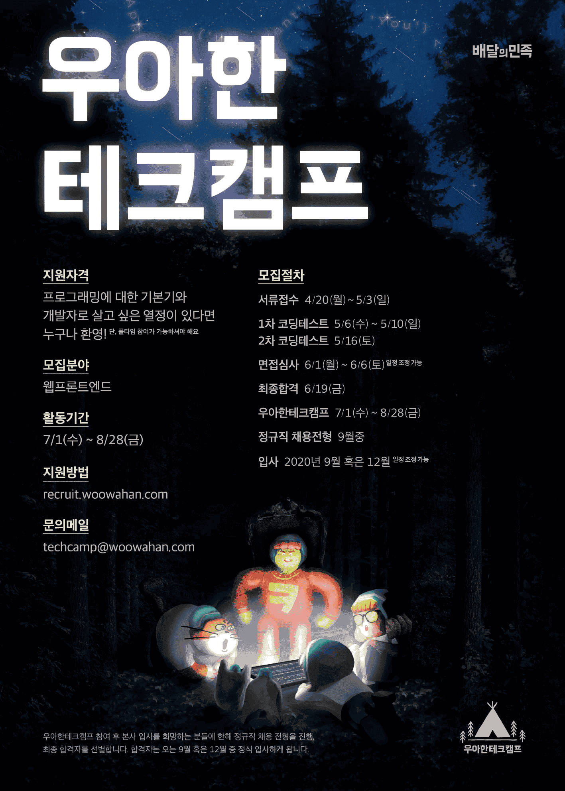
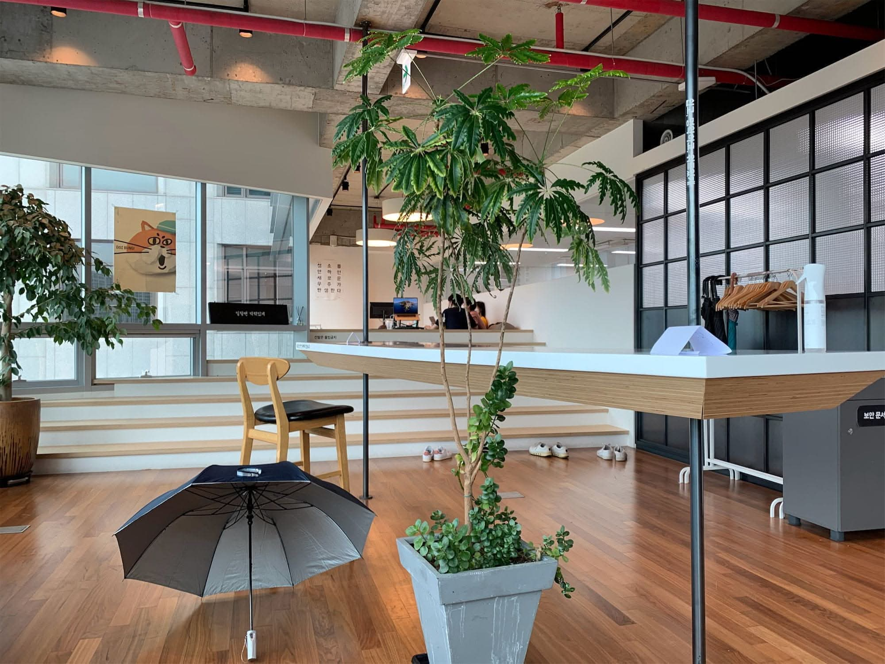
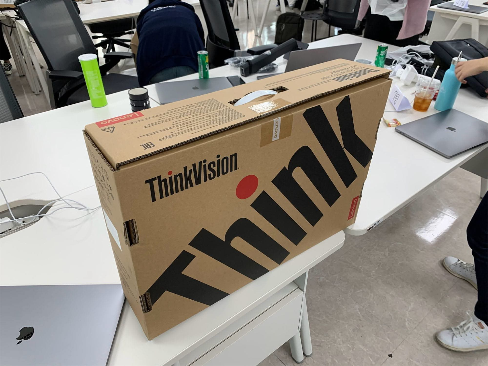

import DisplayFlex from '@site/src/components/DisplayFlex'

It may seem too late to write a review in 2021 for something that ended in August 2020, but with the [4th recruitment](https://www.woowahan.com/#/recruit/techcamp) currently underway, I felt that if I didn't post it now, I might never do it. Most of the information available online only briefly touches upon the topic, so I will focus on **the things I was curious about when I applied**.
**Woowa Tech Camp** is a programmer training course where participants work as interns at **Woowa Brothers**, a tech unicorn company that operates **Baedal Minjok** (배달의민족, a.k.a Baemin), during the summer while studying development and programming close to real-world practice. 30 people are selected, with a competition ratio of approximately 43 to 1.

<figure>

<figcaption>
No shoes allowed - the so-called **Sushi Bar Lounge**. It's first-come, first-served due to the great view.
</figcaption>  
</figure>
## 🔋 Selection Process
### Application
Each question had a 700-character limit.
- What do you think are the virtues of a developer, and in light of this, what aspects of yourself do you think make you suitable to work as a developer?  
- Please freely describe why you want to participate in Woowa Tech Camp.  
- If you have your own programming learning method outside of the curriculum, please describe it.  
- Describe an experience where you faced difficulties in the collaboration process and what efforts you made to overcome those difficulties.

### 1st Coding Test
The problems were typical coding test questions. I remember solving them in JavaScript, and since I had practiced a lot for coding tests due to Programmers Summer Coding and Woowa Tech Camp at the time, the difficulty level wasn't too burdensome. There were a total of 4 problems with a time limit of 150 minutes.
### 2nd Coding Test
It was a project to develop an admin tool that performs specific functions on the provided VS Code web platform. The basic boilerplate, build configuration, and CI/CD were pre-implemented, so it could be run quickly as described in the README, and we had to implement 3 core features on top of that. The use of external libraries was prohibited, and it had to be solved using only vanilla JS. The time limit was quite long at 4 hours, but I felt it was insufficient. I will omit the detailed problem-solving strategy as the staff said they couldn't share it... 😭
### Interview
Due to COVID-19, it was conducted online for 30 minutes. Since it wasn't a developer recruitment interview, rather than asking in-depth technical questions, they mainly asked about whether we had a solid foundation as programmers, were ready to learn at Woowa Tech Camp, and could be good camp members. In my case, I mentioned this technical blog in my application, and they asked detailed questions about [one specific post](/w/4BB66F).
### Competition Ratio
I was also curious about the competition ratio, and [according to what I learned later](https://woowabros.github.io/devrel/2020/08/14/tecmpcamp_july_1.html), it was as follows:
- Total applicants: 1300+ (43+ times)  
- Passed application and 1st coding test: 500+ (17+ times)  
- Passed 2nd coding test: 90 (3 times)  
- Passed interview and final acceptance: 30

## 🏫 Curriculum
0.  Orientation Period (3 days)
- Mini Project: Implementing a web server without Express and HTTP.  
- Study Keywords: Node.js, JS OOP, Asynchronous Programming, Async Cafe, HTTP Specification, HTTP Basics.  
- [Our Team's GitHub](https://github.com/woowa-techcamp-2020/anaclumos-yuda1124-sooojungee-learn-node)  
- [My Blog Post](/r/940821)

<figure>
<DisplayFlex>
  
  

</DisplayFlex>
<figcaption>
  
**Small House** where the orientation took place. Located in Jamsil.
</figcaption>  
</figure>
1.  **Baemin Mart Project** implementing login (1 week)
- Conditions  
  - Use only vanilla JavaScript.  
  - Implement authentication directly without using authentication systems like Passport.  
  - Implement the DB directly using the file system without using a commercial DB.  
- Study Keywords: HTML, CSS, CSS Layout, Express.  
- [Our Team's GitHub](https://github.com/woowa-techcamp-2020/market-7)
<figure>
<DisplayFlex>
  

</DisplayFlex>
<DisplayFlex>
  

</DisplayFlex>
<figcaption>
**Big House** which became the main stage for Woowa Tech Camp. Located a 12-second walk from Mongchontoseong Station.
</figcaption>  
</figure>
2.  **Trello Project** directly implementing a Kanban board (2 weeks)
- Conditions  
  - Use only vanilla JavaScript.  
  - Directly configure and utilize Webpack.  
  - Drag & drop must be implemented, but it should be done directly using event bubbling, event capture, and event delegation without the HTML Drag and Drop API.  
- Study Keywords: Webpack, ES Module, DOM API, Templating, Fetch-Promise pattern, JS Event Delegation, DBMS, MySQL, SQL Syntax.  
- [Our Team's GitHub](https://github.com/woowa-techcamp-2020/todo-8)
<figure>
<DisplayFlex>
  

</DisplayFlex>
<figcaption>
The cafe on the 18th floor of the Big House and the view of Olympic Park from the cafe.
</figcaption>  
</figure>
3.  **Bank Salad Project** directly implementing a household ledger app (2 weeks)
- Conditions  
  - Use only vanilla JavaScript.  
  - Directly implement a single-page application using vanilla JavaScript and the History API.  
  - Implement CI/CD directly without using commercial solutions.  
  - Implement OAuth.  
  - Draw graphs using SVG, canvas, etc.  
- Study Keywords: Observer Pattern, ERD, OAuth, Passport, State Management, Immutability, Transactions, Shell Scripts, CI/CD, CSS Animations & Optimizations (requestAnimationFrame & requestIdleCallback), SVG, Canvas.  
- [Our Team's GitHub](https://github.com/woowa-techcamp-2020/hkb-7)
<figure>

<figcaption>
We occasionally did pair programming. [The code you see now is...](https://github.com/woowa-techcamp-2020/hkb-7/blob/develop/server/routes/user.js)
</figcaption>  
</figure>
4.  **B Mart Project** directly implementing Baedal Minjok's B Mart (3 weeks)
- Conditions  
  - Use Vanilla React.  
  - Utilize AWS VPC.  
  - Utilize S3 image storage.  
  - Utilize the Elastic Search, Logstash, Kibana (ELK) combination.  
- Study Keywords: React Hooks, AWS VPC, React Router, React Context API, React useReducer, AWS IAM, AWS S3, React Test Codes (Jest, Enzyme, ...), Elastic Search, Logstash, Kibana, ELK.  
- [Our Team's GitHub](https://github.com/woowa-techcamp-2020/bmart-4)

---
## ✨ The Good Parts
First of all, an activity stipend of about 1.5 million won per month and activity equipment (MacBook Pro 💻 and monitor 🖥) were provided.
<figure>
<DisplayFlex>
  

</DisplayFlex>
<figcaption>
A 2019 MacBook Pro 16-inch i9 high-end model was loaned to everyone. 16GB RAM, 1TB SSD, Radeon 5500M 4GB GPU. As of the 2020 camp, it was the highest spec MacBook Pro that could be ordered without CTO. One monitor was provided for every two people, for a total of 15 monitors. The monitors were ThinkVision QHD monitors. I thought there wouldn't be enough monitors, but there were plenty.
</figcaption>  
</figure>
### 👨‍💻 What the heck is (for beginners) good code?
```js  
// Load activity log to right sidebar  
async function addActivityLogToActivityLogList() {  
  let activityLogList = document.getElementById('activity-log-list')  
  activityLogList.classList.add('activityLog')  
  activityLogList.innerHTML = ''  
  let userList = await api.User().getAllUsers()  
  userList.reverse()  
  console.log('There are currently [', userList.length, '] users.')  
  userList.forEach((user) => {  
    let activityLog = document.createElement('li')  
    activityLog.classList.add('activityLog')  
    let date = new Date(moment(user.created_at).format('YYYY-MM-DD HH:mm:ss'))  
    activityLog.innerText = user.userId + ' joined on ' + date  
    activityLogList.appendChild(activityLog)  
  })  
}  
```
The original code can be found [here](https://github.com/woowa-techcamp-2020/todo-8/blob/develop/frontEnd/src/app.js#L141-L156).
> Uh - this is not in a state to be reviewed. Who wrote this? Let's have a talk.

This was the feedback on my code that was randomly selected to be shown on the screen during the code review session on Friday afternoon, July 25th, at the end of the 2nd project. At the time, I thought I had overcome the extreme time pressure quite well and created a well-functioning page. However, receiving such direct criticism left me in a state of shock. It's not well conveyed in writing, but the atmosphere was truly frozen.
On the train ride home that day, I had countless thoughts. After calming my mind for a moment and thinking about it, I realized that if it had been a camp where they just said, "Okay, okay~ We all did well and worked hard~", it wouldn't have been a good camp. Just as a good workbook should have problems that you get wrong. So I decided to make the most of what I was relatively good at and absorb as much as I could learn during the remaining month.
Juniors interested in studying programming often hear things like "clean code, good patterns". However, **the problem is that from a beginner's perspective, hearing these things mechanically too often leads to unconsciously repeating them as if memorizing them**, without having a realistic sense of what level is actually good. Looking back at the code above,

- The code is doing two tasks simultaneously. ① Fetching information and ② displaying information. In this case, the code becomes highly dependent. High dependency can lead to major surgery when part of the code needs to be replaced later.
- Overall, the logic and view are mixed in the file, and readability is poor.
  Based on the advice, from the 3rd project onwards, I paid a lot of attention to these development patterns. I did a mini-project with a part of the 3rd project, and you can probably get a sense of what it's like.
- [Creating a Calendar with Vanilla JS](/w/F522B3)

### 🛷 Dunning-Kruger Sledding

It may be a bit cliché, but I was able to directly experience the **peak of ignorance**. Of course, I never thought I knew everything completely, but since I had experience with various JavaScript projects, I dared to think, "Of course I'll have to work hard, but **wouldn't I be able to keep up to some extent without too much difficulty?**"

Naturally, Woowa Tech Camp was extremely challenging. The original goal of the curriculum was to impose constraints on each project and then resolve the regrets caused by those constraints in the next project. For example, after implementing authentication without using Passport, that thirst would be quenched in the next project by using Passport. However, on the flip side, this process occurred every 1-2 weeks, meaning that as soon as you barely grasped the previous technology, you had to immediately move on to the next technology and experience a steep learning curve again.
It felt like I experienced the Dunning-Kruger sledding at Woowa Tech Camp. Since I wasn't proficient enough to freely handle JavaScript, I really had to work hard to keep up.

### 🌎 What does it mean to know in the internet age?

I also pondered a lot about **what it means to know something in an age where search exists**. If I limit this to programming, I think I found a bit of an answer. It's the concept of GSPH, which stands for Googling Session Per Hour. A Googling Session refers to a deep search task lasting more than 5 minutes. For example, if you couldn't remember the name of a JavaScript property function and completed the search in 2 minutes, it wouldn't count as a Googling Session, but if OAuth doesn't come to mind easily and you have to look at the documentation for 10 minutes, it would count as a Googling Session.

When doing a task, if the Googling Sessions per hour are (roughly) 3 or less, it seems you can say you know that concept. In other words, doing short searches in the middle of a task doesn't directly mean you don't know the concept. However, if you have to look up every detail of the task one by one, it means you still need more study.

### 👾 Library ≠ Alien Technology

Sometimes frameworks and libraries are treated like alien technology. Of course, well-known frameworks and libraries are collections of proven, efficient code, but thinking of them as **unapproachable alien technology** and **relying on libraries for all considerations** can be a bit dangerous.


In particular, the underlying technology of web libraries is Plain JavaScript that we can also use. Rather than blindly relying on external libraries, it was continuously emphasized throughout the camp that we need to know how that library works and what potential risk factors exist. In other words, in case of necessity, you should study carefully enough to be able to implement a library in a similar form.

> Libraries are Terran 🧑‍🔧 technology, not Protoss 👽 technology.

One example is the [left-pad incident](https://blog.npmjs.org/post/141577284765/kik-left-pad-and-npm) that occurred in 2016. An 11-line library called `left-pad` was removed from npm, and as a result, the dependency chain collapsed like dominoes, rendering the `babel` transpiler unusable. If you think about it, wasn't this problem also caused by excessive reliance on simple code that could be written quickly?

From the perspective of a hobby developer, you might think, "Huh? Babel is a really reliable library used by hundreds of thousands of people. I should focus on the safety of my own code instead of worrying about that." However, for a company that suffers enormous financial losses even if the service is down for just 30 minutes, this consideration is essential. In other words, libraries are not unknowable alien technology, nor are they something we should pray to, and we should keep in mind that they are also services that can be damaged at any time.

## 🥳 Fun Experiences

### 🧩 Crawling Baemin's Image Server

When creating the final B Mart service, there was a time when we needed a huge amount of Baemin's B Mart data. We needed photos to put in the photo slots to give it an app-like feel. Using [my previous experience](/w/21E029), I (with permission from the staff) scraped the image resources on Baemin's server.

Strictly speaking, the images exist in the form of CDN open web, so it's not **hacking Baemin's server**. The problem is that these endpoints and the following image addresses are **hidden** in an unrecognizable way.

    http://CDNdomain.baemin.com/some/thing/1abcde23-very-long-alphanumeric-address.jpg

The final image CDN URI looks roughly like this, and when accessed, the image appears.
It wasn't a shallow level of crawling where you simply open the B Mart web view and use CSS selectors, nor did we receive internal resource server data by sharing it with Woowa Tech Camp, so it took quite a bit of effort. To briefly share, I intercepted the iOS Baemin app communication to find out the endpoints and image addresses, and through a bit of CTF, I was able to figure out the image address list. I scraped about 1,000 images, icons, sound effects, etc. from that image server and shared them in a private repository for other Woowa Tech Camp participants to use.


### 🏢 Whirlwind Corporate Night History

We were able to hear behind-the-stories of Korean companies in between. Stories like how a certain game company doesn't use RDB much and uses binary dumps because hundreds of thousands of items are mass-produced, how an incident occurred where someone manipulated the game DB fields to duplicate items worth hundreds of millions of won, so DB access rights management became very strict afterward, how developers at a certain accommodation company could access the personal information of all members, so for a while, developers freely accessed celebrity member information... For me, who is very interested in the corporate ecosystem, these were truly fascinating stories.


### ⚡️ Synergy x Synergy = Synergy<sup>3</sup>

**Nevertheless**, I think the greatest advantage was meeting other Woowa Tech Camp participants. I kind of understood what it means when people say the best welfare is great colleagues. Most notably, I want to talk about [jhaemin](https://github.com/jhaemin).
At Woowa Tech Camp, when starting each project, they provide design drafts and planning documents. However, those contents are just recommendations, and the actual implementation can be done freely. In other words, improving the design to enhance usability and aesthetics is entirely up to the **camp participants**. At first, I thought this design was something that **must** be followed, but that wasn't the case. In the end, as if hinting that good colleagues are those who **find and do the work**, everything was freely open. Whether it was improving the design, adding features, or conversely, deleting something, great power was given and great responsibility was taken.
In terms of the design mindset of a front-end developer, I was greatly influenced by my fellow camp participant [jhaemin](https://github.com/jhaemin). I learned a lot by watching him quickly create usable web apps with his own solid design system. If you directly look at the 2 sites that truly shocked me, you'll probably understand what I mean.

- [woowa-techcamp-2020/market-6](https://github.com/woowa-techcamp-2020/market-6)
- [woowa-techcamp-2020/todo-14](https://github.com/woowa-techcamp-2020/todo-14)

Greatly influenced, I also tried improving the design from the 3rd Bank Salad project. This is how I completely modified the design ↓


In my opinion, the advantages of my design are ① it makes full use of the wide screen by dividing and arranging the screen elements into 3 columns, and ② the activity log window on the right operates independently, so the contents of the right window are maintained even when freely moving to the calendar, statistics, and payment method management. Kind of like Slack?

In addition, there was an overflow of things to learn, such as [naamoonoo](https://github.com/naamoonoo) who [created a pseudo-React with vanilla JavaScript](https://velog.io/@naamoonoo/%EB%A6%AC%EC%95%A1%ED%8A%B8-%EB%94%B0%EB%9D%BC%ED%95%98%EB%A0%A4%EB%8B%A4-%EB%B0%94%EC%A7%93%EA%B0%80%EB%9E%91%EC%9D%B4-%EC%B0%A2%EC%96%B4%EC%A7%84-%EC%9D%B4%EC%95%BC%EA%B8%B0-2%EC%A3%BC%EC%B0%A8-%ED%9A%8C%EA%B3%A0), [pigrabbit](https://github.com/pigrabbit) who completed Elastic Search over the weekend, [dnacu](https://github.com/dnacu) who handled React as comfortably as breathing, [younho9](https://github.com/younho9) who quickly implemented the SPA structure and singleton pattern with just JS, [0407chan](https://github.com/0407chan) who systematically implemented the data access strategy, [Jenny](https://github.com/eunjung-jenny) who finished the design structure overnight, and more.

---

## 🎬 Miscellaneous and Conclusion

- I tried in-depth collaboration with Git and GitHub for the first time. When doing 1-person development, there aren't many occasions to properly utilize Git's `branch` and `checkout` features. In terms of Git collaboration, I think I learned really well with GSPH \< 3.
- The lectures in between were really good. In the lectures held every Wednesday, interesting aspects of the development and operation of Baemin's services were shown. In particular, [the lecture by developer Kim Min-tae](/r/02B616) was truly impressive.
- It was great to indirectly experience company life. To be able to experience company life at the age of 21!
- The kind hyungs and noonas who taught us had a deep understanding. I felt that they were considerate of me. There were also many recreational activities in between, but it was a shame that the recreational activities were reduced due to COVID-19.
- It was a truly precious experience and I gained a lot of new teachings. If my fundamentals were a bit more outstanding, I could have studied much deeper contents, so I have a bit of regret for not being able to do that. I think it has become a really good asset for my future journey.
- Of course, I won't be perfect right away. I'm also feeling a bit of a gap between ideals and reality these days. Still, if we align our compass with our ideals and walk forward, I have a bit of faith that we will reach them someday 🧭
<details>  
<summary>📚 More Resources</summary>
- Official Woowa Brothers Materials
  - [Woowa Tech Camp 3rd Recruitment Guide](https://woowabros.github.io/devrel/2020/04/13/techcamp3.html)
  - [Woowa Tech Camp 3rd July Diary](https://woowabros.github.io/devrel/2020/08/14/tecmpcamp_july_1.html)
  - [Woowa Tech Camp 3rd July Retrospective](https://woowabros.github.io/devrel/2020/08/19/techcamp_july_2.html)
  - [Woowa Tech Camp 3rd August Diary](https://woowabros.github.io/devrel/2020/09/08/techcampaugust.html)
  - [Woowa Tech Camp 3rd August Retrospective](https://woowabros.github.io/devrel/2020/09/14/techcamp3blog.html)
- July Records
  - [(Woowa Tech Camp 3rd) Passing the Halfway Point of the Camp](https://zoomkoding.github.io/%ED%9A%8C%EA%B3%A0/%EC%9A%B0%EC%95%84%ED%95%9C%ED%85%8C%ED%81%AC%EC%BA%A0%ED%94%84/2020/07/26/woowa-tech-camp-mid-term.html)
  - [2020 Woowa Tech Camp (3rd) July Review](https://velog.io/@blair/%EC%9A%B0%EC%95%84%ED%95%9C-%ED%85%8C%ED%81%AC%EC%BA%A0%ED%94%84-7%EC%9B%94-%ED%9B%84%EA%B8%B0)
  - [\[Woowa Tech Camp 3rd\] End of 2nd Pair Programming and Retrospective 👀](https://haerang94.tistory.com/10)
  - [The Basics Were Important.](https://quail-han.tistory.com/20)
  - [Am I a Real Developer? (Woowa Tech Camp 3rd Week 4 Retrospective)](https://younho9.dev/am-i-real-developer)
  - [3 Reasons Why You Should Challenge Woowa Tech Camp](https://www.notion.so/3-2da3c0db345c4512bd3d6f277c595d9e)
  - [Second Project - Todo List Development Story](https://yuda1124.github.io/woowa-todolist/)
  - [Growing Through Woowa Tech Camp](https://www.notion.so/99af27fb380b4b1bbe751f90f48c293a)
  - [The Journey to Woowa Tech Camp and a Retrospective of the Past 4 Weeks](https://www.notion.so/4-b766aaa13f954cb09ad1adde5ac1ecc2)
  - [What Makes a Good Colleague?](https://changicho.tistory.com/25)
  - [The Practical Skills That Junior Developers Feel They Lack and Need to Acquire](https://velog.io/@tnk2u/%EC%A3%BC%EB%8B%88%EC%96%B4-%EA%B0%9C%EB%B0%9C%EC%9E%90%EA%B0%80-%EC%83%9D%EA%B0%81%ED%95%98%EB%8A%94-%EC%84%B1%EC%88%99%ED%95%9C-%EA%B0%9C%EB%B0%9C%EC%9E%90)
- August Records
  - [(Woowa Tech Camp 3rd) Wrapping Up the Camp](https://zoomkoding.github.io/%ED%9A%8C%EA%B3%A0/%EC%9A%B0%EC%95%84%ED%95%9C%ED%85%8C%ED%81%AC%EC%BA%A0%ED%94%84/2020/10/05/woowa-tech-camp-final.html)
  - [Frontend Designer](https://blog.jhaemin.com/frontend-designer#kor)
  - [I Finally Grew. (Woowa Tech Camp 3rd)](https://changicho.tistory.com/28)
  - [The Destination Is One, but the Paths Are Many.](https://quail-han.tistory.com/21)
  - [The Sound of the Heart (Wrapping Up Woowa Tech Camp 3rd)](https://www.notion.so/3-b08da2dc608645f7aac55a484c68b946)
  - [Short Daily Records of Woowa Tech Camp](https://www.notion.so/e6c39818e2ac4577a3dfc2f4fef0d1ad)
  - [Between Kindness and Unkindness - Overall Retrospective of Woowa Tech Camp](https://velog.io/@naamoonoo/%EC%B9%9C%EC%A0%88%EA%B3%BC-%EB%B6%88%EC%B9%9C%EC%A0%88-%EC%82%AC%EC%9D%B4)
- Technology Related
  - [Woowa Tech Camp 3rd Study Blog](https://woowa-techcamp-2020.github.io/practice-interview/)
  - [Requesting Permissions to GitHub Organization to Add CI](https://github.com/woowa-techcamp-2020/market-3/wiki/CI-%EB%B6%99%EC%9D%B4%EA%B8%B0-%EC%9C%84%ED%95%B4-GitHub-Organization%EC%97%90-%EA%B6%8C%ED%95%9C-%EC%9A%94%EC%B2%AD%ED%95%98%EA%B8%B0)
  - [Context API, LifeCycle API, Component Docs, Component, Design Pattern, Redux](https://github.com/changicho/TIL/tree/master/frontend/react)
  - [Getting started to import...](https://www.notion.so/Getting-started-to-import-2a74cd0530df414888aa35d03c54c936#a8cb4fc856e2457e82ec7e5a7b478779)
  - [Git Shortcut Honey Tip](https://github.com/woowa-techcamp-2020/todo-13/wiki/Git-%EB%8B%A8%EC%B6%95%ED%82%A4-%ED%97%88%EB%8B%88%ED%8C%81)
  - [Automatic Deployment with Github Actions + CodeDeploy + EC2](https://www.notion.so/Github-Actions-CodeDeploy-EC2-6d74884a83ef47babce65b47dc130a1a)
  - [Image Lazy Loading](https://github.com/woowa-techcamp-2020/bmart-10/wiki/Image-Lazy-Loading)
  - [Iterm Invocation](https://www.notion.so/Iterm-a8bd15b995124f0eb94182eb03f35f0b)
  - [React Application Architecture - I Struggled Alone Because No One Told Me](https://www.slideshare.net/byungdaesohn/react-76078368)
  - [TIL_20200715](https://www.notion.so/TIL_20200715-84bbe0a9dd2d4664b5a1a36b10c5b1b8)
  - [TIL_20200802
    (Farewell to Postman)](https://www.notion.so/TIL_20200802-Postman-5a2692ff78c74368a4e382ecf3ccef5e)
  - [TIL_20200816](https://www.notion.so/TIL_20200816-eea7c20e22444afa8e3578955de9d1d2)
  - [TIL_20200817](https://www.notion.so/TIL_20200817-22d0cea752a64974b8f3eda7ac40e6a5)
  - [TIL_20200824](https://www.notion.so/TIL_20200824-fca07160d5404208b1c3977677173593)
  - [Let's Boost Productivity in VS Code](https://www.notion.so/VS-Code-576294cd06784db0a5e5f092429d02fb)
  - [Applying alias IntelliSense in VSCode](https://www.notion.so/VSCode-alias-IntelliSense-5133854c58ba470d98abaad06333407c)
  - [Implementing a Calendar with VanillaJS.](https://github.com/woowa-techcamp-2020/hkb-9/wiki/%EB%8B%AC%EB%A0%A5-%EB%A7%8C%EB%93%A4%EA%B8%B0)
  - [Creating a boilerplate with Webpack - 1 (configuring webpack, babel)](https://haerang94.tistory.com/m/5?category=791931)
  - [\[NPM\] semantic versioning](https://github.com/eunjung-jenny/deep_dive/blob/master/semantic%20versioning.md)
  - [cookie parser](https://github.com/woowa-techcamp-2020/market-9/wiki/cookie-parser)
  - [express.json() vs express.urlencoded()](<https://github.com/woowa-techcamp-2020/market-9/wiki/express.json()-vs-express.urlencoded()>)
  - [Deploying a webpack + express project with heroku mysql (heroku mysql integration)](https://haerang94.tistory.com/8?category=791931)
  - [Creating a todo list with only mouse events (feat. event delegation)](https://changicho.tistory.com/23)
  - [Implementing drag and drop with mouse events](https://github.com/woowa-techcamp-2020/todo-1/wiki/mouse-%EC%9D%B4%EB%B2%A4%ED%8A%B8%EB%A1%9C-drag-and-drop-%EA%B5%AC%ED%98%84%ED%95%98%EA%B8%B0)
  - [woowahan-ORM A very light promise-based Node.js ORM for MySQL](https://github.com/woowa-techcamp-2020/woowahan-orm)
  - [Technical Interview Preparation](https://docs.google.com/spreadsheets/d/1kLRKDLHAX5mu0XwxgdAmSbp7NCmbwEqGpPxZWya4gyY/edit#gid=0)
  - [Technical Document : GraphQL](https://github.com/woowa-techcamp-2020/bmart-3/wiki/%EA%B8%B0%EC%88%A0%EB%AC%B8%EC%84%9C-:-GraphQL)
  - [Drag and Drop Animation](https://github.com/woowa-techcamp-2020/todo-14/blob/main/doc/Drag-and-Drop-with-Animation.md)
  - [The Story of Trying to Follow React and Tearing My Pants](https://github.com/naamoonoo/wtc/blob/master/wooact/doc/%EB%A6%AC%EC%95%A1%ED%8A%B8%20%EB%94%B0%EB%9D%BC%ED%95%98%EB%A0%A4%EB%8B%A4%20%EB%B0%94%EC%A7%93%EA%B0%80%EB%9E%91%EC%9D%B4%20%EC%B0%A2%EC%96%B4%EC%A7%84%20%EC%9D%B4%EC%95%BC%EA%B8%B0%20695f40ce352e4f279ac026b4a6c17947.md)
  - [How Does React Work - Diffing](https://www.notion.so/Diffing-3f98bc8be2d448fc8013f53ea595e647)
  - [Implementing Drag & Drop Using Mouse Events](https://www.notion.so/Drag-Drop-5267f4f650a3407e998fa9b0a2bd67da)
  - [The Story of Clumsily Improving(?) the Baemin Mart Category Menu](https://www.notion.so/399b82afc08a487b8b69e0358c20f1a8)
  - [Hello, Passport](https://parkjihwanjay.github.io/third-post/)
  - [How Did the Motorcycle Fly In?](https://github.com/naamoonoo/wtc/tree/master/animation-css)
  - [Custom Elements](https://www.notion.so/Custom-Elements-c8d32964bec6453e9ef6161513671ff8)
  - [The Story of Clumsily Improving(?) the Coupang Category Menu](https://www.notion.so/5b0b0aa4804041d2bbc5dbb79f398d5f)
  - [Deploying a Project to GitHub Pages](https://www.notion.so/ae3b7117ad8b4b70968ba0f428b70e51)
  - [Setting Up a Front-end Development Environment](https://github.com/woowa-techcamp-2020/todo-9/wiki/%ED%94%84%EB%A1%A0%ED%8A%B8%EC%97%94%EB%93%9C-%EA%B0%9C%EB%B0%9C%ED%99%98%EA%B2%BD-%EC%84%A4%EC%A0%95%ED%95%98%EA%B8%B0)
- Image Sources
  - Dunning-Kruger Effect
  - Miranda (sitcom)
  - MBC Infinite Challenge
  - StarCraft II: Legacy of the Void Opening Cinematic

</details>


