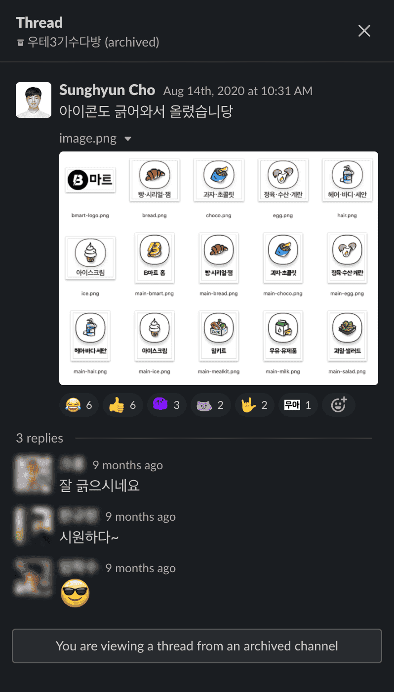

import DisplayFlex from '@site/src/components/DisplayFlex'


2020년 8월에 마무리하고 2021년에 후기를 쓰는 것이 너무 늦은 감이 있지만 지금 [4기 선발](https://www.woowahan.com/#/recruit/techcamp)이 진행 중인 마당에 지금이라도 올리지 않으면 평생 올리지 않을 것 같은 생각이 들어 지금이라도 후기를 마무리 지어 올려 본다. 인터넷에 공개된 대부분의 정보는 간단하게만 짚고 넘어가고 **내가 지원할 때 궁금했던 점** 위주로 작성해 보겠다.

**우아한테크캠프**는 **배달의민족**을 운영하는 테크 유니콘 기업 **우아한형제들**에서 여름 동안 인턴으로 근무하며 실무와 가까운 개발 및 프로그래밍 공부를 하는 프로그래머 양성 과정이다. 선발 인원은 30명이며 경쟁률은 대략 43대 1이다.

<figure>


<figcaption>

신발은 출입금지 — 일명 **스시바 라운지**. 전망이 좋아 선착순이다.

</figcaption>
</figure>

## 🔋 선발 과정

### 지원서

질문 하나 당 700자 분량이었다.

- 본인이 생각하는 개발자의 덕목과 여기에 비추어 보았을 때 본인의 어떤 점이 개발자로 일하기 적합하다고 생각하시나요?
- 우아한테크캠프에 참여하고 싶은 이유를 자유롭게 기술하여 주세요.
- 교과 과정 이외에 나만의 프로그래밍 학습 방법이 있다면 서술해주세요.
- 협업의 과정에서 어려움을 겪었던 경험과 그 어려움을 극복하기 위해 어떠한 노력을 했는지 서술해주세요.


### 1차 코딩 테스트

흔히 볼 수 있는 코딩 테스트 문제들이었다. 자바스크립트로 풀었던 것으로 기억하며 당시 프로그래머스 썸머코딩과 우아한테크캠프 때문에 코딩테스트 연습을 많이 했었기에 그렇게 부담스러운 난이도는 아니었다. 총 4문제로 150분이 주어졌다.

### 2차 코딩 테스트

제공되는 VS Code 웹 플랫폼에서 특정 기능을 수행하는 관리자 툴을 개발하는 프로젝트였다. 기본적인 보일러 플레이트와 빌드 설정, CI/CD는 미리 구현해 주셨기에 README에 설명된 대로 금방 실행할 수 있었으며 그 위에 3개의 핵심 기능을 구현해야 했다. 외부 라이브러리 사용은 금지됐고 바닐라 JS만으로 해결해야 했다. 시간은 4시간으로 꽤 길었는데 나는 시간이 부족하다고 느꼈다. 자세한 문제 전략에 대한 설명은 관계자님께서 공유할 수 없다고 말씀하셔서 생략한다... 😭

### 면접

코로나19로 인해 온라인으로 30분간 진행되었으며 개발자 채용 면접이 아니기에 기술적으로 깊은 내용을 물어보기보다는 프로그래머로서의 기본기를 잘 갖추고 있는지, 우테캠에서 배울 준비가 되었는지, 좋은 캠프 멤버로 활동할 수 있을지에 대한 부분을 주로 물어보신다는 느낌을 받았다. 특히 나의 경우 지원서에 이 기술 블로그를 언급했는데, 그중 [글 하나](/ko/w/4BB66F)에 대한 상세한 정보를 물어보셨다.

### 경쟁률

경쟁률에 대한 부분도 궁금했었는데 [나중에 알게 된 바](https://woowabros.github.io/devrel/2020/08/14/tecmpcamp_july_1.html)로는 다음과 같았다.

- 전체 지원자 1300명+ (43배수+)
- 서류 및 1차 코딩 테스트 통과자 500명+ (17배수+)
- 2차 코딩 테스트 통과자 90명 (3배수)
- 면접 통과 및 최종 합격자 30명


## 🏫 교육 과정

0.  OT 기간 (기간 3일)

- 미니 프로젝트: Express, HTTP 없이 웹 서버 구현하기.
- 공부 키워드: Node.js, JS OOP, 비동기 프로그래밍, 비동기 카페, HTTP 명세, HTTP 기초.
- [우리 팀 GitHub](https://github.com/woowa-techcamp-2020/anaclumos-yuda1124-sooojungee-learn-node)
- [내 블로그 글](/ko/r/940821)

<figure>

<DisplayFlex>


</DisplayFlex>

<figcaption>

OT가 이루어진 **작은집**. 잠실에 위치해 있다.

</figcaption>
</figure>

1.  로그인을 구현하는 프로젝트를 수행하는 **배민상회 프로젝트** (기간 1주)

- 조건
  - 바닐라 자바스크립트만을 활용한다.
  - Passport 등의 인증 시스템 없이 인증을 직접 구현한다.
  - 상용 DB를 사용하지 않고 파일 시스템으로 DB를 직접 구현한다.
- 공부 키워드: HTML, CSS, CSS Layout, Express.
- [우리 팀 GitHub](https://github.com/woowa-techcamp-2020/market-7)

<figure>

<DisplayFlex>


</DisplayFlex>

<DisplayFlex>


</DisplayFlex>

<figcaption>

우아한테크캠프의 본무대가 된 **큰집**. 몽촌토성역 12초 거리에 위치해 있다.

</figcaption>
</figure>

2.  칸반 보드를 직접 구현하는 **트렐로 프로젝트** (기간 2주)

- 조건
  - 바닐라 자바스크립트만을 활용한다.
  - Webpack을 직접 설정해 활용한다.
  - 드래그 & 드롭을 구현해야 하지만 HTML Drag and Drop API 없이 이벤트 버블링, 이벤트 캡처 그리고 이벤트 위임을 활용해 직접 구현해야 한다.
- 공부 키워드: Webpack, ES Module, DOM API, Templating, Fetch-Promise pattern, JS Event Delegation, DBMS, MySQL, SQL Syntax.
- [우리 팀 GitHub](https://github.com/woowa-techcamp-2020/todo-8)

<figure>

<DisplayFlex>


</DisplayFlex>

<figcaption>

큰집 18층 카페와 카페에서 바라본 올림픽공원의 모습이다.

</figcaption>
</figure>

3.  가계부 앱을 직접 구현하는 **뱅크샐러드 프로젝트** (기간 2주)

- 조건
  - 바닐라 자바스크립트만을 활용한다.
  - 바닐라 자바스크립트와 History API를 활용해 싱글 페이지 애플리케이션을 직접 구현한다.
  - CI/CD를 상용 솔루션 없이 직접 구현한다.
  - OAuth를 구현한다.
  - SVG와 캔버스 등을 활용해 그래프를 그린다.
- 공부 키워드: Observer Pattern, ERD, OAuth, Passport, State Management, Immutability, Transactions, Shell Scripts, CI/CD, CSS Animations & Optimizations (requestAnimationFrame & requestIdleCallback), SVG, Canvas.
- [우리 팀 GitHub](https://github.com/woowa-techcamp-2020/hkb-7)

<figure>


<figcaption>

종종 페어 프로그래밍을 했다. [지금 보이는 이 코드는...](https://github.com/woowa-techcamp-2020/hkb-7/blob/develop/server/routes/user.js)

</figcaption>
</figure>

4.  배달의민족 B마트를 직접 구현하는 **B마트 프로젝트** (기간 3주)

- 조건
  - Vanilla React를 활용한다.
  - AWS VPC를 활용한다.
  - S3 이미지 저장소를 활용한다.
  - Elastic Search, Logstash, Kibana (ELK) 조합을 활용한다.
- 공부 키워드: React Hooks, AWS VPC, React Router, React Context API, React useReducer, AWS IAM, AWS S3, React Test Codes (Jest, Enzyme, ...), Elastic Search, Logstash, Kibana, ELK.
- [우리 팀 GitHub](https://github.com/woowa-techcamp-2020/bmart-4)


---

## ✨ 좋았던 점들

우선 매달 150만원 정도의 활동비와 활동 장비(맥북 프로 💻 그리고 모니터 🖥)가 지급되었다.

<figure>

<DisplayFlex>


</DisplayFlex>

<figcaption>

2019년형 MacBook Pro 16인치 i9 고급형이 모두에게 대여되었다. 램은 16GB, SSD는 1TB, GPU는 Radeon 5500M 4GB. 2020년 캠프 당시 기준 CTO 없이 주문 가능한 최고 사양 맥북 프로였다. 모니터는 2인당 1개씩 총 15개가 지급되었다. 모니터는 ThinkVision QHD 모니터. 모니터가 부족할 줄 알았는데 여유로웠다.

</figcaption>
</figure>

### 👨‍💻 도대체 (초보자에게) 좋은 코드가 뭔데?

```js
// 우측 사이드바 활동 내역 로드
async function addActivityLogToActivityLogList() {
  let activityLogList = document.getElementById('activity-log-list')
  activityLogList.classList.add('activityLog')
  activityLogList.innerHTML = ''
  let userList = await api.User().getAllUsers()
  userList.reverse()
  console.log('현재 사용자는 [', userList.length, ']명 입니다.')
  userList.forEach((user) => {
    let activityLog = document.createElement('li')
    activityLog.classList.add('activityLog')
    let date = new Date(moment(user.created_at).format('YYYY-MM-DD HH:mm:ss'))
    activityLog.innerText = user.userId + '는 ' + date + '에 가입했습니다.'
    activityLogList.appendChild(activityLog)
  })
}
```

이 코드의 원본은 [여기](https://github.com/woowa-techcamp-2020/todo-8/blob/develop/frontEnd/src/app.js#L141-L156)에 있다.

> 어 — 이건 리뷰할 수 있는 상태가 아닌데. 누가 이거 썼어요? 얘기 좀 들어봅시다.

2번째 프로젝트가 끝난 7월 25일 금요일 오후 코드 리뷰 시간에 제비뽑기에 걸려 화면에 나타난 내 코드에 대한 피드백이다. 당시로선 극심한 시간의 압박을 잘 극복해나가고 꽤 잘 동작하는 페이지를 만들었다고 생각했었다. 그런데 이런 직설적인 평가를 들으니 정신적인 충격이 가시질 않았다. 글로는 잘 나타나지 않았는데 무언가 정말 얼어붙는 분위기였다.

그날 집에 가는 기차 안에서도 수많은 생각이 들었다. 잠시 마음을 가라앉히고 생각해 보니 **그래그래~ 우리 모두 잘했고 수고했어~**라고 넘기는 캠프였다면 오히려 좋은 캠프가 아니었을 것이라는 생각이 들었다. 문제집도 틀리는 문제가 있어야 좋은 문제집이라고 하는 것처럼. 그래서 남은 한 달 동안 내가 나름 잘 할 수 있는 것을 최대한 활용하고, 배울 수 있는 내용을 최대한 흡수하기로 다짐했던 기억이 난다.

프로그래밍 공부에 관심이 있는 주니어라면 "클린 코드, 좋은 패턴"과 같은 이야기를 종종 듣는다. 다만 **문제는 초보자의 입장에서는 이런 이야기를 기계적으로 너무 많이 듣다보니 무의식 중 외우듯이 반복하는 이야기일 뿐**, 도대체 어느 정도가 좋은 것인지에 대한 사실적인 감각이 없다는 것이다. 다시 돌아가 위의 코드를 본다면,

- 코드가 2가지 작업을 동시에 하고 있다. ① 정보를 받아오고 ② 정보를 표시하고 있다. 이럴 경우 코드의 의존성이 높아진다. 의존성이 높아지면 추후에 일부 코드를 교체해야 할 때 대수술을 진행하게 될 수 있다.
- 전반적으로 해당 파일에 로직과 뷰가 섞여있으며 가독성이 떨어진다.

조언을 바탕으로 3번째 프로젝트부터는 이런 개발 패턴에 많은 신경을 썼다. 3번째 프로젝트 중 일부분을 뽑아 미니 프로젝트를 한 적이 있는데 아마 무슨 느낌인지 짐작할 수 있을 것 같다.

- [바닐라 JS로 달력 만들기 @](/ko/w/F522B3)

### 🛷 더닝 크루거 썰매장

약간 클리셰이기는 하지만, **우매함의 봉우리**를 직접 경험할 수 있었다. 물론 내가 모든 것을 온전히 알고 있다는 생각은 한 적 없지만 자바스크립트로 이런 저런 프로젝트를 해본 경험이 있으니 "물론 노력해야겠지만, **어느 정도는 수월하게 따라갈 수도 있지 않을까?"**라고 감히 생각했었다.


당연하게도 우아한테크캠프는 엄청 어려웠다. 원래 커리큘럼의 목표는 각 프로젝트마다 제약 조건을 건 뒤 그 제약 조건으로 인한 아쉬움을 다음 프로젝트에서 해결하는 것이었다. 예를 들어 Passport를 사용하지 않고 인증을 구현해본 뒤 그다음 프로젝트에서 Passport를 사용하여 그 갈증을 해소하는 것이다. 하지만 반대로 이야기하면 이 과정이 1~2주마다 일어나기 때문에 이전 기술을 겨우 파악했을 때쯤 다음 기술로 곧바로 넘어가서 가파른 러닝 커브를 다시 경험해야 한다는 의미기도 했다.

우아한테크캠프에서 더닝 크루거의 썰매장을 경험한 것 같다. 나는 자바스크립트를 자유자재로 다룰 정도는 아니었기에 정말 열심히 따라가야 했다.

### 🌎 인터넷 시대에 아는 것이란?

또 검색이 존재하는 시대에 **아는 것이란 도대체 무엇인가**에 대한 고민도 많이 하게 되었다. 이 부분에 대해 프로그래밍에 한정한다면 약간의 답을 찾은 것 같다. GSPH라는 개념인데, Googling Session Per Hour의 약자이다. Googling Session이란 5분 이상의 깊은 검색 작업을 의미한다. 예를 들어 자바스크립트 속성 함수 이름이 기억이 나지 않아 검색을 2분 만에 마쳤다면 Googling Session에 해당하지 않지만 OAuth가 잘 생각나지 않아 10분간 도큐먼트를 봐야 한다면 Googling Session에 해당한다.


어느 작업을 할 때 1시간에 Googling Session이 (대략) 3회 이하라면 그 개념을 안다고 할 수 있는 것 같다. 즉 작업을 할 때 중간중간 짧은 검색을 하는 것은 그 개념을 모른다는 뜻으로 직결되지 않는다. 하지만 작업의 모든 디테일을 일일이 다 찾아봐야 한다면 아직은 공부가 더 필요하다는 뜻이다.

### 👾 라이브러리 ≠ 외계 기술

프레임워크와 라이브러리를 외계인의 기술처럼 대하는 경우가 종종 있다. 물론 잘 알려진 프레임워크와 라이브러리는 검증된 효율적인 코드들의 집합이지만, **다가갈 수 없는 에일리언 테크놀로지**라고 생각해버리고 **모든 고민을 라이브러리에 위임하는 접근 방식**은 조금 위험할 수 있다.


특히 웹 라이브러리들의 기반 기술은 우리도 쓸 수 있는 Plain JavaScript이다. 무작정 외부 라이브러리에 의존하는 것이 아니라 그 라이브러리가 어떻게 동작하는지, 잠재적인 위험 요소는 무엇이 있는지를 알고 써야 한다는 점이 캠프 내내 지속적으로 강조되었다. 즉 부득이한 경우 비슷한 형태로 라이브러리를 구현 가능할 정도로 세심하게 공부해야 한다.

> 라이브러리는 프로토스👽 기술이 아니라 테란🧑‍🔧 기술이다.

일례로 2016년 일어난 [left-pad 사건](https://blog.npmjs.org/post/141577284765/kik-left-pad-and-npm)이 있다. `left-pad`라는 11줄짜리 라이브러리가 npm에서 삭제되었고 이로 인해 의존 관계가 도미노처럼 무너지며 `babel`이라는 트랜스 파일러가 사용 불가능해진 것이다. 생각해보면 이 사건도 금방 작성할 간단한 코드에 과하게 의존하는 바람에 발생한 문제 아닌가?

취미 개발자의 입장이라면 "엥? babel 그거 수십만 명이 사용하는 정말 믿음직한 라이브러리잖아, 그거 신경 쓸 시간에 내 코드 안전성이나 신경 써야지"라고 생각할 수 있겠지만 30분만 서비스가 다운되어도 엄청난 금전적인 손실을 겪는 기업의 입장에서는 이런 고민은 필수적이라는 뜻이다. 즉 라이브러리는 알 수 없는 외계인의 기술도 아니고, 우리가 기우제를 지낼 대상도 아니고, 마찬가지로 언제든지 손상될 수 있는 서비스라는 점을 염두에 두어야 한다.

---

## 🥳 재미있었던 일들

### 🧩 배민 이미지 서버 크롤링하기

마지막 B마트 서비스를 제작할 때 배민의 B마트 자료가 엄청나게 많이 필요한 일이 있었다. 사진 칸에 넣을 사진이 있어야 앱 느낌이 날 테니 말이다. [예전의 경험](/w/21E029)을 살려 배민 서버에 있는 이미지 리소스를 (관계자 님의 허락을 받고) 긁었다.


엄밀하게 말하면 이미지들은 CDN 오픈웹에 존재하는 형태이기 때문에 **배민 서버 해킹**은 아니다. 문제는 이 엔드 포인트들과 뒤의 이미지 주솟값이 알 수 없게 **숨겨져 있다**는 것이다.

    http://CDN도메인.baemin.com/무슨/무슨/1abcde23-아주긴-알파뉴메릭-주소.jpg

최종 이미지 CDN URI는 대충 이렇게 생겼고 접속하면 이미지가 나온다.

단순하게 B마트 웹뷰를 띄워서 CSS 셀렉터를 쓰는 얕은 수준의 크롤링도 아니었고 우테캠이라고 리소스 서버 내부 자료를 공유 받은 것도 아니어서 꽤나 노력이 들어갔다. 간단하게만 공유하자면 iOS 배민 앱 통신을 감청해서 엔드 포인트와 이미지 주소를 알아냈고 약간의 CTF를 통해서 이미지 주소 리스트를 알아낼 수 있었다. 해당 이미지 서버에 있는 이미지와 아이콘, 효과음 등을 1,000건 정도 긁어서 다른 우테캠 캠프생 분들이 쓸 수 있도록 프라이빗 저장소에 공유했다.



### 🏢 소용돌이 기업야사

우리나라 기업들의 비하인드스토리를 중간중간 들을 수 있었다. 모 게임 기업에서는 아이템이 수십만 개씩 양산되기에 RDB를 잘 쓰지 않고 바이너리 덤프를 사용한다는 이야기, 누군가 게임 DB 필드를 조작해 몇억 원짜리 아이템을 복제한 사건이 발생해 이후부터 DB 접근 권한 관리가 매우 철저해졌다는 이야기, 모 숙박 업체에서 개발자들이 모든 회원들의 개인 정보를 열람할 수 있어서 한동안 개발자들이 마음대로 연예인 회원 정보를 열람했었다는 이야기, 모 검색 업체 의장이 "경쟁 업체보다 1초 빠르게 만들어"라고 지시했었다는 이야기... 기업 생태계에 관심이 많은 나에게는 정말 재미있는 이야기였다.


### ⚡️ 시너지 x 시너지 = 시너지<sup>3</sup>

**그럼에도 불구하고** 최고의 장점은 다른 우아한테크캠프생 분들을 만난 점이라고 생각한다. 최고의 복지는 훌륭한 동료들이라는 말이 무슨 느낌인지 살짝 이해한 것 같았다. 가장 대표적으로 [jhaemin](https://github.com/jhaemin)님을 이야기해보고 싶다.

우테캠은 모든 프로젝트를 시작할 때 디자인 시안 및 기획서를 준다. 다만 그 내용은 권고사항일 뿐이고 실제 구현은 자유롭게 할 수 있다. 즉, 디자인을 고쳐서 사용성과 심미성을 개선하는 것은 순전히 **캠프생**들의 몫이다. 처음에는 이 디자인이 **의무적으로** 따라야 하는 디자인이라고 생각했지만 그렇지 않았다. 결국 좋은 동료는 일을 **찾아서 하는** 사람이라는 것을 넌지시 암시하기라도 하듯 모든 것은 자유롭게 열려있었다. 디자인을 개선하든, 기능을 추가하든, 아니면 반대로 무언가를 삭제하든, 큰 힘이 주어지고 큰 책임감을 지는 것이었다.

프론트엔드 개발자의 디자인 정신, 이 부분에 있어서는 같이 캠프생이었던 [jhaemin](https://github.com/jhaemin)님께 정말 많은 영향을 받았다. 자신만의 확고한 디자인 체계로 사용성 좋은 웹앱을 뚝딱 만드시는 것을 보며 많이 배우게 되었다. 내가 정말 충격을 받았던 사이트 2개를 직접 본다면 무슨 말인지 알게 될 것이다.

- [woowa-techcamp-2020/market-6](https://github.com/woowa-techcamp-2020/market-6)
- [woowa-techcamp-2020/todo-14](https://github.com/woowa-techcamp-2020/todo-14)

영향을 많이 받아 나도 3번째 뱅크샐러드 프로젝트부터 디자인을 개선해보았다. 이렇게 디자인을 온전히 수정했다 ↓


내가 느끼기에 내 디자인의 장점은 ① 화면 요소를 3열로 나누어 배치해서 와이드 스크린의 장점을 적극 활용한다는 점과 ② 우측의 활동 내역 창이 독립적으로 동작하기 때문에 자유롭게 달력, 통계, 결제 수단 관리로 이동해도 우측창의 내용이 유지된다는 점이다. 슬랙이랑 비슷한 느낌?

이 외에도 [바닐라 자바스크립트로 유사 React를 만들어버리신](https://velog.io/@naamoonoo/%EB%A6%AC%EC%95%A1%ED%8A%B8-%EB%94%B0%EB%9D%BC%ED%95%98%EB%A0%A4%EB%8B%A4-%EB%B0%94%EC%A7%93%EA%B0%80%EB%9E%91%EC%9D%B4-%EC%B0%A2%EC%96%B4%EC%A7%84-%EC%9D%B4%EC%95%BC%EA%B8%B0-2%EC%A3%BC%EC%B0%A8-%ED%9A%8C%EA%B3%A0) [naamoonoo](https://github.com/naamoonoo)님, 주말동안 Elastic Search를 완성해오신 [pigrabbit](https://github.com/pigrabbit)님, React를 숨 쉬듯 편안하게 다루시던 [dnacu](https://github.com/dnacu)님, JS만으로 SPA 구조와 싱글톤 패턴을 뚝딱 구현하신 [younho9](https://github.com/younho9)님, 데이터 접근 전략을 체계적으로 구현하신 [0407chan](https://github.com/0407chan)님, 밤새 디자인 구조를 싹 끝내신 [Jenny](https://github.com/eunjung-jenny) 님 등... 여기에 다 적지 못할 정도로 정말 배울 것이 넘쳐났다.

---

## 🎬 기타 및 결론

- Git과 GitHub으로 심화된 협업을 처음 해봤다. 1인 개발을 할 때는 git의 `branch` `checkout` 기능을 제대로 활용할 일이 많지 않다. Git 협업에 있어서는 GSPH<3으로 정말 잘 배운 것 같다.
- 중간 중간 강의들이 정말 좋았다. 매주 수요일마다 있던 강의들에서 배민 서비스의 개발과 운영에 대한 흥미로운 점들이 보였다. 특히 [김민태 개발자님의 강의](/ko/r/02B616)가 정말 인상적이었다.
- 회사 생활을 간접 경험해볼 수 있어서 정말 좋았다. 21살에 회사 생활을 경험해볼 수 있다니!
- 친절하게 알려주는 형 누나들이 이해심이 정말 깊었다. 나를 배려해준다는 것이 느껴졌었다. 중간 중간 레크리레이션 활동도 많았는데, 코로나19 때문에 레크리레이션 활동이 축소된 것이 아쉬웠다.
- 정말 소중한 경험이었고 새로운 가르침을 많이 얻었다. 내가 기본기가 조금 더 출중했다면 훨씬 더 깊은 내용까지 공부할 수 있었을텐데, 그러지 못해 아쉬움이 약간 남는다. 앞으로의 여정에 있어 정말 좋은 자산이 된 것 같다.
- 물론, 내가 곧장 완벽할 수는 없을 것이다. 나도 요즘 이상과 현실의 괴리를 조금씩 느끼고 있다. 그래도 우리의 이상향에 나침반을 맞추고 걸어나간다면 언젠가는 도달하지 않을까 — 하는 일말의 믿음이 있을 뿐이다 🧭

<details>
<summary>📚 더 많은 자료들</summary>

- 우아한형제들 공식 자료

  - [우아한테크캠프 3기 모집 안내](https://woowabros.github.io/devrel/2020/04/13/techcamp3.html)
  - [우아한테크캠프 3기 7월의 일기](https://woowabros.github.io/devrel/2020/08/14/tecmpcamp_july_1.html)
  - [우아한테크캠프 3기 7월의 회고](https://woowabros.github.io/devrel/2020/08/19/techcamp_july_2.html)
  - [우아한테크캠프 3기 8월의 일기](https://woowabros.github.io/devrel/2020/09/08/techcampaugust.html)
  - [우아한테크캠프 3기 8월의 회고](https://woowabros.github.io/devrel/2020/09/14/techcamp3blog.html)

- 7월의 기록들

  - [(우아한테크캠프 3기) 캠프의 반환점을 돌며](https://zoomkoding.github.io/%ED%9A%8C%EA%B3%A0/%EC%9A%B0%EC%95%84%ED%95%9C%ED%85%8C%ED%81%AC%EC%BA%A0%ED%94%84/2020/07/26/woowa-tech-camp-mid-term.html)
  - [2020 우아한 테크캠프(3기) 7월 후기](https://velog.io/@blair/%EC%9A%B0%EC%95%84%ED%95%9C-%ED%85%8C%ED%81%AC%EC%BA%A0%ED%94%84-7%EC%9B%94-%ED%9B%84%EA%B8%B0)
  - [\[우아한테크캠프 3기\] 2번째 페어프로그래밍 종료 및 회고 👀](https://haerang94.tistory.com/10)
  - [기본은 중요했다.](https://quail-han.tistory.com/20)
  - [나는 찐-개발자인가 (우아한테크캠프 3기 4주차 회고)](https://younho9.dev/am-i-real-developer)
  - [당신이 우아한테크캠프에 도전해야 하는 3가지 이유](https://www.notion.so/3-2da3c0db345c4512bd3d6f277c595d9e)
  - [두번째 프로젝트 - Todo List 개발기](https://yuda1124.github.io/woowa-todolist/)
  - [우아한 테크 캠프로 성장하기](https://www.notion.so/99af27fb380b4b1bbe751f90f48c293a)
  - [우아한테크캠프에 오기까지 그리고 지난 4주의 회고](https://www.notion.so/4-b766aaa13f954cb09ad1adde5ac1ecc2)
  - [좋은 동료는 무엇인가?](https://changicho.tistory.com/25)
  - [주니어 개발자가 느낀 '나에게 있어 부족한, 그래서 갖춰야 할' 현업능력](https://velog.io/@tnk2u/%EC%A3%BC%EB%8B%88%EC%96%B4-%EA%B0%9C%EB%B0%9C%EC%9E%90%EA%B0%80-%EC%83%9D%EA%B0%81%ED%95%98%EB%8A%94-%EC%84%B1%EC%88%99%ED%95%9C-%EA%B0%9C%EB%B0%9C%EC%9E%90)

- 8월의 기록들

  - [(우아한테크캠프 3기) 캠프를 마치며](https://zoomkoding.github.io/%ED%9A%8C%EA%B3%A0/%EC%9A%B0%EC%95%84%ED%95%9C%ED%85%8C%ED%81%AC%EC%BA%A0%ED%94%84/2020/10/05/woowa-tech-camp-final.html)
  - [Frontend Designer](https://blog.jhaemin.com/frontend-designer#kor)
  - [나는 비로소 성장했습니다. (우아한테크캠프 3기)](https://changicho.tistory.com/28)
  - [도착지는 하나지만, 가는 길은 하나가 아니다.](https://quail-han.tistory.com/21)
  - [마음의 소리 (우테캠 3기를 마치며)](https://www.notion.so/3-b08da2dc608645f7aac55a484c68b946)
  - [우테캠 매일의 짧은 기록](https://www.notion.so/e6c39818e2ac4577a3dfc2f4fef0d1ad)
  - [친절과 불친절 사이 - 우아한 테크 캠프 전체 회고](https://velog.io/@naamoonoo/%EC%B9%9C%EC%A0%88%EA%B3%BC-%EB%B6%88%EC%B9%9C%EC%A0%88-%EC%82%AC%EC%9D%B4)

- 기술 관련

  - [우아한 테크캠프 3기 스터디 블로그](https://woowa-techcamp-2020.github.io/practice-interview/)
  - [CI 붙이기 위해 GitHub Organization에 권한 요청하기](https://github.com/woowa-techcamp-2020/market-3/wiki/CI-%EB%B6%99%EC%9D%B4%EA%B8%B0-%EC%9C%84%ED%95%B4-GitHub-Organization%EC%97%90-%EA%B6%8C%ED%95%9C-%EC%9A%94%EC%B2%AD%ED%95%98%EA%B8%B0)
  - [Context API, LifeCycle API, Component Docs, Component, Design Pattern, Redux](https://github.com/changicho/TIL/tree/master/frontend/react)
  - [Getting started to import...](https://www.notion.so/Getting-started-to-import-2a74cd0530df414888aa35d03c54c936#a8cb4fc856e2457e82ec7e5a7b478779)
  - [Git 단축키 허니팁](https://github.com/woowa-techcamp-2020/todo-13/wiki/Git-%EB%8B%A8%EC%B6%95%ED%82%A4-%ED%97%88%EB%8B%88%ED%8C%81)
  - [Github Actions + CodeDeploy + EC2 자동배포하기](https://www.notion.so/Github-Actions-CodeDeploy-EC2-6d74884a83ef47babce65b47dc130a1a)
  - [Image Lazy Loading](https://github.com/woowa-techcamp-2020/bmart-10/wiki/Image-Lazy-Loading)
  - [Iterm 호출](https://www.notion.so/Iterm-a8bd15b995124f0eb94182eb03f35f0b)
  - [React 애플리케이션 아키텍처 - 아무도 알려주지 않아서 혼자서 삽질했다.](https://www.slideshare.net/byungdaesohn/react-76078368)
  - [TIL_20200715](https://www.notion.so/TIL_20200715-84bbe0a9dd2d4664b5a1a36b10c5b1b8)
  - [TIL_20200802(Postman과 이별하기)](https://www.notion.so/TIL_20200802-Postman-5a2692ff78c74368a4e382ecf3ccef5e)
  - [TIL_20200816](https://www.notion.so/TIL_20200816-eea7c20e22444afa8e3578955de9d1d2)
  - [TIL_20200817](https://www.notion.so/TIL_20200817-22d0cea752a64974b8f3eda7ac40e6a5)
  - [TIL_20200824](https://www.notion.so/TIL_20200824-fca07160d5404208b1c3977677173593)
  - [VS Code에서 생산성을 향상해보자](https://www.notion.so/VS-Code-576294cd06784db0a5e5f092429d02fb)
  - [VSCode에서 alias IntelliSense 적용시키기](https://www.notion.so/VSCode-alias-IntelliSense-5133854c58ba470d98abaad06333407c)
  - [VanilaJS로 달력 구현하기.](https://github.com/woowa-techcamp-2020/hkb-9/wiki/%EB%8B%AC%EB%A0%A5-%EB%A7%8C%EB%93%A4%EA%B8%B0)
  - [Webpack으로 boilerplate 만들기 - 1 (webpack, babel 설정하기)](https://haerang94.tistory.com/m/5?category=791931)
  - [\[NPM\] semantic versioning](https://github.com/eunjung-jenny/deep_dive/blob/master/semantic%20versioning.md)
  - [cookie parser](https://github.com/woowa-techcamp-2020/market-9/wiki/cookie-parser)
  - [express.json() vs express.urlencoded()](<https://github.com/woowa-techcamp-2020/market-9/wiki/express.json()-vs-express.urlencoded()>)
  - [heroku mysql 연동해서 webpack + express 프로젝트 배포해보기 (heroku mysql연동편)](https://haerang94.tistory.com/8?category=791931)
  - [mouse event만으로 투두리스트(todo list) 만들기 (feat. 이벤트 위임)](https://changicho.tistory.com/23)
  - [mouse 이벤트로 drag and drop 구현하기](https://github.com/woowa-techcamp-2020/todo-1/wiki/mouse-%EC%9D%B4%EB%B2%A4%ED%8A%B8%EB%A1%9C-drag-and-drop-%EA%B5%AC%ED%98%84%ED%95%98%EA%B8%B0)
  - [woowahan-ORM A very light promise-based Node.js ORM for MySQL](https://github.com/woowa-techcamp-2020/woowahan-orm)
  - [기술면접대비](https://docs.google.com/spreadsheets/d/1kLRKDLHAX5mu0XwxgdAmSbp7NCmbwEqGpPxZWya4gyY/edit#gid=0)
  - [기술문서 : GraphQL](https://github.com/woowa-techcamp-2020/bmart-3/wiki/%EA%B8%B0%EC%88%A0%EB%AC%B8%EC%84%9C-:-GraphQL)
  - [드래그 앤 드롭 애니메이션](https://github.com/woowa-techcamp-2020/todo-14/blob/main/doc/Drag-and-Drop-with-Animation.md)
  - [리액트 따라하려다 바짓가랑이 찢어진 이야기](https://github.com/naamoonoo/wtc/blob/master/wooact/doc/%EB%A6%AC%EC%95%A1%ED%8A%B8%20%EB%94%B0%EB%9D%BC%ED%95%98%EB%A0%A4%EB%8B%A4%20%EB%B0%94%EC%A7%93%EA%B0%80%EB%9E%91%EC%9D%B4%20%EC%B0%A2%EC%96%B4%EC%A7%84%20%EC%9D%B4%EC%95%BC%EA%B8%B0%20695f40ce352e4f279ac026b4a6c17947.md)
  - [리액트는 어떻게 작동할까 - Diffing](https://www.notion.so/Diffing-3f98bc8be2d448fc8013f53ea595e647)
  - [마우스 이벤트를 이용한 Drag & Drop 구현기](https://www.notion.so/Drag-Drop-5267f4f650a3407e998fa9b0a2bd67da)
  - [배민상회 카테고리 메뉴 어설픈 개선(?) 후기](https://www.notion.so/399b82afc08a487b8b69e0358c20f1a8)
  - [안녕, Passport](https://parkjihwanjay.github.io/third-post/)
  - [오토바이는 어떻게 날아왔을까?](https://github.com/naamoonoo/wtc/tree/master/animation-css)
  - [커스텀 엘리먼트(Custom Elements)](https://www.notion.so/Custom-Elements-c8d32964bec6453e9ef6161513671ff8)
  - [쿠팡 카테고리 메뉴 어설픈 개선(?) 후기](https://www.notion.so/5b0b0aa4804041d2bbc5dbb79f398d5f)
  - [프로젝트 깃허브 페이지에 배포하기](https://www.notion.so/ae3b7117ad8b4b70968ba0f428b70e51)
  - [프론트엔드 개발환경 설정하기](https://github.com/woowa-techcamp-2020/todo-9/wiki/%ED%94%84%EB%A1%A0%ED%8A%B8%EC%97%94%EB%93%9C-%EA%B0%9C%EB%B0%9C%ED%99%98%EA%B2%BD-%EC%84%A4%EC%A0%95%ED%95%98%EA%B8%B0)

- 이미지 소스
  - 더닝 크루거 효과
  - 미란다 (시트콤)
  - MBC 무한도전
  - StarCraft II: Legacy of the Void Opening Cinematic

</details>


