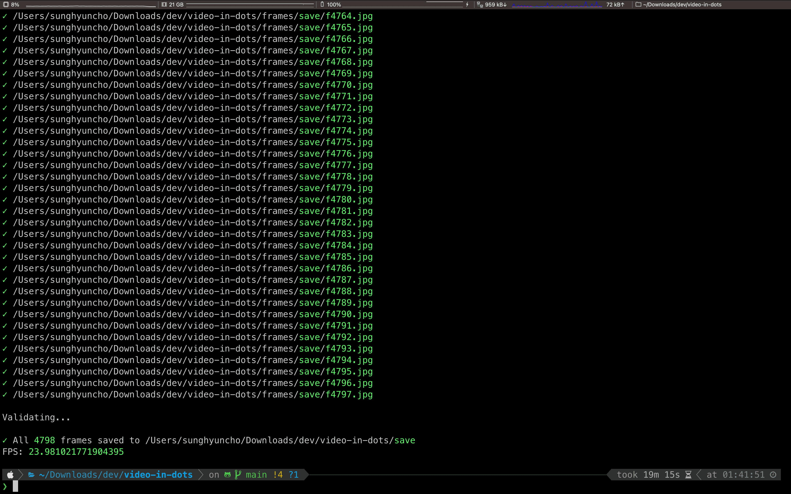
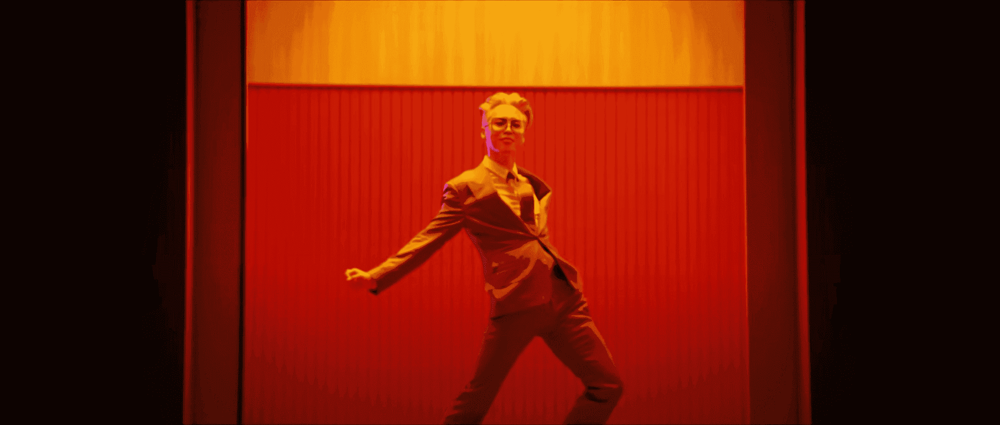

import YouTube from '@site/src/components/YouTube'
import DisplayFlex from '@site/src/components/DisplayFlex'

OK — I admit.
The title is slightly misleading.
You are reading a technical post about converting any video into an ASCII Art text stream that one _can_ play on the terminal.
The text stream here is a subtitle file.
You can use any video player or terminal program to parse and display subtitles to play the music video.
But the _playing_ part is out of the scope of this post.
Still don't get it? Here's a demo:

<YouTube id="t_YsTEhcTpo"/>

Enable subtitles and wait for a couple of seconds.
If the video errors out, check out the following screen recording:

<YouTube id="-Dby42c_4Y4"/>

My text streams use braille to represent pixels.
And to display consecutive streams of texts paired with music playback, what would be more suitable than the subtitle format? Therefore, I aim to convert any video into a YouTube subtitle.
The tech stack is:

- OpenCV (C++ cv2) — used to convert video into frames
- Python Image Library (Python 3 Pillow) — used to convert frames into ASCII art (braille)
- Python Standard Library (sys, os, pathlib) — used to read and write files
- ffmpeg (optional) — used to pack everything into a video

Open-sourced on GitHub: [anaclumos/video-in-dots](https://github.com/anaclumos/video-in-dots).

:::note
Technically, braille characters are not ASCII characters.
They are Unicode, but let's not be too pedantic.
:::

## Design

We need to first prove the concept (PoC) that the following technologies achieve our goal:

1. Converting any image into a monochrome image
2. Converting any monochrome image into ASCII art
3. Converting any video into a series of images
4. Converting any frames into a series of ASCII art and then packaging them into a subtitle file.
5. (Figured out later) Compressing the subtitle files under a specific size.
6. (Figured out later) Dithering the images to improve the quality of the ASCII art.

## 1. Converting images into [monochrome images](https://en.wikipedia.org/wiki/Binary_image)

A monochrome image is an image with 1-bit depth, comprised of `#000000` and `#FFFFFF` colors.
Note that grayscale images are not monochrome images.
Grayscale images also have a wide range of gray colors between `#000000` and `#FFFFFF`.
We can use these pure black and white colors to represent the raised and lowered dots of the braille characters, to visually distinguish borders and shapes.
Therefore, we convert an image into a BW image and again convert that into a 1-bit depth image.
One detail we should note is that subtitles are usually white, so we want the white pixel in the monochrome image to represent 1, the raised dot in braille.


The leftmost image has 256 shades of gray, and the right three images have only two shades of gray, represented in different monochrome conversion algorithms.
I used the Floyd-Steinberg dithering algorithm in this project.

### Converting the image

There are many ways to convert an image into a monochrome image.
However, this project only uses sRGB color space, so I used the CIE 1931 sRGB Luminance conversion algorithm.
[Wikipedia](https://en.wikipedia.org/wiki/Grayscale#Converting_colour_to_greyscale).
Sounds fancy, but it's just a formula:

```python
def grayscale(red: int, green: int, blue: int) -> int:
    return int(0.2126 * red + 0.7152 * green + 0.0722 * blue)
```

`red`, `green`, and `blue` are the RGB values of the pixel, represented in integers from 0 to 255.
If their sum goes over the `hex_threshold`, the pixel is white (`1`); otherwise, it is black.
We can now run this code for every pixel.
This grayscale code is for understanding the fundamentals.
We will use Python PIL's `convert` function to convert the image into a monochrome image.
This library also applies the Floyd-Steinberg dithering algorithm to the image.

```python
resized_image_bw = resized_image.convert("1")  # apply dithering
```

## 2. Converting any monochrome image into arbitrary-sized ASCII arts

The above sentence has three parts.
Let's break them down.

1. Converting any monochrome image into
1. Arbitrary-sized
1. ASCII arts

We figured out the first, so now let's explore the second.

### Resizing images with PIL

We can use the following code to resize an image in PIL:

```python
def resize(image: Image.Image, width: int, height: int) -> Image.Image:
    if height == 0:
        height = int(im.height / im.width * width)
    if height % braille_config.height != 0:
        height = int(braille_config.height * (height // braille_config.height))
    if width % braille_config.width != 0:
        width = int(braille_config.width * (width // braille_config.width))
    return image.resize((width, height))
```

I will use two-by-three braille characters, so I should slightly modify the height and width of the image to make it divisible by 2 and 3.

### Converting the image

Seeing the image will help you better understand.
For example, let's say we have the left image (6 by 6).
We would cut the image into two-by-three pieces and converted each piece into a braille character.


The key here is to find the correct braille character to represent the two-by-three piece.
A straightforward approach is to map all the two-by-three pieces into an array, especially since two-by-three braille characters only have 64 different combinations.
But we can do better by understanding how Unicode assigns the character codes.


To convert a two-by-three piece into a braille character, I made a simple [util function](https://github.com/anaclumos/tools-image-to-braille).
This code uses the above logic to resize the image, convert it into braille characters, and color them on the terminal.
You can color the terminal output with `\033[38;2;{};{};{}m{}\033[38;2;255;255;255m".format(r, g, b chr(output))`.
For more information, see [ANSI Color Escape Code](https://en.wikipedia.org/wiki/ANSI_escape_code).
If you want to try it out, here is the code: [anaclumos/tools-image-to-braille](https://github.com/anaclumos/tools-image-to-braille)

:::tip
This code uses an ANSI True Color profile with 16M colors.
macOS Terminal will not support 16M color; it only supports 256.
You can use iTerm2 or VS Code's integrated terminal to see the full color.
:::

## 3. Converting any video into a series of images

I planned to experiment with different dimensions with the same image, so I wanted to cache the images physically.
I decided to use Python OpenCV to do this.

1. Set basic configurations and variables.
1. Read the video file.
1. Create a directory to store the images.
1. Loop through the video frames.



## 4. Convert text streams into formalized subtitle files

I already had the braille conversion tool from section 2; now, I needed to run this function for every cached image.
I first tried to use the `.srt` (SubRip) format.
The `.srt` file looks like this:

```
1
00:01:00,000 --> 00:02:00,000
This is an example
SubRip caption file.
```

The first line is the sequence number, and the second is the time range in the `Start --> End` format ( `HH:mm:ss,SSS` ).
Lastly, the third line is the subtitle itself.
I chose SubRip because it supported colored subtitles.


I made several SubRip files with different colors, but YouTube won't recognize the color; it turned out SubRip's color styling is nonstandard.

### Types of subtitles YouTube supports

<DisplayFlex>


</DisplayFlex>

YouTube docs shows the above table.
I figured that SAMI files supported simple markups, so I used SAMI.
(Oddly enough, I am very familiar with SAMI because `.smi` is the standard file for Korean subtitles.) Creating subtitles is already simple because it is appending text to a file in a specific format, which didn't require a lot of code change.
[Microsoft docs](https://docs.microsoft.com/en-us/windows/win32/wmp/sami-file-example) shows the structure of SAMI files.

```xml
<SAMI>
<HEAD>
    <STYLE TYPE = "text/css">
    <!--
    /* P defines the basic style selector for closed caption paragraph text */
    P {font-family:sans-serif; color:white;}
    /* Source, Small, and Big define additional ID selectors for closed caption text */
    #Source {color: orange; font-family: arial; font-size: 12pt;}
    #Small {Name: SmallTxt; font-size: 8pt; color: yellow;}
    #Big {Name: BigTxt; font-size: 12pt; color: magenta;}
    /* ENUSCC and FRFRCC define language class selectors for closed caption text */
    .ENUSCC {Name: 'English Captions'; lang: en-US; SAMIType: CC;}
    .FRFRCC {Name: 'French Captions'; lang: fr-FR; SAMIType: CC;}
    -->
    </STYLE>
</HEAD>
<BODY>
    <!<entity type="mdash"/>- The closed caption text displays at 1000 milliseconds. -->
    <SYNC Start = 1000>
        <!-- English closed captions -->
        <P Class = ENUSCC ID = Source>Narrator
        <P Class = ENUSCC>Great reason to visit Seattle, brought to you by two out-of-staters.
        <!-- French closed captions -->
        <P Class = FRFRCC ID = Source>Narrateur
        <P Class = FRFRCC>Deux personnes ne venant la r&eacute;gion vous donnent de bonnes raisons de visiter Seattle.
</BODY>
</SAMI>
```

You can see it's just a simple XML file.
Looking closely, you can also see how multi-language subtitles are handled in one SAMI file.

## 5. Compressing the text files


I finally got my hands on the SAMI file to discover that the file was over **70MB**.
I couldn't find any official size limit for YouTube subtitles, but empirically, I discovered the file size limit was around 10MB.
So I needed to compress the files.

I thought of three ways to compress the files:

1.  Reduce the width and height.
2.  Skip some frames.
3.  Use color stacks.

I already separated the configurations from the main code, so I could easily change the width, height, and frame rate.
However, after many experiments, I figured that YouTube only supports 8—10 frames per second for subtitles, so I decided to skip some frames to reduce the file size.

```python
class braille_config:
    # 2 * 3 braille
    base = 0x2800
    width = 2
    height = 3


class video_config:
    width = 56
    height = 24
    frame_jump = 3  # jumps 3 frames
```

What I mean by "color stacks" is that I could push the same color to the stack and pop it when the color changes.
Let's take a look at the original SAMI file:

```xml
<FONT color="#FFFFFF">⠿</FONT>
<FONT color="#FFFFFF">⠿</FONT>
<FONT color="#FFFFFF">⠿</FONT>
<FONT color="#FFFFFF">⠿</FONT>
<FONT color="#FFFFFF">⠿</FONT>
<FONT color="#FFFFFF">⠿</FONT>
<FONT color="#FFFFFF">⠿</FONT>
<FONT color="#FFFFFF">⠿</FONT>
<FONT color="#FFFFFF">⠿</FONT>
<FONT color="#FFFFFF">⠿</FONT>
<FONT color="#FFFFFF">⠿</FONT>
<FONT color="#FFFFFF">⠿</FONT>
<!-- Text Length: 371 -->
```

Although they are all the same color, the code appended the color tag for every character.
Therefore, I can reduce the repetition by using color stacks:

```xml
<FONT color="#FFFFFF">⠿⠿⠿⠿⠿⠿⠿⠿⠿⠿⠿⠿</FONT>
<!-- Text Length: 41. Reduced by 89% -->
```

It's not the complete-search-maximal-compression you usually see when Leetcoding, but it's still an excellent compression to make it under 10MB.
This simple algorithm is especially good when you have black-and-white videos.

```xml
<SYNC Start=125><P Class=KOKRCC><FONT color="#FFFFFF">⠿⠿⠿⠿⠿⠿⠿⠿⠿⠿⠿⠿⠿⠿⠿⠿⠿⠿⠿⠿⠿⠿⠿⠿⠿⠿⠿⠿</FONT><BR><FONT color="#FFFFFF">⠿⠿⠿⠿⠿⠿⠿⠿⠿⠿⠿⠿⠿⠿⠿⠿⠿⠿⠿⠿⠿⠿⠿⠿⠿⠿⠿⠿</FONT><BR><FONT color="#FFFFFF">⠿⠿⠿⠿⠿⠿⠿⠿⠿⠿⠿⠿⠿⠿⠿⠿⠿⠿⠿⠿⠿⠿⠿⠿⠿⠿⠿⠿</FONT><BR><FONT color="#FFFFFF">⠿⠿⠿⠿⠿⠿⠿⠿⠿⠿⠿⠿⠿⠿⠿⠿⠿⠿⠿⠿⠿⠿⠿⠿⠿⠿⠿⠿</FONT><BR><FONT color="#FFFFFF">⠿⠿⠿⠿⠿⠿⠿⠿⠿⠿⠿⠿⠿⠿⠿⠿⠿⠿⠿⠿⠿⠿⠿⠿⠿⠿⠿⠿</FONT><BR><FONT color="#FFFFFF">⠿⠿⠿⠿⠿⠿⠿⠿⠿⠿⠿⠿⠿⠿⠿⠿⠿⠿⠿⠿⠿⠿⠿⠿⠿⠿⠿⠿</FONT><BR><FONT color="#FFFFFF">⠿⠿⠿⠿⠿⠿⠿⠿⠿⠿⠿⠿⠿⠿⠿⠿⠿⠿⠿⠿⠿⠿⠿⠿⠿⠿⠿⠿</FONT><BR><FONT color="#FFFFFF">⠿⠿⠿⠿⠿⠿⠿⠿⠿⠿⠿⠿⠿⠿⠿⠿⠿⠿⠿⠿⠿⠿⠿⠿⠿⠿⠿⠿</FONT><BR></SYNC>
<SYNC Start=250><P Class=KOKRCC><FONT color="#FFFFFF">⠿⠿⠿⠿⠿⠿⠿⠿⠿⠿⠿⠿⠿⠿⠿⠿⠿⠿⠿⠿⠿⠿⠿⠿⠿⠿⠿⠿</FONT><BR><FONT color="#FFFFFF">⠿⠿⠿⠿⠿⠿⠿⠿⠿⠿⠿⠿⠿⠿⠿⠿⠿⠿⠿⠿⠿⠿⠿⠿⠿⠿⠿⠿</FONT><BR><FONT color="#FFFFFF">⠿⠿⠿⠿⠿⠿⠿⠿⠿⠿⠿⠿⠿⠿⠿⠿⠿⠿⠿⠿⠿⠿⠿⠿⠿⠿⠿⠿</FONT><BR><FONT color="#FFFFFF">⠿⠿⠿⠿⠿⠿⠿⠿⠿⠿⠿⠿⠿⠿⠿⠿⠿⠿⠿⠿⠿⠿⠿⠿⠿⠿⠿⠿</FONT><BR><FONT color="#FFFFFF">⠿⠿⠿⠿⠿⠿⠿⠿⠿⠿⠿⠿⠿⠿⠿⠿⠿⠿⠿⠿⠿⠿⠿⠿⠿⠿⠿⠿</FONT><BR><FONT color="#FFFFFF">⠿⠿⠿⠿⠿⠿⠿⠿⠿⠿⠿⠿⠿⠿⠿⠿⠿⠿⠿⠿⠿⠿⠿⠿⠿⠿⠿⠿</FONT><BR><FONT color="#FFFFFF">⠿⠿⠿⠿⠿⠿⠿⠿⠿⠿⠿⠿⠿⠿⠿⠿⠿⠿⠿⠿⠿⠿⠿⠿⠿⠿⠿⠿</FONT><BR><FONT color="#FFFFFF">⠿⠿⠿⠿⠿⠿⠿⠿⠿⠿⠿⠿⠿⠿⠿⠿⠿⠿⠿⠿⠿⠿⠿⠿⠿⠿⠿⠿</FONT><BR></SYNC>
<SYNC Start=375><P Class=KOKRCC><FONT color="#FFFFFF">⠿⠿⠿⠿⠿⠿⠿⠿⠿⠿⠿⠿⠿⠿⠿⠿⠿⠿⠿⠿⠿⠿⠿⠿⠿⠿⠿⠿</FONT><BR><FONT color="#FFFFFF">⠿⠿⠿⠿⠿⠿⠿⠿⠿⠿⠿⠿⠿⠿⠿⠿⠿⠿⠿⠿⠿⠿⠿⠿⠿⠿⠿⠿</FONT><BR><FONT color="#FFFFFF">⠿⠿⠿⠿⠿⠿⠿⠿⠿⠿⠿⠿⠿⠿⠿⠿⠿⠿⠿⠿⠿⠿⠿⠿⠿⠿⠿⠿</FONT><BR><FONT color="#FFFFFF">⠿⠿⠿⠿⠿⠿⠿⠿⠿⠿⠿⠿⠿⠿⠿⠿⠿⠿⠿⠿⠿⠿⠿⠿⠿⠿⠿⠿</FONT><BR><FONT color="#FFFFFF">⠿⠿⠿⠿⠿⠿⠿⠿⠿⠿⠿⠿⠿⠿⠿⠿⠿⠿⠿⠿⠿⠿⠿⠿⠿⠿⠿⠿</FONT><BR><FONT color="#FFFFFF">⠿⠿⠿⠿⠿⠿⠿⠿⠿⠿⠿⠿⠿⠿⠿⠿⠿⠿⠿⠿⠿⠿⠿⠿⠿⠿⠿⠿</FONT><BR><FONT color="#FFFFFF">⠿⠿⠿⠿⠿⠿⠿⠿⠿⠿⠿⠿⠿⠿⠿⠿⠿⠿⠿⠿⠿⠿⠿⠿⠿⠿⠿⠿</FONT><BR><FONT color="#FFFFFF">⠿⠿⠿⠿⠿⠿⠿⠿⠿⠿⠿⠿⠿⠿⠿⠿⠿⠿⠿⠿⠿⠿⠿⠿⠿⠿⠿⠿</FONT><BR></SYNC>
<SYNC Start=500><P Class=KOKRCC><FONT color="#FFFFFF">⠿⠿⠿⠿⠿⠿⠿⠿⠿⠿⠿⠿⠿⠿⠿⠿⠿⠿⠿⠿⠿⠿⠿⠿⠿⠿⠿⠿</FONT><BR><FONT color="#FFFFFF">⠿⠿⠿⠿⠿⠿⠿⠿⠿⠿⠿⠿⠿⠿⠿⠿⠿⠿⠿⠿⠿⠿⠿⠿⠿⠿⠿⠿</FONT><BR><FONT color="#FFFFFF">⠿⠿⠿⠿⠿⠿⠿⠿⠿⠿⠿⠿⠿⠿⠿⠿⠿⠿⠿⠿⠿⠿⠿⠿⠿⠿⠿⠿</FONT><BR><FONT color="#FFFFFF">⠿⠿⠿⠿⠿⠿⠿⠿⠿⠿⠿⠿⠿⠿⠿⠿⠿⠿⠿⠿⠿⠿⠿⠿⠿⠿⠿⠿</FONT><BR><FONT color="#FFFFFF">⠿⠿⠿⠿⠿⠿⠿⠿⠿⠿⠿⠿⠿⠿⠿⠿⠿⠿⠿⠿⠿⠿⠿⠿⠿⠿⠿⠿</FONT><BR><FONT color="#FFFFFF">⠿⠿⠿⠿⠿⠿⠿⠿⠿⠿⠿⠿⠿⠿⠿⠿⠿⠿⠿⠿⠿⠿⠿⠿⠿⠿⠿⠿</FONT><BR><FONT color="#FFFFFF">⠿⠿⠿⠿⠿⠿⠿⠿⠿⠿⠿⠿⠿⠿⠿⠿⠿⠿⠿⠿⠿⠿⠿⠿⠿⠿⠿⠿</FONT><BR><FONT color="#FFFFFF">⠿⠿⠿⠿⠿⠿⠿⠿⠿⠿⠿⠿⠿⠿⠿⠿⠿⠿⠿⠿⠿⠿⠿⠿⠿⠿⠿⠿</FONT><BR></SYNC>
<SYNC Start=625><P Class=KOKRCC><FONT color="#FFFFFF">⠿⠿⠿⠿⠿⠿⠿⠿⠿⠿⠿⠿⠿⠿⠿⠿⠿⠿⠿⠿⠿⠿⠿⠿⠿⠿⠿⠿</FONT><BR><FONT color="#FFFFFF">⠿⠿⠿⠿⠿⠿⠿⠿⠿⠿⠿⠿⠿⠿⠿⠿⠿⠿⠿⠿⠿⠿⠿⠿⠿⠿⠿⠿</FONT><BR><FONT color="#FFFFFF">⠿⠿⠿⠿⠿⠿⠿⠿⠿⠿⠿⠿⠿⠿⠿⠿⠿⠿⠿⠿⠿⠿⠿⠿⠿⠿⠿⠿</FONT><BR><FONT color="#FFFFFF">⠿⠿⠿⠿⠿⠿⠿⠿⠿⠿⠿⠿⠿⠿⠿⠿⠿⠿⠿⠿⠿⠿⠿⠿⠿⠿⠿⠿</FONT><BR><FONT color="#FFFFFF">⠿⠿⠿⠿⠿⠿⠿⠿⠿⠿⠿⠿⠿⠿⠿⠿⠿⠿⠿⠿⠿⠿⠿⠿⠿⠿⠿⠿</FONT><BR><FONT color="#FFFFFF">⠿⠿⠿⠿⠿⠿⠿⠿⠿⠿⠿⠿⠿⠿⠿⠿⠿⠿⠿⠿⠿⠿⠿⠿⠿⠿⠿⠿</FONT><BR><FONT color="#FFFFFF">⠿⠿⠿⠿⠿⠿⠿⠿⠿⠿⠿⠿⠿⠿⠿⠿⠿⠿⠿⠿⠿⠿⠿⠿⠿⠿⠿⠿</FONT><BR><FONT color="#FFFFFF">⠿⠿⠿⠿⠿⠿⠿⠿⠿⠿⠿⠿⠿⠿⠿⠿⠿⠿⠿⠿⠿⠿⠿⠿⠿⠿⠿⠿</FONT><BR></SYNC>
```

[The file completed so far](https://raw.githubusercontent.com/anaclumos/video-in-dots/main/examples/butter.smi) (No Dithering)

## 6. Ditherings

I uploaded the file I created so far, but something was off.
It seemed like a problem with how mobile devices handle braille characters.
For example, a _flat_ braille character appeared as a circle on computers but as an empty space on mobile devices.
(Maybe legibility issues?) I needed extra modifications to resolve this issue: dithering.




Dithering is a technique to compensate for image quality loss when converting an image to a lower color depth by adding noise to the picture.
Let me explain it with an example from [Wikipedia](https://en.wikipedia.org/wiki/Dither):


Can you see the difference between the second and third images?
They use 256 colors, but the third image has more details and gradients.
In this way, we can adequately locate pixels to represent the image properly.

Dithering is also used in GIF image conversion, so most GIF images show many dotted patterns.
Digital artifacts are also related to ditherings.
You lose some details when you convert an image to a lower color depth.
If the dithering happens often, you will get a picture with many artifacts.
(Of course, digital artifacts have many other causes.
See [dithering and color banding](https://en.wikipedia.org/wiki/Colour_banding) for more information.)

Monochrome conversion also requires dithering because we are compressing the 16M color space into two colors.
We can do this with the PIL library mentioned above.

```python
resized_image_bw = resized_image.convert("1")  # apply dithering
```

Let us check this in action.

<YouTube id="ZOzBvBjEPTE"/>

Can you perceive the difference, especially from 1:33?

## Results

I completed the project and uploaded the video to YouTube.
I aim to study computer graphics and image processing more further.
If you are interested in this topic, please check out my previous post: [How Video Compression Works](/w/6B6D29)

### Butter

<YouTube id="t_YsTEhcTpo"/>

### Fiesta

<YouTube id="pUmeDHgDkPE"/>

## Added 2021-07-09: Irregular Subtitle Specs?

I tested the subtitle file on the YouTube app on iOS/iPadOS, and macOS Chrome, Firefox, and Safari.
However, I heard that the subtitle file does not work on some devices, like the Android YouTube app and Windows Chrome.
I have attached a screen recording of the subtitle file on macOS 11 Chrome 91.
You can expect the subtitle file to work when using an Apple device.

I also made the screen recording in **8K** to show crisp dots in motion 😉

<DisplayFlex>
<YouTube id="-Dby42c_4Y4"/>
<YouTube id="Ta6zySgtnX4"/>
</DisplayFlex>
