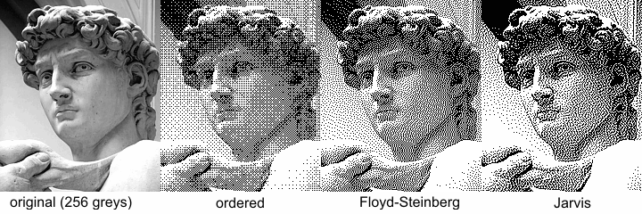

TODO: GRAMMARLY!


OK — I admit. The title is slighty misleading. This is a technical post about how to convert any video into an ASCII Art text stream that _can_ be played on the terminal. Text stream here is a subtitle file here. You can use any video player, or terminal program that can parse and display subtitles to play the music video. But _playing_ part is out of the scope of this post.

Still don't get what I'm talking about? Here's a demo:

<YouTube id="t_YsTEhcTpo"/>

Enable subtitles and wait for couple seconds. If the video errors out, check out the following screen recording:

<YouTube id="-Dby42c_4Y4"/>

My text streams are using braille characters to represent pixels. And to display consecutive streams of texts, pairing with a music playback, what would be more suitable than using the subtitle format? Therefore, the objective of this goal is to convert any video into a YouTube subtitle. The tech stack is:

- OpenCV (C++ cv2) — used to convert video into frames
- Python Image Library (Python 3 Pillow) — used to convert frames into ASCII art (braille)
- Python Standard Library (sys, os, pathlib) — used to read and write files
- ffmpeg (optional) — used to pack everything into a video

Open-sourced on GitHub: [anaclumos/video-in-dots](https://github.com/anaclumos/video-in-dots).

:::note
Technically, braille characters are not ASCII characters. They are Unicode; but let's not be to pedantic here.
:::

---

## Design

We need to first PoC (Proof of Concept) that the following technologies to achieve our goal:

1. Converting any image into monochrome image
2. Converting any monochrome image into ASCII art
3. Converting any video into a series of images
4. Converting any series of frames into a series of ASCII art, packaging them into a subtitle file.
5. (Figured out later) Compressing the subtitle files under a certain size.
6. (Figured out later) Dithering the images to improve the quality of the ASCII art.

---

## 1. Converting any image into [monochrome image](https://en.wikipedia.org/wiki/Binary_image)

A monochrome image is an image with 1-bit depth, comprised with `#000000` and `#FFFFFF` colors.
Note that, grayscale images are not monochrome images. Grayscale images also have a wide range of gray colors in between `#000000` and `#FFFFFF`.
These pure black and white colors can be used to represent the raised and lowered dots of the braille characters.

We use braille characters to visually distinguish borders and shapes.
Therefore, we first convert an image into BW image, and again convert that into a 1-bit depth image.
One detail we need to note is that subtiltes are usually white, so we want the white pixel in the monochrome image to represent 1, the raised dot in braille characters.



The leftmost image has 256 shades of gray, and the right three images have only 2 shades of gray, represented in differnent monochrome conversion algorithms. We use Floyd-Steinberg dithering algorithm in this project.

### Converting the image

There exists many ways to convert an image into monochrome image. This project only uses sRGB color space, so we use the CIE 1931 sRGB Luminance conversion algorithm. [Wikipedia](https://en.wikipedia.org/wiki/Grayscale#Converting_colour_to_greyscale) Sounds fancy, but it's just a formula:

```python
def grayscale(red: int, green: int, blue: int) -> int:
    return int(0.2126 * red + 0.7152 * green + 0.0722 * blue)
```

`red`, `green`, `blue` are the RGB values of the pixel, represented in integer from 0 to 255.
If their sum goes over `hex_threshold`, the pixel is white (`1`); otherwise, the pixel is black.
We can now run this code for every pixels.
This grayscale code is for understanding the fundamentals.
We will use `Python PIL`'s `convert` function to convert the image into monochrome image.
This library also applies Floyd-Steinberg dithering algorithm to the image.

```python
resized_image_bw = resized_image.convert("1")  # apply dithering
```

---

## 2. Converting any monochrome image into an arbitrary-sized ASCII art

The above sentence has three parts. Let's break them down. Converting...

1. any monochrome image into
1. an arbitrary-sized
1. ASCII art

We figured out the first, so now let's explore the second.

### Resizing images with PIL

We can use the following code to resize an image in PIL.

```python
def resize(image: Image.Image, width: int, height: int) -> Image.Image:
    if height == 0:
        height = int(im.height / im.width * width)
    if height % braille_config.height != 0:
        height = int(braille_config.height * (height // braille_config.height))
    if width % braille_config.width != 0:
        width = int(braille_config.width * (width // braille_config.width))
    return image.resize((width, height))
```

We will use 2 by 3 braille characters, so we slightly modify the height and width of the image to make it divisible by 2 and 3.

### Converting the image

Seeing the image will make you understand better.
For example, let's say we have the left image (6 by 6).
We cut the image into 2 by 3 pieces, and convert each piece into a braille character.


The key here is to find the right braille character to represent the 2 by 3 piece.
One simple approach is to map all the 2 by 3 pieces into an array, especially when 2 by 3 braille characters only have 64 different combinations.
But we can do better, by understanding how Unicode assigned the character codes.


I made a simple [util function](https://github.com/anaclumos/tools-image-to-braille) to convert a 2 by 3 piece into a braille character.
This code uses the above logic to resize the image, convert it into braille characters, and color them on the terminal.
You can color the terminal output with `\033[38;2;{};{};{}m{}\033[38;2;255;255;255m".format(r, g, b chr(output))`.
For more information, see [ANSI Color Escape Code](https://en.wikipedia.org/wiki/ANSI_escape_code).
If you want to try it out, here is the code: [anaclumos/tools-image-to-braille](https://github.com/anaclumos/tools-image-to-braille)

:::tip
This code uses ANSI True Color profile with 16M colors. macOS Terminal will not support 16M color; it only supports 256. You can use iTerm2 or VS Code's integrated terminal to see the full color.
:::

---

## Converting any video into a series of images

I planned to experiment differnet dimensions with the same image, so I wanted to physically cache the images.
I decided to use Python OpenCV to do this.

1. Set basic configurations and variables.
1. Read the video file. If the video file is not found, exit the program.
1. Create a directory to store the images.
1. Loop through the video frames.


---

## 4. Convert text streams into formalized subtitle files

I already had the braille conversion tool from section 2; now I needed to run this function for every cached images.
I first tried to use `.srt` (SubRip) format.
`.srt` file looks like this:

```
1
00:01:00,000 --> 00:02:00,000
This is an example
SubRip caption file.
```

The first line is the sequence number, and the second line is the time range in `Start --> End` format ( `HH:mm:ss,SSS` ).
Lastly, the third line is the subtitle itself.
I chose SubRip because it supported colored subtitles, but...


I made several SubRip files with different colors, but YouTube won't recognize the color; turned out SubRip's color styling is non-standard.

### Types of subtitles YouTube supports

<DisplayFlex>


</DisplayFlex>

[YouTube Docs](https://support.google.com/youtube/answer/2734698) shows the above table.

I figured that SAMI files supported simple markups, so I decided to use SAMI.
(Oddly enough, I am very familiar with SAMI, because `.smi` is like the standard file for Korean subtitles.)
Creating subtitles is already simple because it was appending text to a file in a specific format.
It didn't require a lot of code change.
[Microsoft Docs](https://docs.microsoft.com/en-us/windows/win32/wmp/sami-file-example) shows the format of SAMI files.

```xml
<SAMI>
<HEAD>
    <STYLE TYPE = "text/css">
    <!--
    /* P defines the basic style selector for closed caption paragraph text */
    P {font-family:sans-serif; color:white;}
    /* Source, Small, and Big define additional ID selectors for closed caption text */
    #Source {color: orange; font-family: arial; font-size: 12pt;}
    #Small {Name: SmallTxt; font-size: 8pt; color: yellow;}
    #Big {Name: BigTxt; font-size: 12pt; color: magenta;}
    /* ENUSCC and FRFRCC define language class selectors for closed caption text */
    .ENUSCC {Name: 'English Captions'; lang: en-US; SAMIType: CC;}
    .FRFRCC {Name: 'French Captions'; lang: fr-FR; SAMIType: CC;}
    -->
    </STYLE>
</HEAD>
<BODY>
    <!<entity type="mdash"/>- The closed caption text displays at 1000 milliseconds. -->
    <SYNC Start = 1000>
        <!-- English closed captions -->
        <P Class = ENUSCC ID = Source>Narrator
        <P Class = ENUSCC>Great reason to visit Seattle, brought to you by two out-of-staters.
        <!-- French closed captions -->
        <P Class = FRFRCC ID = Source>Narrateur
        <P Class = FRFRCC>Deux personnes ne venant la r&eacute;gion vous donnent de bonnes raisons de visiter Seattle.
</BODY>
</SAMI>
```

You can see that it's just a simple XML file. If you look closely, you can also see how multi-language subtitles are handled in one SAMI files.

---

## 5. Compressing the text files.


I finally got my hands on the SAMI file, just to find out that the file was over **70MB**.
I couldn't find any official size limit for YouTube subtitles, but empirically, I found that the file size limit was around 10MB.
I needed to compress the files.

I thought of three ways to compress the files:

1.  Reduce the width and height.
2.  Skip some frames.
3.  Use color stacks.

I already spearated the configurations from the main code, so I could easily change the width, height, and frame rate.
With many experiment, I figured that YouTube only supports 8-10 frames per second for subtitles, so I decided to skip some frames to reduce the file size.

```python
class braille_config:
    # 2 * 3 braille
    base = 0x2800
    width = 2
    height = 3


class video_config:
    width = 56
    height = 24
    frame_jump = 3  # jumps 3 frames
```

What I mean by "color stacks" is that I could the push the same color to the stack, and then pop it when the color changes.
Let's take a look at the original SAMI file:

```xml
<FONT color="#FFFFFF">⠿</FONT>
<FONT color="#FFFFFF">⠿</FONT>
<FONT color="#FFFFFF">⠿</FONT>
<FONT color="#FFFFFF">⠿</FONT>
<FONT color="#FFFFFF">⠿</FONT>
<FONT color="#FFFFFF">⠿</FONT>
<FONT color="#FFFFFF">⠿</FONT>
<FONT color="#FFFFFF">⠿</FONT>
<FONT color="#FFFFFF">⠿</FONT>
<FONT color="#FFFFFF">⠿</FONT>
<FONT color="#FFFFFF">⠿</FONT>
<FONT color="#FFFFFF">⠿</FONT>
<!-- Text Length: 371 -->
```

Even though they are all the same color, the code appended the color tag for every single character.
I can reduce the repetition by using color stacks:

```xml
<FONT color="#FFFFFF">⠿⠿⠿⠿⠿⠿⠿⠿⠿⠿⠿⠿</FONT>
<!-- Text Length: 41. Reduced by 89% -->
```

It's not the complete-search-maximal-compression that you usually see when leetcoding, but it's still a good compression to make it under 10MB.
This is especially good when you have black and white videos.

```xml
<SYNC Start=125><P Class=KOKRCC><FONT color="#FFFFFF">⠿⠿⠿⠿⠿⠿⠿⠿⠿⠿⠿⠿⠿⠿⠿⠿⠿⠿⠿⠿⠿⠿⠿⠿⠿⠿⠿⠿</FONT><BR><FONT color="#FFFFFF">⠿⠿⠿⠿⠿⠿⠿⠿⠿⠿⠿⠿⠿⠿⠿⠿⠿⠿⠿⠿⠿⠿⠿⠿⠿⠿⠿⠿</FONT><BR><FONT color="#FFFFFF">⠿⠿⠿⠿⠿⠿⠿⠿⠿⠿⠿⠿⠿⠿⠿⠿⠿⠿⠿⠿⠿⠿⠿⠿⠿⠿⠿⠿</FONT><BR><FONT color="#FFFFFF">⠿⠿⠿⠿⠿⠿⠿⠿⠿⠿⠿⠿⠿⠿⠿⠿⠿⠿⠿⠿⠿⠿⠿⠿⠿⠿⠿⠿</FONT><BR><FONT color="#FFFFFF">⠿⠿⠿⠿⠿⠿⠿⠿⠿⠿⠿⠿⠿⠿⠿⠿⠿⠿⠿⠿⠿⠿⠿⠿⠿⠿⠿⠿</FONT><BR><FONT color="#FFFFFF">⠿⠿⠿⠿⠿⠿⠿⠿⠿⠿⠿⠿⠿⠿⠿⠿⠿⠿⠿⠿⠿⠿⠿⠿⠿⠿⠿⠿</FONT><BR><FONT color="#FFFFFF">⠿⠿⠿⠿⠿⠿⠿⠿⠿⠿⠿⠿⠿⠿⠿⠿⠿⠿⠿⠿⠿⠿⠿⠿⠿⠿⠿⠿</FONT><BR><FONT color="#FFFFFF">⠿⠿⠿⠿⠿⠿⠿⠿⠿⠿⠿⠿⠿⠿⠿⠿⠿⠿⠿⠿⠿⠿⠿⠿⠿⠿⠿⠿</FONT><BR></SYNC>
<SYNC Start=250><P Class=KOKRCC><FONT color="#FFFFFF">⠿⠿⠿⠿⠿⠿⠿⠿⠿⠿⠿⠿⠿⠿⠿⠿⠿⠿⠿⠿⠿⠿⠿⠿⠿⠿⠿⠿</FONT><BR><FONT color="#FFFFFF">⠿⠿⠿⠿⠿⠿⠿⠿⠿⠿⠿⠿⠿⠿⠿⠿⠿⠿⠿⠿⠿⠿⠿⠿⠿⠿⠿⠿</FONT><BR><FONT color="#FFFFFF">⠿⠿⠿⠿⠿⠿⠿⠿⠿⠿⠿⠿⠿⠿⠿⠿⠿⠿⠿⠿⠿⠿⠿⠿⠿⠿⠿⠿</FONT><BR><FONT color="#FFFFFF">⠿⠿⠿⠿⠿⠿⠿⠿⠿⠿⠿⠿⠿⠿⠿⠿⠿⠿⠿⠿⠿⠿⠿⠿⠿⠿⠿⠿</FONT><BR><FONT color="#FFFFFF">⠿⠿⠿⠿⠿⠿⠿⠿⠿⠿⠿⠿⠿⠿⠿⠿⠿⠿⠿⠿⠿⠿⠿⠿⠿⠿⠿⠿</FONT><BR><FONT color="#FFFFFF">⠿⠿⠿⠿⠿⠿⠿⠿⠿⠿⠿⠿⠿⠿⠿⠿⠿⠿⠿⠿⠿⠿⠿⠿⠿⠿⠿⠿</FONT><BR><FONT color="#FFFFFF">⠿⠿⠿⠿⠿⠿⠿⠿⠿⠿⠿⠿⠿⠿⠿⠿⠿⠿⠿⠿⠿⠿⠿⠿⠿⠿⠿⠿</FONT><BR><FONT color="#FFFFFF">⠿⠿⠿⠿⠿⠿⠿⠿⠿⠿⠿⠿⠿⠿⠿⠿⠿⠿⠿⠿⠿⠿⠿⠿⠿⠿⠿⠿</FONT><BR></SYNC>
<SYNC Start=375><P Class=KOKRCC><FONT color="#FFFFFF">⠿⠿⠿⠿⠿⠿⠿⠿⠿⠿⠿⠿⠿⠿⠿⠿⠿⠿⠿⠿⠿⠿⠿⠿⠿⠿⠿⠿</FONT><BR><FONT color="#FFFFFF">⠿⠿⠿⠿⠿⠿⠿⠿⠿⠿⠿⠿⠿⠿⠿⠿⠿⠿⠿⠿⠿⠿⠿⠿⠿⠿⠿⠿</FONT><BR><FONT color="#FFFFFF">⠿⠿⠿⠿⠿⠿⠿⠿⠿⠿⠿⠿⠿⠿⠿⠿⠿⠿⠿⠿⠿⠿⠿⠿⠿⠿⠿⠿</FONT><BR><FONT color="#FFFFFF">⠿⠿⠿⠿⠿⠿⠿⠿⠿⠿⠿⠿⠿⠿⠿⠿⠿⠿⠿⠿⠿⠿⠿⠿⠿⠿⠿⠿</FONT><BR><FONT color="#FFFFFF">⠿⠿⠿⠿⠿⠿⠿⠿⠿⠿⠿⠿⠿⠿⠿⠿⠿⠿⠿⠿⠿⠿⠿⠿⠿⠿⠿⠿</FONT><BR><FONT color="#FFFFFF">⠿⠿⠿⠿⠿⠿⠿⠿⠿⠿⠿⠿⠿⠿⠿⠿⠿⠿⠿⠿⠿⠿⠿⠿⠿⠿⠿⠿</FONT><BR><FONT color="#FFFFFF">⠿⠿⠿⠿⠿⠿⠿⠿⠿⠿⠿⠿⠿⠿⠿⠿⠿⠿⠿⠿⠿⠿⠿⠿⠿⠿⠿⠿</FONT><BR><FONT color="#FFFFFF">⠿⠿⠿⠿⠿⠿⠿⠿⠿⠿⠿⠿⠿⠿⠿⠿⠿⠿⠿⠿⠿⠿⠿⠿⠿⠿⠿⠿</FONT><BR></SYNC>
<SYNC Start=500><P Class=KOKRCC><FONT color="#FFFFFF">⠿⠿⠿⠿⠿⠿⠿⠿⠿⠿⠿⠿⠿⠿⠿⠿⠿⠿⠿⠿⠿⠿⠿⠿⠿⠿⠿⠿</FONT><BR><FONT color="#FFFFFF">⠿⠿⠿⠿⠿⠿⠿⠿⠿⠿⠿⠿⠿⠿⠿⠿⠿⠿⠿⠿⠿⠿⠿⠿⠿⠿⠿⠿</FONT><BR><FONT color="#FFFFFF">⠿⠿⠿⠿⠿⠿⠿⠿⠿⠿⠿⠿⠿⠿⠿⠿⠿⠿⠿⠿⠿⠿⠿⠿⠿⠿⠿⠿</FONT><BR><FONT color="#FFFFFF">⠿⠿⠿⠿⠿⠿⠿⠿⠿⠿⠿⠿⠿⠿⠿⠿⠿⠿⠿⠿⠿⠿⠿⠿⠿⠿⠿⠿</FONT><BR><FONT color="#FFFFFF">⠿⠿⠿⠿⠿⠿⠿⠿⠿⠿⠿⠿⠿⠿⠿⠿⠿⠿⠿⠿⠿⠿⠿⠿⠿⠿⠿⠿</FONT><BR><FONT color="#FFFFFF">⠿⠿⠿⠿⠿⠿⠿⠿⠿⠿⠿⠿⠿⠿⠿⠿⠿⠿⠿⠿⠿⠿⠿⠿⠿⠿⠿⠿</FONT><BR><FONT color="#FFFFFF">⠿⠿⠿⠿⠿⠿⠿⠿⠿⠿⠿⠿⠿⠿⠿⠿⠿⠿⠿⠿⠿⠿⠿⠿⠿⠿⠿⠿</FONT><BR><FONT color="#FFFFFF">⠿⠿⠿⠿⠿⠿⠿⠿⠿⠿⠿⠿⠿⠿⠿⠿⠿⠿⠿⠿⠿⠿⠿⠿⠿⠿⠿⠿</FONT><BR></SYNC>
<SYNC Start=625><P Class=KOKRCC><FONT color="#FFFFFF">⠿⠿⠿⠿⠿⠿⠿⠿⠿⠿⠿⠿⠿⠿⠿⠿⠿⠿⠿⠿⠿⠿⠿⠿⠿⠿⠿⠿</FONT><BR><FONT color="#FFFFFF">⠿⠿⠿⠿⠿⠿⠿⠿⠿⠿⠿⠿⠿⠿⠿⠿⠿⠿⠿⠿⠿⠿⠿⠿⠿⠿⠿⠿</FONT><BR><FONT color="#FFFFFF">⠿⠿⠿⠿⠿⠿⠿⠿⠿⠿⠿⠿⠿⠿⠿⠿⠿⠿⠿⠿⠿⠿⠿⠿⠿⠿⠿⠿</FONT><BR><FONT color="#FFFFFF">⠿⠿⠿⠿⠿⠿⠿⠿⠿⠿⠿⠿⠿⠿⠿⠿⠿⠿⠿⠿⠿⠿⠿⠿⠿⠿⠿⠿</FONT><BR><FONT color="#FFFFFF">⠿⠿⠿⠿⠿⠿⠿⠿⠿⠿⠿⠿⠿⠿⠿⠿⠿⠿⠿⠿⠿⠿⠿⠿⠿⠿⠿⠿</FONT><BR><FONT color="#FFFFFF">⠿⠿⠿⠿⠿⠿⠿⠿⠿⠿⠿⠿⠿⠿⠿⠿⠿⠿⠿⠿⠿⠿⠿⠿⠿⠿⠿⠿</FONT><BR><FONT color="#FFFFFF">⠿⠿⠿⠿⠿⠿⠿⠿⠿⠿⠿⠿⠿⠿⠿⠿⠿⠿⠿⠿⠿⠿⠿⠿⠿⠿⠿⠿</FONT><BR><FONT color="#FFFFFF">⠿⠿⠿⠿⠿⠿⠿⠿⠿⠿⠿⠿⠿⠿⠿⠿⠿⠿⠿⠿⠿⠿⠿⠿⠿⠿⠿⠿</FONT><BR></SYNC>
```

The file completed so far: [raw.githubusercontent.com/anaclumos/video-in-dots/main/examples/butter.smi](https://raw.githubusercontent.com/anaclumos/video-in-dots/main/examples/butter.smi) (No Dithering)

---

## 6. Ditherings

I uploaded the file I created so far, but something was off.
It seemed like a problem of how mobile devices handle braille characters.
A _flat_ braille character showed as an empty circle on computers, but as an empty space in mobile devices.
I speculated that this is because of the legibility of the braille characters.
I needed extra modifications to resolve this issue: dithering.


Dithering is a technique to compensate image quality loss when converting an image to a lower color depth, by adding noise to the image.
Let me explain it with an example from [Wikipedia](https://en.wikipedia.org/wiki/Dither):


Can you feel the difference between the second and third image?
They both use 256 colors, but the third image has more details and gradients.
Like this, we can adequately locate pixels to properly represent the image.

Dithering is also used in GIF image conversion, so most GIF images show a lot of dotted patterns.

Digital artifacts are also related to ditherings.
When you convert an image to a lower color depth, you lose some details.
If the dithering happens multiple times, you will get an image with a lot of artifacts.
(Of course, digital artifacts have a lot of other causes. See [dithering and color banding](https://en.wikipedia.org/wiki/Colour_banding) for more information.)

<YouTube id="JR4KHfqw-oE" />

Monochrome conversion also requires dithering because we are compressing the 16M color space into 2 colors.
We can do this with the aforementioned PIL library.

```python
resized_image_bw = resized_image.convert("1")  # apply dithering
```

Let us check this in action.

<YouTube id="ZOzBvBjEPTE"/>

Can you realize the difference, especially from 1:33?

---

## Finalizing

I completed the project and uploaded the video to YouTube.
I aim to study computer graphics and image processing more in the future.
If you are interested in this topic, please check out the previous post that I wrote:

- [How Video Compression Works](https://cho.sh/blog/6B6D29)

### Butter

<YouTube id="t_YsTEhcTpo"/>

### Fiesta

<YouTube id="pUmeDHgDkPE"/>

---

## Added 2021-07-09: Irregular Subtitle Specs?

I tested the subtitle file on iOS, iPadOS YouTube app, and macOS Chrome, Firefox, and Safari.
However, I heard that the subtitle file does not work on some devices, like Android YouTube app and Windows Chrome.
Anyways, I therefore attach a screen recording of the subtitle file on macOS 11 Chrome 91.
If you are on an Apple device, you can expect the subtitle file to work.

I also made the screen recording in **8K** to show a crisp dots in motion 😉

<DisplayFlex>
<YouTube id="-Dby42c_4Y4"/>
<YouTube id="Ta6zySgtnX4"/>
</DisplayFlex>
