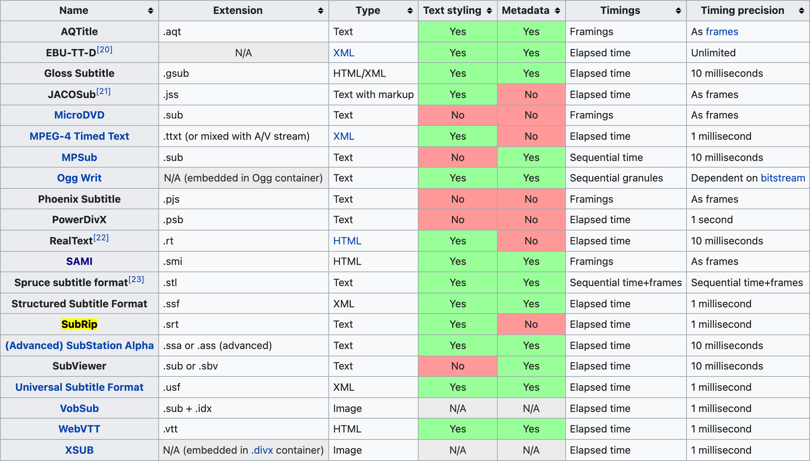
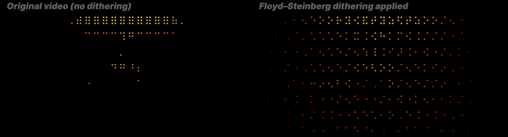

import YouTube from '@site/src/components/YouTube'
import DisplayFlex from '@site/src/components/DisplayFlex'


이 글의 목표는 동영상을 점자 패턴 스트림 (Braille Pattern Stream, ⠨⠎⠢⠨⠀⠙⠗⠓⠾⠀⠠⠪⠓⠪⠐⠕⠢)으로 변환하는 방법을 설명하는 것이다.
점묘화로 만드는 동영상이나 아스키 아트로 만드는 동영상이라고 생각해도 좋을 것이다 (물론 점자는 ASCII가 아닌 Unicode이다.)
아직 점자 동영상이 무슨 뜻인지 모르겠다면 완성본을 먼저 보자.

<YouTube id="t_YsTEhcTpo"/>

자막을 켜고 5-10초를 기다리면 된다. 자막이 10MB라 로딩이 느릴 수 있다. 만약 점자가 보이지 않는다면 다음 영상을 보자.

<YouTube id="-Dby42c_4Y4"/>

점자 패턴 스트림은 말 그대로 연속된 형태의 점자 패턴이기에 동영상으로 만들 수도 있고 아예 **자막으로 모든 것을 넣어버릴 수도** 있다.
자막이야말로 텍스트 스트림을 보여주는 수단이기 때문이다. 때문에 이 프로젝트의 목표를 **동영상을 변환해서 YouTube 자막으로 넣어보는 것**으로 잡았다.
기반 기술은 다음과 같다.

- OpenCV (C++ cv2) — 동영상을 연속된 이미지로 변환하기 위해 사용됨
- Python Image Library (Python 3 Pillow) — 이미지를 점자로 변환하기 위해 사용됨
- Python Standard Library (sys, os, pathlib) — 파일을 읽고 쓰기 위해 사용됨
- ffmpeg (optional) — 동영상을 편집하기 위해 사용됨

[anaclumos/video-in-dots](https://github.com/anaclumos/video-in-dots)에 오픈소스로 공개되어 있다.

---

## 설계

목표를 위해서 다음의 기술들이 필요하다고 생각했다.

1.  임의의 이미지를 모노크롬 이미지로 변환하는 기술
2.  모노크롬 이미지를 임의 크기의 점자 배열로 변환하는 기술
3.  동영상을 프레임의 연속으로 변환할 수 있는 기술
4.  3번에서 얻은 프레임을 2번에서 얻은 기술을 이용해 텍스트 스트림으로 변환하여 정형화된 자막의 형태로 변환하는 기술
5.  (나중에 알게 됨) 텍스트 스트림을 특정 크기 이하로 압축하는 기술
6.  (나중에 알게 됨) Dithering 처리 기술

---

## 1\. 임의의 이미지를 [모노크롬 이미지](https://en.wikipedia.org/wiki/Binary_image)로 변환

모노크롬 이미지는 1비트 깊이의 이미지로, `#000000`의 완벽한 검정과 `#FFFFFF`의 완벽한 하양으로만 이루어지는 이미지이다.
이 하양과 검정을 점자에서 각 점이 칠해진 (raised) 상태와 그렇지 않은 상태에 대응시킬 수 있다.

점자의 기본적인 역할은 **경계선**과 **형체**를 구분할 수 있도록 도와주는 것이다.
이미지를 흑백의 형태로 변환한 뒤 1비트 흑백 이미지로 변환한다.
여기서 중요한 점은 자막은 대개 시스템 기본값이 하얀색이기 때문에 우리의 1비트 흑백 이미지에서는 **밝은 픽셀이 1이 되어야 한다는 것이다.**


제일 왼쪽의 의미지는 256단계의 grayscale 이미지이고,
나머지 3개의 이미지는 각기 다른 알고리즘으로 나타낸 모노크롬 이미지이다.
이 프로젝트에서는 최종적으로 Floyd-Steinberg 알고리즘을 사용한다.

### 이미지를 모노크롬으로 변환하기

이미지를 1비트 흑백으로 바꾸는 방법은 굉장히 다양한데, 이 프로젝트는 sRGB 영역만 사용할 것이기에 CIE 1931 sRGB에 정의된 Luminance 기반 변환을 사용한다.
다음처럼 간단하게 표현할 수 있다. [참고](https://en.wikipedia.org/wiki/Grayscale#Converting_colour_to_greyscale)

```python
def grayscale(red: int, green: int, blue: int) -> int:
    return int(0.2126 * red + 0.7152 * green + 0.0722 * blue)
```

여기에서 red, green, blue는 0-255의 `int`이다.
이 합이 임의의 `hex_threshold`를 넘으면 해당 픽셀의 값을 1로 설정한다.
이 코드를 모든 픽셀마다 실행해주면 된다. 물론 위의 grayscale 코드는 이론적인 부분을 이해하기 위함이고,
최종적으로는 아래와 같이 `Python PIL`에 내장된 코드를 사용할 것이다.
후술하겠지만, 이 라이브러리는 기본적으로 **디더링 처리**도 해준다.

```python
resized_image_bw = resized_image.convert("1")  # apply dithering
```

---

## 2\. 모노크롬 이미지를 임의 크기의 점자 배열로 변환

위 문장은 3가지 파트로 나눌 수 있다. ① 1비트 모노크롬 이미지를 ② 임의 크기의 ③ 점자 배열로 변환하는 기술. 1번은 완료했으니 우선 2번부터 살펴보자.

### PIL을 통해 이미지 크기 변환하기

이 프로젝트에서는 이미지를 PIL을 사용해 불러오기 때문에, 다음 코드를 통해 이미지를 임의 크기로 변경할 수 있다.

```python
def resize(image: Image.Image, width: int, height: int) -> Image.Image:
    if height == 0:
        height = int(im.height / im.width * width)
    if height % braille_config.height != 0:
        height = int(braille_config.height * (height // braille_config.height))
    if width % braille_config.width != 0:
        width = int(braille_config.width * (width // braille_config.width))
    return image.resize((width, height))
```

이 프로젝트에서 사용할 점자는 크기가 2 × 3 크기이기에 이미지의 너비, 높이가 여기에 완벽하게 나누어 떨어지도록 크기를 미세하게 조정한다.

### 이미지를 점자 배열로 변환하기

이건 사진으로 보는 것이 이해하기가 더 편하다. 왼쪽과 같이 6 × 6 이미지가 있을 경우 너비를 2픽셀, 높이를 3픽셀마다 잘라 2 × 3 이미지로 만든 뒤 이를 점자로 변환한다.


점자 변환 알고리즘의 핵심은 어떻게 픽셀 배열에 해당하는 점자를 정확하게 찾느냐는 것이다.
가장 단순하게 모든 픽셀 배열 조합을 점자와 매핑해놓는 방법도 있다.
특히나 2 × 3의 점자는 26개의 조합 밖에 없기 때문이다.
하지만 유니코드가 점자 규격이 제정될 때 점자가 어떻게 배치되었는지를 이해하면 더 간단하게 나타낼 수 있다.


간단한 [유틸 코드](https://github.com/anaclumos/tools-image-to-braille)를 작성해보았다.
이 코드의 경우 위의 로직을 이용해서 이미지를 리사이징한 뒤 점자로 변환하고 색을 입혀 `terminal`에 점자 배열을 `print`한다.
`Terminal`에 `print`되는 글자의 색은 `\033[38;2;{};{};{}m{}\033[38;2;255;255;255m".format(r, g, b chr(output))` 의 형태로 입힐 수 있는데,
더 궁금한 경우 [ANSI Color Escape Code](https://en.wikipedia.org/wiki/ANSI_escape_code)를 알아보면 된다.
직접 실행해보고 싶다면 다음 저장소의 파일을 실행해 보자. [anaclumos/tools-image-to-braille](https://github.com/anaclumos/tools-image-to-braille)

:::tip
이 코드의 경우 1600만 색상의 ANSI True Color라는 색상 프로필을 사용하는데, macOS에 내장된 terminal.app에서는 True Color 1600만 색상을 지원하지 않고 256개의 색상만 지원한다. 때문에 True Color을 지원하는 iTerm이나 VS Code 내장 터미널을 사용해서 실행하자.
:::

---

## 3\. 동영상을 프레임의 연속으로 변환

같은 영상으로 반복해서 코드를 실행할 일이 있을 것이기에 프레임마다 사진이 물리적으로 저장되어야 했다. 이를 위해 Python OpenCV 라이브러리를 활용하기로 결정했다. 간단하게 이야기해서 다음의 과정을 거친다.

1.  기본적인 라이브러리와 변수 설정
2.  동영상이 존재하지 않을 경우 오류 표시
3.  프레임 이미지 파일이 저장될 폴더 생성
4.  각 프레임을 저장.


---

## 4\. 텍스트 스트림을 생성해 정형화된 자막의 형태로 변환

이미 2번에서 예제 코드를 완성했기 때문이 이 코드를 매 프레임마다 실행하면 되는 구조였다. 처음에는 `.srt` 파일, 즉 SubRip 파일을 이용해서 자막을 생성하려 했다. 다음의 과정을 거친다. `.srt` 자막은 다음 구조를 가진다.

```
1
00:01:00,000 --> 00:02:00,000
This is an example
SubRip caption file.
```

가장 위에 `Sequence` 번호, `Start --> End` 타임 스탬프 ( `HH:mm:ss,SSS` ), 그리고 자막 텍스트로 이루어져 있다.
처음에 SubRip을 선택한 이유는 단순히 텍스트 색상을 지원하기 때문이었다.



파일을 제작한 후 YouTube에 업로드하려 했는데 색상이 전혀 나오지 않는 것을 보고 이것이 비공식적 옵션이라는 것을 알게 되었다.

### YouTube가 지원하는 자막의 종류 및 특징

<DisplayFlex>


</DisplayFlex>

[YouTube의 문서](https://support.google.com/youtube/answer/2734698)를 살펴보니 다음과 같은 자막을 지원하고 있었다.

SAMI 파일 (한글 자막에 자주 쓰이는 `.smi` 파일)이 색상을 지원한다는 것을 알게 되어 SAMI 파일로 노선을 변경했다. 어차피 자막 파일 제작 스크립트는 정해진 문법에 따라 텍스트 파일에 `append`해주는 수준에 불과하기에 많은 변경을 요구하지 않았다. [Microsoft의 문서](https://docs.microsoft.com/en-us/windows/win32/wmp/sami-file-example)를 확인해보니 SAMI 파일은 다음과 같은 문법을 사용하고 있었다.

```xml
<SAMI>
<HEAD>
    <STYLE TYPE = "text/css">
    <!--
    /* P defines the basic style selector for closed caption paragraph text */
    P {font-family:sans-serif; color:white;}
    /* Source, Small, and Big define additional ID selectors for closed caption text */
    #Source {color: orange; font-family: arial; font-size: 12pt;}
    #Small {Name: SmallTxt; font-size: 8pt; color: yellow;}
    #Big {Name: BigTxt; font-size: 12pt; color: magenta;}
    /* ENUSCC and FRFRCC define language class selectors for closed caption text */
    .ENUSCC {Name: 'English Captions'; lang: en-US; SAMIType: CC;}
    .FRFRCC {Name: 'French Captions'; lang: fr-FR; SAMIType: CC;}
    -->
    </STYLE>
</HEAD>
<BODY>
    <!<entity type="mdash"/>- The closed caption text displays at 1000 milliseconds. -->
    <SYNC Start = 1000>
        <!-- English closed captions -->
        <P Class = ENUSCC ID = Source>Narrator
        <P Class = ENUSCC>Great reason to visit Seattle, brought to you by two out-of-staters.
        <!-- French closed captions -->
        <P Class = FRFRCC ID = Source>Narrateur
        <P Class = FRFRCC>Deux personnes ne venant la r&eacute;gion vous donnent de bonnes raisons de visiter Seattle.
</BODY>
</SAMI>
```

HTML과 같은 구조를 사용한다. 자세하게 보면 **다중 언어 자막**을 어떻게 처리하는지도 알 수 있다.
출처: [Microsoft](https://docs.microsoft.com/en-us/windows/win32/wmp/sami-file-example)

---

## 5\. 텍스트 스트림을 특정 크기 이하로 압축


이렇게 SAMI 파일을 완성하고 나니 **70MB가 넘는** 파일이 생성되었다. YouTube에도 자막이 업로드되지 않았다. (YouTube에서 공식적으로 밝힌 자막 최대 크기에 대해서는 찾을 수 없었다. 하지만 나중에 경험적으로 알게된 사실로 그 용량 제한이 10MB인 것 같았다.) 유튜브에 업로드하기 위해선 용량 절감이 필요했다.

이때 생각한 압축 방법은 크게 3가지가 있다.

1.  점자 배열의 크기 자체를 줄이기
2.  프레임 건너뛰기
3.  컬러 스택 이용하기

1번과 2번의 경우 다음과 같이 점자 배열 설정을 분리해두었기에 다양한 숫자로 실험을 할 수 있었다.
YouTube의 경우도 자막이 변경되는 최대 속도가 8-10Hz 였기 때문에 프레임을 건너뛰어 용량을 절감할 수 있었다.

```python
class braille_config:
    # 2 * 3 braille
    base = 0x2800
    width = 2
    height = 3


class video_config:
    width = 56
    height = 24
    frame_jump = 3  # jumps 3 frames
```

3번에서 말하는 컬러 스택이란,
동일한 색상의 점자가 등장했을 때 이를 stack에 잠시 밀어두었다가 색깔이 변경되면 한 번에 append하는 방식이다.
초기 자막을 한 번 보자.

```xml
<FONT color="#FFFFFF">⠿</FONT>
<FONT color="#FFFFFF">⠿</FONT>
<FONT color="#FFFFFF">⠿</FONT>
<FONT color="#FFFFFF">⠿</FONT>
<FONT color="#FFFFFF">⠿</FONT>
<FONT color="#FFFFFF">⠿</FONT>
<FONT color="#FFFFFF">⠿</FONT>
<FONT color="#FFFFFF">⠿</FONT>
<FONT color="#FFFFFF">⠿</FONT>
<FONT color="#FFFFFF">⠿</FONT>
<FONT color="#FFFFFF">⠿</FONT>
<FONT color="#FFFFFF">⠿</FONT>
<!-- 텍스트 길이: 371 -->
```

모두 동일한 색상의 흰색 점자임에도 매번 앞뒤로 긴 HTML 문법이 붙고 있다. 즉 컬러 스택의 색상을 보관한 뒤, 동일한 색상의 점자들이 나타나면 스택에 그 점자를 추가하고 색상이 바뀌는 순간에 이를 다음과 같이 한 번에 붙이는 방식이다.

```xml
<FONT color="#FFFFFF">⠿⠿⠿⠿⠿⠿⠿⠿⠿⠿⠿⠿</FONT>
<!-- 텍스트 길이: 41. 약 9배 절감되었다. -->
```

[알고리즘 문제](https://tech.kakao.com/2019/10/02/kakao-blind-recruitment-2020-round1/#%EB%AC%B8%EC%A0%9C-1)에서 흔히 보이는 **완전탐색 후 최대압축**은 아니지만, 10MB 아래로 줄이기에는 충분한 알고리즘이었다. 특히 흑백 계열에서 발군의 압축 성능을 보인다.

```xml
<SYNC Start=125><P Class=KOKRCC><FONT color="#FFFFFF">⠿⠿⠿⠿⠿⠿⠿⠿⠿⠿⠿⠿⠿⠿⠿⠿⠿⠿⠿⠿⠿⠿⠿⠿⠿⠿⠿⠿</FONT><BR><FONT color="#FFFFFF">⠿⠿⠿⠿⠿⠿⠿⠿⠿⠿⠿⠿⠿⠿⠿⠿⠿⠿⠿⠿⠿⠿⠿⠿⠿⠿⠿⠿</FONT><BR><FONT color="#FFFFFF">⠿⠿⠿⠿⠿⠿⠿⠿⠿⠿⠿⠿⠿⠿⠿⠿⠿⠿⠿⠿⠿⠿⠿⠿⠿⠿⠿⠿</FONT><BR><FONT color="#FFFFFF">⠿⠿⠿⠿⠿⠿⠿⠿⠿⠿⠿⠿⠿⠿⠿⠿⠿⠿⠿⠿⠿⠿⠿⠿⠿⠿⠿⠿</FONT><BR><FONT color="#FFFFFF">⠿⠿⠿⠿⠿⠿⠿⠿⠿⠿⠿⠿⠿⠿⠿⠿⠿⠿⠿⠿⠿⠿⠿⠿⠿⠿⠿⠿</FONT><BR><FONT color="#FFFFFF">⠿⠿⠿⠿⠿⠿⠿⠿⠿⠿⠿⠿⠿⠿⠿⠿⠿⠿⠿⠿⠿⠿⠿⠿⠿⠿⠿⠿</FONT><BR><FONT color="#FFFFFF">⠿⠿⠿⠿⠿⠿⠿⠿⠿⠿⠿⠿⠿⠿⠿⠿⠿⠿⠿⠿⠿⠿⠿⠿⠿⠿⠿⠿</FONT><BR><FONT color="#FFFFFF">⠿⠿⠿⠿⠿⠿⠿⠿⠿⠿⠿⠿⠿⠿⠿⠿⠿⠿⠿⠿⠿⠿⠿⠿⠿⠿⠿⠿</FONT><BR></SYNC>
<SYNC Start=250><P Class=KOKRCC><FONT color="#FFFFFF">⠿⠿⠿⠿⠿⠿⠿⠿⠿⠿⠿⠿⠿⠿⠿⠿⠿⠿⠿⠿⠿⠿⠿⠿⠿⠿⠿⠿</FONT><BR><FONT color="#FFFFFF">⠿⠿⠿⠿⠿⠿⠿⠿⠿⠿⠿⠿⠿⠿⠿⠿⠿⠿⠿⠿⠿⠿⠿⠿⠿⠿⠿⠿</FONT><BR><FONT color="#FFFFFF">⠿⠿⠿⠿⠿⠿⠿⠿⠿⠿⠿⠿⠿⠿⠿⠿⠿⠿⠿⠿⠿⠿⠿⠿⠿⠿⠿⠿</FONT><BR><FONT color="#FFFFFF">⠿⠿⠿⠿⠿⠿⠿⠿⠿⠿⠿⠿⠿⠿⠿⠿⠿⠿⠿⠿⠿⠿⠿⠿⠿⠿⠿⠿</FONT><BR><FONT color="#FFFFFF">⠿⠿⠿⠿⠿⠿⠿⠿⠿⠿⠿⠿⠿⠿⠿⠿⠿⠿⠿⠿⠿⠿⠿⠿⠿⠿⠿⠿</FONT><BR><FONT color="#FFFFFF">⠿⠿⠿⠿⠿⠿⠿⠿⠿⠿⠿⠿⠿⠿⠿⠿⠿⠿⠿⠿⠿⠿⠿⠿⠿⠿⠿⠿</FONT><BR><FONT color="#FFFFFF">⠿⠿⠿⠿⠿⠿⠿⠿⠿⠿⠿⠿⠿⠿⠿⠿⠿⠿⠿⠿⠿⠿⠿⠿⠿⠿⠿⠿</FONT><BR><FONT color="#FFFFFF">⠿⠿⠿⠿⠿⠿⠿⠿⠿⠿⠿⠿⠿⠿⠿⠿⠿⠿⠿⠿⠿⠿⠿⠿⠿⠿⠿⠿</FONT><BR></SYNC>
<SYNC Start=375><P Class=KOKRCC><FONT color="#FFFFFF">⠿⠿⠿⠿⠿⠿⠿⠿⠿⠿⠿⠿⠿⠿⠿⠿⠿⠿⠿⠿⠿⠿⠿⠿⠿⠿⠿⠿</FONT><BR><FONT color="#FFFFFF">⠿⠿⠿⠿⠿⠿⠿⠿⠿⠿⠿⠿⠿⠿⠿⠿⠿⠿⠿⠿⠿⠿⠿⠿⠿⠿⠿⠿</FONT><BR><FONT color="#FFFFFF">⠿⠿⠿⠿⠿⠿⠿⠿⠿⠿⠿⠿⠿⠿⠿⠿⠿⠿⠿⠿⠿⠿⠿⠿⠿⠿⠿⠿</FONT><BR><FONT color="#FFFFFF">⠿⠿⠿⠿⠿⠿⠿⠿⠿⠿⠿⠿⠿⠿⠿⠿⠿⠿⠿⠿⠿⠿⠿⠿⠿⠿⠿⠿</FONT><BR><FONT color="#FFFFFF">⠿⠿⠿⠿⠿⠿⠿⠿⠿⠿⠿⠿⠿⠿⠿⠿⠿⠿⠿⠿⠿⠿⠿⠿⠿⠿⠿⠿</FONT><BR><FONT color="#FFFFFF">⠿⠿⠿⠿⠿⠿⠿⠿⠿⠿⠿⠿⠿⠿⠿⠿⠿⠿⠿⠿⠿⠿⠿⠿⠿⠿⠿⠿</FONT><BR><FONT color="#FFFFFF">⠿⠿⠿⠿⠿⠿⠿⠿⠿⠿⠿⠿⠿⠿⠿⠿⠿⠿⠿⠿⠿⠿⠿⠿⠿⠿⠿⠿</FONT><BR><FONT color="#FFFFFF">⠿⠿⠿⠿⠿⠿⠿⠿⠿⠿⠿⠿⠿⠿⠿⠿⠿⠿⠿⠿⠿⠿⠿⠿⠿⠿⠿⠿</FONT><BR></SYNC>
<SYNC Start=500><P Class=KOKRCC><FONT color="#FFFFFF">⠿⠿⠿⠿⠿⠿⠿⠿⠿⠿⠿⠿⠿⠿⠿⠿⠿⠿⠿⠿⠿⠿⠿⠿⠿⠿⠿⠿</FONT><BR><FONT color="#FFFFFF">⠿⠿⠿⠿⠿⠿⠿⠿⠿⠿⠿⠿⠿⠿⠿⠿⠿⠿⠿⠿⠿⠿⠿⠿⠿⠿⠿⠿</FONT><BR><FONT color="#FFFFFF">⠿⠿⠿⠿⠿⠿⠿⠿⠿⠿⠿⠿⠿⠿⠿⠿⠿⠿⠿⠿⠿⠿⠿⠿⠿⠿⠿⠿</FONT><BR><FONT color="#FFFFFF">⠿⠿⠿⠿⠿⠿⠿⠿⠿⠿⠿⠿⠿⠿⠿⠿⠿⠿⠿⠿⠿⠿⠿⠿⠿⠿⠿⠿</FONT><BR><FONT color="#FFFFFF">⠿⠿⠿⠿⠿⠿⠿⠿⠿⠿⠿⠿⠿⠿⠿⠿⠿⠿⠿⠿⠿⠿⠿⠿⠿⠿⠿⠿</FONT><BR><FONT color="#FFFFFF">⠿⠿⠿⠿⠿⠿⠿⠿⠿⠿⠿⠿⠿⠿⠿⠿⠿⠿⠿⠿⠿⠿⠿⠿⠿⠿⠿⠿</FONT><BR><FONT color="#FFFFFF">⠿⠿⠿⠿⠿⠿⠿⠿⠿⠿⠿⠿⠿⠿⠿⠿⠿⠿⠿⠿⠿⠿⠿⠿⠿⠿⠿⠿</FONT><BR><FONT color="#FFFFFF">⠿⠿⠿⠿⠿⠿⠿⠿⠿⠿⠿⠿⠿⠿⠿⠿⠿⠿⠿⠿⠿⠿⠿⠿⠿⠿⠿⠿</FONT><BR></SYNC>
<SYNC Start=625><P Class=KOKRCC><FONT color="#FFFFFF">⠿⠿⠿⠿⠿⠿⠿⠿⠿⠿⠿⠿⠿⠿⠿⠿⠿⠿⠿⠿⠿⠿⠿⠿⠿⠿⠿⠿</FONT><BR><FONT color="#FFFFFF">⠿⠿⠿⠿⠿⠿⠿⠿⠿⠿⠿⠿⠿⠿⠿⠿⠿⠿⠿⠿⠿⠿⠿⠿⠿⠿⠿⠿</FONT><BR><FONT color="#FFFFFF">⠿⠿⠿⠿⠿⠿⠿⠿⠿⠿⠿⠿⠿⠿⠿⠿⠿⠿⠿⠿⠿⠿⠿⠿⠿⠿⠿⠿</FONT><BR><FONT color="#FFFFFF">⠿⠿⠿⠿⠿⠿⠿⠿⠿⠿⠿⠿⠿⠿⠿⠿⠿⠿⠿⠿⠿⠿⠿⠿⠿⠿⠿⠿</FONT><BR><FONT color="#FFFFFF">⠿⠿⠿⠿⠿⠿⠿⠿⠿⠿⠿⠿⠿⠿⠿⠿⠿⠿⠿⠿⠿⠿⠿⠿⠿⠿⠿⠿</FONT><BR><FONT color="#FFFFFF">⠿⠿⠿⠿⠿⠿⠿⠿⠿⠿⠿⠿⠿⠿⠿⠿⠿⠿⠿⠿⠿⠿⠿⠿⠿⠿⠿⠿</FONT><BR><FONT color="#FFFFFF">⠿⠿⠿⠿⠿⠿⠿⠿⠿⠿⠿⠿⠿⠿⠿⠿⠿⠿⠿⠿⠿⠿⠿⠿⠿⠿⠿⠿</FONT><BR><FONT color="#FFFFFF">⠿⠿⠿⠿⠿⠿⠿⠿⠿⠿⠿⠿⠿⠿⠿⠿⠿⠿⠿⠿⠿⠿⠿⠿⠿⠿⠿⠿</FONT><BR></SYNC>
```

여기까지 완성된 [파일](https://raw.githubusercontent.com/anaclumos/video-in-dots/main/examples/butter.smi) (Dithering 미적용 상태)

---

## 6\. 디더링

이렇게 완성된 파일을 YouTube에 업로드했는데, 어딘가 어색한 부분이 있었다. 이는 모바일 기기에서 점자를 다루는 방법이 다른 문제인 것 같았다. 컴퓨터에서는 점자의 한 점에 색상이 색칠되지 않아도 빈 원이 그려져 있는 반면, **모바일에서는 점자가 칠해져 있지 않다면 그냥 빈 공간으로 표현된다**. 아마 모바일의 가독성 때문에 이런 처리가 되는 것 같았다. 이를 해결하기 위해서는 **디더링 처리**가 필요하다.




Dithering은 더 넓은 컬러 스펙트럼에서 더 낮은 컬러 스펙트럼으로 변환할 때 화질 저하를 보상하는 기법이다.
이 또한 [Wikipedia의 예시](https://en.wikipedia.org/wiki/Dither)를 살펴보자.


2번 이미지와 3번 이미지의 디테일 차이가 느껴지는가? 둘 다 압축된 256색을 사용하지만 3번 이미지가 훨씬 디테일이 느껴진다.
이와 같이 낮아진 색 스펙트럼에서도 픽셀의 배치를 적절히 활용하여 이미지의 디테일을 살릴 수 있다.

디더링 처리는 GIF 변환 과정에서도 사용되기 때문에 대부분의 GIF 파일에서는 위의 3번 사진과 같이 수많은 점이 돌출되어 찍혀있는 듯한 느낌이 든다 (흔히 말하는 **GIF 감성**)

흔히 말하는 **디지털 풍화**도 스크린샷을 찍을 때 일어나는 디더링 처리와 관련이 있다. 무압축 스크린샷을 지원하지 않는 기기일 경우 스크린샷을 찍으며 압축을 한다. 이 과정에서 손실된 색상 디테일을 보정하기 위해 일부 픽셀 데이터가 보정되는데 이 과정이 수십-수백회 반복되면 원래 이미지에서 상당히 멀어진 이미지에 도달하게 된다. 물론 디지털 풍화에는 이 외에도 많은 요소가 영향을 준다. (관련 문서: [dithering and color banding](https://en.wikipedia.org/wiki/Colour_banding))

윤곽선을 담당하는 모노크롬 변환 또한 1600만 RGB 색 영역을 흑백 2가지 색을 가진 색 영역으로 낮추는 과정이기 때문에 이 디더링 처리가 필요하다. 상술했듯이 PIL의 기본 변환 코드를 사용하여 손쉽게 구현할 수 있다.

```python
resized_image_bw = resized_image.convert("1")  # apply dithering
```

뮤직비디오의 실제 장면으로 확인해보자.

<YouTube id="ZOzBvBjEPTE"/>

1분 33초 경부터 디더링의 효과를 눈에 띄게 나타난다.

---

## 끝마치며

일단 이렇게 마무리된 프로젝트이다. 코드를 통해서 동영상을 분석하고 제어하는 프로젝트는 꾸준히 진행할 생각이다. 과거에 업로드했던 관련 글을 올리며 글을 마무리한다.

- [동영상 압축과 유체이탈](https://blog.chosunghyun.com/kr-video-ghosting/)

### Butter

<YouTube id="t_YsTEhcTpo"/>

### Fiesta

<YouTube id="pUmeDHgDkPE"/>

---

## 2021년 7월 9일 추가 – 불균일한 자막 스펙?

나는 iOS와 iPadOS 네이티브 YouTube 앱, 그리고 macOS Chrome, Firefox, Safari에서 자막을 테스트했다. 그런데 안드로이드에서 자막이 나타나지 않거나 YouTube 앱이 크래시된다는 제보를 받았다. Windows 10 Chromium Edge에서도 공백 문자 너비가 무시되는 것인지 점자 자막이 불안정하게 나타나는 문제가 있었다.

하여튼 그런 문제로 인해 macOS 11 Chrome 91에서 화면 녹화한 모습을 첨부한다. Apple Platform에서 이 영상들을 감상하는 사람들은 아래와 같은 점자 영상들을 볼 수 있다. 참고로 각 점자들의 **선명한 모습**을 보여주고 싶어 영상을 **8K**로 제작했다.

<DisplayFlex>
<YouTube id="-Dby42c_4Y4"/>
<YouTube id="Ta6zySgtnX4"/>
</DisplayFlex>
