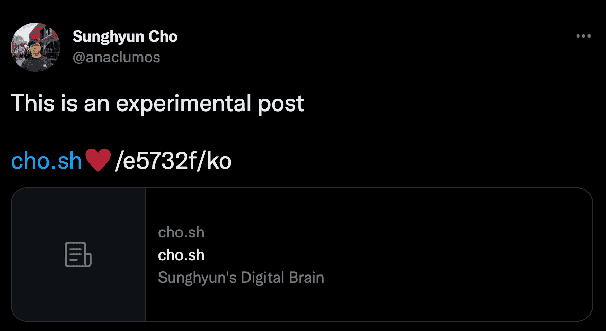

After a few years of technical writing, I felt limitations on writing platforms that hindered me from writing the best-class articles. Technological knowledge is dynamic and intertwined in that none of the current formats - academic papers, lecture videos, code examples, or straightforward posts - can best represent the knowledge. I have examined and observed some attempts that addressed this issue, namely, stuff called the **second brain** or **digital gardens**, but none of them seemed to correctly solve the problem. Therefore, I have distilled my inconveniences into this huge mega-post and imagined **_what I would've done if I had created the new incarnations of digital brains._**

:::info **Update 2022-06-12**
Since this post, I have extensively studied non-linear PKM software, such as [Roam](https://roamresearch.com/), [[Obsidian]], [Logseq](https://logseq.com/), and [Foam](https://foambubble.github.io/foam/). I acknowledge that I misunderstood the concept of manual linking; that PKM software performs a fuzzy search to intelligently identify linked and unlinked references. I found some PKM software with automatic linkings, such as [Saga](https://saga.so) or [Weavit](https://www.weavit.ai/). But none of them worked how I expected. Manual linking helps refine the database. So, even if I make a Next-gen digital brain, I will not remove the linking process.
:::

:::tip **Update 2022-07-01**
Well, you're now watching my next-gen digital brain! For the past two weeks, I have worked on the [WWW project](https://github.com/anaclumos/extracranial) that built this website. It checks off almost all of the marks detailed in this post!
:::

<details>
<summary>TL;DR</summary>

- Create an **aesthetic**-**interactive**-**automatic** pile of **code**-**image**-**repo**-**text** that **organizes**-**presents**-**pitches** itself.
- There is **no** manual tagging, linking, or image processing, etc., etc.
- You just throw a random knowledge; creating a **knowledge mesh network**.
- The **algorithm** operates everything. It will be contained, processed, organized, and distributed all around the world in **different languages**.
- You don't **tend** knowledge. The algorithm penalizes outdated content (you can mark the post as **evergreen** to avoid this.)

</details>

## So what's the issue?

Apart from popular belief, I noticed the best method for managing a digital garden is **not tending it**. Instead, try to make a **digital jungle** - you don't take care of it; nature will automatically raise it.
In other words, the digital brain should make as less friction as possible.
The less you tend, the more you write.

### Especially,

I despise the `[[keyword]]` pattern prevalent in so-called second brains (obsidian, dendron, ...).
Not to mention it performs poorly for non-alphabetical documents,
it is manual - creates a lot of friction.
The fact that you must explicitly wrap them with brackets doesn't make sense... What if you realize you want to make a linkage to a term you've been writing for 200 posts?
Do you go back and link them all one by one?
No! The solution must lie in algorithmic keyword extraction.

## Organizing Contents

### Interconnected entities

Practical knowledge does not exist in simple posts (though they might be straightforward). Create a knowledge bundle that interconnects GitHub Repository, Codes, GitHub README, and other posts in the same brain network.
Examine how [Victor](https://victordibia.com/blog/alpha-code/)'s post has rich metadata for the paper, dataset, demo, and post. This is what I see as **interconnected entities**.

- [A powerful, flexible, Markdown-based authoring framework](https://markdoc.io/)

### Interactive Contents & Animations


### Unorganized Graphing.

Trust me, manually fiddling with tag sucks.
Necessarily tagging posts and organizing posts into subdirectories resembles organizing your computer.
However, you wouldn't want to do this if you have thousands of posts; also the border gets loose. What if the post has two properties? What becomes the primary tag and what becomes the secondary tag?
[Notable trends. Gen Z's don't organize folders anymore!](https://www.theverge.com/22684730/students-file-folder-directory-structure-education-gen-z)
Recent trends, I would say, are dumping everything into a mega folder and searching up things whenever needed.
I also used to organize folders a lot more, but recently as searches like Spotlight and Alfred improve, I don't see the need to manage them all by hand, considering I always pull up those search commands to open a file.
You don't need to manually organize all of the files when algorithms can read all the texts and organize them for you!
Use algorithmic inspections to analyze how the posts may interrelate with each other properly.


Therefore, creating a cluster of posts, not classified by me, but bots and algorithms.
[WordPress also has this plugin.](https://wordpress.org/plugins/related-posts-for-wp/)
This is similar to backlinking, which most so-called digital brains such as [[Obsidian]] and [Dendron](https://www.dendron.so/) are doing.


I agree with the importance of interlinking knowledge crumbles, but I can't entirely agree with their method.
Manually linking posts are inconsistent and troublesome; it can only be done on a massive communal scale, like Wikipedia.
You cannot apply the same logic to individual digital brain systems.

## SEO and Open Graphs

### Precis Bots for Meta description

I can apply the above technique for crosslinking to TL;DR bots for meta tag descriptions.

### Automatic Open Graph Image Insertion

For example, GitHub creates automatic open graph images with their metadata.


There are quite some services using this technique.
GitHub wrote an excellent [post](https://github.blog/2021-06-22-framework-building-open-graph-images/) on implementing this feature.
I also tried to implement this on top of Ghost CMS, which I gave up after figuring out the Ghost Core Engine should support this. However, I have created a [fork](https://github.com/vercel/og-image/compare/main...anaclumos:main) that I can extend later. [http://og-image.cho.sh/](http://og-image.cho.sh/)

[GitHub - anaclumos/cho-sh-og-image: Open Graph Image as a Service - generate cards for Twitter, Facebook, Slack, etc](https://github.com/anaclumos/cho-sh-og-image)

## Multilanguage

### Proper multilanguage support

**Automatic Langauge Detection**. The baseline is to reduce the workload, that I write random things, and the algorithm will automatically organize corresponding data.
**[hreflang](https://developers.google.com/search/docs/advanced/crawling/localized-versions) tags and [HTTP content negotiations](https://developer.mozilla.org/en-US/docs/Web/HTTP/Content_negotiation)**. I found none of the services which use this trick properly (outside of megacorporate i18n products)

### Translations

At this point, I might write one English post and let Google Translate do the heavy lifting.
Also, I can get contributions from GitHub.

While supporting multilanguage and translations, I want to put some 3D WebGL globe graphics. Remember [infrastructure.aws](https://infrastructure.aws) in 2019? It used to show an awesome 3D graphic of AWS's global network. [AWS Edge Cloud Continuum](https://apps.kaonadn.net/5181491956940800/index.html)

I kind of want this back too. Meanwhile, this looks nice:

- [GitHub - shuding/code: 5kB WebGL globe lib.](https://github.com/shuding/cobe)

Also made some [contributions](https://github.com/shuding/cobe/pull/30)...

### Fonts and Emoji

I want to go with the standard SF Pro series with a powerful new font Pretendard.

```css
font-family:
  ui-sans-serif,
  -apple-system,
  BlinkMacSystemFont,
  'Apple SD Gothic Neo',
  Pretendard,
  system-ui -system-ui,
  sans-serif,
  'Apple Color Emoji';
```

However, I am exploring other options.
I liked [TossFace](https://toss.im/tossface)'s bold attempt to infuse Korean values into the Japan-based emoji system for emoji. (lol, but they canceled it.)


Honestly, I want this back. They can use Unicode [Private Use Area](https://en.wikipedia.org/wiki/Private_Use_Areas#:~:text=In%20Unicode%2C%20a%20Private%20Use,characters%20by%20the%20Unicode%20Consortium.). But Toss is too lazy to do that considering they still didn't make the WOFF version Webfont.
So I might use [Twemoji](https://twemoji.twitter.com/).

## Domains and Routes

### URL Structures

Does URL Structure matter for SEO? I don't think so if the exhaustive domain list is provided through sitemap.xml.
For SEO purposes (although I still doubt the effectiveness), automatically inserting the URLified titles at the end might help (like Notion)

### Nameless routes

[Autolinks with alphanumeric IDs | GitHub Changelog](https://github.blog/changelog/2022-07-01-autolinks-with-alphanumeric-ids/)
I don't like naming routes like `cho.sh/blog/how-to-make-apple-music-clone`. What if I need to update the title and want to update the URL Structure?
Changing URL structure affects SEO, so I would need to stick to the original domain even after changing the entity title to maintain the SEO. But then the title and URL would be inconsistent.
Therefore, I would give the entity a UID that would be a hash for each interconnected entity. Maybe the randomized hash UID could be a color hex that could be the [theme color](https://developer.mozilla.org/en-US/docs/Web/HTML/Element/meta/name/theme-color) for the entity?
Emoji routes seem cool, aye? I would also need Web Share API since Chrome doesn't support copying Unicode URLs.
Some candidates I am thinking of:

- cho.sh/♥/e5732f/ko
- cho.sh/🧠/e5732f/en



## Miscellany

### Headline for Outdated Posts

There should be a method to penalize old posts; they should exist in the database but wouldn't appear as much on the data chain. i.e., put a lifespan or "valid until" for posts.


### Footnotes

An excellent addition. But not necessary.
If I ever have to make a footnote system, I want to make it hoverable, which [namu.wiki](https://namu.wiki) did a great job. I do not want to make it jump down to the bottom and put a cringy ↩️ icon to link back.

### ToC

A nice addition. But not necessary.

### Comments

Will go with Giscus.
