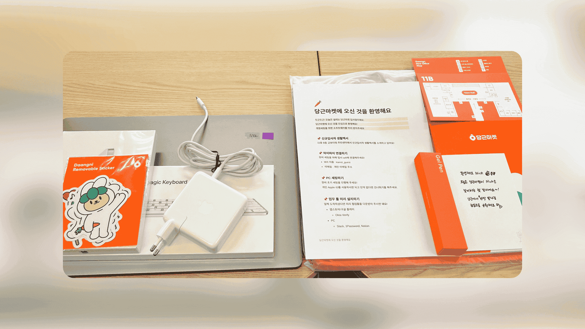

It's already been a week since I've been living as an intern at Karrot (2022-05-22), a Korean Unicorn Company.
It's an internship that lasts for three months, but it would be good to organize the interview and onboarding before it's too late.

## Application and Interview

### A Great Start

It starts with [Karrot Market Team Recruiting Site](https://team.daangn.com/).
I got a lot of feelings that Karrot was putting a lot of energy into **discovering good talent**.
While running the recruitment website neatly, Karrot wrote down all the information applicants might be curious about.
Above all, Karrot wrote the JD (Job Description) specifically and clearly.
Some companies I interviewed with did not disclose the JD, so Karrot was much more considerate.

Karrot Mini R&D Engineer Intern JD

**Who we are looking for**.

Karrot Market is still actively using web technology to create mobile apps.
The web is a great tool, but it still has a lot of limitations when it comes to native platform support.
The OS's WebView environment is unsuitable for running multiple apps simultaneously.
Due to the difference between the web security model and the basic OS security model, it is challenging to replicate the **native experience**.
For example, if you request user location information through the web API, you will experience a different UI/UX from the user consent seen in native.
The Karrot Mini team is looking for a breakthrough from the modern web, not the OS WebView.
We are looking for someone who will break through what was initially thought to be challenging to achieve on the web and create an **OS-level experience** that can run entirely in the browser.

Specifically, they will

- Study the next-generation web-based execution environment to be used in the Karrot market
- Provide a sandbox environment to isolate multiple apps
- Must provide Karrot market integration function through web standard interface
- Implement a scheduler that can observe and control the running state of multiple apps

We are looking for someone.

- Familiar with HTML, CSS, and JavaScript-based web development
- Skilled in program development using JavaScript and TypeScript
- Those who are interested in reading the DOM standard and implementing it themselves
- Those who are interested in various web standard APIs
- Have a basic understanding of the security model of web browsers
- Those who want to operate an open-source project from the beginning

Even better if you

- Have experience contributing to or operating an open-source project in which many people participate.
- Have good knowledge of OS, scheduling, and concurrent programming
- Know how to handle various programming languages
- Have experience with system programming languages such as C/C++, Go, Rust, or Zig is preferred

**Please Note**...

- This position is held for three months, and in some cases, a 6-month extension is possible

**Procedure**...

1. Document submission
2. Job interview
3. Final acceptance

**Document Screening**

Karrot Market is accepting freestyle applications.
Please freely express various information that shows your strengths.
You can freely select the document format, such as word, pdf, or web link, excluding `hwp` files.
Please forward your portfolio, GitHub link, etc., as needed.

**Job Interview**

This is the stage where you have an in-depth talk about your job-related experiences and competencies based on your resume and assignments.
The job interview lasts from 1 hour to 1 hour 30 minutes with the Karrot Market team members who are highly related to the job.

Doesn't it look very detailed and subtle?
The information transparency was excellent, allowing me to predict what position I would hold and what responsibilities I would be given even before the interview.
The application process was also straightforward.
I didn't have to write a cover letter, etc.; I only had to attach my existing resume.
It took less than 15 minutes to apply.

### The Interview

As mentioned in JD, the interview was scheduled for 1 hour and 30 minutes.
I had been interviewing for several companies before.
Up to this point, the discussions I had experienced could be divided into two types.

Example of Behavioral Interview

- If _this_ happened within your team, how would you deal with it?
- What do you think is the most important thing as a PM or developer?
- Please describe this project written on your resume.
  What did you learn? What did you miss the most?

Example of Technical Interview

- ~ Please solve this problem.
- (In case of Web3 company interview) Please explain the concept of blockchain Proof of Stake. How is it different from Proof of Work? What problem are you trying to solve?
- Please explain the difference between HTTP POST/GET/PUT, etc.

Among them, if you were looking for a Computer Science intern, you had to prepare well for the second technical interview.
In the meantime, most of the companies that have been interviewed are **preparable** as above.
Karrot's interview was different.
They did not ask questions about the interviewer's knowledge, and we discussed practical work within 5 minutes of starting the discussion.
I felt like I was in a team meeting rather than an interview.
First, he explained the team's current problem.
Then, he asked me to analyze the expected solutions presented and their strengths and weaknesses.
During the actual interview, he explained the following information.

### On Mini-Apps

- In China's WeChat, there is a Mini Program called **Xiaochengxu**.
- A feature that allows sideloading of small programs within WeChat.
- You don't need to install the app, take a QR code, and the mini-app loads super-fast, giving you a similar experience to the app.
- At the same time, membership registration and payment connection are not required. Since WeChat ID and WeChat Pay are automatically linked, no roadblocks hinder the user's flow.
- In China, the mini-app app ecosystem already dominated the market, and Line and Snap are also preparing for this trend.
- Apple has also launched its mini-app, App Clips.

If you are curious about the mini-app, please refer to this article!

- [Web Standard Mini App Problems 📱](/w/A370F3)
- [Mini Apps](https://web.dev/mini-apps/)

### So, how did it go?

The answers to the previous question lead to the next question.

Interview Questions

- In the case of WeChat, they create their native client, and the native client runs the mini-app. However, in this case, mini-apps do not comply with web standards and use their security model, making it difficult to introduce them globally. Karrot Market is also envisioning a similar mini-app environment. What is the appropriate strategy for this?
- → It would be sufficient to implement a general-purpose mini-app that complies with standard web specifications and perfectly follows the web security model. In other words, you want to run a WebView inside the web. The first method that comes to mind is an iframe. What's the problem with implementing this in an iframe?
- → Since the external and internal codes of an iframe run on the same thread, the client app also freezes if the mini-app freezes. What should I do to solve this?
- → With Web Worker, it is possible to separate the mini app and the client app into separate threads. However, the Web Worker cannot access the DOM API if you do this. For example, you cannot use the DOM API called `getClientBoundingRect`. What should I do to solve this?
- → Provide a virtual DOM API that Web Workers can access. To solve this problem, Google developed a model called WorkerDOM. And an open-source project called PartyTown, an implementation that separates third-party JS code into a separate Web Worker, was recently released. So how can we implement a mini-app system using this?
- → Let's assume that the mini-app system is implemented using the underlying technologies of Web Worker and WorkerDOM. Then, can we implement forced shutdown and multitasking on the web within the web? What should I do?

It was not a typical interview, but it aimed to find out how to come up with an idea and find a solution at a practical level.
It felt like I was having a coffee chat, and I thought I was receiving significant consideration even though I was the interviewee.
The people team's efforts were evident in many aspects, such as promising to inform both successful and unsuccessful applicants of the results within three days and asking for understanding via e-mail when the announcement of the results was delayed.

If you are curious about the questions above, you can learn the answers by looking at the articles below.

- [How to build a plugin system on the web and also sleep well at night](https://www.figma.com/blog/how-we-built-the-figma-plugin-system/)
- [WorkerDOM: JavaScript Concurrency and the DOM](https://speakerdeck.com/cramforce/workerdom-javascript-concurrency-and-the-dom)

## Interesting Things about Karrot

### Interns with Power

Our team consists of 8 people, and I felt like I became a core member of a tiny startup, not an intern at a Unicorn company.
Interns were also given a fair amount of voice and power, and information and opportunities were unrestricted.
**Even as an intern, I could develop ideas, contribute to production-level products, and suggest new directions for product design**.
The team leader supported me in expressing more opinions on the first day, which helped me tremendously.
I was learning on the job in the actual field.

### Great Power and Responsibility

Karrot showed me trust first by giving me as much freedom as possible.
For example, I go to work freely between 9:00 and 11:00 and do not say hello when I leave work.
I would not record work hours and only had to prove it with performance.
I was an intern, so I asked a bunch of things, and I was impressed with team members saying: **We trust you, proceed as you wish.**

### Working Anywhere

It's related to the above, but our team has never gathered offline.
I went to work alone with my team for the last few days.
Currently, one of our team's developers is **living in Jeju Island for a month**.
Nevertheless, all team members maintained the best performance.
Also, the concept of **asynchronous communication** impressed me.
As we move increasingly to remote work, it takes too much energy to hold meetings where everyone gathers in real-time.
We instead document and record everything and use corporate messengers like Slack to handle everything during my working hours.
Of course, this is based on trust between members and the freedom and responsibility above.
(i.e., it is a system that runs under the belief that there are no employees to free ride like group assignments)

### Transparent Information

There are no restrictions for interns.
You can view the server code of the Karrot market, check the sales volume of local advertisements, and view the minutes of meetings with Karrot investors.
After reading this, you will probably think of Reed Hastings's **No Rules Rules** book.

- [Netflix Jobs](https://jobs.netflix.com/)

In the corporate meeting every Monday, we share updates from each team.
It was also impressive that no one used presentation slides; they were all written in a shared document in Notion for easier future reference.
**Overall, the culture promoted creative and powerful expression of opinions**.
In addition, it induced a responsible attitude by first trusting the employees.

### Endless Debates

I put the one that impressed me the most last.
**The discussion culture based on mutual respect** was awe-inspiring.
Two days after I arrived, we had a 6-hour meeting, and our team exchanged hundreds of Slack messages until dawn to discuss the direction of the product.
While I've done various group assignments and student startup projects, I've never seen such deep and delicate affection for a product and heated discussions.
Debating how to allocate limited resources to succeed in the market inspired me.
Everyone communicated logically to understand the other people's points of view and find a middle ground.
Even so, it was cool to see that the discussion never linked to personal feelings and respected each other.

## Moving Forward

I will be working on sandboxing for the mini-app standard in the future.
Simply put, it's about creating a web within the web and the basis for the mini-app environment.
I have a variety of technical & product goals.
I plan to write another article after finishing my internship.
[Please look forward to](https://github.com/braneproject) [the Karrot Mini Team!](https://playground.karrotmini.dev/)
