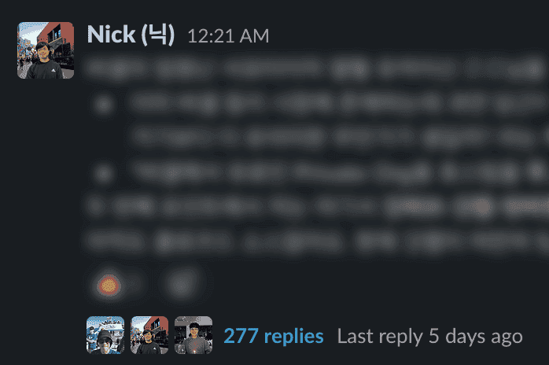

당근에서 인턴으로 생활한지 벌써 일주일입니다 (2022-05-22). 3달동안 진행되는 인턴십이지만, 면접과 온보딩에 대해서는 더 늦어지기 전에 정리해야 좋을 것 같아 이렇게 정리했습니다.

## 지원과 면접

### 어디서부터 시작하는가

모든 시작은 [당근마켓 팀 리크루팅 사이트](https://team.daangn.com/)입니다. 일전에 다른 분의 면접 리뷰에서도 느낀 것이지만, **인재의 발굴**에 엄청난 에너지를 쏟고 있다는 느낌을 많이 받았습니다. 구인 웹사이트를 깔끔하게 운영하면서 지원자들이 궁금해할 만한 내용들을 빠짐없이 기재해두었고, 무엇보다 JD(Job Description)를 구체적이고 명확하게 적었습니다. 면접을 본 기업 중 JD는 대외비이기 때문에 공개하기 어렵다고 한 기업도 있었기에 더욱 지원자를 세세하게 배려한다는 느낌을 받았습니다.

당근미니 R&D 엔지니어 인턴 JD

**이런 일을 해요**.

당근마켓은 지금도 웹 기술을 적극적으로 활용해서 모바일 앱을 만들고 있어요. 웹은 훌륭한 도구이지만 여전히 네이티브 플랫폼 지원에 있어서 한계가 많아요. 기본적으로 OS에서 제공하는 웹뷰 환경은 여러 앱들을 동시에 실행하는데 적합하지 않아요. 웹 보안모델과 OS 기본 보안 모델의 차이로 인해 **네이티브 경험**을 완성하기가 어려워요. 예를 들어 웹의 API로 사용자 위치정보를 요청하면 네이티브에서 보던 사용자 동의와 다른 UI/UX를 경험하게 돼요. 당근미니 팀은 OS 웹뷰가 아닌 현대의 웹으로부터 돌파구를 찾고 있어요. 원래 웹으로 달성하기 어렵다고 여겨졌던 것들을 돌파해서 온전하게 브라우저에서 구동 가능한 **OS 수준 경험**을 함께 만들어나갈 분을 찾고 있어요.

**구체적으로는 이런 일을 해요**.

- 당근마켓에서 활용할 차세대 웹 기반 실행환경을 연구해요
- 여러 앱을 격리할 수 있는 샌드박스 환경을 제공해야해요
- 웹 표준 인터페이스를 통해 당근마켓 통합 기능 제공해야해요
- 여러 앱들의 실행 상태를 관찰하고 제어할 수 있는 스케줄러를 구현해야해요

**이런 분을 찾고 있어요**.

- HTML, CSS, JavaScript 기반 웹 개발에 익숙하신 분
- JavaScript, TypeScript를 활용한 프로그램 개발에 능숙하신 분
- DOM 표준을 읽고 직접 구현해보는데 관심이 있으신 분
- 다양한 웹 표준 API에 관심이 많으신 분
- 웹 브라우저의 보안 모델에 대한 기본적인 이해가 있으신 분
- 오픈소스 프로젝트를 초기부터 운영해보실 분

**이런 분이면 더 좋아요!**

- 여러 사람들이 참여하는 오픈소스 프로젝트 기여나 운영 경험이 있으면 좋아요
- OS, 스케줄링, 동시성 프로그래밍에 대한 지식이 있으면 좋아요
- 다양한 프로그래밍 언어를 다룰 줄 알면 좋아요
- C/C++, Go, Rust, Zig 같은 시스템 프로그래밍 언어 활용 경험이 있으면 더 좋아요

**참고해 주세요**.

- 본 포지션은 3개월 동안 진행되며, 경우에 따라 6개월 연장 제안이 가능해

**이렇게 합류해요**.

- 1\. 서류접수 → 2. 직무 면접 → 3. 최종 합격

**서류 전형**

- 당근마켓은 자유양식의 지원서를 받고 있어요. 본인의 강점이 잘 드러나는 다양한 정보를 자유롭게 표현해주세요.문서 형식은 hwp(한글) 파일을 제외하고 word, pdf, 웹 링크 등 자유롭게 선택해주시면 돼요. 필요에 따라 포트폴리오, Github 링크 등도 함께 전달해주시면 좋아요.

**직무 면접**

- 직무와 관련된 경험과 역량에 대해 이력서 및 과제를 바탕으로 심층적인 이야기를 나누는 단계예요.직무 면접은 업무 연관성이 높은 당근마켓 팀원들과 1시간에서 1시간 30분 가량 진행돼요.

엄청 디테일하고 깨알 같지 않나요? 이를 통해 면접 전부터 어떤 포지션을 맡게 될지, 무슨 책임이 주어질지 예상할 수 있는 정보의 투명성이 무척 좋았습니다. 지원 과정도 무척 간소했습니다. 자기소개서 등을 작성하지 않아도 되었고 기존에 가지고 있던 이력서만 첨부하면 되었습니다. 지원하는데 15분이 채 걸리지 않은 것 같습니다.

### 면접

JD에서 언급된 바와 같이 면접은 1시간 30분으로 예정되었습니다. 이전에도 여러 기업의 면접을 보고 있었습니다. 이때까지만 해도 제가 경험한 면접은 크게 두 종류로 나눌 수 있었습니다.

Behavioral Interview 예시

- 만약 이런 일이 팀 내에서 발생했다면 어떻게 대처하시겠습니까?
- PM 혹은 개발자로서 제일 중요한 것이 무엇이라고 생각하시나요?
- 이력서에 적힌 이 프로젝트에 대해서 설명해주세요. 무엇을 배우셨나요? 무엇이 가장 아쉬우셨나요?

Technical Interview 예시

- ~이 문제를 풀어주세요.
- (Web 3 기업 면접의 경우) 블록체인의 Proof of Stake의 개념을 설명해주세요. Proof of Work와 어떻게 다른가요? 무슨 문제를 해결하려고 하는건가요?
- HTTP의 POST/GET/PUT 등등의 차이를 설명해주세요.

이 중 Computer Science 인턴을 구한다면 단연 두 번째인 Technical Interview를 잘 준비해야 했는데요. 그동안 면접을 본 대부분의 기업들은 위의 예시처럼 **준비 가능한. 모범 정답이 어느 정도 정해진**. 그런 질문들을 물어보았습니다.

당근의 면접은 색달랐습니다. 위와 같이 면접자의 지식을 묻는 질문을 하지 않았고, 면접을 시작한지 5분이 지나지 않아 실무에 대한 이야기로 넘어갔습니다. 면접이 아니라 회의에 들어온 것 같은 기분이 들었습니다. 현재 팀이 마주한 문제 상황(공교롭게도 면접관님도 Tim이셨습니다만 여기에서는 Team을 뜻합니다)에 대한 설명을 해주셨고, 이에 대해 현재까지 제시된 예상 해결 방법들과 그 장단점을 분석해달라고 하셨습니다. 이렇게만 보시면 이해가 잘 안 될테니 직접 제 일에 대해서 간략하게 설명을 드리겠습니다. 실제 면접 때 다음 내용들을 쭉 설명해주셨습니다.

### 미니앱이 뭔지 아니?

- 중국의 WeChat에는 **샤오청쉬**라는 미니 프로그램이 존재한다.
- WeChat 내에서 작은 프로그램들을 사이드로딩할 수 있는 기능이다.
- 앱을 설치할 필요 없이 QR 코드만 촬영하면 미니앱이 초고속으로 로딩되어 앱과 매우 유사한 경험을 할 수 있다.
- 이와 동시에 회원가입과 결제 연결도 필요 없다. WeChat ID와 WeChat Pay가 자동으로 연결되어 있기 때문에 사용자의 플로우를 방해하는 어떤 Road Block도 없다.
- 중국에서는 이미 미니앱으로 앱 생태계가 평정이 되었고, Line, Snap도 이런 트렌드를 준비 중이며 Apple 또한 나름의 미니앱인 App Clips를 출시하였다.

미니 앱이 더 궁금하시다면 이 글을 참고해보세요!

- [10\. 위챗의 절대반지, 미니 프로그램 #01](https://brunch.co.kr/@cbinsight/23)

### 그래서 어떻게 진행됐는데?

이전 질문의 답변이 다음 질문으로 이어지는 형태의 질문들이었습니다.

면접 질문들

- WeChat의 경우는 자신들만의 네이티브 클라이언트를 만들어서 네이티브 클라이언트가 미니앱을 구동한다. 하지만 이렇게 될 경우 미니앱들이 웹표준을 준수하지 않으면서 독자적인 보안 모델을 사용하기에 글로벌하게 도입하기에 어려움이 있다. 당근마켓에서도 이와 비슷한 미니앱 환경을 구상하고 있는데, 이에 알맞은 전략이 무엇일까.
- → 표준 웹 규격을 준수하며 웹의 보안 모델을 완벽하게 따르는 범용적 형태의 미니앱을 구현하면 될 것이다. 즉, 웹 안에서 웹뷰를 돌리려고 한다. 제일 먼저 떠오르는 방법은 iframe이다. iframe으로 이를 구현할 시 문제가 무엇일까.
- → iframe은 외부 코드와 내부 코드가 같은 쓰레드 위에서 돌아가기 때문에 미니앱이 죽으면 클라이언트 앱도 죽는 문제가 발생한다. 이를 해결하기 위해서는 어떻게 해야할까.
- → Web Worker를 사용하면 미니앱과 클라이언트 앱을 별도의 쓰레드로 분리하는 것이 가능해진다. 하지만 이렇게 할 경우 Web Worker가 DOM API에 접근하지 못하는 문제가 발생한다. 예를 들어, `getClientBoundingRect`라는 DOM API를 사용하지 못한다. 이를 해결하기 위해서는 어떻게 해야할까.
- → Web Worker가 접근할 수 있는 가상 DOM API를 제공해주면 된다. 구글에서 이를 해결하기 위해 WorkerDOM이라는 모델을 개발했다. 그리고 써드파티 JS 코드를 별도의 Web Worker로 분리하는 구현체인 PartyTown이라는 오픈소스 프로젝트도 최근 공개되었다. 이를 이용해서 미니앱 시스템을 어떻게 구현할 수 있을까.
- → 만약 이렇게 Web Worker와 WorkerDOM의 기반 기술을 활용해서 미니앱 시스템을 구현했다고 하자. 그렇다면 웹 안의 웹에서 강제종료와 멀티태스킹을 구현할 수 있을까? 어떻게 해야할까?

이렇게 보시면 느낌이 오시나요? 면접이 아니라 실무 수준에서 어떻게 ideation을 해내고 솔루션을 찾아내는지를 알아보는 형태의 면접이었습니다. 합류할지 모르는 면접자에게 직면한 문제 상황과 고려하고 있는 해결책들을 1시간 30분에 걸쳐 설명해주시는 것이 마치 커피 챗을 하는 기분이 들었고, 내가 면접자임에도 엄청난 배려를 받고 있다는 느낌이 들었습니다. 합격자와 불합격자 모두에게 결과를 3일 이내 알려주는 것을 약속하는 모습, 결과 발표가 지연되자 이메일로 미리 양해를 구하는 모습 등 많은 면에서 피플팀의 노력이 보였습니다.

혹여나 위의 질문들에 대해서 답이 궁금하신 분들은 아래 글들을 살펴보시면 답을 아실 수 있습니다.

- [How to build a plugin system on the web and also sleep well at night](https://www.figma.com/blog/how-we-built-the-figma-plugin-system/)
- [WorkerDOM: JavaScript Concurrency and the DOM](https://speakerdeck.com/cramforce/workerdom-javascript-concurrency-and-the-dom)

## 당근에서 신기했던 점들

### 인턴 너 혹시... 뭐 돼?

우선 당근은 목적 조직으로 운영됩니다. 목적 조직과 기능 조직은 서로 반대되는 개념입니다. 기능 조직은 프론트엔드팀, 서버팀, 디자인팀, 기획팀과 같이 팀의 기능에 따라 조직이 분류되고 서로 다른 프로젝트를 병렬로 각 팀에서 토스하며 업무를 처리하는 구조를 말합니다. 목적 조직은 그와 반대로 한 팀 내에 기획자, 디자이너, 엔지니어 등이 모여서 하나의 작은 Cross-functional team을 구성합니다. 저희 팀은 8명으로 구성되어 있는데, 인턴이 아니라 정말 작은 스타트업에 막내로 들어와있다는 느낌을 받았습니다. 인턴에게도 상당한 수준의 발언권과 에너지가 분배되었고, 정보와 기회가 제한되지 않았습니다. **인턴임에도 프로덕션 레벨 제품에 아이디어를 내서 기여를 할 수 있고, 제품의 설계에 새로운 방향을 제안할 수 있었습니다**. 첫날 이런저런 이야기를 했을때 저를 격려해주시고 더 많은 의견 개진을 응원해주신 것이 큰 힘이 되었습니다. 비유하자면, 인턴을 위해 준비된 정교한 프로그램을 밟는 것이 아니라 장인 옆에서 어깨 너머로 기술을 전수 받는 수련공이 된 것 같았습니다. 실제 현장에서 현업을 배운다는 느낌을 받았습니다. (물론 당근에서도 정교하게 설계된 프로그램 형태의 인턴도 운영하고 있습니다.)

### 스파이더맨도 울고 갈 큰 힘과 책임

구성원들을 신뢰하며 자유를 줄테니 책임을 다하라는 느낌을 많이 받았습니다. 단적인 예시로 9시부터 11시 사이에 자유롭게 출근을 하며 퇴근할 때 인사를 하지 않습니다. 즉, 업무 시간을 기록하지 않을테니 퍼포먼스로 증명하라는 느낌이었습니다. 인턴이라서 잘 모르는 내용들을 물어보고는 했는데 **그냥 판단하셔서 괜찮겠다고 생각하신대로 해주시면 돼요**라고 돌아온 답변이 인상 깊었습니다.

### 홍길동도 부러워할 리모트 근무

위와 연결되는 내용이지만 아직 저희 팀 한 번도 오프라인으로 전부 모인 적이 없습니다. 최근 며칠은 저희 팀에서 혼자 출근한 것 같아요. 당장 저희 팀의 개발자 한 분도 **제주도에서 한달살이**를 하고 계십니다. 그럼에도 불구하고 팀원들 모두 퍼포먼스는 최상을 유지하고 계셨습니다. 또한 **비동기 통신**이라는 개념도 인상 깊었습니다. 원격 근무로 점점 이동하며 모두가 실시간으로 모이는 회의를 잡는 것에 에너지가 과하게 들어가니 차라리 모든 것을 문서화하고 기록한 뒤 Slack 등의 기업 메신저를 이용해 모든 것을 자신만의 업무 시간에 처리하는 것입니다. 물론 이는 위에서 자유와 책임을 중시하며 각 구성원들끼리의 강한 도덕적 신뢰를 기반으로 하는 것 같았습니다. (i.e., 조별과제처럼 무임승차할 직원이 없다는 믿음 아래 구동되는 제도입니다)

### 가재도 살 수 있을 것 같은 투명한 정보

인턴에게도 어떠한 제한이 없습니다. 당근마켓의 서버 코드를 열람해볼 수 있고, 지역광고의 매출액 규모를 확인해볼 수 있으며, 당근 투자사들과의 회의록도 열람할 수 있습니다. 아마 이 내용을 보고 리드 헤이스팅스의 **규칙 없음** 책을 많이 떠올리실 것 같은데요. **네가 반년 뒤에 해고될 가능성이 50% 정도 되니 전세 계약을 미루는 것이 어떻겠느냐**까지 투명하게 공개하는 넷플릭스와 기업 문화가 비슷했습니다.

- [Netflix Jobs](https://jobs.netflix.com/culture?lang=%ED%95%9C%EA%B5%AD%EC%96%B4)

매주 월요일마다 있는 전사 미팅에서는 모두가 듣는 가운데 각 팀의 업데이트를 공유하며, 손쉽게 검색될 수 있도록 어떤 형태의 슬라이드도 활용하지 않고 모두 Notion의 공유 문서에 작성하는 것도 인상 깊었습니다. **전반적으로 문화를 통해 창의적이고 자발적인 의견 개진을 촉진시킨다는 느낌을 받았습니다**. 직원들에게 먼저 신뢰를 보여줌으로써 책임감 있는 자세를 유도하는 것 같았습니다.

### 진짜 세계관 최강자들의 싸움이다...

가장 인상 깊었던 것을 마지막에 두었습니다. **상호 존중을 기반으로 한 토론 문화**가 무척이나 인상 깊었습니다. 제가 온지 이틀만에 6시간 동안 회의를 하고, 새벽까지 수백 개의 문자를 주고 받으며 프로덕트의 방향성을 논하는 일이 있었습니다. 그동안 여러 조별 과제와 (유사) 창업을 해보았지만, 이토록 깊고 섬세하게 프로덕트에 애정을 가지고 열띤 토론을 하는 것을 처음 보았습니다. 제한된 리소스를 어떻게 분배하여 어떻게 시장에서의 성공을 이끌 것인지 토론하면서도 상대방의 관점을 이해하고 중간점을 찾기 위해 논리적으로 의사 표현하는 모습이 너무나도 인상 깊었습니다. 그러면서도 그 토론이 개인적인 감정과 연결되지 않고 서로를 존중하는 모습이 👍👍👍👍👍 너무 멋있었습니다.

## 앞으로

저는 앞으로 미니앱 표준을 위한 샌드박싱 작업을 진행하게 됩니다. 간략하게 말하면 웹 안의 웹을 만드는 작업이며 미니앱 환경을 위한 기반 작업을 하는 일입니다. 나름 다양한 기술적 & 제품적 욕심이 생겼는데 인턴을 잘 마무리하고 또 한 번 재미있는 글을 작성할 수 있었으면 좋겠습니다. [당근미니 팀에](https://playground.karrotmini.dev/) [많은 관심 부탁드려요!](https://github.com/braneproject)
