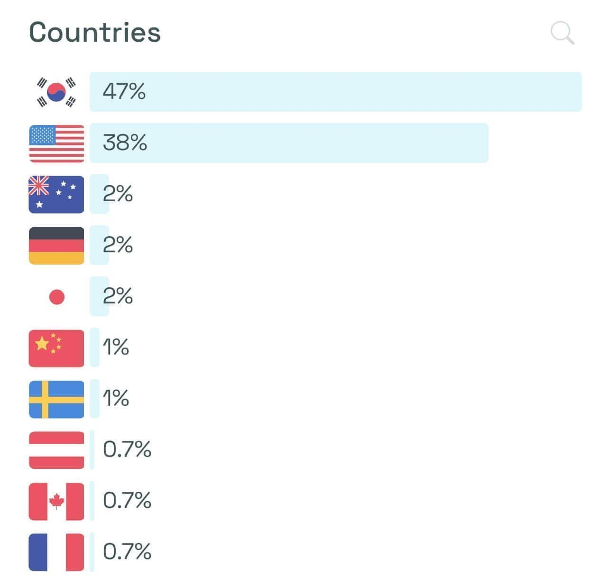

<figure>

<figcaption>

[tossface.cho.sh](https://tossface.cho.sh)

</figcaption>
</figure>

:::info
I would like to thank @sudosubin and the Tossface team for reviving Korean emojis with Unicode PUA!
:::

## Background

Tossface is an emoji font face a Korean (almost) Decacorn company, Viva Republica, created.
Tossface initially included a series of intentionally divergent emoji designs,
replacing culturally specific Japanese emojis with designs representing related Korean concepts
and outdated technologies with contemporary technologies.

- [Why can't I just welcome Tossface?](https://www-jiwon-me.translate.goog/tossface/?_x_tr_sl=ko&_x_tr_tl=en&_x_tr_hl=en&_x_tr_pto=wapp)

Unfortunately, these replacements caused backlash from multiple stakeholders,
and Viva Republica had to remove the emojis.

## Unicode Private Use Area

However, there is a hidden secret in Unicode;
There is a unused, hidden area from U+E000-F8FF, U+F0000-FFFFD, U+100000-10FFFD, which is known as Unicode Private Use Area.
This area will remain unassigned for standard emojis, and companies can use it at their own will.

Regrettably, those letters with Korean and contemporary style in a clean and neat tone and manners disappeared into history.
Therefore, I have proposed returning the emojis using a standard technology known as Unicode Private Area.

After about three months, Viva Republica accepted the request.
They redistributed those emojis in Tossface v1.3, from PUA U+E10A to U+E117.

## But how shall I type?

However, these emojis remained uncharted in the Unicode standard.
PUA U+E10A to U+E117 cannot be inputted with the standard keyboard, nor does it appear on the emoji chart.
Ironic that we finally got the glyphs back but can't type.

So I have created a small website where you can check the glyphs and copy them.
I call these [Microprojects](/r/A46FA5).
They're perfect for trying out new technologies;
I wanted to try Astro, but it kept giving me unrecognizable errors primarily because the platform was still in an early stage,
so I used Next.js, Vercel, and Tailwind.

## Now, it somehow became a Museum of Korean Culture

After creating the website, it now looked like a Museum of Korean Culture,
so I added some text in English and shared it publicly.

## Postmortem

- [tossface.cho.sh](https://tossface.cho.sh)

It was a fast and fun project before the beginning of school!
