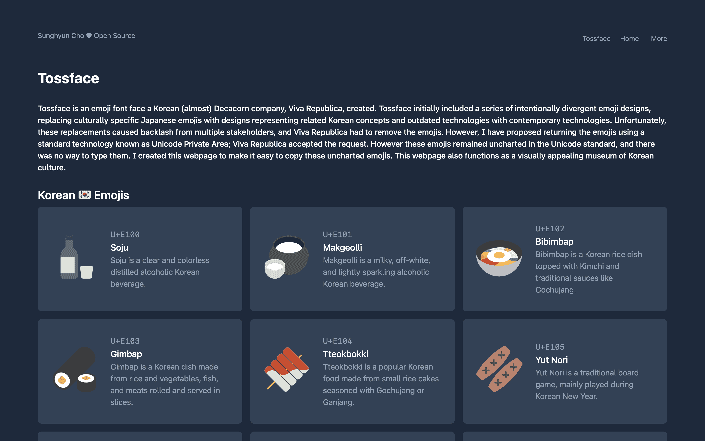
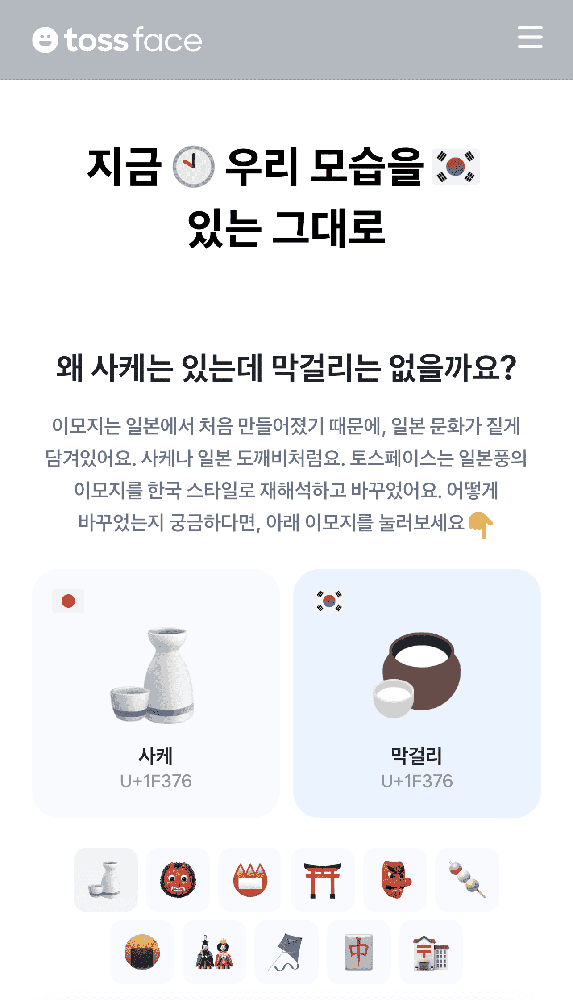
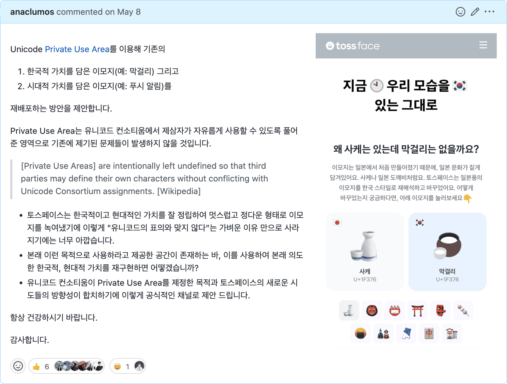

<figure>

<figcaption>

[tossface.cho.sh](https://tossface.cho.sh)

</figcaption>
</figure>

:::info
@sudosubin 님을 비롯하여 빠르게 응답해주시고, PUA 요청 반영에 힘써주신 토스페이스 팀에게 감사 인사를 드립니다.
:::

## 배경

토스페이스는 대한민국의 (거의) 데카콘 기업 비바 리퍼블리카가 제작한 이모지 폰트 페이스입니다.
토스페이스는 이모지를 마음대로 변경했다는 독특한 시도를 통해서 많은 구설수에 올랐습니다.
일본풍이 짙게 섞여있는 이모지를 한국식으로, 또 오래된 기술을 현대 기술의 모습으로 재해석한 것이었습니다.

- [토스페이스를 마냥 환영할 수 없는 이유](https://www.jiwon.me/tossface/)
- [토스 '이모지', "제멋대로 만들었다" 논란 이유는? - 지구인사이드](https://g9inside.com/?p=9259)

곧 토스페이스는 유니코드의 표의를 훼손했다는 거친 항의에 기존의 창의적인 시도를 엎어야 했습니다.

## Unicode Private Use Area

하지만 유니코드에는 토스 팀이 처음에 고려하지 못했던 숨겨진 비밀이 있습니다.
바로 Private Use Area 라고 불리는 비사용 영역(U+E000-F8FF, U+F0000-FFFFD, U+100000-10FFFD)입니다.
이 영역에는 미래에도 어떤 표준 이모지도 배정되지 않으며, 기업체들이 자유롭게 사용할 수 있습니다.

깔끔하고 정갈한 톤앤매너로 한국적이고 시대적인 멋을 잘 표현한 토스페이스의 글자들이 이대로 사라지는 것이 아쉬웠습니다.
그래서 공식적인 채널로 비바 리퍼블리카에 이를 제안했습니다.

그로부터 약 세달 뒤, 토스페이스 팀에서 토스페이스 v1.3에 PUA U+E10A부터 U+E117 영역에 기존의 "색다른" 이모지들을 재배포했다는 연락을 받았습니다.

## 근데 어떻게 타이핑하지?

하지만 이 영역은 쉽게 타이핑할 수 없는 영역입니다.
PUA U+E10A부터 U+E117 영역은 일반적인 키보드로 입력할 수도 없으며 이모지 키보드에도 나타나지 않습니다.
글리프가 존재해도 글리프를 사용하기 어려운 아이러니한 상황이 생겼습니다.

그래서 간단하게 글자를 확인하고 클릭하여 복사할 수 있는 웹사이트를 만들고 싶었습니다.
저는 이를 [Micro Project](/r/A46FA5)라고 부릅니다.
새로운 기술을 시도해보기 안성맞춤입니다.
원래는 새로 출시된 Astro를 사용해보고 싶었으나, 아직 플랫폼이 성숙하지 않아 레퍼런스를 찾기 어려운 오류들이 반복되어,
빠르게 제작할 수 있는 Next + Vercel + Tailwind를 사용했습니다.

## 만들다보니 대한민국 문화 홍보관

만들고 나니 얼추 대한민국 문화 홍보관처럼 사용할 수 있을 것 같아 간단한 안내 문구들을 추가하여 영문으로 맥락을 설명한 후,
Hacker News에 공유했습니다.

## 끝마치며

- [tossface.cho.sh](https://tossface.cho.sh)

개강 전에 주말 동안 짧게 진행한 재미있는 프로젝트였습니다.
