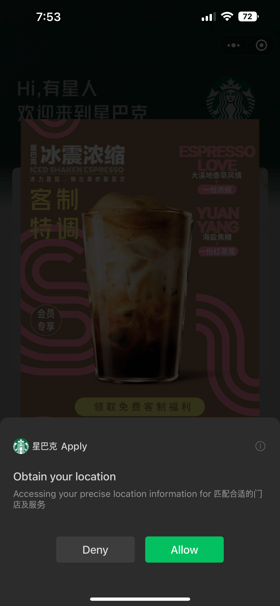
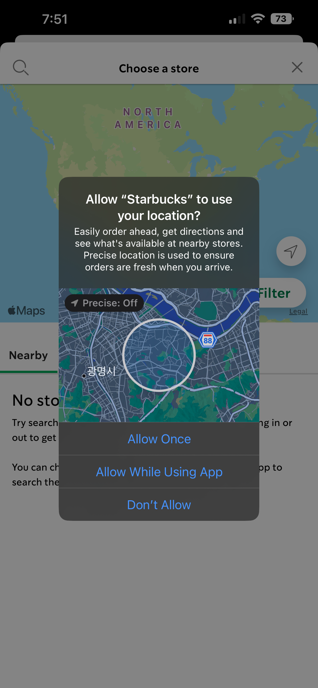

import Admonition from '@theme/Admonition'
import DisplayFlex from '@site/src/components/DisplayFlex'

# 웹 표준 미니앱

당근마켓에서 R&D 엔지니어 인턴으로 재직하면서 일한 **웹 표준 미니앱**의 기술적인 배경과 현 진척도에 대해 이야기해보려고 한다.

## 배경 0. 미니앱

미니앱은 슈퍼앱 위에서 구동되는 제3사 서비스들의 집합이다.
예를 들어 카카오톡에서 카카오선물하기 같은 서비스가 있는데,
이것을 타사가 개발하여 카카오톡이라는 플랫폼 위에서 서비스하는 개념이다.

중화권에서는 이미 BAT (바이두, 알리바바, 텐센트) 3사가 미니앱으로 시장을 장악하였으며
그 중 1위인 WeChat의 미니앱은 일간 사용자가 4억명이 넘고, 월간 사용자는 9억명을 상회한다.
또한 Apple과 Google이 중화권에서 앱스토어, 플레이스토어를 이용한
플랫폼 파워를 지니지 못하는 이유가 바로 미니앱이다.
중화권 사용자들에게 앱스토어와 플레이스토어는
마치 과거 마이크로소프트에 내장된 인터넷 익스플로러와 같다.
인터넷 익스플로러의 유일한 용도가 Chrome을 찾고 설치하는 것이듯,
중화권 앱스토어와 플레이스토어의 사실상 유일한 용도는 WeChat을 설치하는 것뿐이다.

이는 국제적으로도 새로운 현상이 아니다.
Snap은 [Snap Mini](https://developers.snap.com/en-US/minis)라는 프로그램을 개발 중이고,
Line은 [Line Mini App](https://developers.line.biz/en/services/line-mini-app/)을 만들고 있다.
당근마켓도 미니앱을 위한 환경을 구축하려고 한다.
미니앱이 무엇인지, 그 파급력이 무엇인지는 [Google의 미니앱 문서](https://web.dev/mini-apps/)를 전부 번역해두었다. (PR 대기 중)
여기서 이야기하기에는 내용이 과하게 길어질테니 해당 문서를 참고하기 바란다.

<Admonition type="note" title="여기까지 정리" icon="💡">

- 미니앱은 쉽고 빠른 개발(웹과 유사한 개발 경험)로 최대 비즈니스 효과(모바일 앱 경험)를 제공한다.
- 당근마켓은 내부, 외부의 팀이 당근마켓의 미니앱을 통해 유저에게 서비스를 제공하기를 바란다.
- 따라서 당근마켓은 슈퍼앱으로서 일종의 미니앱 환경을 만들고 싶어한다.
- 당근마켓은 모든 슈퍼앱이 미니앱 환경을 원할 것이라고 생각하고, 모든 슈퍼앱이 미니앱 환경을 만든다면 개발자 경험과 사용자 경험이 파편화될 것이라고 생각한다.
- **목표**. 한국, 일본, 미국, 영국 등에서 성공할 수 있는 미니앱 모델을 만들어라.

</Admonition>

## 배경 1. 많은 미니앱을 위해

앞서 언급한 BAT의 경우 웹에서 영감을 받은 듯한
[독자적인 언어와 브라우저](https://web.dev/mini-app-markup-styling-and-scripting/)를
개발하여 그 내부를 자신들의 마음대로 뜯어고쳤다.
중화권의 BAT의 경우 독자 규격을 사용하고,
그 3사의 비즈니스 파워가 상당하기 때문에 타사 개발자들에게 여러가지 요구를 할 수 있다.
하지만 대부분의 (소위) 슈퍼앱들은 서비스가 강력하기는 해도,
자사의 SDK를 이용해 재개발하라거나,
슈퍼앱일때만 다르게 동작하는 로직 분기처리를 요구하는 등
타사 개발자들에게 무리한 요구를 하지는 못한다.
그렇게 되면 굳이 구태여 미니앱을 만들지 않을 것이다.
그 노력으로 iOS, Android 앱을 잘 만드는 것이 더 성공 확률이 보장되기 때문이다.

이를 위해 표준 미니앱은 웹 표준을 준수해야 한다.
어떤 웹앱일지라도 약간의 수정을 통해 미니앱으로나 웹앱으로나 코드 변경 없이 동작할 수 있도록 해야한다.

## 배경 2. 예쁘게 보여주기 위해

예쁘게 보여주는 것은 상당히 중요하다.
특히 권한을 요구하는 화면은 더욱 그렇다.
어떠한 맥락도 없이 *서비스가 위치를 사용하고 싶어합니다*고 갑자기 물어본다면
사용자는 거절을 누를 확률이 높고, 그러면 서비스의 운영에 지장이 생길 수 있다.
즉 권한 요구 창은 설득력이 있어야 한다.
그를 위해서는 그에 합당한 인터페이스와 디자인으로 갖춰져야 한다.
즉, **예뻐야 한다**.

예를 들어 스타벅스 웹, 앱, 미니앱에서 위치 정보를 요구하는 경우를 살펴보자.
어떤 권한 요구 창을 승인하고 어떤 권한 요구 창을 거절할 것 같은가?

<DisplayFlex>





</DisplayFlex>

보다 더 많은 맥락이 주어지는 오른쪽으로 갈수록 승인할 사용자가 많을 것이다.
때문에 표준 미니앱은 최소한 가운데만큼의 맥락을 제공할 수 있어야 한다.

## 배경 3. 웹 표준 권한 요구 창을 예쁘게 보여주기 위해

앞서 이야기한 예시를 이어보자면 위치 정보 권한 요구 창은 [Geolocation API](https://developer.mozilla.org/en-US/docs/Web/API/Geolocation_API)가 불릴 때 발생한다.
별거 없다.
다음 코드를 실행하면 바로 나온다.

```js
navigator.geolocation.getCurrentPosition()
```

배경 1과 배경 2에 근거해, 위 코드가 실행되었을 시 (웹 표준 방식으로 위치 정보를 요청 시) **사용자를 설득할 수 있는 배경 정보와 디자인을 갖춘 권한 요구창**이 나타나야 한다.

## 문제 1. 하지만 그것은 브라우저의 영역인데?

저렇게 알림창을 띄우는 것은 브라우저의 영역이다. 때문에,
웹뷰를 그대로 사용해서 (iOS의 경우 WKWebView) 미니앱을 구동하는 경우
저렇게 위치 권한 요구 창이 그대로 나타나게 된다.
이 문제는 현재 당근마켓에 구현된 **당근미니**에도 발생한다.
그렇다면 여기서 문제를 어떻게 해결해야 할까?
새로운 브라우저를 만들어야 할까?

<DisplayFlex>


</DisplayFlex>

## 해결책 1: 어차피 누가 누군지 모른다.

99.99%의 웹앱의 경우 그냥 권한이 필요한 곳에 `getCurrentPosition()`할 뿐이지
그것이 진짜 브라우저에서 실행되는건지는 관심이 아니다.
그렇다면 만약 다음과 같은 **가짜** `navigator`를 만든다면 어떨까?

```js
const navigator = {
  geolocation: {
    getCurrentPosition(success, error) {
      // do some random stuff...
    },
  },
}
```

JavaScript는 `navigator`의 진위를 검사하지 않기에 원하는 동작을 사이에 주입할 수 있다.
이를 **Shim**이라고 한다.

> 컴퓨터 프로그래밍에서 심(shim)은 API 호출을 투명하게 가로채고 전달된 인수를 변경하거나, 작업 자체를 처리하거나, 다른 곳으로 작업을 리디렉션하는 라이브러리입니다. (In computer programming, a shim is a library that transparently intercepts API calls and changes the arguments passed, handles the operation itself, or redirects the operation elsewhere.) — [Shim \(computing\) - Wikipedia](<https://en.wikipedia.org/wiki/Shim_(computing)>)

고양이가 위치 권한을 달라고 요구하는 데모 웹사이트를 만들어보았다.

<DisplayFlex>


</DisplayFlex>

- [anaclumos/poc-geolocation-dialog: Geolocation Shimming Demo](https://github.com/anaclumos/poc-geolocation-dialog)

즉, 이를 조금 더 고도화해서 아예 `document`,
즉 DOM 자체를 JavaScript로 구현하여 원하는 부분만 교체하면
미니앱스러운 경험을 제공할 수 있다.

## 배경 4. 일관적인 경험을 위해

미니앱은 일관적인 경험을 주는 것이 중요하다.
마치 브라우저를 사용할 때
**새로고침, 즐겨찾기, 이전 페이지, 창닫기의 위치가 변하지 않듯이**
여러 미니앱에 있어서도 동일한 경험을 주어야 한다.
이는 내가 번역한
[미니앱 문서](https://web.dev/mini-app-about/#the-user-experience)에도 언급되어 있다.
이를 위해서는 공통 컴포넌트의 일부를 우리가 주입해야 한다.

## 배경 5. 빠른 경험을 위해

서로 다른 미니앱을 열고 닫을 때 빠르게 앱을 열고 닫기 위해
앱의 데이터를 `prefetch` 해올 수 있다.
하지만 앱을 열고 닫을 때마다 데이터가 유지되어야 하기에,
`iframe` 안에 미니앱을 담아두고
외부에서는 슈퍼앱의 웹뷰가 서로 다른 데이터를 처리하고
`prefetch`하는 방식을 생각할 수 있다.

## 문제 2. 얼음 ❄ 땡

하지만 여기서 또다른 문제가 발생한다.
`iframe`은 단일 쓰레드에서 동작한다.
즉, 미니앱이 멈추면 슈퍼앱의 종료 버튼 또한 먹통이 된다.

## 해결책 2. 웹에서 멀티쓰레드

<Admonition type="tip" title="JavaScript은 Single-Threaded하지 않나?" icon="🤔">

반은 맞고 반은 틀리다.

- 브라우저 안의 JavaScript은 Single-Threaded하다.
- 하지만 Web Worker라는 별도의 장치를 통해 Multi-Thread 연산을 처리할 수 있다.

</Admonition>

그렇다면 Web Worker에서 `iframe`을 구동한다면
미니앱이 멈추어도 슈퍼앱은 멈추지 않을 것이다.

## 문제 3. Web Worker 안에는 DOM API가 없다

Web Worker 안에서는 DOM API를 접근할 방법이 없다.
DOM API라는 것도 결국 말 그대로 JavaScript 기반의 Object Model이기 때문에
DOM API와 똑같이 생긴 가짜 DOM을 Worker 안에 내려주고,
그 가짜 DOM에 조작된 모든 것들을 진짜 DOM에 그대로 가져다가 적용할 수 있다면
이 문제를 해결할 수 있다.
또한 이 사이에서 **그대로 가져다가** 적용하는 것이 아니라
이게 적합한 작업인지 검사할 수 있다면,
원천적으로 어뷰징을 차단할 수 있다.

## 해결책 3: 미션 임파서블을 찍는다


다행히도 비슷한 연구가 선행되어 있다.
Google 사에서 AMP에 사용할 목적으로 [WorkerDOM](https://github.com/ampproject/worker-dom)이라는 것을 만들었고,
BuilderIO 사에서 써드파티 라이브러리 코드를 Worker에 분리할 목적으로 [Partytown](https://github.com/BuilderIO/partytown)이라는 것을 만들었다.
하지만 이 둘 다 완전한 구현체는 아니다.
[WorkerDOM](https://github.com/ampproject/worker-dom)은 Spectre 보안 사고가 한창일 때 제작되었기에 SharedArrayBuffer와 Atomics를 활용한 동기적 데이터 교환이 불가능하다.
Partytown은 [Event Prevent Default](https://partytown.builder.io/trade-offs#events-cannot-prevent-default)를 할 수 없다.
하지만 본질적으로, **미션 임파서블 모델**을 사용해서 가운데에서 적절하게 써드파티 코드를 격리하는 것이 가능하다는 것이다.

## 문제 4: 오프라인 환경에서는 접속이 불가능하다

기존의 웹 환경에서는 오프라인 환경에서 접속이 불가능하다.
예를 들어 계산기 미니앱이 존재하면,
네트워크 없이도 접속할 수 있어야 한다.
이는 초기 로딩 속도와도 크게 연관된다.
Progressive Web App을 활용하여 오프라인에서 사용할 수 있지만,
PWA 또한 초기에 수많은 네트워크 요청을 보내서
웹페이지를 저장해야한다는 점에서 여전히 비효율적이다.

## 해결책 4. 묶어서 한 번에 보낸다


이 또한 하나의 해결책이 있다.
Google에서 [[CBOR]] 형식에 기반한
[WebBundle](https://github.com/google/webbundle)이라는 라이브러리를
제작했기 때문이다.
웹번들은 여러 HTML, CSS, JS, 이미지 등을
하나의 압축된 파일로 묶어서
사용할 수 있도록 해준다.
이미 Chrome에서 사용할 수 있는 기능이고,
Google에서 실험적으로 다양하게 연구하고 있는 기능이다.
물론 Google의 본 목적은 이 **묶음 배송**을 통해
URL 기반의 광고 차단 기술을 무력화하기 위한 목적이지만.
[관련 글타래](https://news.ycombinator.com/item?id=24274968)

## 문제 5. 악성 코드로 바뀌면 어쩌지?

GitHub에서 멀쩡해보이는 코드도 NPM에서는 공격 코드가 삽입된 채로 존재할 수 있다.
실제로 월간 4천만번 이상 다운로드되는 UAParser.js 라는 라이브러리의 NPM 저장소가 해킹되어
악성 코드가 삽입되어 배포된 적 있다.
[사고 기록](https://github.com/advisories/GHSA-pjwm-rvh2-c87w)


결과적으로 어떤 형태로든 슈퍼앱의 입장에서는
미니앱 제작사의 패키지를 직접 받아서
검수를 하고 다른 코드로 바꿔치지 못하도록 스스로 호스팅해야 한다.


## 결론

위 모든 문제를 다 해결하면 **제대로 된** 미니앱 환경을 구축할 수 있다.
다만 이제 보면 알 수 있듯이 문제의 난이도가 모두 상당하다.
특히 나는 인턴 기간 동안 2번과 3번 문제에 집중했지만
워낙 깊은 영역으로 파고들다 보니 관련 키워드를 검색해도
이미 본 사이트 몇 개만 나오는 등 어려움이 많았다.

중화권과 같이 특수한 환경에 고립되지 않고
① 국제적으로 자유롭고 ② 확장성 있으며 ③ 웹 표준과 상호 호환되고 ④ 제작자와 사용자의 가치를 극대화하는
미니앱 환경이 존재하길 바란다.
다만 기술적 어려움으로 빠른 시일 내에는 만나기 어려울 듯 하다.
