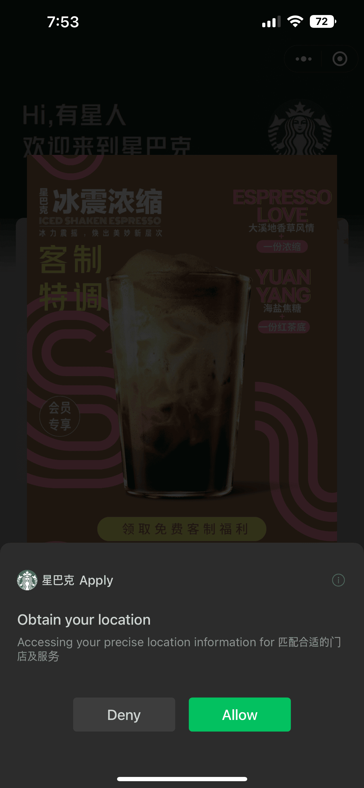
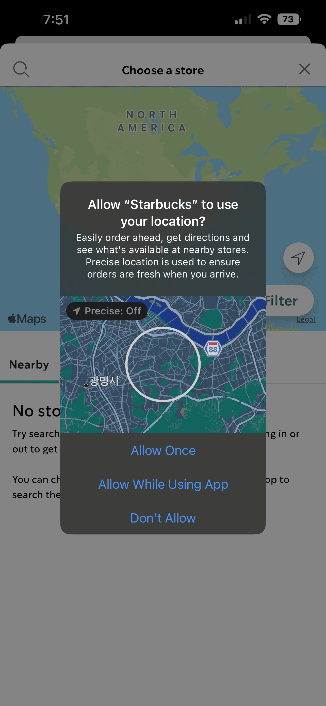
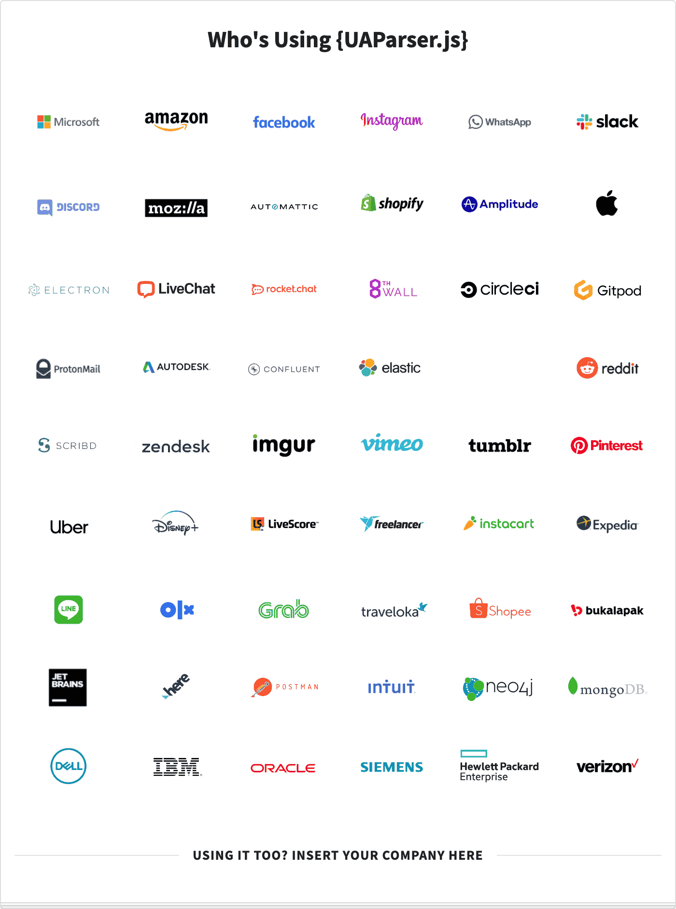

import Admonition from '@theme/Admonition'
import DisplayFlex from '@site/src/components/DisplayFlex'

I worked as a full-time Mini App researcher intern at Karrot (Korean Unicorn Company 🇰🇷🦄).
This is what I found and learned from it.

## 📱 Mini Apps

**Mini Apps** are a collection of third-party services that run on top of a native **Super App**.

:::info
Imagine the Shopify app hosting thousands of small shopping mall web apps.
You sign in once, and you can access all the apps.
No need to log in, no need to download, no need to update; it goes beyond Shop Pay, which simply provides a payment gateway.
There could be a Game Super App that hosts thousands of mini-games, a Shopping Super App that hosts thousands of mini-shopping malls, a Social Super App that hosts thousands of mini-social networks, and so on.
:::

How is this different from the status quo?
You can get the best of both worlds;
deploy it as an app (gets the best retention and metrics) with making a web (simple JavaScript development)

At the same time, you can use Super App's complete account and wallet information (no need to sign up or bother to enter data)

Therefore,

- it is faster than making an app
- it reaches more demographic than making a web
- it can target more user base than making an app
- it guarantees unparalleled reachability, retention, and payment conversions.

The so-called BAT (Baidu, Alibaba, and Tencent) is already dominating the Chinese market.
WeChat, the first player in the market, already has a Mini App ecosystem of 400 million active daily users and 900 million active monthly users.
Apple and Google are struggling to maintain their platform power in the Chinese market because of these Mini Apps.
For Chinese users, the App Store and the Play Store are like Internet Explorer.
Just as IE only exists to download Chrome, so the App Store and the Play Store are simply gateways for downloading WeChat.

Of course, international businesspeople have reacted by replicating this outside of China.
Snap tried to create [Snap Mini](https://developers.snap.com/en-US/minis), and Line tried to implement [Line Mini Apps](https://developers.line.biz/en/services/line-mini-app/).
Karrot, a Korean Unicorn company that has 60% of Korean citizens as their user base, also wants to become a Super App and create a Mini App environment.
Offering more information on the Mini App system is out of the scope of this post; please refer to [Google's in-depth review](https://web.dev/mini-apps/) on Mini Apps.

<Admonition type="note" title="So far" icon="💡">

- A Mini App is easy to make (web-like developer experience) while having powerful business effects (app-like user experience).
- Karrot wants its internal and external partners to provide service through the Mini App within the Karrot App.
- Karrot thinks that all Super Apps will want to make Mini App Systems and that there will be repeated work and fragmented developer experience if all the Super Apps make their own Mini App systems.
- **Goal**. Figure out a Mini App Model that will succeed in Korea, Japan, United States, United Kingdom, and so on. (Karrot's business regions)

</Admonition>

## 🔥 For Thriving Ecosystems

The previously mentioned BAT have created [their proprietary languages and browsers](https://web.dev/mini-app-markup-styling-and-scripting/), seemingly inspired by the web.
These three companies possess immense platform power; they can ask whatever they want from the developers.
However, most Super App services cannot justify developers following their demands, like asking devs to use non-standard SDKs or asking for logical branching for detecting a Mini App environment.
In that case, developers will give up creating a Mini App to spend that effort on creating an iOS and Android app (which has a much higher chance of success).
If you have other thoughts, why is PWA still stagnating?
Therefore, a **standard Mini App** should follow the web standard.
Developers should deploy their web app as a Mini App with little to no change.

## 😻 For Beautiful Interfaces

Having a pretty design is much more important than you think.
This statement is especially true for permission request screens.
If, for example, a service requires location without context, the user will likely decline, affecting the service's stability.
I mean that permission requests should make sense, for which we require persuasive interfaces and designs.
Therefore, it needs to be pretty.

Let us take Starbucks as an example.
The following image shows permission requests from Starbucks Web, App, and Mini App.
Which one do you think you will grant? Which one will you decline?

<DisplayFlex>





</DisplayFlex>

Most users will likely grant our request as we go to the right, given more details.
A standard Mini App should at least provide the context level of the middle screenshot.

## 📨 For Prettier Permission Requests

The geolocation permission requests mentioned above display whenever JavaScript calls the [Geolocation API](https://developer.mozilla.org/en-US/docs/Web/API/Geolocation_API).
It's not magic — executing the following code will prompt the permission request.

```js
navigator.geolocation.getCurrentPosition()
```

Based on backgrounds 1 and 2, we would need to provide a more persuasive and prettier permission request when we execute the above code, based on the Web Standards.

## 🌐 But Isn't That the Browser's Job?

Yes, displaying such a request screen falls under the browser's responsibility.
Therefore, we will meet the above permission request if we call the Geolocation API inside a Web View (specifically, WKWebView for iOS).
This behavior also happens inside Karrot Mini, an intermediary version of the Mini App system built by Karrot.
So, how can we solve this? Do we plan on making a new browser?

<DisplayFlex>


</DisplayFlex>

## 🎭 We don't care who's who

For web apps, 99.99% don't care who's who.
They call the function wherever they need it.
So, what if we make a fake navigator like the following?

```js
const navigator = {
  geolocation: {
    getCurrentPosition(success, error) {
      // do some random stuff...
    },
  },
}
```

JavaScript does not check for the authenticity of the navigator.
Therefore, we can inject whatever behavior we want.
This methodology is called Shim.

> In computer programming, a shim is a library that transparently intercepts API calls and changes the arguments passed, handles the operation itself, or redirects the operation elsewhere. — [Shim (computing)](<https://en.wikipedia.org/wiki/Shim_(computing)>)

I have created a demo website where a cat gif asks for location permission.

<DisplayFlex>


</DisplayFlex>

- [anaclumos/poc-geolocation-dialog: Geolocation Shimming Demo](https://github.com/anaclumos/poc-geolocation-dialog)
- [Geolocation Shimming Demo](https://poc-geolocation-dialog.vercel.app/)

If we advance this methodology and implement the Document Object Model in JavaScript, we can inject all behaviors that are deemed suitable for Mini Apps.

## 🗿 For Consistent Experiences

A Mini App is all about a consistent experience.
It's akin to universal components like Refresh, Favorite, or Close buttons not changing in browsers when you navigate different websites.
For more information on consistent experiences, please refer to Google's [Mini App User Experiences](https://web.dev/mini-app-about/#the-user-experience) document.
Of course, this consistency will require us to inject standard components.

## ⚡️ For Snappy Experiences

Opening and closing different Mini Apps should at least be faster than websites, if not faster than their app versions.
For this, we would need prefetching policies for Mini Apps.
We also want data persistency when opening and closing apps so we can contain the Mini App inside an `iframe` and delegate the managing to the Super App's web view.
This procedure will also require implementing `crossOriginIsolated`, `Cross-Origin-Opener-Policy`, and `Cross-Origin-Embedder-Policy` headers so that the codes inside the iframes will not have access to data outside.

## 🥶 How'd You Solve the Icing Problem?


There's another problem here: The `iframe` works on a single thread, so when the Mini App freezes, the entire Super App will also freeze, including the quit button.

## 🕸 Multi-threaded Web

<Admonition type="info" title="Isn't JavaScript Single-Threaded?" icon="🤔">

Correct and wrong.

- JavaScript inside a browser is single-threaded.
- We can, however, create multiple threads with web workers.

</Admonition>

Then, if we run our `iframe` inside the web worker, the Super App will effectively solve the icing problem.

## 🧑‍🔧 No DOM APIs in Workers

Web workers do not have access to DOM APIs.
However, just like our shimming the Geolocation API, the DOM API is also an Object Model written in JavaScript.
Therefore, we would effectively solve this problem if we could provide the fake DOM API inside the web worker and mirror the manipulations to the real DOM.
Also, we can police the manipulations between the two DOM APIs by verifying if this operation is permitted or not.

## 👻 Mission Impossible


Luckily, there is previous research conducted.
Google created [WorkerDOM](https://github.com/ampproject/worker-dom) for their Accelerated Mobile Pages, and BuilderIO created [Partytown](https://github.com/BuilderIO/partytown) to separate 3rd-party codes from web workers.
However, none of them is fully appropriate for Mini Apps.
Google started WorkerDOM when Spectre security vulnerability was a thing and did not utilize SharedArrayBuffer and Atomics.
Therefore, WorkerDOM cannot make synchronous data transfers (elaborated later).
Partytown cannot [Event Prevent Default](https://partytown.builder.io/trade-offs#events-cannot-prevent-default).
But fundamentally, we can use this Mission Impossible model to isolate and quarantine third-party codes.

## 💽 No Synchronous Data Transfer

Web Workers do not have synchronous data transfer by default.
Synchronous data transfer is essential for many places; for example, drawing animations or displaying a map on the screen requires it because we need to calculate the pixels on the screen to render the next frame.
However, since we do not have synchronous DOM APIs inside of Workers, all of the animation codes will not respond.

## 🤝 Then Make It Synchronous!

JavaScript was meant to be asynchronous from the beginning due to user interactions.
That is why we have the notorious triumvirate: callbacks, promise, async/await.
Synchronously performing _such asynchronous_ JavaScript means that if I call a specific function, the entire operation will sit there and wait until it gets the response.

We can make this synchronous using the following two methods.

1.  Synchronous `XMLHttpRequest`
    - Sending a synchronous XMLHttpRequest will idle the JavaScript operation until we get the response.
      However, this is deprecated and closer to being a hack.
      [Synchronous and asynchronous requests - Web APIs | MDN](https://developer.mozilla.org/en-US/docs/Web/API/XMLHttpRequest/Synchronous_and_Asynchronous_Requests#synchronous_request)
2.  `SharedArrayBuffer` and `Atomics`
    - SharedArrayBuffer is a shared data channel between Web Worker and the main thread.
      The Atomics operation ensures thread safety in such mutual operations.
      At the same time, it means we can pause the Worker thread, harnessing the power of Atomics.
      Mini Apps already use Web Workers, so using SharedArrayBuffer and Atomics seems more suitable.

## ✂️ Oops, You Got Disconnected

We cannot access the regular web environment offline.
For example, if we have a calculator Mini App, we expect it to work without network access.
This condition also tightly relates to initial loading speeds.
Although we can use progressive web apps to cache the website offline, it also requires plenty of initial network requests to cache it, deeming it inefficient.

## 📦 Pack it up!


There is also a solution.
Google is already experimenting with [WebBundle](https://github.com/google/webbundle), based on the CBOR file format.
WebBundle contains all the necessary files for the web, including HTML, CSS, JS, and images, into one file.
WebBundle is already enabled in Chrome, and Google is experimenting with this technology in various ways.
But sadly, Google's hidden goal is to disarm and bypass URL-based adblocking technologies.
[Related Thread](https://news.ycombinator.com/item?id=24274968).

## 🦠 What if it gets malicious code?

A perfectly fine code on GitHub can suddenly become an attacking code in NPM.
For example, UAParser.js, a popular library marking 40M+ monthly downloads, once got hacked and distributed malicious codes.
[Accident Records](https://github.com/advisories/GHSA-pjwm-rvh2-c87w).



Essential in any way, the Super App provider should get the package from Mini App providers, audit them, and host by themselves so that others cannot swap out codes.
However, there is very little to say because this part of the system is developed almost wholly.

## 😊 Conclusion.

If we solve all the abovementioned problems, we can finally construct a proper Mini App environment.
However, as you can tell, each issue exhibits a vast range of technical and administrative challenges.
I focused on problems #2 and #3 during my internship, but the resource was extremely scarce since it delved into such a niche area of interest.
I imagine seeing a Mini App environment that is ① internationally accessible ② scalable ③ interoperable with Web Standards ④ and maximizing values for creators and users without being confined to a specific geographic region like China.

But the challenges will only delay our joyful union.
