# 웹으로 빚은 다이나믹 아일랜드 🏝

<Admonition type="info" title="잔소리 말고 일단 먼저 보여줘요" icon="🗣">
그럼요. 클릭해보세요. 제가 현재 듣고 있거나 가장 최근에 들은 30개의 음악 중 하나가 무작위로 나타난답니다.
</Admonition>

import IframeResizer from 'iframe-resizer-react'

<figure
style={{
position: 'sticky',
top: '4rem',
zIndex: 100,
margin: '0 -16px',
width: 'calc(100% + 32px)',
}}
>
<IframeResizer
id='dynamic-island'
style={{
margin: '0 -1rem',
width: 'calc(100% + 2rem)',
}}
src='https://dynamic-island.cho.sh/embed-player'
/>

</figure>

<figcaption>

↑ 클릭해보세요 ↑

</figcaption>

**유능한 예술가는 모방하고 위대한 예술가는 훔친다** —
그리고 이번에는 [Vercel](https://vercel.com)의 개발자 경험 담당 VP [Lee Robinson](https://github.com/leerob)의 아이디어 하나를 베껴보려 한다.
Next.js의 각종 신기술을 활용하는 실험적이지만 간결하고 아름다운 포트폴리오로 유명한 [leerob.io](https://github.com/leerob/leerob.io)에는 한 가지 재미있는 기능이 있다.
자신이 **현재 듣고 있는 음악이 웹에 같이 나타나는 기능**이다.

<figure>

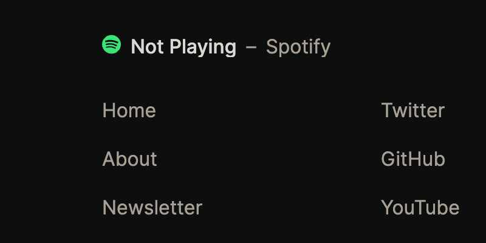

<figcaption>

Now Playing — Spotify @ [leerob.io](https://leerob.io)

</figcaption>
</figure>

[누구보다 음악적 취향이 뚜렷한 나였기에](/w/AF848F) 언젠가는 이를 꼭 내 웹사이트에 구현하고 싶었다.
다만 단순하게 재현하는 수준이 아니라 무언가 기술적인 도전을 해보고 싶었다.
당시 여러 음악 서비스를 돌아가며 사용해보고 있었기에 굳이 개발을 서두르지 않은 이유도 있었다.
그런 이유로 개발을 이리저리 미루다 2022년에 이르렀다.
그러던 중 Apple이 최근 신박한 새로운 기능을 발표했다.
바로 다이나믹 아일랜드(Dynamic Island)라는 기능이다.

<figure>

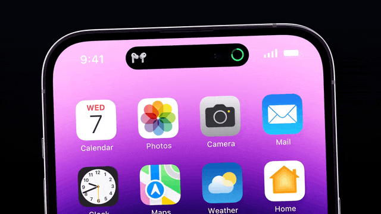

<figcaption>

화면 상단 펀치홀이 자유자재로 크기를 바꾸며 다양한 부가 정보를 표시한다.

</figcaption>
</figure>

이를 웹에서 정확하게 똑같이 구현해보고 싶다는 결론에 이르렀다.
몇 가지 안드로이드 전용 복제품을 인터넷에서 확인하기도 했는데,
전부 애니메이션 곡선이 부자연스러워 이런 디테일을 공부해보고 싶었다.

import Admonition from '@theme/Admonition'

<Admonition type="info" title="목표" icon="💡">

웹 상에서 내가 현재 듣고 있는 음악을 보여주는 다이나믹 아일랜드 🏝 를 구현해보자.

</Admonition>

<Admonition type="tip" title="꿀팁" icon="🍯">

이 프로젝트의 [연구 기록](/r/B21605)도 공개되어 있다.

</Admonition>

## 🛠 기술 정하기

우선 프레임워크로는 자주 사용하는 Next.js와 Tailwind를 골랐다.
가장 익숙하기에 가장 빠르게 만들 수 있을 것 같았다.
문제는 애니메이션이었다.
간단한 CSS 애니메이션은 다루어 보았지만
ease-in-ease-out을 넘어가는 복잡한 애니메이션은 다뤄보지 못했다.
[Framer Motion](https://www.framer.com/developers/)이라는 라이브러리를 알게 되어 이를 사용하기로 했다.

<figure>

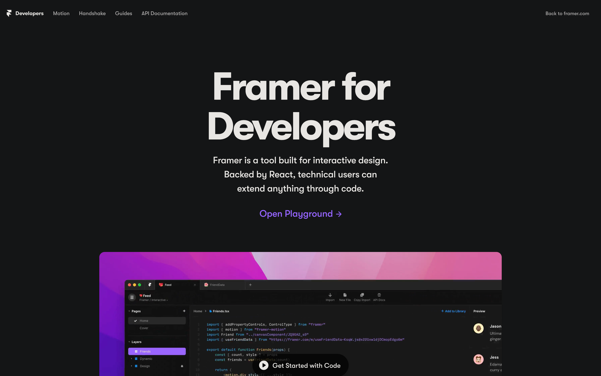

<figcaption>

[Framer Motion](https://www.framer.com/developers/)

</figcaption>
</figure>

## 🧑🏻‍🏫 애니메이션의 물리

우선 Apple의 애니메이션과 다른 모방작의 애니메이션이 왜 달라보이는지부터 이해해야 한다.
애니메이션에도 다양한 종류가 있지만, 크게 2가지로 나눌 수 있다.
(최소한 [Apple 플랫폼에서는 이렇게 2가지로 나누어 지원한다](https://developer.apple.com/documentation/swiftui/animation).)
아주 단순하게 이해하자면 다음과 같다.

- **Parametric Curve**. 시작점과 종착점이 있을 때, 그 사이 조작점(Control Point)을 두고 그 조작점 사이를 수학 공식을 이용해 보간(interpolate)한다. 보간에 사용되는 공식의 종류에 따라 Linear Curve, Polynomial Curve, Spline Curve 등으로 나뉜다. 흔히 사용되는 Bezier Curve도 여기에 해당된다.
- **Spring Curve**. 고전 물리학의 탄성 방정식([Hooke's law](https://en.wikipedia.org/wiki/Hooke's_law)와 그에 기반한 수많은 방정식)을 이용해 경직도(Stiffness)와 제동 계수(Dampening)를 통한 물리적인 궤도를 계산한다. [더 알아보기: Maxime Heckel](https://blog.maximeheckel.com/posts/the-physics-behind-spring-animations/)

애니메이션 곡선에 대해서 더 깊게 이야기하는 것은 이 글의 초점에서 벗어난 것 같으니 더 자세하게 설명하지는 않겠지만,
대부분의 다이나믹 아일랜드 재현작들이 위의 Parametric Curve를 이용해 애니메이션을 제작하는 반면 (CSS에 내장되어 제공되니 가장 쉽기도 하다)
Apple의 경우 현실의 애니메이션과 비슷하게 구현하기 위함인지 Spring Motion을 주로 사용한다.

이번에 사용한 [Framer Motion](https://www.framer.com/docs/use-spring/)에서도 `useSpring()`이라는 React Hook을 통해 이런 물리적인 움직임을 제어할 수 있다.

```ts
import { useSpring } from 'framer-motion'
useSpring(x, { stiffness: 1000, damping: 10 })
```

## 🛥 다이나믹 아일랜드를 향해

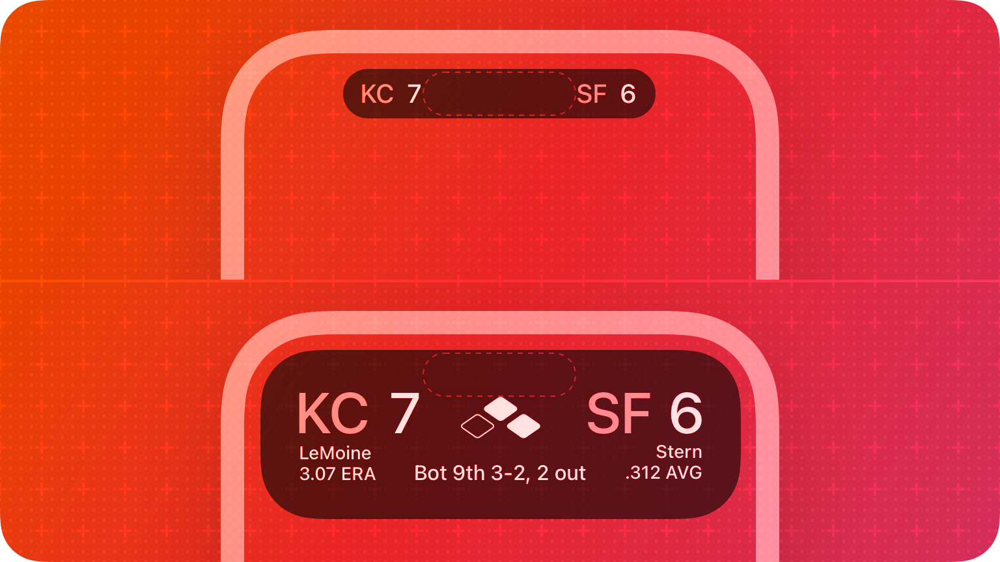

우선 [Apple의 문서](https://developer.apple.com/design/human-interface-guidelines/components/system-experiences/live-activities)를 깊이 읽어보며 이런 저런 특징들을 공부했다.
다이나믹 아일랜드는 크기에 따라 다음과 같은 형태를 지닌다.

<DisplayFlex>
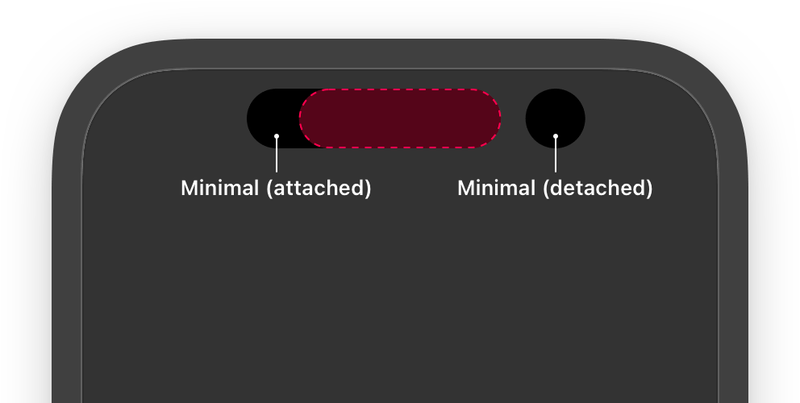
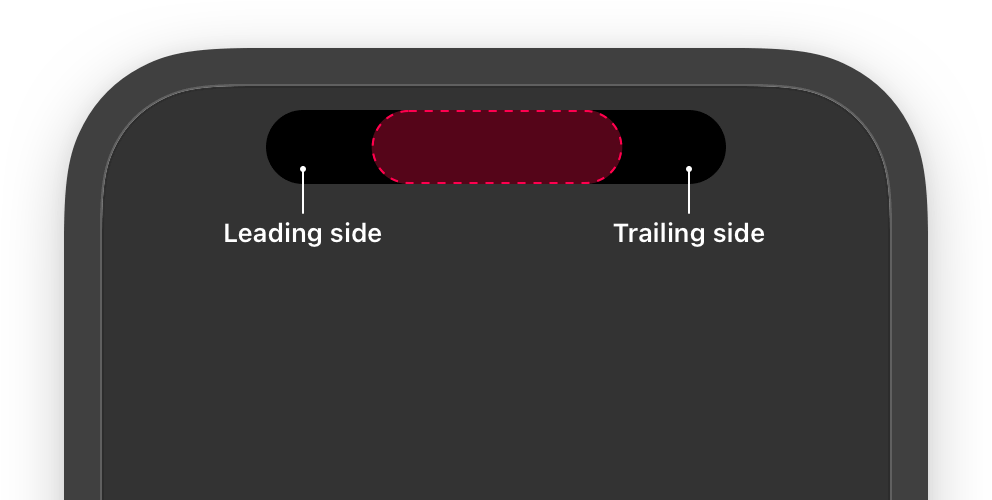

</DisplayFlex>

더불어서 인터넷 어딘가에서 다음과 같은 사진도 확인할 수 있었다.
Apple 공식 문서에서는 단순하게 **Expanded**라고 두루뭉실하게 표현하는 반면 이 사진에는 여러 사이즈가 동시에 나타난다.


이를 반영해서 다음과 같이 타입 정의를 해보았다.

```ts
export type DynamicIslandSize =
  | 'compact'
  | 'minimalLeading'
  | 'minimalTrailing'
  | 'default'
  | 'long'
  | 'large'
  | 'ultra'
```

그런 다음 하룻밤을 갈아넣어 ([2022년 10월 16일](/r/2022-10-16#dynamic-island-on-the-web)) Framer Motion을 이용해 자연스럽게 크기 전환을 하는 방법을 알아냈다.
다음의 코드로 동작한다.
특히 `stiffness`와 `damping` 값을 가지고 많은 실험을 했다.
알아낸 값은 `const stiffness = 400` 그리고 `const damping = 30`.

```tsx
<motion.div
  id={props.id}
  initial={{
	opacity: props.size === props.before ? 1 : 0,
	scale: props.size === props.before ? 1 : 0.9,
  }}
  animate={{
	opacity: props.size === props.before ? 0 : 1,
	scale: props.size === props.before ? 0.9 : 1,
	transition: { type: 'spring', stiffness: stiffness, damping: damping },
  }}
  exit={{ opacity: 0, filter: 'blur(10px)', scale: 0 }}
  style={{ willChange }}
  className={props.className}
>
```

<figure>

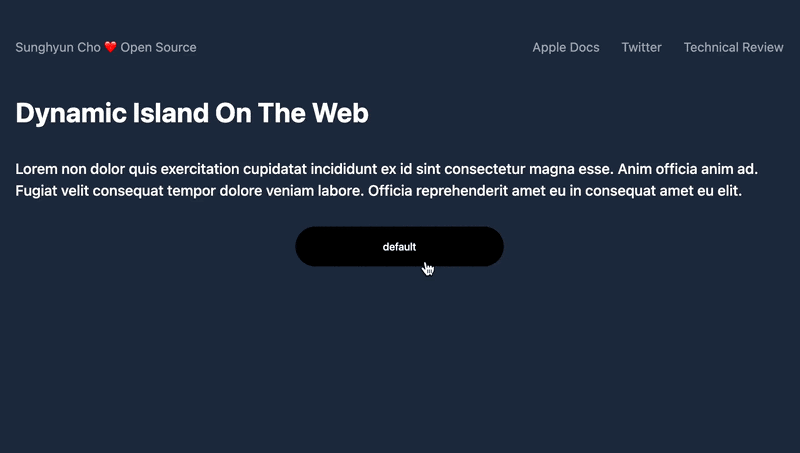

<figcaption>

[2022년 10월 16일](/r/2022-10-16#dynamic-island-on-the-web) 완성한 모습

</figcaption>
</figure>

## 📞 전화 구현

다른 API를 붙이기 전에 처음 한 것은 전화 컴포넌트를 구현하는 일이었다.
큰 이유가 있었던 것은 아니고 애니메이션과 익숙해지기 위해서 구현해보았다.
실제로 완성된 제품을 보니 실제 Apple의 제품과 아주 닮아 마음에 들었다.
[2022년 10월 20일](/r/2022-10-20)에 완성되었다.

<figure>

<IframeResizer
id="dynamic-island-phone-call"
style={{
margin: '0 -16px',
width: 'calc(100% + 32px)',
}}
src="https://dynamic-island.cho.sh/embed-phone-call"
/>

<figcaption>

↑ 클릭해보세요 ↑

</figcaption>
</figure>

## 🍎 Apple Music API

그 다음 필요했던 것은 Apple Music API와 연동하는 일이었다.
2021년 초에 Spotify를 이용해서 기술 시연을 완성한 적이 있다.
Spotify에는 Now Playing API가 공식적으로 존재한다. 비슷하게 Apple Music도 Now Playing API가 있을 것이라고 생각했다.

import DisplayFlex from '@site/src/components/DisplayFlex'

<DisplayFlex>

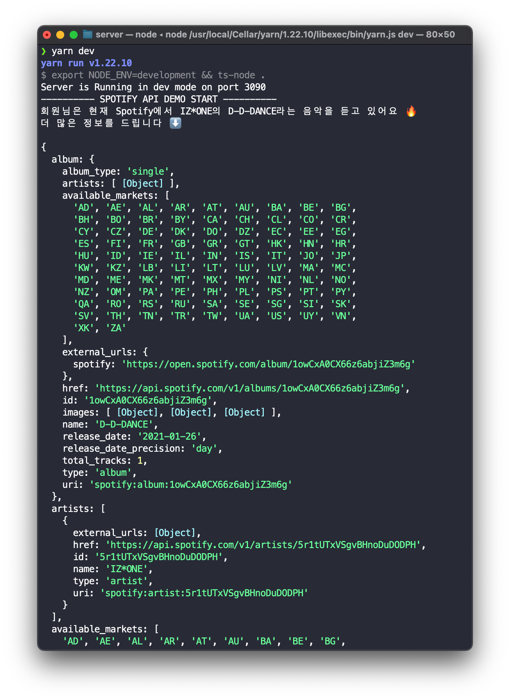

<figure>

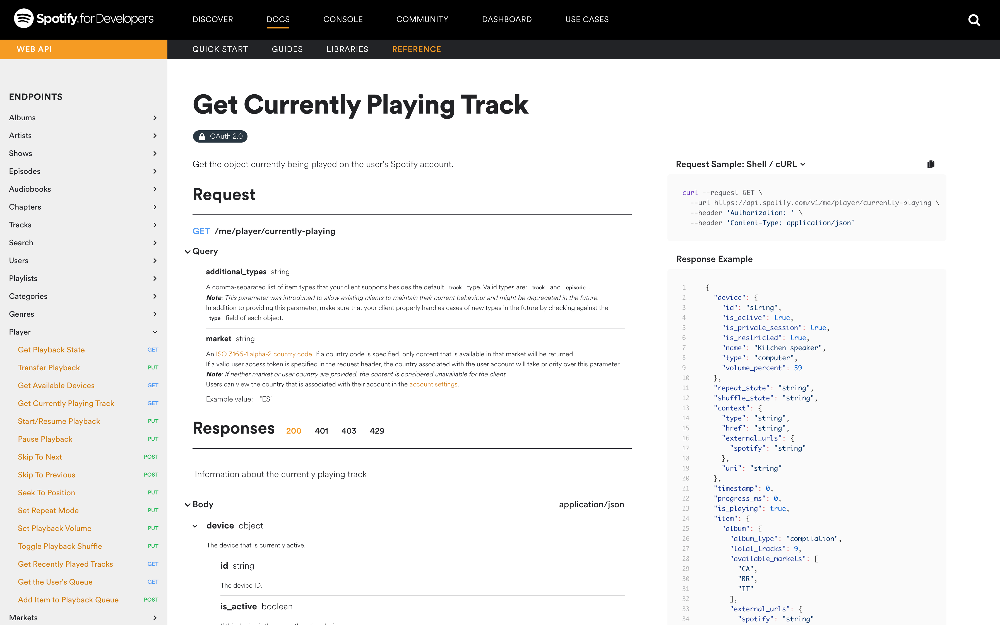

<figcaption>

[Spotify for Developers](https://developer.spotify.com/documentation/web-api/reference/#/operations/get-the-users-currently-playing-track)

</figcaption>
</figure>

</DisplayFlex>

Apple Music API 1.1이 언제 출시된 것인지 모르겠지만 비교적 최근에 [Get Recently Played Tracks](https://developer.apple.com/documentation/applemusicapi/get_recently_played_tracks)라는 이름으로 비슷한 API가 공개되었다.

<figure>

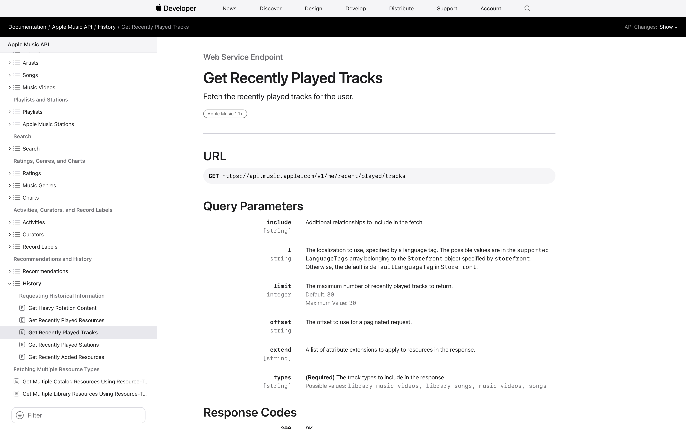

<figcaption>

참고로 [2년 전](https://developer.apple.com/forums/thread/114660)만 해도 API가 존재하지 않았다.

</figcaption>
</figure>

이제 필요한 것은 OAuth 2.0에 필요한 각종 토큰들을 발급 및 저장하는 일이다.
Spotify의 경우 [OAuth 2.0 표준을 거의 그대로 따라가다시피](https://developer.spotify.com/documentation/general/guides/authorization/) 했는데
Apple은 몇 가지 정보가 더 필요했다.
특히 이 Now Playing 같은 경우는 단순하게 Apple과의 인증 뿐만 아니라 **사용자의 정보**에 접근하는 것이다 보니
사용자의 동의 여부에 따른 권한 처리도 별도로 진행되었다.
그리고 이 모든 것이 문서화가 제대로 되어있지 않아 꽤 골치 아팠다.
우선 필요했던 것은 다음과 같다.
쉽게 설명하기 위해 내가 비행기를 운행한다고 비유해서 설명해보겠다.

0. Apple Developer 유료 계정 ($99, 비행기 자체와 관련 사업을 위한 비용 처리.)
1. Apple Developer에서 발급 받는 **Apple Music Key**: Apple Music 관련 서비스에 내가 요청을 날릴 법적 권한이 있음을 확인한다. (조종사 자격증 발급.)
2. Apple 서버에 요청해서 발급 받는 **Apple Music Main Token**: Apple Music 관련 서비스에 내가 요청을 날릴 때 쓸 통행증을 발급 받는다. (항공기 운항승인 신청서.)
3. 사용자가 인증 플로우를 거쳐 발급되는 **Apple Music User Token**: 내 서비스가 사용자 정보에 접근해도 되는지에 대한 동의를 확인한다. (탑승자가 구매하는 비행기 티켓.)

이 4가지 정보들이 모두 연동되어야지 정상적으로 정보(사용자가 무슨 음악을 듣고 있었는가)를 확인할 수 있다.
이와중에 마지막 User Token은 iOS, macOS와 MusicKit on the Web 등 아주 제한적인 형태로만 사용할 수 있도록 만들어놓았다.
MusicKit on the Web은 [music.apple.com](https://music.apple.com)나 [Cider](https://github.com/ciderapp/Cider), [LitoMusic](https://github.com/lujjjh/LitoMusic) 등 Apple Music 웹 클라이언트에서 사용하기 위함이지 지금 이 경우처럼 자유자재로 API 요청을 진행하는 곳에 사용할 수 없다.
그런데도 Apple 문서에는 딱 저렇게 **MusicKit on the Web를 사용하면 자동으로 됩니다**라고만 나와있고 그 외의 경우에는 어떻게 구하는지 전혀 언급이 없다.

그럼 어떡하겠나. **리버스 엔지니어링** 해봐야지. 나머지 단계들은 비교적 직관적인 단계들로 진행되었다. [연구 기록](/r/62764C) 참고.


<figure>


<figcaption>

[MusicKit on the Web](https://js-cdn.music.apple.com/musickit/v3/docs/index.html). 애플 성격에 Storybook 문서로 된 것을 보면 아직 완전 초기 베타인가 보다.

</figcaption>
</figure>

## 🦾 MusicKit 리버스 엔지니어링

우선 MusicKit on the Web의 기본적인 스펙을 모방하며 기초적인 웹을 만들었다.

<DisplayFlex>

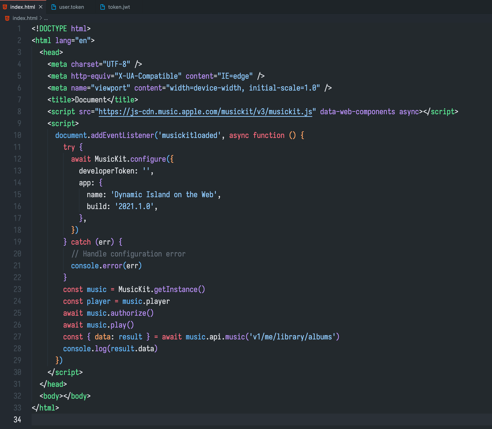

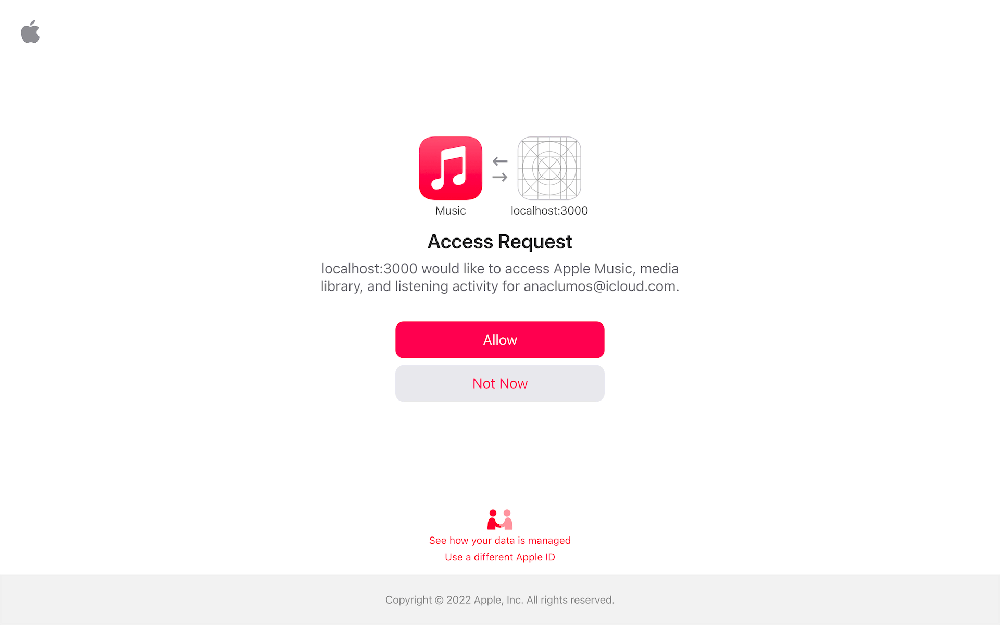

</DisplayFlex>

그런 다음부터 웹페이지의 요청 헤더를 까보면 다음과 같이 `media-user-token`이라는 필드가 있다.

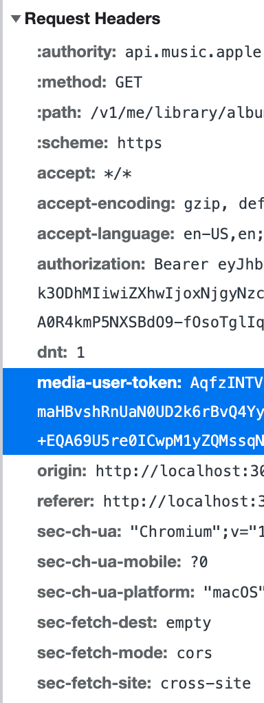

그런 다음 Postman에서 key들을 모두 채워서 요청을 날려보면 다음과 같이 JSON 응답이 돌아옴을 확인할 수 있다.
여기까지 [2022년 10월 28일](/r/2022-10-28)까지 진행된 개발이다.

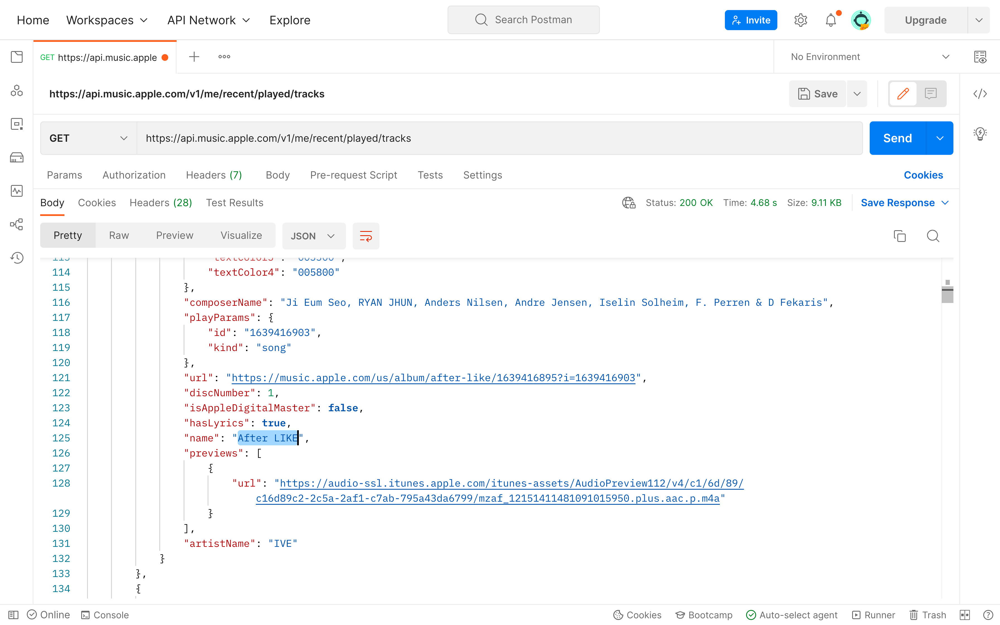

사람들이 접속할 때마다 API 요청을 날리게 된다면 당연히 순식간에 API Quota를 다 쓸 것이다.
그래서 어떠한 형태로든 캐시 서버를 만들고 싶었다.
하지만 **최고의 데이터베이스는 데이터베이스가 없는 것이라는 것을 명심하자**.

> 데이터베이스가 필요 없을 때는 데이터베이스를 쓰지 마세요. 그리고 이건 생각보다 꽤 자주 해당되는 경우랍니다. 예를 들어 전세계 195개를 데이터베이스에 집어넣고 매번 `join`할 필요가 있겠어요? 그냥 `config` 파일에 하드코딩하고 부팅할 때 메모리에 읽어들이세요. [It's not Ruby that's slow, it's your database](https://berk.es/2022/08/09/ruby-slow-database-slow/)

그냥 GitHub Secrets에 비밀 키를 저장해놓고 몇 분에 한 번씩 API를 요청해 GitHub에 띄워두도록 만들었다.

- [anaclumos/now-playing: What is Sunghyun listening to right now? (Apple Music)](https://github.com/anaclumos/now-playing)
- [raw.githubusercontent.com/anaclumos/now-playing/main/now-playing.json](https://raw.githubusercontent.com/anaclumos/now-playing/main/now-playing.json)


## 🎼 이퀄라이저

앞서 전화 컴포넌트를 완성환 것과 비슷하게 음악 플레이어 컴포넌트도 완성했다.

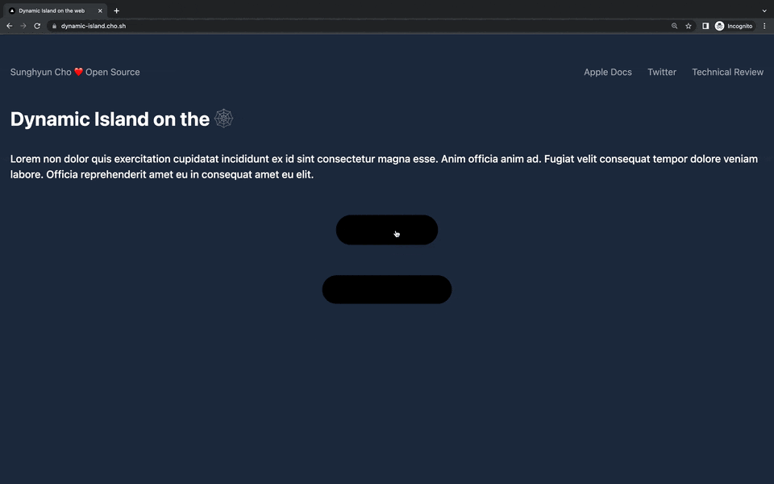

바로 이퀄라이저가 없는 것이다.
React에 괜찮은 이퀄라이저가 없는지 알아보다가 그냥 Framer Motion으로 이마저도 만들기로 결정했다.
몇가지 반복적 개발의 과정 스크린샷을 첨부한다.

<DisplayFlex>
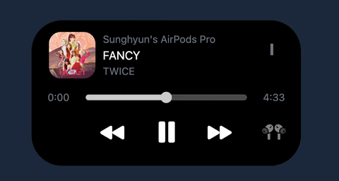
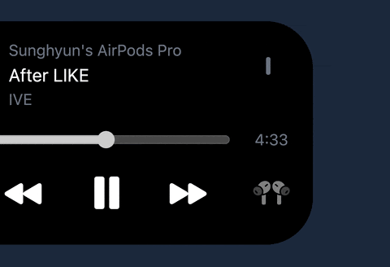
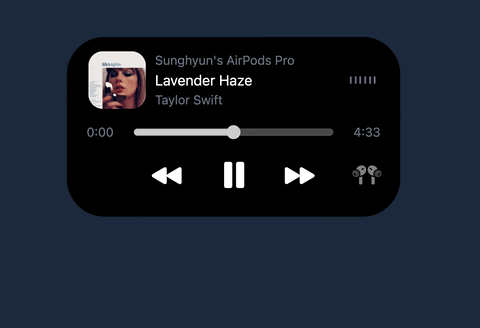
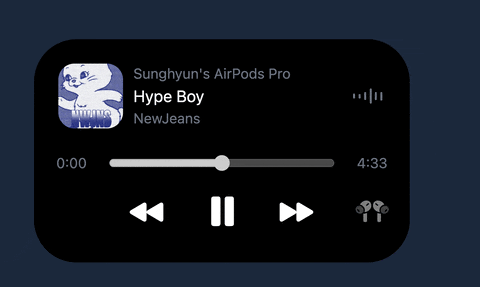
</DisplayFlex>

이퀄라이저의 각 봉은 무작위로 길이가 결정된다.
근데 마지막 `Hype Boy` 예시에서도 뭔가 어색한 것이 느껴졌다.
일반적으로 음악은 저음역대와 고음역대는 진폭이 작은데 반해,
완전하게 무작위로 값을 계산해서 저음역대와 고음역대에도 비슷한 진폭의 봉이 나타나서 그런 것 같았다.
그래서 각 봉마다 기준치(`baseLength`)를 정해주고 그 값에서 ±(무작위 값)을 하도록 변경했다.


마지막으로 이퀄라이저의 색깔을 앨범아트의 키 컬러(Key Color)와 동일하게 변경했다.
별도의 작업이 필요하진 않았고 Apple Music API에 그 값이 같이 포함되어 있다.

## 🔎 스쿼클의 물리 엔진

끝났다고 생각하면 아직 오산이다!
원래 디테일은 마지막 2%에서 차이가 나는 법이다.
이렇게 완성된 다이나믹 아일랜드도 아직 무언가 어색했다.
뭔가... 곡선이 **날카로운** 느낌이 들었다.
바로 **스쿼클**의 미적용 때문이다.

<figure>


<figcaption>

출처: [Apple’s Icons Have That Shape for a Very Good Reason @ HackerNoon](https://hackernoon.com/apples-icons-have-that-shape-for-a-very-good-reason-720d4e7c8a14)

</figcaption>
</figure>

일반적으로 `borderRadius`를 통해서 설정하는 테두리는 곡률이 일정하다.
이렇게 되면 곡률이 시작되는 지점에서 급격한 곡률의 변화로 인해 그 부분이 날카롭게 느껴진다.
이에 반해서 곡률을 서서히 높였다가 낮추면 훨씬 부드러운 곡선이 탄생한다.
**등가속도** 운동이 아니라 **등가가속도** 운동을 한다고 생각하면 된다 (속도를 일정하게 바꾸는 것이 아니라, 가속도를 일정하게 바꾸는 것).
수학적인 단어로 스쿼클은 [초타원 (Superellipse)](https://ko.wikipedia.org/wiki/%EC%B4%88%ED%83%80%EC%9B%90)이다.
다음 공식을 만족하는 형태들이다.

$$
{\lvert{x \over a}\rvert}^n + {\lvert{y \over b}\rvert}^n = 1
$$

여기에서 $n$은 곡률, $a$는 $x$ 축 길이, $b$는 $y$ 축의 길이이다.
수학적으로 더 깊은 내용은 Figma의 [Desperately seeking squircles](https://www.figma.com/blog/desperately-seeking-squircles/) 문서를 참고하자.

[tienphaw/figma-squircle: Figma-flavored squircles for everyone](https://github.com/tienphaw/figma-squircle)를 이용해 `SVG` 스쿼클을 생성한 뒤
`clipPath` 프로퍼티를 이용해 다이나믹 아일랜드를 잘라내도록 만들었다.

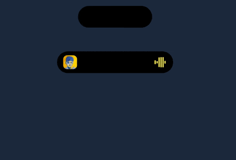

다만 애니메이션의 모든 프레임에 `clipPath`를 걸기 위해서는 스쿼클을 모든 프레임마다 생성해야 하기에,
다이나믹 아일랜드가 크기를 바꾸는 동안은 `borderRadius`를 이용해 모서리를 다듬고,
애니메이션이 끝나는 즉시 재빠르게 `clipPath`를 적용하도록 최적화했다.
아주 자세히 보지 않으면 알아차리기 어려워 성능과 디테일의 괜찮은 타협이라고 생각했다.
여기까지 [2022년 11월 11일](/r/2022-11-11)까지 완성했다.

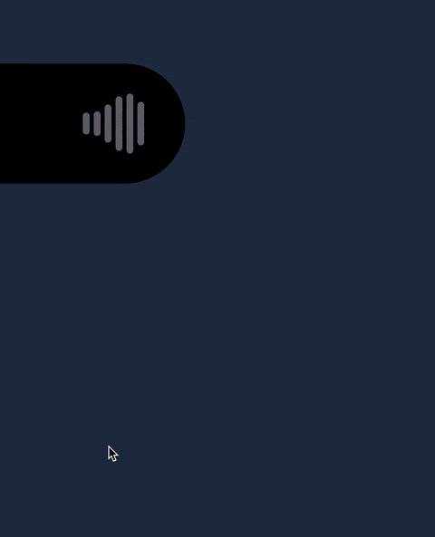

## 💨 애니메이션 최적화

CSS에는 `will-change`라는 속성이 있다.
화면에 무슨 요소가 어떻게 변화할 것인지 브라우저에게 미리 알려주어
속도를 최적화할 수 있도록 미리 작업하라는 것을 뜻한다.
브라우저는 `will-change`가 없는 모든 콘텐츠를 애니메이션이 적용될 때마다 다시 "렌더링"(rasterize)하는데,
`will-change`가 있으면 미리 계산된 정해진 이미지로 일단 애니메이션을 진행한 뒤
애니메이션이 완전히 종료되었을 때 렌더링을 다시 진행한다.
때문에 애니메이션이 종류에 따라 흐려보일 수 있지만, `transform`, `scale`, `rotate` 등의 애니메이션의 부드러움을 준다.

- 참고: [will-change - CSS: Cascading Style Sheets | MDN](https://developer.mozilla.org/en-US/docs/Web/CSS/will-change)

다이나믹 아일랜드는 크기와 투명도 등을 주로 조절하기에 `will-change`를 사용하기 적합했다.
Framer Motion에서는 다음 코드를 이용해 적용할 수 있었다.

```ts
import { motion, useWillChange } from 'framer-motion'

// ...

const willChange = useWillChange()

// ...

<motion.div style={{ willChange }}/>
```

## 🔗 연동

마지막으로 연동에 사용할 수 있는 페이지들을 만들었다 (`/embed-player`, `/embed-phone-call`).
다른 사이트들에 Tailwind, Framer Motion 등 의존성을 추가하고 싶지 않았기에 iframe을 이용해서 연동하고 싶었다.
[davidjbradshaw/iframe-resizer](https://github.com/davidjbradshaw/iframe-resizer)를 이용해서 반응형 iframe을 구현할 수 있었다.
[Position Sticky](https://developer.mozilla.org/en-US/docs/Web/CSS/position)를 사용해 특정 페이지 화면 상단에 붙어있을 수도 있도록 만들었다.
이 페이지 상단에도 붙어있을 것이다!

## 💭 회고

이로써 프로젝트를 모두 완성했다.
몇 가지 특별히 느낀 점이 있다.

우선 첫번째로 중장기 프로젝트를 끈기 있게 잘 진행했다.
원래도 [규칙적으로 꾸준히](/r/D9B586) 무언가를 진행하는 분들을 존경해왔는데,
약 한 달 반에 걸쳐 프로젝트를 완성해서 프로젝트를 뚫어내는데 성공해서 보람이 있었다.
또한 대학교 수업, 구직 활동, 사이드 프로젝트 등을 잘 저글링 🤹 해서 뿌듯했다.
(아직 다 끝나진 않았지만)

두 번째 느낀 점으로, [cometkim](https://github.com/cometkim)님께 특별히 감사 인사를 하고 싶다.
당근마켓에서 인턴을 할 당시 특별한 일화가 하나 기억에 남는데,
바로 `webpack`으로 트랜스파일된 코드 그 자체를 뜯어가며 리버스 엔지니어링하는 것이 가능하다(‼️)는 것을 직접 보여주신 것이다.
인턴십 기간동안 정말 매콤하게 많이 배웠다.
여하튼 그 덕분에 Apple Music API에서 막혔을 때 그냥 **리버스 엔지니어링해서 뚫어내야지**라는 자신감이 생겼던 것 같다.
팀, 감사의 의미로 헤이캐럿 당근을 드립니다 🥕🥕🥕🥕🥕

어쨌든 이렇게 프로젝트를 끝낸다.
