# Recreating the Dynamic Island 🏝

<Admonition type="info" title="Talk is cheap; show me right now!" icon="🗣">
Of course. Click on the black oval below. It will display a song I am currently listening to or any of my 30 most recently played songs.
</Admonition>

import IframeResizer from 'iframe-resizer-react'

<figure
style={{
position: 'sticky',
top: '4rem',
zIndex: 100,
width: 'calc(100%+2rem)',
margin: '0 -1rem'
}}
>

<IframeResizer
id="dynamic-island"
style={{
width: '100%',
margin: '0 auto'
}}
src='https://dynamic-island.cho.sh/embed-player'
/>

</figure>

<figcaption>

Click on the black oval above!

</figcaption>

:::note

There was a breaking change on the Apple Music API side, and I won't live-update the API anymore.

:::

_Good artists copy; great artists steal_ —
and I am now replicating [Vercel](https://vercel.com)'s
DX VP [Lee Robinson](https://github.com/leerob)'s idea,
[LeeRob.io](https://github.com/leerob/leerob.io).
Known for being a excellent testing bed for new Next.js features, [Lee Robinson](https://github.com/leerob) has one outstanding functionality:
It will display **the owner's song currently playing**.

<figure>


<figcaption>

Now Playing — Spotify @ [leerob.io](https://leerob.io)

</figcaption>
</figure>

[I have an unmistakable taste in music genres](/w/AF848F) and longed to implement this one day on my website.
However, I wanted it to be a technical challenge rather than simply recreating it.
I also tried out various music services, making me postpone the development.
I kept delaying the action until Apple released an exciting feature in 2022 called the _Dynamic Island_.

<figure>


<figcaption>

The punch-hole camera at the top will reshape itself into different widgets.

</figcaption>
</figure>

The Dynamic Island perfectly satisfied my desire for a technical hurdle,
so I planned to implement it with Web technologies.
I also checked out different copies of the Dynamic Island for Android products,
which all had awkward animation curves,
further getting me interested in learning such details.

import Admonition from '@theme/Admonition'

<Admonition type="info" title="Goal" icon="💡">

Let's recreate the Dynamic Island on the Web!

</Admonition>

<Admonition type="tip" title="Extra Tip" icon="💰">

I also open-sourced my [research notes](/r/B21605) for this project.

</Admonition>

## 🛠 Readying the Tech

I went with the most familiar choice for the framework: Next.js and Tailwind.
However, the animation troubled me.
I have never dealt with anything more complicated than `ease-in-ease-out` CSS animations.
I learned about a production-ready motion library named [Framer Motion](https://www.framer.com/developers/) and opted for it.

<figure>


<figcaption>

[Framer Motion](https://www.framer.com/developers/)

</figcaption>
</figure>

## 🧑🏻‍🏫 The Physics of Animations

We first want to understand why Apple's animations look different from the others.
We can classify animations into two big categories.
(At least [Apple classifies theirs into these two categories in their platform.](https://developer.apple.com/documentation/swiftui/animation))

**Parametric Curve**. Given a start and an endpoint, place a few control points and interpolate the curve in between using mathematical formulas. Depending on the type of interpolation formula, it can be a linear curve, polynomial curve, spline curve, etc. The Bézier curve that many developers often use falls under this category.

**Spring Curve**. Based on Newtonian dynamics (Hooke's law, the law that governs a spring's physical motion), we calculate the physical trajectory using stiffness and dampening. [Learn More: Maxime Heckel](https://blog.maximeheckel.com/posts/the-physics-behind-spring-animations/)

Any further discussions on animation curves will be out of the scope of this post.
Most replications of the Dynamic Island choose parametric curves (it's the easiest, standardized in CSS).
Apple uses spring motion, supposedly to mimic real-world physics.
Framer Motion, the library I chose for this project,
[also provides a React hook](https://www.framer.com/docs/use-spring/) named `useSpring()` to give control of such physical animations.

```ts
import { useSpring } from 'framer-motion'
useSpring(x, { stiffness: 1000, damping: 10 })
```

## 🛥 To the Dynamic Island


I had to study the different behaviors of the Dynamic Island with [Apple's official documents](https://developer.apple.com/design/human-interface-guidelines/components/system-experiences/live-activities).
The Dynamic Island can be any of the following forms:

<DisplayFlex>
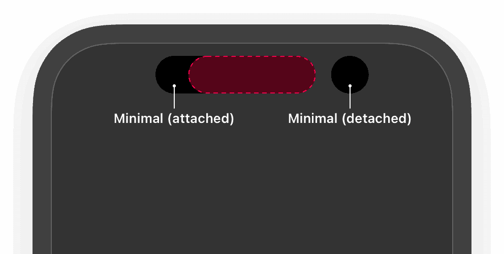
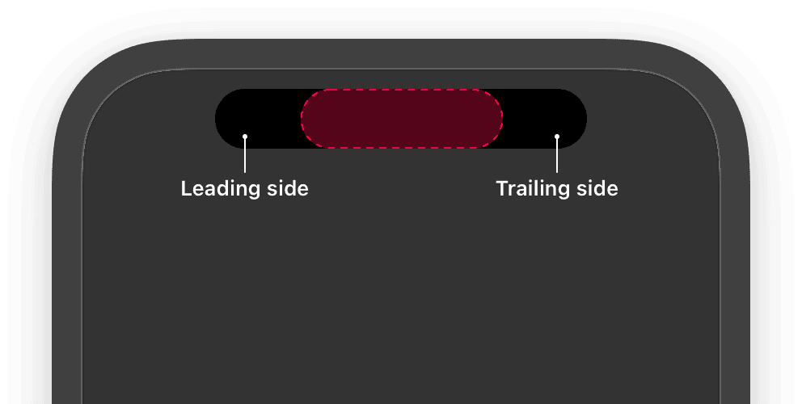

</DisplayFlex>

Furthermore, I found the following image on the Web.
Apple puts _Expanded_ for all big sizes, but this image describes the Dynamic Island's expanded states.

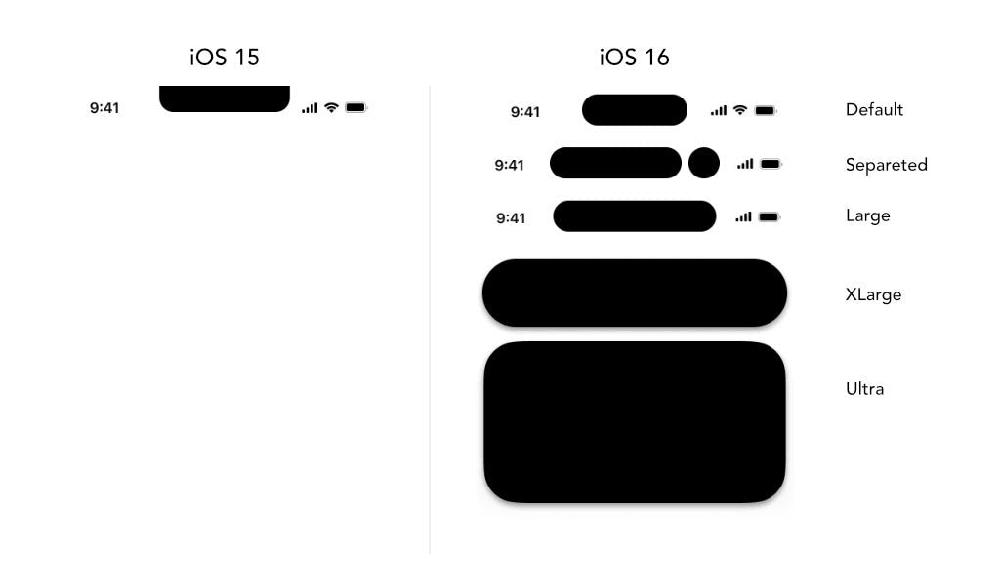

I declared the type as the following, reflecting the earlier information.

```ts
export type DynamicIslandSize =
  | 'compact'
  | 'minimalLeading'
  | 'minimalTrailing'
  | 'default'
  | 'long'
  | 'large'
  | 'ultra'
```

Then I spent a whole night ([2022-10-16](/r/2022-10-16#dynamic-island-on-the-web)) and figured out how to naturally shift sizes with Framer Motion.
It uses the following codes.
I especially experimented with a lot of `stiffness` and `dampening` values;
the golden ratio was `const stiffness = 400` and `const damping = 30`.

```tsx
<motion.div
  id={props.id}
  initial={{
	opacity: props.size === props.before ? 1 : 0,
	scale: props.size === props.before ? 1 : 0.9,
  }}
  animate={{
	opacity: props.size === props.before ? 0 : 1,
	scale: props.size === props.before ? 0.9 : 1,
	transition: { type: 'spring', stiffness: stiffness, damping: damping },
  }}
  exit={{ opacity: 0, filter: 'blur(10px)', scale: 0 }}
  style={{ willChange }}
  className={props.className}
>
```

<figure>

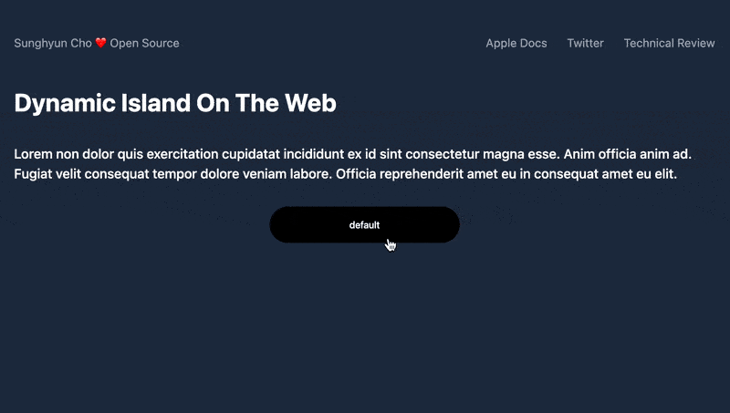

<figcaption>

As of [Oct 16th, 2022](/r/2022-10-16#dynamic-island-on-the-web)

</figcaption>
</figure>

## 📞 Hello?

Before connecting with external APIs, I mimicked Apple's incoming phone call widget.
There's no big reason for this; it was just to get used to the animations.
I love how it turned out; it looks exactly like the official Apple animation!
Finished on [Oct 20th, 2022](/r/2022-10-20).

<figure
style={{
width: 'calc(100%+2rem)',
margin: '0 -1rem'
}}
>

<IframeResizer
id="dynamic-island-phone-call"
style={{
width: '100%',
margin: '0 auto'
}}
src="https://dynamic-island.cho.sh/embed-phone-call"
/>

<figcaption>

↑ Click ↑

</figcaption>
</figure>

## 🍎 Apple Music API

Then I needed to integrate with Apple Music's API.
I previously made a technical demo with Spotify's API at the beginning of 2021.
Spotify officially has a Now Playing API, so naturally, I expected a similar Now Playing API at Apple Music.

import DisplayFlex from '@site/src/components/DisplayFlex'

<DisplayFlex>


<figure>

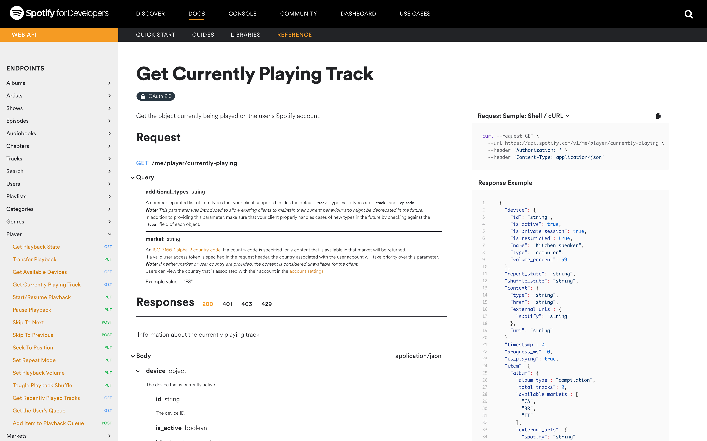

<figcaption>

[Spotify for Developers](https://developer.spotify.com/documentation/web-api/reference/#/operations/get-the-users-currently-playing-track)

</figcaption>
</figure>

</DisplayFlex>

When Apple Music API 1.1 was released, Apple released an API named
[Get Recently Played Tracks](https://developer.apple.com/documentation/applemusicapi/get_recently_played_tracks)
— the closest we ever got to the Now Playing API.
FYI, such an API did not even exist two years ago.

<figure>

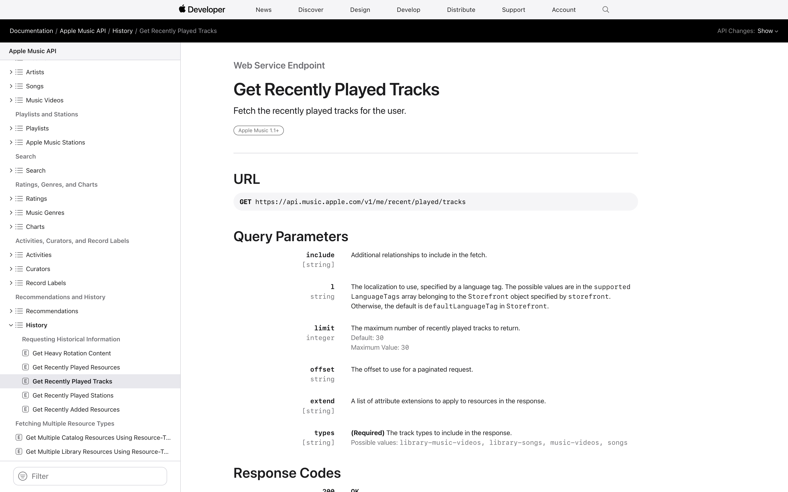

<figcaption>

FYI, such an API did not even exist [two years ago](https://developer.apple.com/forums/thread/114660).

</figcaption>
</figure>

Now we need to issue and save the different tokens needed for OAuth 2.0.
Spotify almost precisely [followed the OAuth 2.0 standards](https://developer.spotify.com/documentation/general/guides/authorization/),
while Apple required a little more processing.
The Now Playing API, especially, accessed the data on the Apple Music server and the user's private data,
so I needed a separate privilege control with user access grants.
Moreover, all of these needed to be better documented,
making it significantly more complicated. I needed the following:

| Aviation Industry                  | Same Concept at Apple                                  | Explanation                                                      |
| ---------------------------------- | ------------------------------------------------------ | ---------------------------------------------------------------- |
| Establishing your Aviation Company | Apple Developer Paid Account                           | $99                                                              |
| Pilot License                      | Apple Music Key from Apple Developer Website.          | Ensures that you have permissions to get data from Apple Servers |
| Air Carrier Operating Permit       | Apple Music Main Token from requesting to Apple Server | A permit to attach when requesting to Apple                      |
| Airline tickets for Passengers     | Apple Music User Token from user's grant               | Ensures if the user wants to use my service                      |

All four pieces of information should work harmoniously to retrieve users' data (of what they were listening to).
All the others were pretty straightforward ([More Info: Research Note](/r/62764C).)
The trickiest one was User Token.
User Token was specialized for iOS, macOS, and MusicKit on the Web.
MusicKit on the Web was intended for Apple Music Web clients,
like [music.apple.com](https://music.apple.com), [Cider](https://github.com/ciderapp/Cider), and [LitoMusic](https://github.com/lujjjh/LitoMusic)
and was not designed for such API request bots.
Still, Apple put _MusicKit on the Web will automatically take care of it_ without documenting it.
So what are we going to do? **Reverse engineer** the API.

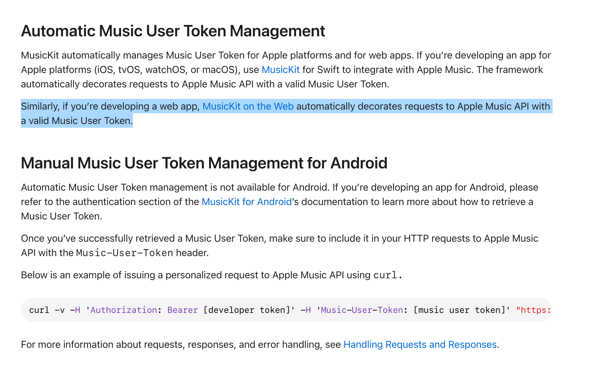

<figure>


<figcaption>

[MusicKit on the Web](https://js-cdn.music.apple.com/musickit/v3/docs/index.html). Is Apple using Storybook? Based on Apple's track record, this MUST be an Alpha of Alpha.

</figcaption>
</figure>

## 🦾 Cracking the MusicKit

First, I mimicked the specs of MusicKit on the Web, creating a website.

<DisplayFlex>

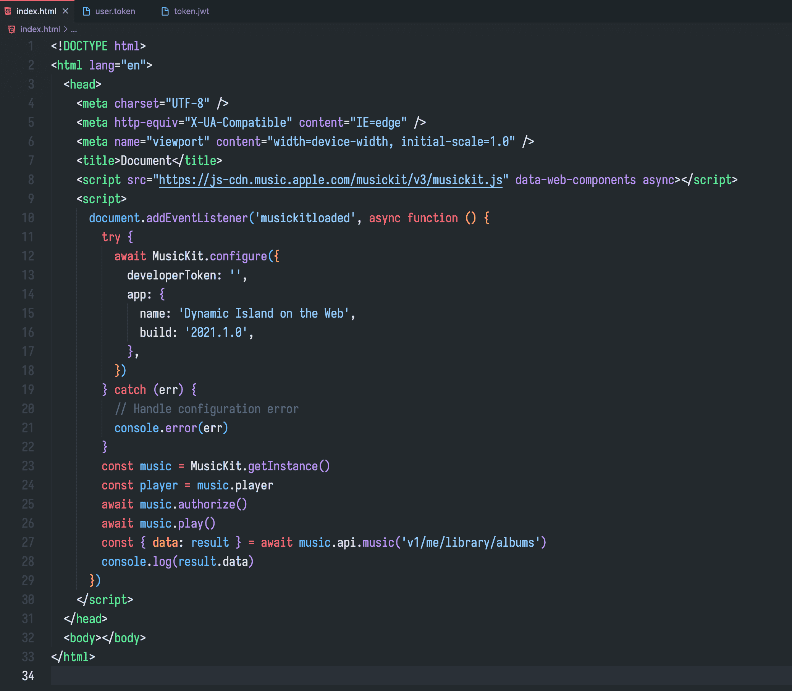

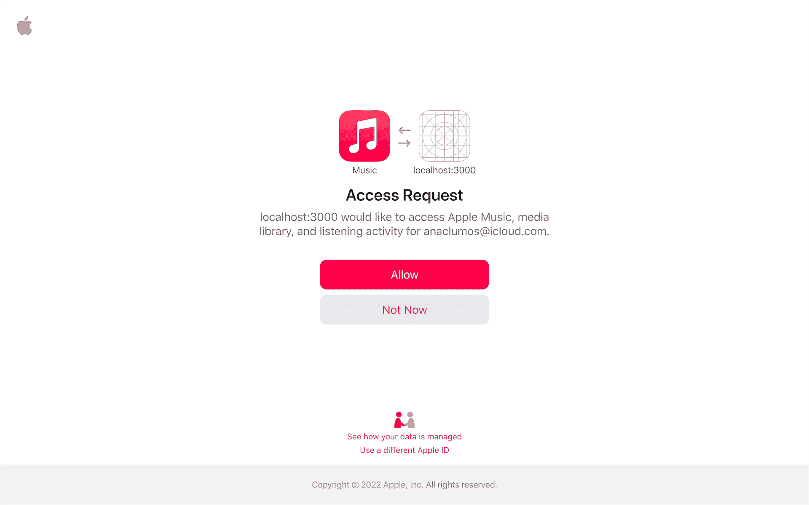

</DisplayFlex>

Then digging into the request headers of the website will reveal the `media-user-token`.

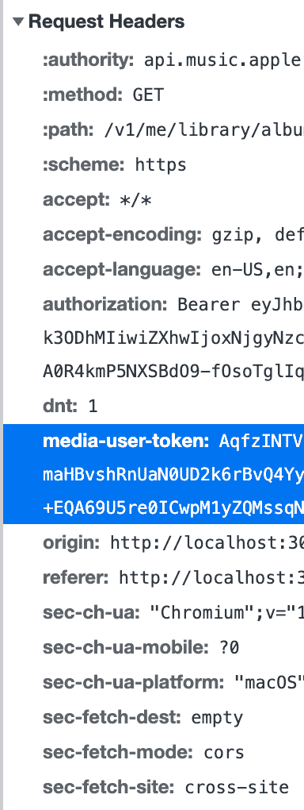

Finally, I can successfully get a JSON response from the Apple server by filling in other information with Postman software.
Finished on [Oct 28th, 2022](/r/2022-10-28).

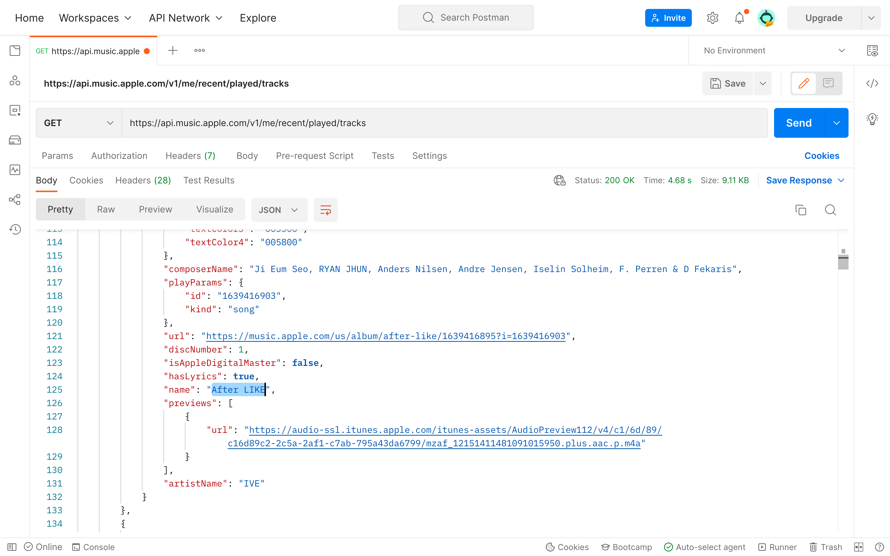

Requiring the information whenever someone accesses the Web will deplete my API quota in minutes.
I wanted to make a cache server of some sort.
But remember, the best database is **no database**.

> Don't use the database when avoidable. Which is always more often than I think. I don't need to store the 195 countries of the world in a database and join when showing a country-dropdown. Just hardcode it or put in `config` read on boot. Hell, maybe your entire product catalogue of the e-commerce site can be a single YAML read on boot? This goes for many more objects than I often think. [It's not Ruby that's slow, it's your database](https://berk.es/2022/08/09/ruby-slow-database-slow/)

So I made a GitHub Secrets that holds my private keys and made GitHub Actions to retrieve the data every few minutes and publish it on GitHub.

- [anaclumos/now-playing: What is Sunghyun listening to right now? (Apple Music)](https://github.com/anaclumos/now-playing)
- [anaclumos/now-playing/main/now-playing.json](https://raw.githubusercontent.com/anaclumos/now-playing/main/now-playing.json)

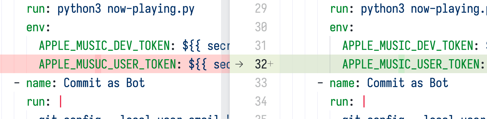

## 🎼 Equalizers

Similar to finishing the phone call component, I completed the music player component.


There were no equalizers!
I searched for good equalizers for React but later decided to implement this with Framer Motion.
So these are the few iterations of the product.

<DisplayFlex>


</DisplayFlex>
<DisplayFlex>


</DisplayFlex>

Each stick of the equalizers will have a random length.
But as seen in the last song, something was also awkward.
Usually, vocal music has smaller amplitudes on low and high frequencies,
but completely randomizing the amplitude will also make those frequencies have similar ups and downs.
So I set a base length as an anchor and made the randomized values slightly shake the values.
Finally, I set the equalizer color to match the album cover's key color.
I did not need additional work; it came with the Apple Music API.


## 🔎 The Physics of Squircles

We're not done yet!
Such completed widgets still felt slightly off;
the curves felt too _sharp_. We needed **squircles**.

<figure>

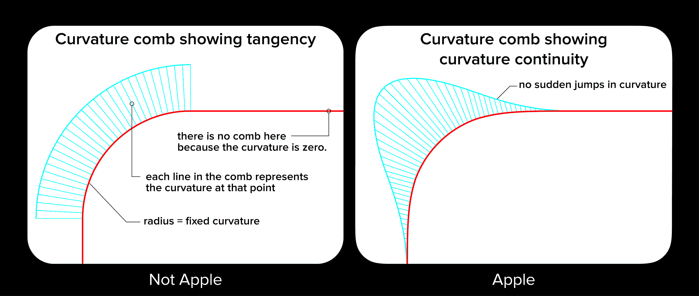

<figcaption>

Source: [Apple's Icons Have That Shape for a Very Good Reason @ HackerNoon](https://hackernoon.com/apples-icons-have-that-shape-for-a-very-good-reason-720d4e7c8a14)

</figcaption>
</figure>

A standard curve made by setting a border-radius has constant curvature, leading the end of the curve to have a sudden surge in curvature, making it feel sharp. On the contrary, gradually increasing and decreasing the curvature will make a much more natural curve.

**For those AP Physics nerds**, it's like uniformly increasing the jerk instead of uniformly accelerating.

**For those AP Calc nerds**, a squircle is a [superellipse](https://en.wikipedia.org/wiki/Superellipse) — the set of points satisfying the following equation.
$n$ is the curvature, $a$ is the length in $x$ axis, and $b$ is the length of $y$ axis.
Here, For any deeper dives, check out Figma's article on squircles.

- [Desperately seeking squircles](https://www.figma.com/blog/desperately-seeking-squircles/)

$$
{\lvert{x \over a}\rvert}^n + {\lvert{y \over b}\rvert}^n = 1
$$

I used this [tienphaw/figma-squircle](https://github.com/tienphaw/figma-squircle) to create an SVG squircle and cut the Dynamic Island with the `clipPath` property.


However, to clip all frames of the animations, we would have to create squircles for every frame, risking speed.
Therefore, I opted to use `borderRadius` for the animation and clipped it right after the animation finished.
It was barely noticeable, even if you looked very closely, so it was a good trade-off between performance and detail.
Finished on [Nov 11th, 2022](/r/2022-11-11).


## 💨 Optimizing Performance

CSS has a `will-change` property.
It tells the browser which elements on the screen will change, preparing the browser for it beforehand.
The browser rasterizes every frame if there is no `will-change` property; however, the browser will reuse a static image while the animation processes, rasterizing only when the animation finishes.
Therefore, the animation may seem blurry depending on the type, but it will give more fluidity for `transform,` `scale,` or `rotate` animations.

- More Info: [will-change - CSS: Cascading Style Sheets | MDN](https://developer.mozilla.org/en-US/docs/Web/CSS/will-change)

The Dynamic Island usually modifies scale and opacity, so it was perfect for `will-change.`
We can apply the property in Framer Motion, as in the following example:

```ts
import { motion, useWillChange } from 'framer-motion'

// ...

const willChange = useWillChange()

// ...

<motion.div style={{ willChange }}/>
```

## 🔗 Integration

Last but not least, I made pages for integration purposes (`/embed-player`, `/embed-phone-call`.)
I did not want to add Tailwind or Framer Motions as a dependency on other websites, so I tried to use the `iframe` method.
I used [davidjbradshaw/iframe-resizer](https://github.com/davidjbradshaw/iframe-resizer) to make a responsive iframe.
I also used CSS's [position: sticky](https://developer.mozilla.org/en-US/docs/Web/CSS/position) property to make it stick on specific pages — it's on this website, too!

## 💭 Postmortem

This completes the project. Here are some thoughts:

First of all, I succeeded in managing a mid-to-long-term side project.
I have always [respected people with persistence](/r/D9B586),
and I was very happy to finally complete the project after working on it for more than a month.
I was also delighted that I successfully juggled 🤹 CS Major classes, job searching, and side projects simultaneously (although they still need to be completed).

Second, I would like to express my gratitude to Tim ([cometkim](https://github.com/cometkim)), whom I met during my previous internship.
I had a memorable experience during this internship when Tim showed me that it is possible to reverse engineer a compiled `webpack` codebase.
It was indeed a spiced-up 🌶 and intense learning environment. However, that gave me confidence when I was blocked by Apple's undocumented API services.

I am also developing the habit of note-taking.
There's a saying that people's will is weaker than we think, so it's better to reshape the environment.
I did a decent job remodeling my website as a digital garden (or [Extracranial Memex](/r/93AA11)) that is optimized for note-taking.
I want to continue taking notes and learning new stuff.
Tim also had a significant effect my note-taking by showing his workspace on Roam Research.

Anyhow, this concludes the project.
Thank you, everyone!

- [anaclumos/dynamic-island](https://github.com/anaclumos/dynamic-island)
- [Dynamic Island on the web](https://dynamic-island.cho.sh/)
