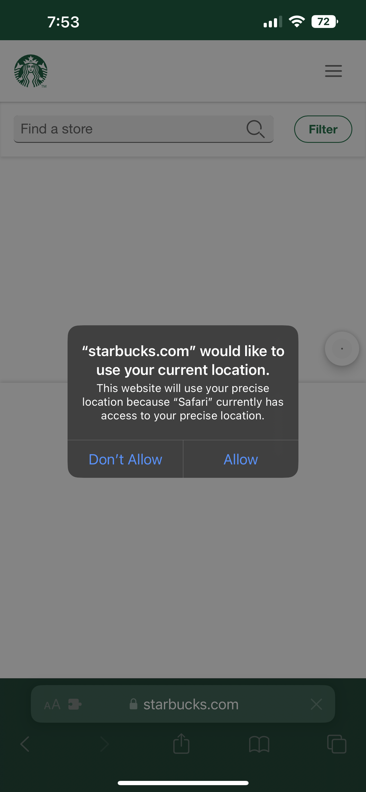
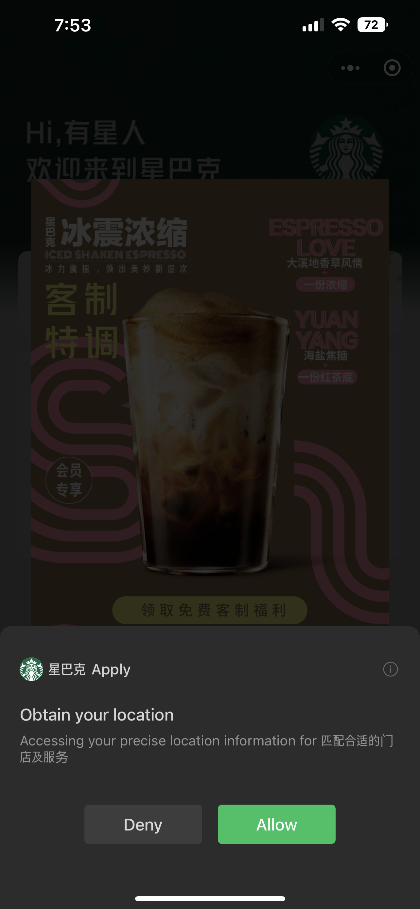
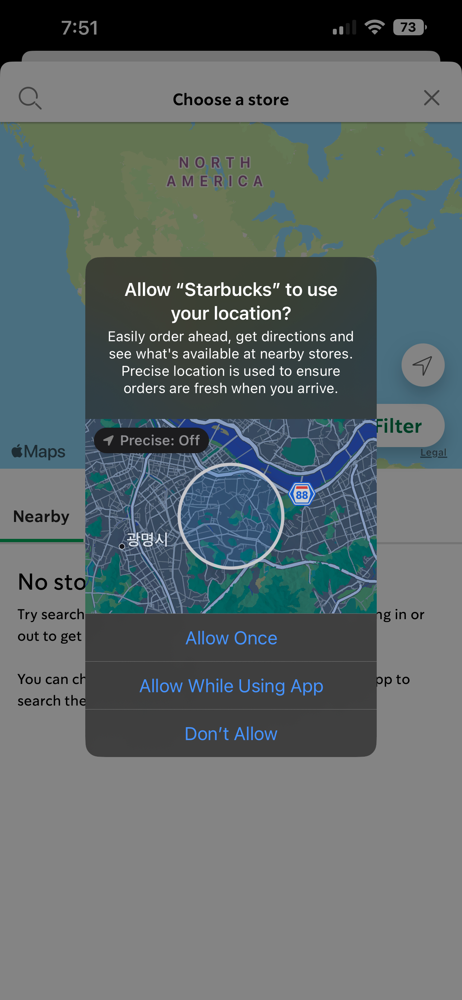
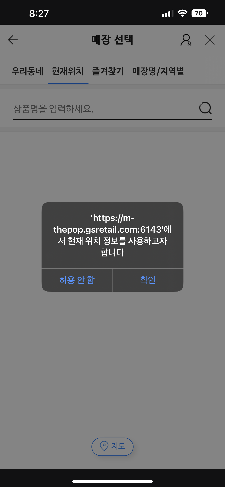
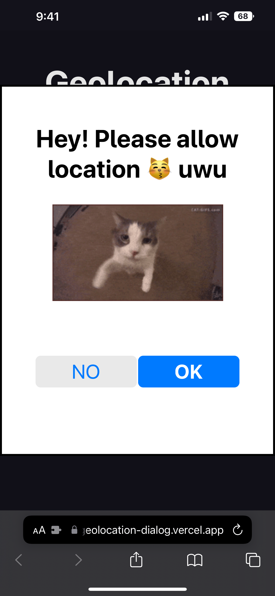
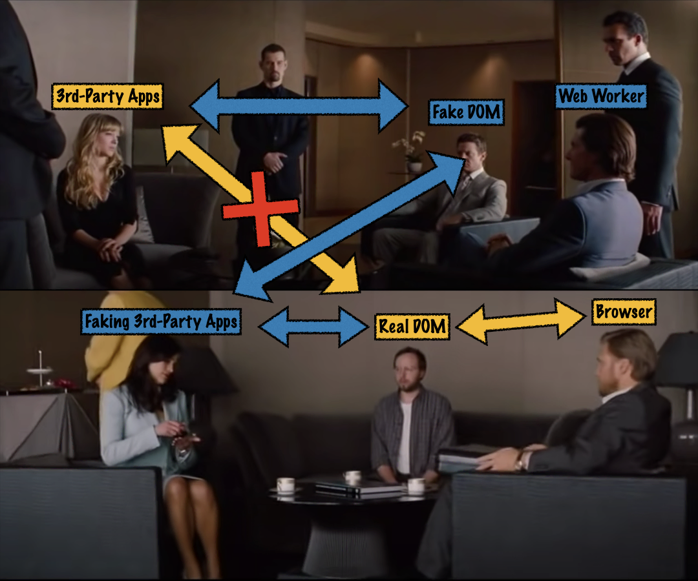
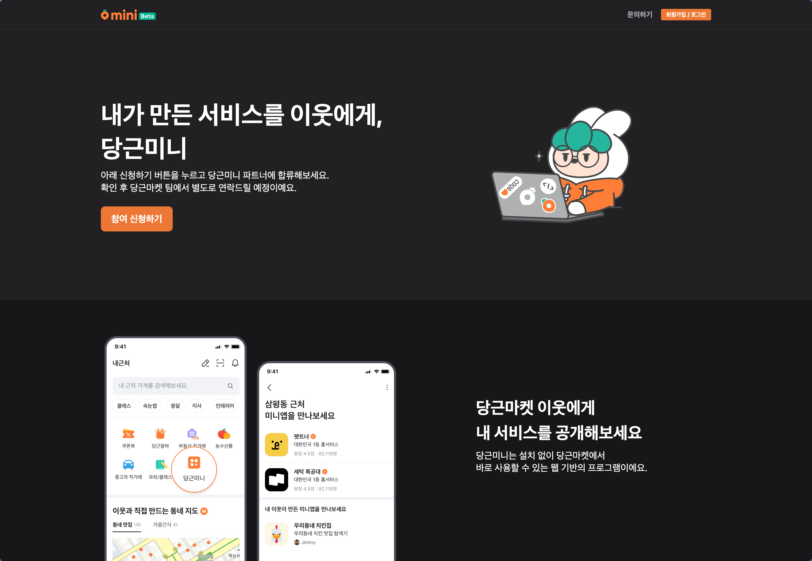

import Admonition from '@theme/Admonition'
import DisplayFlex from '@site/src/components/DisplayFlex'

# The Web Standard Mini App Problem

I worked as a full-time Mini-App researcher intern at Karrot.
This is what I found and learned from it.

## 0. Mini Apps

**Mini Apps** are a collection of third-party services that runs on top of a native **Super App**.
You can think like Facebook Games on a Facebook App, developed and maintained by a third-party developer.

In the Chinese markets, the so-called BAT (Baidu, Alibaba, and Tencent) have already dominated the market.
WeChat, the 1st player in the market, already has a Mini App ecosystem of 400M daily active users and 900M monthly active users.
Apple and Google suffered to maintain their platform power in the Chinese markets because of this Mini Apps.
For the Chinese users, App Store and Play Store are like Internet Explorer.
Just like IE only exists for downloading Chrome,
App Store and Play Store are simply a gateway for downloading WeChat.

Of course, international businesspeople reacted to replicate this outside of China.
Snap tries to create [Snap Mini](https://developers.snap.com/en-US/minis),
and Line tries to implement [Line Mini App](https://developers.line.biz/en/services/line-mini-app/).

Karrot, a Korean Unicorn company having 60% of Korean citizen as their user base, also wants to replicate this on the Korean market.
More information on the Mini App system is out of scope of this post; please refer to Google's in-depth review on Mini Apps.

<Admonition type="note" title="So far" icon="💡">

- Karrot wants to make a Mini App environment.
- Mini App is easy to make (web-like developer experience) while having powerful business effects (app-like user experience).
- Karrot thinks Mini App as the moonshot for overtaking Kakao — the omnipotent Korean app that every Korean uses.
- **Goal**. Figure out a Mini App Model that will succeed in Korea, Japan, United States, United Kingdom, etc (Karrot's business regions)

</Admonition>

## Background 1. For an abundunt Mini App ecosystem

The previously mentioned BAT have created [their proprietary languages and browsers](https://web.dev/mini-app-markup-styling-and-scripting/)를
which are seemingly inspired by the web.
Those three companies possess immense platform power;
they can ask whatever they want to the developers.
However, most of the Super App services cannot justify developers
to follow their demands, like asking devs to use a non-standard SDKs,
or asking for a logical branching for detecting a Mini App environment.
That case developers will just give up creating a Mini App to spend that effort to create an iOS and Android app
(which has much higher chance of success).
Tell me; why is PWA still stagnating?

Therefore, a **standard Mini App** should follow the web standard.
Developers should deploy their web app as Mini App with little to no change.

## 배경 2. 예쁘게 보여주기 위해

예쁘게 보여주는 것은 상당히 중요하다.
특히 권한을 요구하는 화면은 더욱 그렇다.
어떠한 맥락도 없이 *서비스가 위치를 사용하고 싶어합니다*고 갑자기 물어본다면
사용자는 거절을 누를 확률이 높고, 그러면 서비스의 운영에 지장이 생길 수 있다.
즉 권한 요구 창은 설득력이 있어야 한다.
그를 위해서는 그에 합당한 인터페이스와 디자인으로 갖춰져야 한다.
즉, **예뻐야 한다**.

예를 들어 스타벅스 웹, 앱, 미니앱에서 위치 정보를 요구하는 경우를 살펴보자.
어떤 권한 요구 창을 승인하고 어떤 권한 요구 창을 거절할 것 같은가?

<DisplayFlex>





</DisplayFlex>

보다 더 많은 맥락이 주어지는 오른쪽으로 갈수록 승인할 사용자가 많을 것이다.
때문에 표준 미니앱은 최소한 가운데만큼의 맥락을 제공할 수 있어야 한다.

## 배경 3. 웹 표준 권한 요구 창을 예쁘게 보여주기 위해

앞서 이야기한 예시를 이어보자면 위치 정보 권한 요구 창은 [Geolocation API](https://developer.mozilla.org/en-US/docs/Web/API/Geolocation_API)가 불릴 때 발생한다.
별거 없다.
다음 코드를 실행하면 바로 나온다.

```js
navigator.geolocation.getCurrentPosition()
```

배경 1과 배경 2에 근거해, 위 코드가 실행되었을 시 (웹 표준 방식으로 위치 정보를 요청 시) **사용자를 설득할 수 있는 배경 정보와 디자인을 갖춘 권한 요구창**이 나타나야 한다.

## 문제 1. 하지만 그것은 브라우저의 영역인데?

저렇게 알림창을 띄우는 것은 브라우저의 영역이다. 때문에,
웹뷰를 그대로 사용해서 (iOS의 경우 WKWebView) 미니앱을 구동하는 경우
저렇게 위치 권한 요구 창이 그대로 나타나게 된다.
이 문제는 현재 당근마켓에 구현된 **당근미니**에도 발생한다.

<DisplayFlex>



</DisplayFlex>

그렇다면 여기서 문제를 어떻게 해결해야 할까?
새로운 브라우저를 만들어야 할까?

## 해결책 1: 어차피 누가 누군지 모른다.

99.99%의 웹앱의 경우 그냥 권한이 필요한 곳에 `getCurrentPosition()`할 뿐이지
그것이 진짜 브라우저에서 실행되는건지는 관심이 아니다.
그렇다면 만약 다음과 같은 **가짜** `navigator`를 만든다면 어떨까?

```js
const navigator = {
  geolocation: {
    getCurrentPosition(success, error) {
      // do some random stuff...
    },
  },
}
```

JavaScript는 `navigator`의 진위를 검사하지 않기에 원하는 동작을 사이에 주입할 수 있다.
이를 **Shim**이라고 한다.

> 컴퓨터 프로그래밍에서 심(shim)은 API 호출을 투명하게 가로채고 전달된 인수를 변경하거나, 작업 자체를 처리하거나, 다른 곳으로 작업을 리디렉션하는 라이브러리입니다. (In computer programming, a shim is a library that transparently intercepts API calls and changes the arguments passed, handles the operation itself, or redirects the operation elsewhere.) — [Shim \(computing\) - Wikipedia](<https://en.wikipedia.org/wiki/Shim_(computing)>)

고양이가 위치 권한을 달라고 요구하는 데모 웹사이트를 만들어보았다.

<DisplayFlex>




</DisplayFlex>

- [anaclumos/poc-geolocation-dialog: Geolocation Shimming Demo](https://github.com/anaclumos/poc-geolocation-dialog)

즉, 이를 조금 더 고도화해서 아예 `document`,
즉 DOM 자체를 JavaScript로 구현하여 원하는 부분만 교체하면
미니앱스러운 경험을 제공할 수 있다.

## 배경 4. 일관적인 경험을 위해

미니앱은 일관적인 경험을 주는 것이 중요하다.
마치 브라우저를 사용할 때
**새로고침, 즐겨찾기, 이전 페이지, 창닫기의 위치가 변하지 않듯이**
여러 미니앱에 있어서도 동일한 경험을 주어야 한다.
이는 내가 번역한
[미니앱 문서](https://web.dev/mini-app-about/#the-user-experience)에도 언급되어 있다.
이를 위해서는 공통 컴포넌트의 일부를 우리가 주입해야 한다.

## 배경 5. 빠른 경험을 위해

서로 다른 미니앱을 열고 닫을 때 빠르게 앱을 열고 닫기 위해
앱의 데이터를 `prefetch` 해올 수 있다.
하지만 앱을 열고 닫을 때마다 데이터가 유지되어야 하기에,
`iframe` 안에 미니앱을 담아두고
외부에서는 슈퍼앱의 웹뷰가 서로 다른 데이터를 처리하고
`prefetch`하는 방식을 생각할 수 있다.

## 문제 2. 얼음 ❄ 땡

하지만 여기서 또다른 문제가 발생한다.
`iframe`은 단일 쓰레드에서 동작한다.
즉, 미니앱이 멈추면 슈퍼앱의 종료 버튼 또한 먹통이 된다.

## 해결책 2. 웹에서 멀티쓰레드

<Admonition type="tip" title="JavaScript은 Single-Threaded하지 않나?" icon="🤔">

반은 맞고 반은 틀리다.

- 브라우저 안의 JavaScript은 Single-Threaded하다.
- 하지만 Web Worker라는 별도의 장치를 통해 Multi-Thread 연산을 처리할 수 있다.

</Admonition>

그렇다면 Web Worker에서 `iframe`을 구동한다면
미니앱이 멈추어도 슈퍼앱은 멈추지 않을 것이다.

## 문제 3. Web Worker 안에는 DOM API가 없다

Web Worker 안에서는 DOM API를 접근할 방법이 없다.
DOM API라는 것도 결국 말 그대로 JavaScript 기반의 Object Model이기 때문에
DOM API와 똑같이 생긴 가짜 DOM을 Worker 안에 내려주고,
그 가짜 DOM에 조작된 모든 것들을 진짜 DOM에 그대로 가져다가 적용할 수 있다면
이 문제를 해결할 수 있다.
또한 이 사이에서 **그대로 가져다가** 적용하는 것이 아니라
이게 적합한 작업인지 검사할 수 있다면,
원천적으로 어뷰징을 차단할 수 있다.

## 해결책 3: 미션 임파서블을 찍는다



다행히도 비슷한 연구가 선행되어 있다.
Google 사에서 AMP에 사용할 목적으로 [WorkerDOM](https://github.com/ampproject/worker-dom)이라는 것을 만들었고,
BuilderIO 사에서 써드파티 라이브러리 코드를 Worker에 분리할 목적으로 [Partytown](https://github.com/BuilderIO/partytown)이라는 것을 만들었다.
하지만 이 둘 다 완전한 구현체는 아니다.
[WorkerDOM](https://github.com/ampproject/worker-dom)은 Spectre 보안 사고가 한창일 때 제작되었기에 SharedArrayBuffer와 Atomics를 활용한 동기적 데이터 교환이 불가능하다.
Partytown은 [Event Prevent Default](https://partytown.builder.io/trade-offs#events-cannot-prevent-default)를 할 수 없다.
하지만 본질적으로, **미션 임파서블 모델**을 사용해서 가운데에서 적절하게 써드파티 코드를 격리하는 것이 가능하다는 것이다.

## 문제 4: 오프라인 환경에서는 접속이 불가능하다

기존의 웹 환경에서는 오프라인 환경에서 접속이 불가능하다.
예를 들어 계산기 미니앱이 존재하면,
네트워크 없이도 접속할 수 있어야 한다.
이는 초기 로딩 속도와도 크게 연관된다.
Progressive Web App을 활용하여 오프라인에서 사용할 수 있지만,
PWA 또한 초기에 수많은 네트워크 요청을 보내서
웹페이지를 저장해야한다는 점에서 여전히 비효율적이다.

## 해결책 4. 묶어서 한 번에 보낸다


이 또한 하나의 해결책이 있다.
Google에서 [[CBOR]] 형식에 기반한
[WebBundle](https://github.com/google/webbundle)이라는 라이브러리를
제작했기 때문이다.
웹번들은 여러 HTML, CSS, JS, 이미지 등을
하나의 압축된 파일로 묶어서
사용할 수 있도록 해준다.
이미 Chrome에서 사용할 수 있는 기능이고,
Google에서 실험적으로 다양하게 연구하고 있는 기능이다.
물론 Google의 본 목적은 이 **묶음 배송**을 통해
URL 기반의 광고 차단 기술을 무력화하기 위한 목적이지만.
[관련 글타래](https://news.ycombinator.com/item?id=24274968)

## 문제 5. 악성 코드로 바뀌면 어쩌지?

GitHub에서 멀쩡해보이는 코드도 NPM에서는 공격 코드가 삽입된 채로 존재할 수 있다.
실제로 월간 4천만번 이상 다운로드되는 UAParser.js 라는 라이브러리의 NPM 저장소가 해킹되어
악성 코드가 삽입되어 배포된 적 있다.
[사고 기록](https://github.com/advisories/GHSA-pjwm-rvh2-c87w)


결과적으로 어떤 형태로든 슈퍼앱의 입장에서는
미니앱 제작사의 패키지를 직접 받아서
검수를 하고 다른 코드로 바꿔치지 못하도록 스스로 호스팅해야 한다.
앱스토어를 운영한다고 생각하면 좋겠다.
(더 정확하게는 Chrome Extension Store를 운영하는 것에 더 가깝겠다.)



## Conclusion

위 모든 문제를 다 해결하면 **제대로 된** 미니앱 플랫폼을 구축할 수 있다.
다만 이제 보면 알 수 있듯이 문제의 난이도가 모두 상당하다.
특히 나는 인턴 기간 동안 2번과 3번 문제에 집중했지만
워낙 깊은 영역으로 파고들다 보니 관련 키워드를 검색해도 이미 읽어본 사이트 10개만 나오는 등
어려움이 많았다.

I envision a Mini App platform that is
① international unbound, ② extensible, ③ web standard interoperable, ④ and maximizing its value for both creator and users,
without being confined in a specific cultural region like China.
However it seems unlikely to see it in a near future due to its innate technological difficulties.
