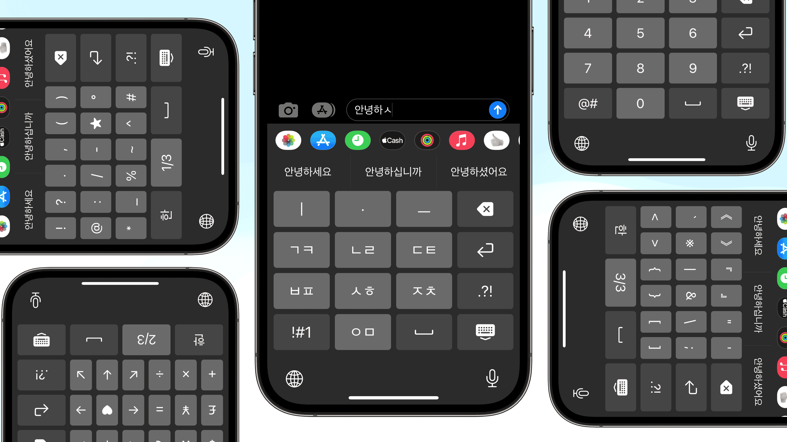
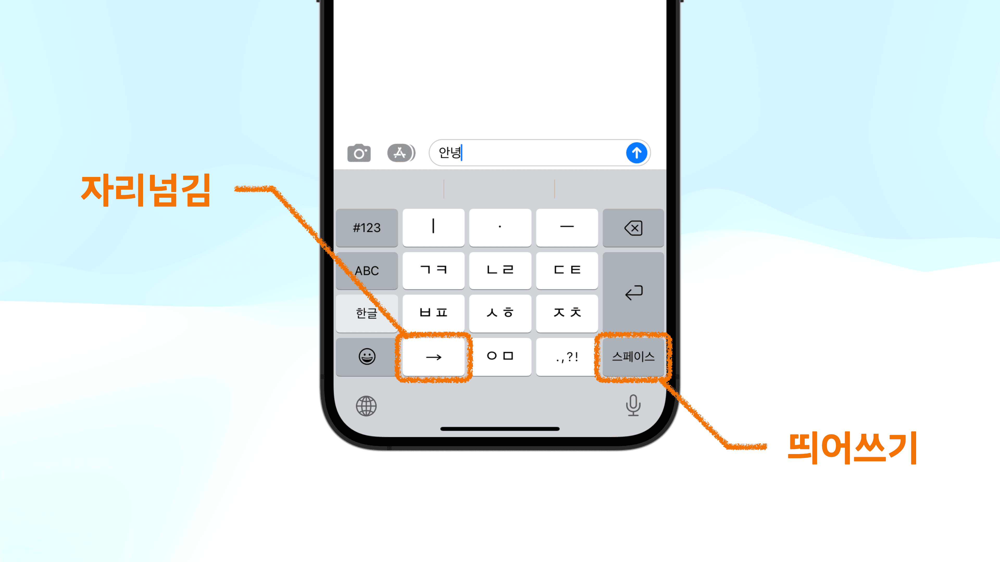
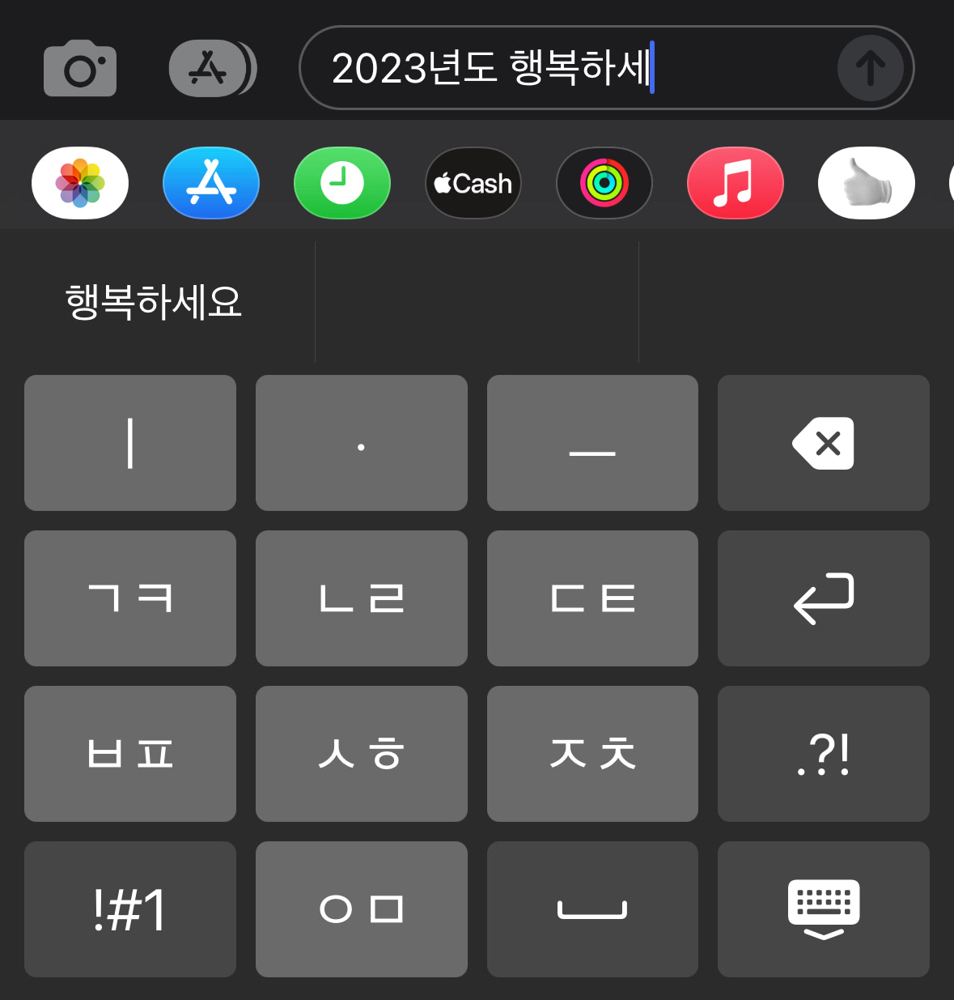
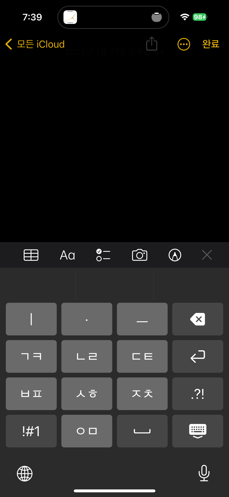
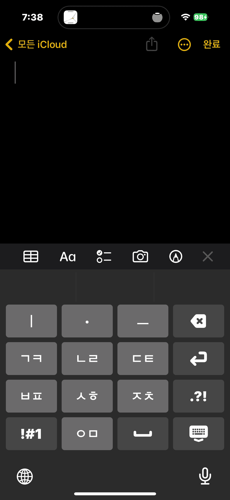
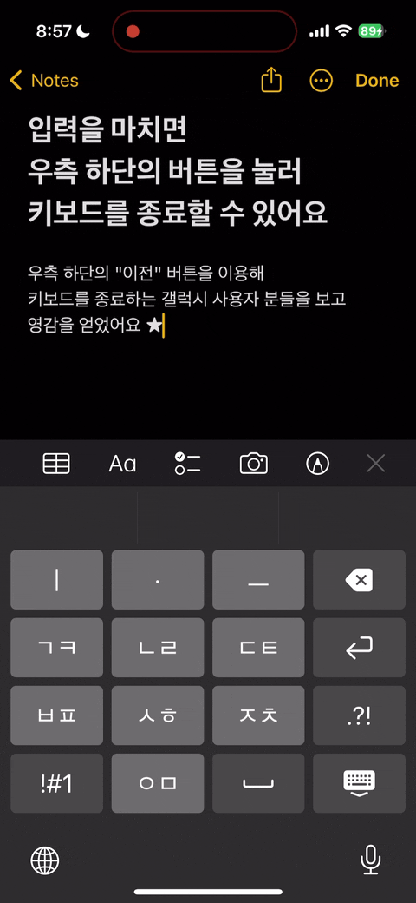
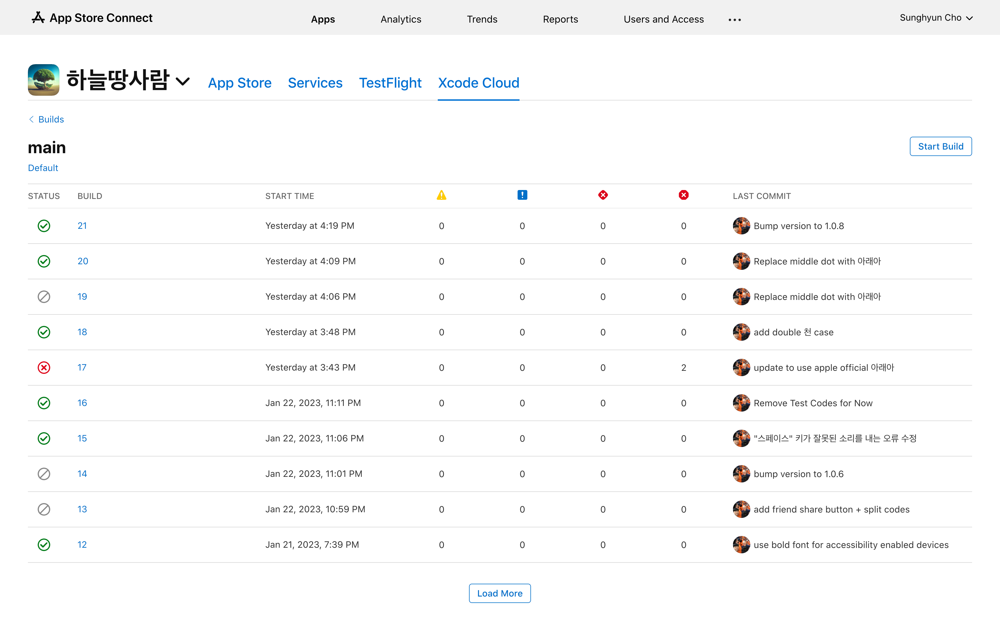
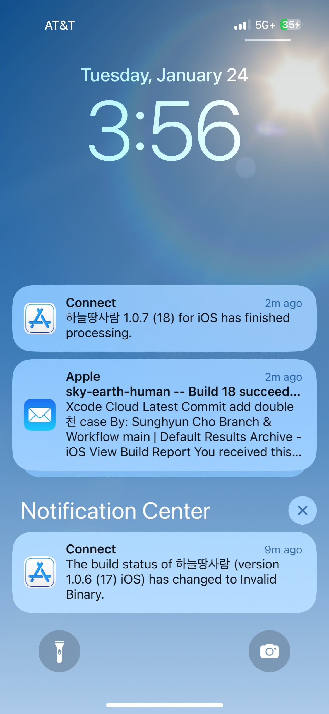

import Admonition from '@theme/Admonition';
import DisplayFlex from '@site/src/components/DisplayFlex'

# 갤럭시 천지인을 그리워하는 아이폰 유저들을 위한 키보드 ⌨️



<Admonition type="info" title="잔말 말고 설치 링크부터 줘요" icon="💎">

물론이죠. [앱스토어](https://apps.apple.com/app/id/1666355842)에서 설치해보세요.
[GitHub 저장소](https://github.com/anaclumos/sky-earth-human)도 있답니다.

</Admonition>

애플 아이폰을 찾는 소비자들이 증가하고 있다.
눈에 띄는 부분은 아이폰을 찾는 중장년층 소비자가 늘어나고 있다는 점이다.
대부분의 사람들은 갤럭시에서 아이폰으로 못 넘어오는 이유로 통화녹음과 삼성페이를 꼽는데,
부모님이 아이폰으로 바꾸신 뒤에 내가 관찰한 바는 조금 달랐다.

아무도 손에 꼽지 않은 예상 외의 난관은 바로 **키보드**였다.
대한민국 소비자들은 10키 휴대전화 시절부터 문자를 입력함에 아무런 불편함이 없었다.
세종의 제자 원리를 본따 만든 **천지인**이라는 강력한 입력 방식 때문에,
하나의 버튼에 알파벳이 3개, 4개씩 붙어있는 영미권에 비해 쿼티 키보드의 필요성이 현저히 적었기 때문이다.
태어났을 당시부터 스마트폰이 존재하던 알파 세대가 아닌 이상 여전히 천지인 키보드를 사용하고 계시는 분들이 많다.

2010년 천지인의 특허가 개방된 이후 아이폰에도 2013년부터 천지인 키보드가 추가되었지만,
이상하게도 아이폰은 키보드의 모양이 조금 달랐다.
가장 결정적인 차이점은 **자리넘김** 버튼과 **띄어쓰기** 버튼이 따로 존재한다는 점이다.



<Admonition type="info" title='예를 들어 "오 안녕"을 입력하기 위해서는...' icon="💎">

- 갤럭시: `ㅇ` `ᆞ` `ㅡ` → 띄어쓰기 → `ㅇ` `ㅣ` `ᆞ` `ㄴ` → **띄어쓰기** → `ㄴ` `ᆞ` `ᆞ` `ㅣ` `ㅇ`
- 아이폰: `ㅇ` `ᆞ` `ㅡ` → 띄어쓰기 → `ㅇ` `ㅣ` `ᆞ` `ㄴ` → **자리넘김** → `ㄴ` `ᆞ` `ᆞ` `ㅣ` `ㅇ`

</Admonition>

이와 같이 2가지 다른 버튼이 따로 존재하는 것 뿐만 아니라 버튼의 각 크기도 더욱이 작아져,
오타가 지속적으로 발생하는 등 사용에 불편함을 호소하는 사람들이 많았다.
이런 이유로 갤럭시 천지인과 유사한 아이폰 키보드를 만들어보고 싶다는 결론에 이르렀다.

<Admonition type="info" title="목표" icon="💎">

학습 없이 쉽게 사용할 수 있는 아이폰용 천지인 키보드를 만들어 보자!

</Admonition>

<Admonition type="tip" title="꿀팁" icon="🍯">

이 프로젝트의 [연구 기록](/r/C222D1)도 공개되어 있다.

</Admonition>

## 📜 특허권 및 법적 권리

우선 특허권과 법적 권리에 아무런 문제가 없는지를 확인했다.
조사한 결과, [조관현 특허권 보유자](https://doi.org/10.8080/1019960047925)님께서 특허권을 정부에 기증하셔
국가 표준으로 채택된 이후, [한글 자판에 대한 특허권 사용권이 무상으로 허용](https://www.korea.kr/news/policyBriefingView.do?newsId=148700827)되었다.
이에 아무런 문제가 없음을 확인한 후 개발에 착수했다.

## 🛠 기술 정하기

아이폰 자판을 만들기 위해 애플의 [커스텀 키보드 만들기](https://developer.apple.com/documentation/uikit/keyboards_and_input/creating_a_custom_keyboard) 문서를 정독했다.
확인 결과 일반적인 아이폰 앱을 제작하는 난이도와 비슷해보였다.
일단 ViewController 내에 버튼과 로직을 때려박아 개발하는 것은 쉬워보였으나,
SwiftUI를 이용한 iOS 개발을 한 적이 없어 SwiftUI로 개발해보고 싶었다.
처음에는 새로 나온 [SwiftUI Grid](https://developer.apple.com/documentation/swiftui/grid) 기능을 쓰면 깔끔하게 버튼을 배열할 수 있을 듯했는데,
이는 사진 앱처럼 수많은 엘리먼트들을 화면에 배열하는 것에 더 최적화되어있고,
나의 경우처럼 버튼의 개수가 정해져있는 경우에는 (웹에서의 display: flex와 유사한) HStack과 VStack으로 충분하다고 판단했다.

아이폰 써드파티 키보드는 **익스텐션**이라는 독특한 구조를 이용해 제작한다.
iOS 앱 본체가 아니면 전부 익스텐션이라고 생각하면 된다.
커스텀 키보드도 익스텐션이고, iOS 위젯도 익스텐션이고, 애플 워치 앱에도 익스텐션이 탑재된다.
[Ray Wenderlich](https://www.kodeco.com/49-custom-keyboard-extensions-getting-started)의 문서를 읽으며 간단한 데모들을 제작하며
키보드 익스텐션에 대한 이해를 높였다.

<figure>

<DisplayFlex>

<figure>


</figure>

<figure>


</figure>

<figure>


</figure>

</DisplayFlex>

<figcaption>

몇 가지 초기 버전들

</figcaption>

</figure>

가운데 이미지의 "ㅇ" 근처의 회색 배경은 iOS 기기의 NSRange와 setMarkedText라는 기능이었다.
입력 중인 글자에 영역 처리를 해서 입력을 도와주는 기능이었는데,
중국어의 한어병음(Pinyin)처럼 문자 입력 직전에 조합용으로 사용되는 것으로 천지인용으로 적절하지 않다고 판단했다.
또하나 흥미로운 점으로 아이폰 기본 자판의 색상들은 기본으로 제공되는 어떤 systemColor와도 달랐다.
색깔을 Color Meter로 뽑아 하나하나 입력했다.

## 😶‍🌫️ 그런데 천지인은 어떻게 만들지

천지인의 입력 로직을 구현하기 위해 찬찬히 생각을 하던 중, 이게 대단히 복잡하다는 것을 알게 되었다.
예를 들어 다음의 경우를 생각해보자.

- `않`을 입력하기 위해 `안ㅅ`이 입력되어 있는 경우에 `ㅅㅎ` 버튼을 누르면 `않`이 되어야 한다. 이전 글자와 재결합이 가능한지 판단해야 한다.
- `앉`에서 `ㅡ`를 입력하면 `안즈`가 되어야 한다. 마지막 종성 하나가 추출 가능한지 확인해야 한다. 이전 글자에서 추출이 가능한지 판단해야 한다.
- `깚`에서 `ㅂㅍ` 키를 누르면 `깔ㅃ`이 되어야 한다. 즉 종성 추출 + 된소리 변경이 가능한지 판단해야 한다.
- `갌`에서 `ㅅㅎ` 키를 누르면 `갏`이 되어야 한다. 즉, 단순하게 `ㅅ`, `ㅎ`, `ㅆ`를 상호 변경하는 것 뿐만 아니라, `ㄽ` 등의 겹받침의 변환도 판단해야 한다.

이 외에도 수많은 경우가 많다. 조합형 한글을 나열해두고 하나하나 계산을 한다고 하더라도, 위 경우의 수를 모두 고려하는 것은 매우 어렵다.
**유한상태기계**로 제작할 경우 두벌식보다 훨씬 많은 약 20개 정도의 데이터 저장 스택과 수십 가지의 상태가 필요하다고 판단했다.
(정확히 계산하지는 않았으니 더 단순한 구현 로직이 존재할 수도 있다. 혹시라도 이 방식대로 진짜 만들어보고 싶은 사람이 있다면 [이 특허](https://patents.google.com/patent/KR20000049347A/ko)의 다이어그램을 참고하자.)
인터넷 상에 몇 가지 구현 로직들을 발견하기는 했지만,
전부 길고 복잡해 Swift로의 번역을 차치하고 코드 자체를 이해하는데도 한세월이 걸릴 듯 했다.
그러다 문득 이런 생각이 들었다.

<Admonition type="info" title='케이스가 너무 많고 복잡하면' icon="💎">

그냥 전부 **하드코딩**하면 되잖아?

</Admonition>

생각해보면 **같은 버튼 조합을 입력하면 같은 글자로 찍혀야하는 것이 바로 키보드**이리라.
그냥 모든 경우의 수를 생성해서 하나의 거대한 JSON 파일에 넣어버리면 어떨까!
단순하게 셈을 해보아도 한글은 약 11,000자 밖에 안 되고, 앞뒤 글자까지 같이 고려하는 케이스만 고려한다고 해도 조합은 많아야 10만 단위를 넘어가지 않을 것으로 판단했다.
JSON의 크기는 2MB 안팎에서 넘어가지 않을 것이다.

과거처럼 임베디드 하드웨어에서 KB 단위로 골프를 치며 메모리 최적화를 해야하는 시대가 아니다.
**한글이 인류와 함께하는 이상 분명 미래의 누군가가 천지인을 다시 제작할 일이 있을 것**이고,
그를 위해서는 누군가가 온전한 천지인 지도를 만들 가치가 충분히 존재한다.

## 🖨️ 활자: 세상에서 가장 단순한 천지인 구현체

그로 인해서 활자를 만들었다. 천지인의 모든 상태와 조합을 담아놓은 한글 지도 🗺️ 이다.
총 5만 여개의 입력 케이스가 존재하며, 압축된 JSON은 500KB 정도 크기이다.

고차원적 기능을 구현하기 위해서는 몇 가지 기교들이 더 필요하지만
(백스페이스 키를 눌렀을 때 글자 단위로 지워지는 것이 아니라 자소 단위로 지워진다거나, 시간에 따른 자리넘김 처리를 한다거나)
궁극적으로 핵심 입력 로직은 다음과 같이 단순하다.

```ts
const type = (이전: string, 활자: hwalja, 키: string, 수정중: boolean) => {
  const 마지막한글자 = 이전.slice(-1)
  const 마지막두글자 = 이전.slice(-2)
  if (수정중 && 마지막두글자 in 활자[키]) return 이전.slice(0, -2) + 활자[키][마지막두글자]
  if (수정중 && 마지막한글자 in 활자[키]) return 이전.slice(0, -1) + 활자[키][마지막한글자]
  return 이전 + 활자[키]['']
}
```

단 5줄 만으로 천지인 로직 구현이 가능하니 나는 감히 이것을 **전 세계에서 가장 단순한 천지인 구현체**라고 칭하겠다.

전처리 방식이 궁금한 사람들이 있을텐데,
입력 가능한 11,000여 자의 한글 글자들을 종착점으로 삼아
그 글자를 생성하기 위해 마지막으로 눌러야했을 글쇠는 무엇인지,
그리고 그 글쇠를 누르기 전 상태는 무엇인지 역산했다.
예를 들어 **`역`이 있다면 이전 상태는 `여`이고 `ㄱ`을 눌러서 `역`에 도달했겠군**하는 식으로 역으로 계산한 것이다.
물론 이에 더해 여러 엣지 케이스들을 처리해야 했다.
[4년 전 조성현이 나를 많이 도와주었다.](https://github.com/anaclumos/hangulbreak/blob/master/Python/HangulDecomposeModule.py)

<Admonition type="tip" title='직접 해보자!' icon="🧪">
다음 창은 활자를 이용해 간단하게 구현해본 천지인 입력 시연이다.
</Admonition>

<figure>

<iframe src="https://hwalja.cho.sh/" title="활자 데모" height="450"/>

<figcaption>

[활자는 모든 플랫폼에 사용할 수 있도록 공개했다.](https://github.com/anaclumos/hwalja)<br/>위 데모로 직접 활자를 입력해보자!

</figcaption>
</figure>

<Admonition type="info" title='활자는' icon="💎">
가장 <strong>단순한</strong> 구현체이지 가장 <strong>가벼운</strong> 구현체는 아니라는 점을 명심하자.
</Admonition>

<details>
<summary>조합형 한글로 문자열 정규화를 하면 좀 더 경우의 수가 줄지 않나요?</summary>

활자 프로젝트에 대해 이성광 님께서 [NFD로 문자열 정규화를 해서 초중종성을 떼어놓고 만들면 좀 더 경우의 수가 줄지 않을까](https://www.facebook.com/groups/codingeverybody/posts/8942515352455588/?comment_id=8946907612016362)에 대한 지적을 해주셨다.
나는 완성형 한글만 놓고 생각했는데, 말씀하신대로 조합형으로 제작 후 정규화를 거치면 경우의 수가 확실히 많이 준다.
예를 들어 `안 ᄂᆞᆞㅣㅇ` 같이 풀어두고 `ᆞᆞㅣ` 부분만 `ㅕ`로 조합한 뒤, `ㄴㅕㅇ`을 정규화 과정을 통해 `녕`으로 변환하는 것이다.

활자 프로젝트의 경우 현 접근을 유지하기로 했다.
활자는 **가장 쉽고 단순한 천지인 구현체**를 지향하는 만큼
현재의 접근이 `substring + replace` 만으로 구현할 수 있기 때문이다.
만약 NFD와 정규화에 대한 정보를 추가해야한다면,
비록 활자 프로젝트 자체는 가벼워지겠지만,
그를 사용하는 개발자 측에서 NFD와 정규화에 대한 추가적인 학습 및 구현이 필요하다.
오토마타를 이용한 학습 곡선에 불편함을 느껴
**모든 정보를 하드코딩해 가장 단순한 형태로 구현하기로 한 활자 프로젝트의 본 목적**에 어긋난다.
더불어 이미 압축된 버전은 500KB 수준이기에 입력 엔진으로 사용하기에 부담이 되는 크기가 아니다.

</details>

## 🤖 자동완성 키보드 만들기

천지인을 쓰는 사람들이 빠른 속도로 타자를 칠 수 있는 이유는 바로
[자동 완성 텍스트](https://support.apple.com/ko-kr/guide/iphone/iphd4ea90231/ios)
(개발 명칭: Apple QuickType)을 적극적으로 활용한다는 점이다.
이 자동 완성 텍스트들은 사용자가 입력하는 패턴을 [지속적으로 학습](https://developer.apple.com/design/human-interface-guidelines/technologies/machine-learning/roles/)하여 사용자의 입력을 돕는다.

다행히도 애플 UIKit에는 Core ML과 Neural Engine을 직접 건드리지 않고도
문맥 자동 완성 기능을 사용할 수 있는 [UITextChecker](https://developer.apple.com/documentation/uikit/uitextchecker)를 제공한다.
한국어도 물론 지원하며, `learnWord()`와 `unlearnWord()`를 사용하여 사용자의 입력을 학습하거나 삭제할 수 있다.

```swift
import UIKit

let uiTextChecker = UITextChecker()
let input = "행복하"
let guesses = uiTextChecker.completions(
    forPartialWordRange: NSRange(location: 0, length: input.count),
    in: input,
    language: "ko-KR"
)

/*
[
  "행복한", "행복합니다", "행복하게", "행복할", "행복하다", "행복하고", "행복하지",
  "행복하다고", "행복하다는", "행복하기", "행복하면", "행복할까", "행복하길",
  "행복함을", "행복하기를", "행복함", "행복하니", "행복한테", "행복하자", "행복하네"
]
*/

```

이 기능을 이용해 자동완성 기능을 완성했다.
가끔 문맥이 어색하거나 아무런 추천을 해주지 않거나 하는 버그가 존재하지만,
최소 기능 제품을 위해서는 훌륭하게 동작한다!



## ⌨️ 키보드 기능 고도화

천지인은 단축키에 기원을 두고 있는 만큼 관련된 고도 기능들이 있다.
백스페이스 키를 길게 누르면 뗄 때까지 글이 삭제되는 기능이나,
입력 키를 길게 누르면 그 버튼에 대응하는 숫자가 입력되는 기능 들이 있다.
이 기능들을 사용하기 위해 Swift의 Closure를 활용해서 다음과 같이 키보드 버튼 컴포넌트를 확장했다.

<figure>

```swift
struct KeyboardButton: View {
  var onPress: () -> Void
  var onLongPress: () -> Void
  var onLongPressFinished: () -> Void
  var body: some View {
    Button(action: {})
      .simultaneousGesture(
        DragGesture(minimumDistance: 0) // <-- A
          .onChanged { _ in
            // 길게 누르거나 드래그했을 때 구동될 코드
            onLongPress()
          }
          .onEnded { _ in
            // 길게 누르는 동작 또는 드래그 동작이 끝날 때
            onLongPressFinished()
          }
      )
      .highPriorityGesture(
        TapGesture()
          .onEnded { _ in
            // 터치했을 때 구동될 코드
            onPress()
          }
      )
  }
}
```

</figure>

<figcaption>

설명을 위해 간소화된 코드이다. [KeyboardButton.swift](https://github.com/anaclumos/sky-earth-human/blob/main/keyboard/KeyboardButton.swift)

</figcaption>

`A`로 표현된 부분을 사용하는 기발한 방법을 알게 되었다.
이렇게 하면 다음 두 마리 토끼를 한 코드로 잡을 수 있다.

- 한글 버튼을 스와이프(flick)해 숫자를 입력하는 기능
- 한글 버튼을 길게 눌러 숫자를 입력하는 기능

DragGesture의 minimumDistance가 0으로 설정되어 있다면
롱프레스도 동시에 인식하여 highPriorityGesture를 취소하고
DragGesture에 해당하는 기능을 실행한다는 특징을 이용한 것이다.

더불어 iOS13부터 소개된 [Combine](https://developer.apple.com/documentation/combine) 문법을 시범적으로 사용해보았다.
Combine 프레임워크는 시간에 따른 비동기적 동작을 처리하기 위한 Declarative Swift API이다.
이를 이용해 타이머를 생성하고 "롱프레스 백스페이스" 동작을 구현할 수 있다.

<figure>

```swift
struct DeleteButton: View {
  @State var timer: AnyCancellable?
  var body: some View {
    KeyboardButton(systemName: "delete.left.fill", primary: false, action: {
      // 탭했을 때는 기본 삭제 동작을 실행한다.
      options.deleteAction()
    },
    onLongPress: {
      // 길게 누르고 있을 경우 0.1초마다 실행되는 타이머를 생성한다.
      timer = Timer.publish(every: 0.1, on: .main, in: .common)
        .autoconnect()
        .sink { _ in
          // 누르고 있는 동안 0.1초에 한 번씩 글자 하나를 지운다.
          options.deleteAction()
        }
    },
    onLongPressFinished: {
      // 손을 떼면 타이머가 취소되며 무한 반복 삭제 동작이 해제된다.
      timer?.cancel()
    })
  }
}
```

<figcaption>

설명을 위해 간소화된 코드이다. [HangulView.swift](https://github.com/anaclumos/sky-earth-human/blob/main/keyboard/HangulView.swift)

</figcaption>

</figure>

이렇게 조합된 하나의 코드를 통해 길게 누르거나 드래그를 이용해 특수한 동작을 실행하는 기능을 구현할 수 있었다.

## 🦾 접근성과 사용성

유용하다고 생각한 접근성 기능을 몇 가지 추가했다.
우선 가장 먼저 사용자가 "볼드체 텍스트" 기능을 활성화한 경우 글자 두께를 두껍게 변경하는 것이다.
다음 코드를 이용해 사용할 수 있다.

```swift
let fontWeight: UIAccessibility.isBoldTextEnabled ? .bold : .regular
```

<DisplayFlex>





</DisplayFlex>

또 나름 큰 영감을 받은 기능이 하나가 있었다.
바로 갤럭시 사용자들이 우측 하단의 "이전" 버튼을 눌러서
키보드를 종료한다는 사실을 관찰했다.
그래서 그 자리에 키보드를 손쉽게 종료할 수 있도록 키보드 종료 버튼을 배치했다.



## 🧑🏻‍🎨 Midjourney를 이용한 앱 아이콘 생성

<figure>


<figcaption>

생성된 여러 가지 이미지들

</figcaption>

</figure>

앱 아이콘을 생성하기 위해 Midjourney라는 그림 AI를 사용했다.
요즘에는 이런 것을 프롬프트 엔지니어링이라고 하던데 그냥 다양한 키워드들로 그림을 그리는 것이 즐거웠다.

## ☁️ Xcode Cloud를 이용한 CI/CD 연결

마지막으로 2022년에 출시된 Xcode Cloud를 이용해 CI/CD를 구축했다.
이를 이용하면 마치 GitHub에 리액트 코드를 푸시하면 Vercel이 알아서 빌드 후 배포해주는 것처럼,
Apple Xcode Cloud 서버에서 iOS 앱이 컴파일되어 보관된다.
애플 아이폰 앱의 경우 앱스토어 리뷰라는 절차가 있기 때문에 완전 자동 배포가 되지는 않고,
앱스토어 콘솔에서 빌드를 선택하고 리뷰 요청 버튼을 눌러야 하지만,
이전에 엑스코드에서 아카이브 파일을 생성해 수동으로 업로드해야했던 것에 비해서 훨씬 편해졌다.

<DisplayFlex>

<figure>



</figure>

<figure>



</figure>

</DisplayFlex>

## 🏁 마무리하며

오랜만에 iOS 개발을 하니 즐거웠다.
iOS 플랫폼이 훨씬 성숙해진 것이 느껴졌다.
특히나 활자 프로젝트를 진행하며
**한글이 이렇게 아름답구나**라는 감정을 많이 느꼈다.
무엇보다도 부모님께 참 좋은 선물을 해드린 것 같아 기분이 좋았다.
작업한 링크들을 첨부하며 글을 마무리한다.

<Admonition type="info" title="앱스토어 5점 리뷰와 GitHub 스타는 큰 응원이 됩니다!" icon="💙">

- [앱스토어](https://apps.apple.com/app/id/1666355842)
- [GitHub 저장소](https://github.com/anaclumos/sky-earth-human)
- [하위 프로젝트 "활자" GitHub 저장소](https://github.com/anaclumos/hwalja)

</Admonition>
