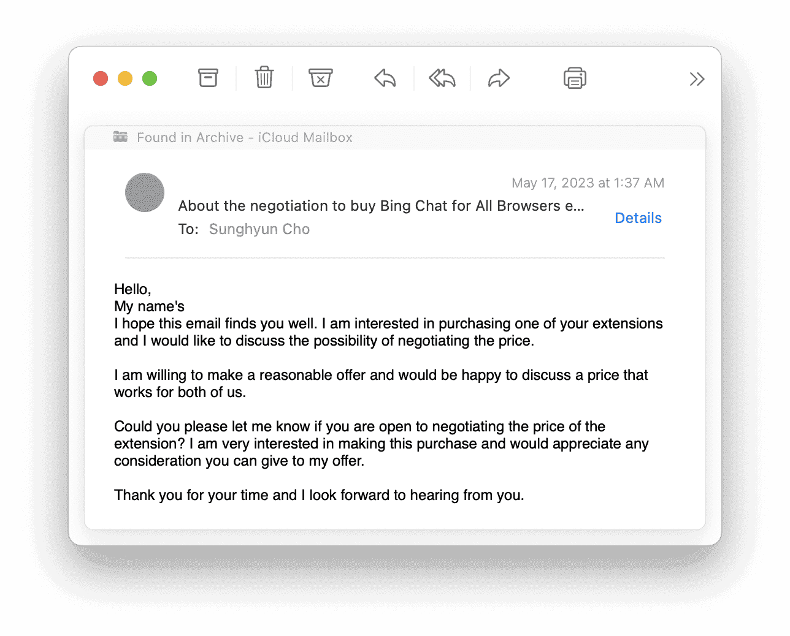
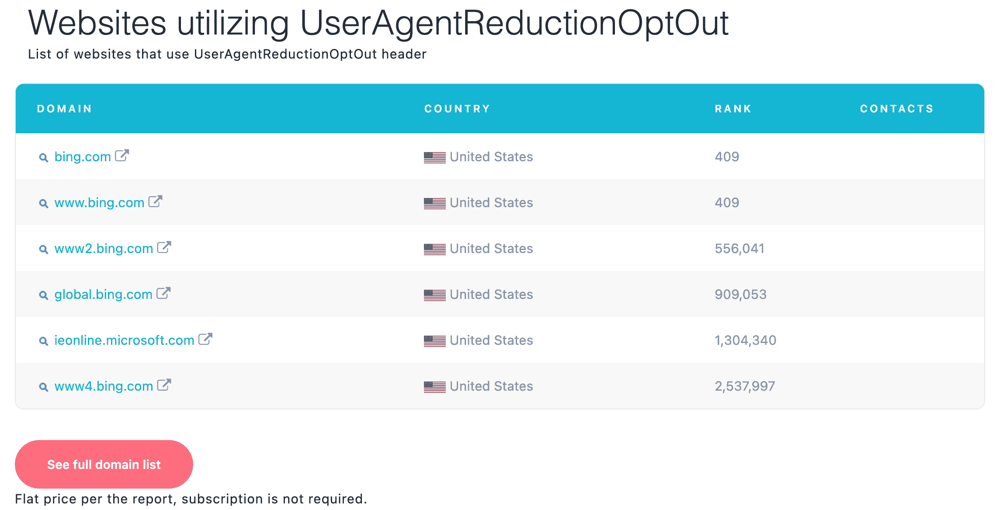
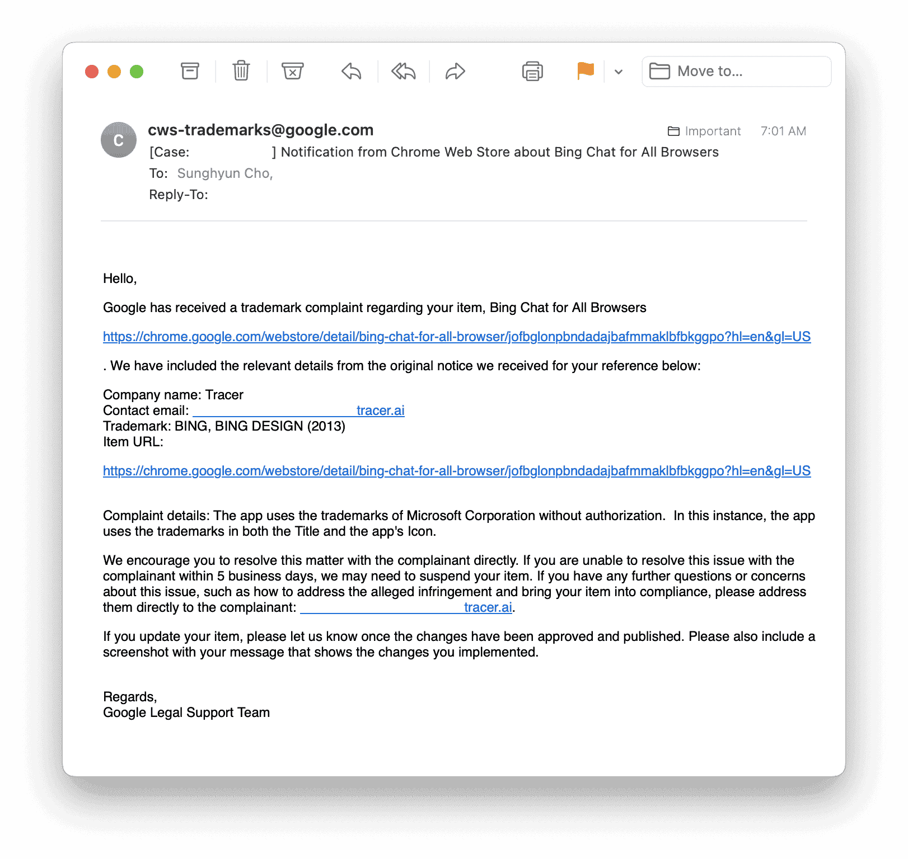
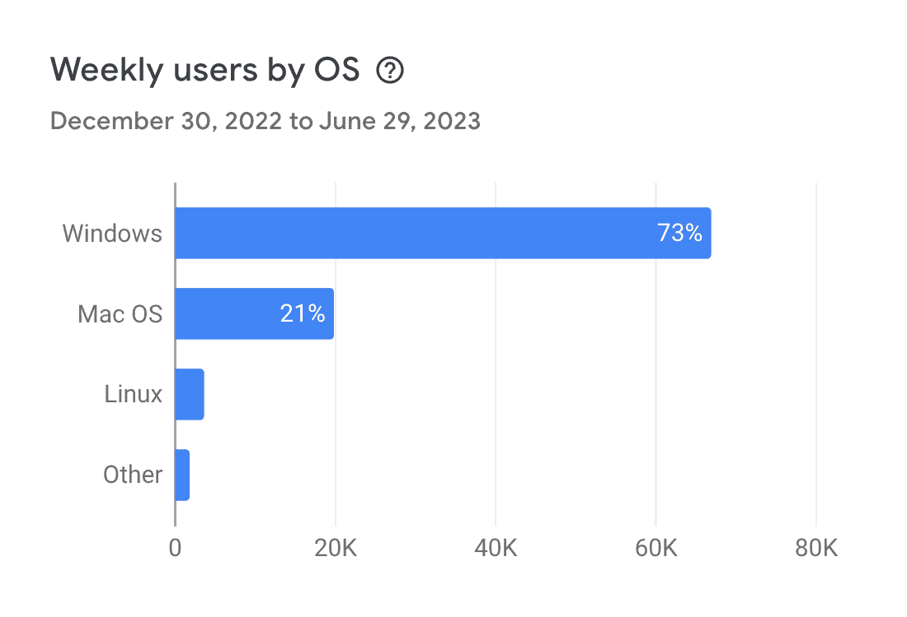
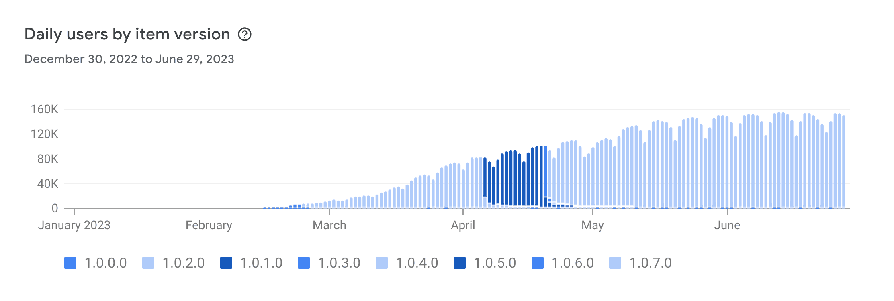
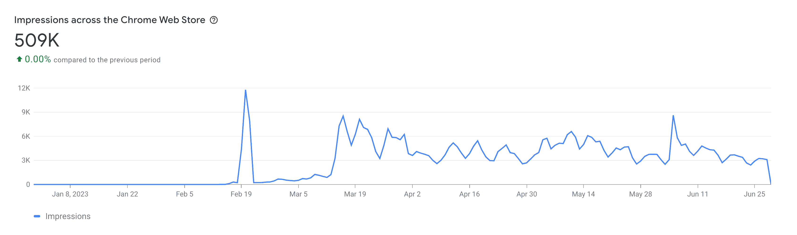
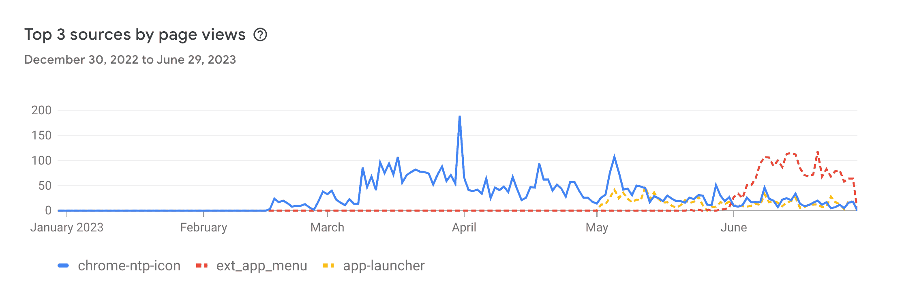

import Admonition from '@theme/Admonition';
import DisplayFlex from '@site/src/components/DisplayFlex'

# Microsoft Forces Me to Delete My 230K User Extension 🗑️

The new Bing Chat, Microsoft's search AI powered by ChatGPT, only works on the Edge browser, so I built an [extension](https://github.com/anaclumos/bing-chat-for-all-browsers) to make Bing Chat work on Chrome and Firefox. After a long and winding road, I reached 750K visitors, 500K installs, and 230K weekly active users, but I had to take down the project because of a trademark complaint from Microsoft. Now let's talk about what happened.

## Coming on the Market

Since ChatGPT was first released, many apps have come on the market. What these apps all have in common is that they started small, found their footing, gained hundreds of thousands of users, and grew almost forcibly. We've seen that timing is everything, and those apps used by many people evolve naturally. I've been observing these market patterns and looking for opportunities, and then Bing Chat came along. Since most consumers use Chrome anyway and Edge is a Chromium browser, it will take a lot of work to distinguish between Edge and Chrome. If there's a program that naturally bypasses it, people will use it. With that in mind, I developed and deployed it in a day. I also kept up-to-date with the recent AI boom, learned about Bing Chat very early on, and signed up for the waitlist. We'll talk about that later.

## Making Front Page on Yahoo! JAPAN

I saw no significant user growth in the first few days likely because Microsoft initially waitlisted Bing Chat due to lacking GPUs. Then at the end of February 2023, there was a dramatic increase in users. Interestingly, it was all Japanese users.

<figure>

<figcaption>

Made Front Page on Yahoo! JAPAN IT Section. [Archive](https://web.archive.org/web/20230219102830/https://news.yahoo.co.jp/articles/fa91cea4b421a3147e3345bb74f552fd3066e74f)

</figcaption>

</figure>

As it turned out, Yahoo! JAPAN, the number one portal in Japan, featured me on their front page and brought in many people. Since then, the number of users has grown organically. [Research Note on Bing Chat and Japan](/r/6AA0FE)

<Admonition type="tip" title="As a reminder" icon="✅">

I am Korean, not Japanese, so this event was very unexpected and random for me. We have different search engines (Naver—Yahoo!), different messenger (Kakao—Line), and **different online culture and lives**, so to speak. In the end, I was very happy that a lot of users from Japan loved my extension.

</Admonition>

## 230K Users and an Acquisition Offer

I met many people along the way as my user base grew. I even hit 1.5k 🌟 on GitHub. People created 120 issues on GitHub, and I responded to about 1K cases via email, Chrome Web Store, and Firefox Add-ons. I averaged about ten cases daily, with a much higher volume in the second half of the extension's life cycle.

Several people have approached me through various media outlets interested in acquiring the extension. They were either AI companies looking to snowball or companies that brokered advertising deals for tech companies. Apps that have established themselves with a simple feature like this are great acquisition targets. They have a clear interest (generative AI), few components, low technical debt (easy to move in your features), a large user base, and tons of media and blogs already linking to the extension install page.

<figure>

<DisplayFlex>

<figure>

</figure>

<figure>

</figure>

<figure>

</figure>

</DisplayFlex>

<figcaption>

Different Acquisition/Advertisement Offers with varying prices.

</figcaption>

</figure>

For various reasons, I did not sell or get financially involved. However, the negotiation experience will come in handy later. Interestingly, they were looking to buy 230K+ active users rather than the product, but they had very different magnitute of values.

## Shield and Spear

Meanwhile, Microsoft was updating its browser detection logic weekly. Dozens of GitHub issues were being registered, and I got tons of bug report emails daily. Most of the fixes were relatively easy, requiring a few bureaucratic steps like refreshing or tweaking the browser User-Agent value.

Then, an event changed my perception in an instant. At 11:00 p.m., dozens of users contacted me simultaneously. I'm attaching a link to the [GitHub Issue](https://github.com/anaclumos/bing-chat-for-all-browsers/issues/74). The biggest problem was that I could use the service without any issues, and I couldn't reproduce the phenomenon on my device and the machines of people around me. Nevertheless, over two hours, GitHub and my inbox would be saturated.

After a sleepless night and 12 hours of debugging, I realized that Microsoft had created a proprietary header specification. A sophisticated front-end website like Bing or Google has hundreds of headers, cookies, and local storage, so it takes work to determine which headers, if any, affect access to the service.

To use a dramatic analogy, a reverse engineering or CTF hack like this is not unlike a cold case investigation. There is no way to know what information is helpful and what is unnecessary, coincidental, person-to-person, false positive, or undetected.

<figure>

<DisplayFlex>

<figure>

</figure>

<figure>

</figure>

</DisplayFlex>

<figcaption>

`UserAgentReductionOptOut`, only used on bing.com globally.

</figcaption>

</figure>

I was impressed with Microsoft's determination. If you think about it, giving away GPT-4 services in Bing and restricting them to Edge is about using AI to compete with Google. It must have been a **pain in the ass** for Microsoft to open all of its features to its biggest competitor, Chrome, and keep 230K users from moving to Edge. At this point, I realized my project could not continue indefinitely. Microsoft will continue to develop different tactics for its products, and it's hard to work for free indefinitely, especially overnight like this. I speculated that my project will end **when Microsoft allows access to third-party browsers** because the product will lose market validity at this point.

## Trademark Complaints

However, my project's end was closer than expected since Microsoft complained that using Bing's logo and name was problematic, and they threatened to ask Google's legal team to shut my extension down unless I did it myself within the next five days. I was torn between confusion and feeling like I had been awarded a badge of honor for Microsoft making a move after me. According to the news, Microsoft has been aware of my extension since March, so the company has been ignoring it for a while now.

<figure>

<figcaption>

tracer.ai is the Brand Protection Software Company that Microsoft hired.

</figcaption>

</figure>

It's not every day that an indie app uses the name of a famous brand in its name, especially when it comes to extensions such as 'Enhancer for Blah Blah.' Since extensions are essentially programs that assist the service, the fact that users install them affirms that they will continue to use the service. Businesses will encourage more developers to make extensions for their apps and, at the very least, will not stop users from creating their extensions.If anything, **I brought benefits to Microsoft by making Bing Chat more accessible**. Did Microsoft think people were not switching browsers because of my small extension? I think there's more of a path dependency of browsers, so I'm guessing that I provided more customers for them (people who would have tried Bing Chat a few times in Chrome out of curiosity) than the opposite (people who would have switched to Edge but didn't because of my extension).

<Admonition type="warning" title="Maybe they're just scaring you off?" icon="💭">

Could be. Maybe Microsoft is just automatically sending documents. But it's unlikely that they would have sent it to **all** the Bing AI-related apps that are popping up in the first place. In any case, internally, Microsoft must have officially decided to take action against apps that have a lot of users.

After all, there's **precedent** in the past...

</Admonition>

### But This Isn't the First Time: MikeRoweSoft v. Microsoft

Microsoft has a reputation for being a stickler for trademarks and rights. A case in point is the [2004 case where it filed a trademark infringement lawsuit against student Mike Rowe's domain, **MikeRoweSoft.com**](https://en.wikipedia.org/wiki/Microsoft_v._MikeRoweSoft), where Mike got a trademark complaint just like me. He declined first and settled for a small amount after a lengthy court battle. My situation had a lot of similarities.

### Conclusion

When I received the documents, I had a lot of thoughts. It's not easy to give up an app with 230K users, which is a first for me, but as I mentioned before, I was already mentally saturated. People started making feature and enhancement requests on GitHub, bug reports poured in endlessly via email, and the biggest problem was the inability to debug. Microsoft would have continued to do something, whether a technical tactic or a legal tactic, even if this incident had passed.

Moreover, [Microsoft announced they will open it to all browsers soon](https://twitter.com/MParakhin/status/1661775489542004743). They may keep developing the app by adding more features, but that's not in the interest of the product because they want to retain users. In many ways, the product didn't have much of a life left. There was no point in being unresponsive and causing problems.

I was happy to have learned my lesson and called it a day. I have since unpublished the app from the store and archived the repository.

## Lessons Learned

### Unpaid open source is lowkey emotional labor.

That was my biggest takeaway.

> In a sense, these GitHub notifications are a constant stream of negativity about your projects. Nobody opens an issue or a pull request when they’re satisfied with your work. They only do so when they’ve found something lacking. Even if you only spend a little bit of time reading through these notifications, it can be mentally and emotionally exhausting. [What it feels like to be an open-source maintainer](https://nolanlawson.com/2017/03/05/what-it-feels-like-to-be-an-open-source-maintainer/)

I was no different. My email was flooded with anonymous complainers. Many times it was just pure name-calling and complaining. It's impossible to please everyone. If I tried to make a fix, three people protested; if I didn't, the people who wanted the feature protested again. I couldn't turn off my daily GitHub notifications. If this is how it is for a small app, how is a medium to large-scale project maintained? Regarding unpaid open source, honor and self-enthusiasm are short-lived.

### Linus, Genovese, and the Matthew Effect

There's a phrase that is a staple of open-source advocacy.

> Linus's law is the assertion that "given enough eyeballs, all bugs are shallow". [Linus's law](https://en.wikipedia.org/wiki/Linus%27s_law)

But we all know of a social phenomenon that is precisely the opposite.

> The bystander effect, or bystander apathy, is a social psychological theory that states that individuals are less likely to offer help in presence of other people. [Bystander effect](https://en.wikipedia.org/wiki/Bystander_effect)

Which is right? The conclusion I came to is closer to the latter. The scientific community already has a name for it: The Matthew Effect.

> In the sociology of science, "Matthew effect" was a term coined by Robert K. Merton to describe how, among other things, eminent scientists will often get more credit than a comparatively unknown researcher, even if their work is similar; it also means that credit will usually be given to researchers who are already famous. [Matthew effect](https://en.wikipedia.org/wiki/Matthew_effect#Sociology_of_science)

A tiny percentage of contributors contribute, and they do so repeatedly; even then, they are heavily skewed toward a few popular repositories. Thus, the contributors and the repositories they contribute to are heavily skewed.

### The rarest resource is human will

I'm not good at running and developing long-term projects. For a hobbyist, the deciding factor is willpower. **Speed is essential—not because of time to market, but because you need a meaningful metric before running out of willpower**, which is individuals' most common deficiency. If that doesn't work, you must purchase willpower (i.e., pay salary) to sustain projects in the long run.

If you try to do something in one fell swoop, you'll only get as much done as you can in that one swoop. While you can increase your fitness for short bursts of exercise, a more fundamental solution is to balance your breathing via aerobic rather than anaerobic exercise. I wanted to build lasting services that continue to evolve and create new value even without of my goodwill and passion—products with a life of their own.

## Statistics

I finish this post with some memorable statistics.

 
🪦 Monuments

<figure>

<figcaption>

Weekly users over time. I had about 210K Chrome users and 20K Firefox user.

</figcaption>

</figure>

<DisplayFlex>

<figure>

</figure>

<figure>

</figure>

<figure>

</figure>

</DisplayFlex>

<figure>

</figure>

<figure>

</figure>

<figure>

</figure>

<DisplayFlex>

<figure>

</figure>

<figure>

</figure>

</DisplayFlex>

<Admonition type="tip" title="Like My Work?" icon="✅">

Let's chat! [Email](https://mailhide.io/e/IXndXpED) me to schedule a call.

</Admonition>
